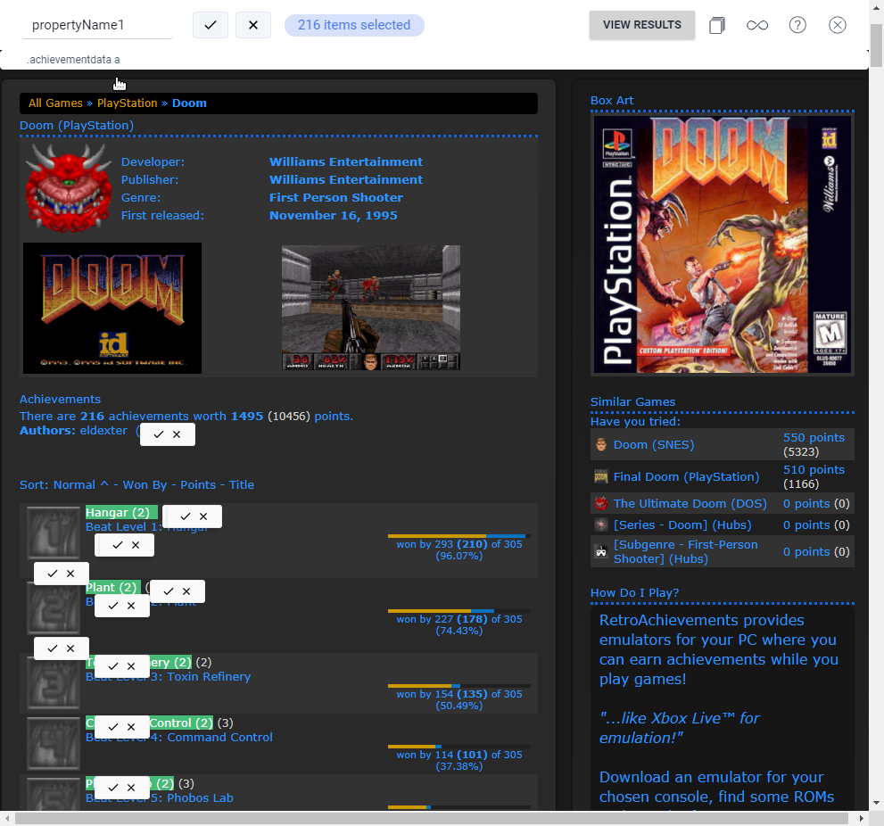

In this article I'm gonna share a fast and easy method to scrape all Achievements, Descriptions or other useful information from RetroAchievements into a CSV format which can be posted in Forums and Discord for sharing Rescore and Revision Update plans.

Here are the steps to be taken:

1. Download the Chrome Extension from <https://simplescraper.io>
2. Browse to the **Game Page** you want to Scrape the Achievement List from (example: <https://retroachievements.org/game/11256>)
3. Click on '_Launch Simple Scraper_' and choose '_Scrape this website_'
4. Choose '_Add a property_'
5. Now you can select what information you want to scrape, click on the Achievements
6. The number of selected items must match the number of Achievements on the Site

### For Rescoring Updates - scrape Achievements only

* `div.achievemententry div.achievementdata a`
* `.achievementdata a`

**NOTE**: you can change the scraping content manually in the appearing box below `propertyName1`.

### For Revision Updates - scrape Achievements and Descriptions

* `div.achievemententry div.achievementdata`
* `.achievementdata`

7. Click on the checkmark to confirm the selection and choose 'View Results'
8. A new tab should open, now click on CSV to download the Achievement List
9. Upload the downloaded CSV file to Google Drive and open it with Google Sheets

**NOTE**: Scraped Achievements with Descriptions can be seperated by splitting the columns with `\n`.

### Upload and split into columns in Google Sheets

10. In Google Sheets, select `A` (must be marked) and choose '_Data_' then '_Split text to columns_', '_custom_' and insert `\n`.

Please check [Achievement Set Revisions documentation](http://docs.retroachievements.org/Achievement-Set-Revisions/) for more information regards Recore and Revision Updates.
