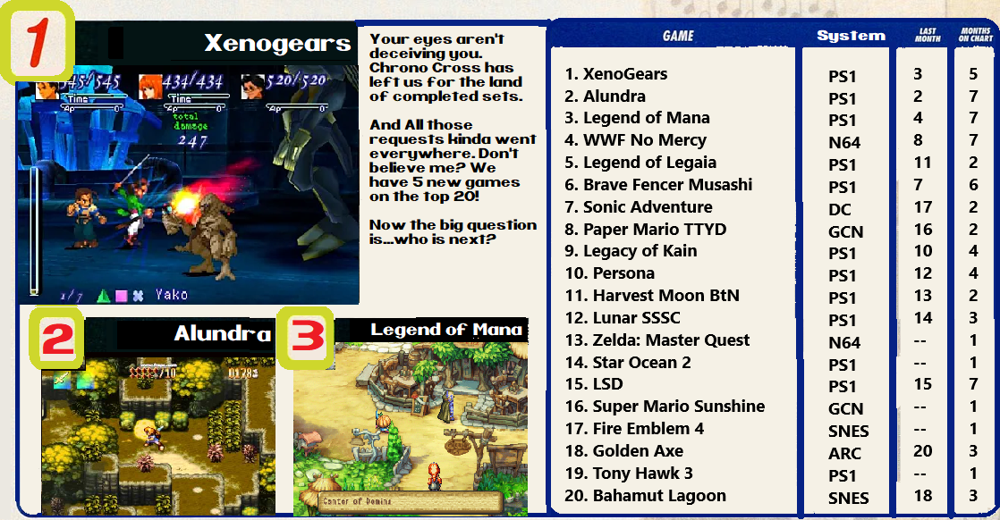

## How to Request

Just enter in the game's page and click on "Request Set". You don't have an unlimited amount of requests, though.

You start with none, then you get one when you reach 2.5k points, then you get a new one each 5k points (until 20k). Then you get a new one each 10k points (until a maximum of 20 requests, which happens at 180k points). Then you have a new one each 20k points indefinitely.

You also get the right to make one more request for each year you are a member of RetroAchievements.org.

**Now, Let's check which missing sets the community wants more in September/2020.**

Note: You can check current directly on the site accessing the [Request Hub](https://retroachievements.org/setRequestList.php).

## For Consoles

## For Handhelds

## Some Stats

| System | Total Requests | Most Requested Game |
| - | - | - |
| Atari 2600 | 14 | River Raid |
| Atari 7800 | 3 | Alien Brigade |
| Coleco | 1 | Carnival |
| NES | 194 | Fire Emblem: Shadow Dragon and the Blade of Light |
| SNES | 238 | Fire Emblem: Genealogy of the Holy War |
| Virtual Boy | 3 | Galactic Pinball |
| N64 | 92 | WWF No Mercy |
| SG1000 | 1 | Lode Runner |
| Master System | 30 | Lucky Dime Caper |
| Genesis | 150 | Urban Strike |
| Sega CD | 19 | Shining Force CD |
| Sega 32X | 10 | Spiderman Web of Fire |
| Sega Saturn | 38 | Dracula X |
| TG16 | 41 | Bomberman 93 |
| PS1 | 254 | Xenogears |
| Arcade | 155 | Golden Axe |
| Apple II | 12 | Oregon Trail |
| PC8000 | 3 | Emmy 2 |
| Atari Lynx | 3 | Gauntlet The Third Encounter |
| Wonderswan | 3 | Makai Toushi SaGa |
| Gameboy | 74 | James Bond 007 |
| GBC | 42 | Dragon Warrior Monsters |
| GBA | 126 | Final Fantasy 6 Advance |
| NDS | 146 | Pokemon Heart Gold Soul Silver |
| Game Gear | 15 | Ristar |
| Neo Geo Pocket | 7 | SNK Vs Capcom Match of the Millenium |
| MSX | 5 | Vampire Killer |
| 3DO | 3 | Putt Putt Joins the Parade |
| Pokemon Mini | 2 | Pokemon Zany Cards |

## Most Wanted Hack/Homebrew

1. ~Hack~ Pokemon - Clover (Game Boy Advance)
2. ~Hack~ JUMP 1/2 \| Janked Up Mario Party 1/2 (SNES)
3. ~Hack~ Final Fantasy VI Brave New World (SNES)
4. ~Hack~ Zelda: Masters of Time (Nintendo 64)
5. ~Hack~ Super Mario Odyssey 64 (Nintendo 64)

## Random Tidbits

- Coleco got its first request

