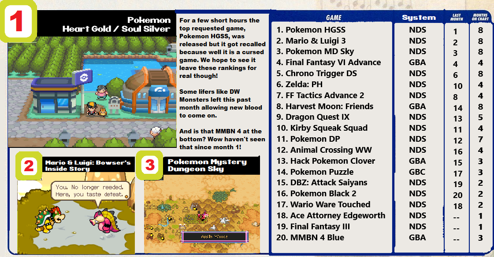

## How to Request

Just enter in the game's page and click on "Request Set". You don't have an unlimited amount of requests, though.

You start with none, then you get one when you reach 2.5k points, then you get a new one each 5k points (until 20k). Then you get a new one each 10k points (until a maximum of 20 requests, which happens at 180k points). Then you have a new one each 20k points indefinitely.

You also get the right to make one more request for each year you are a member of RetroAchievements.org.

**Now, Let's check which missing sets the community wants more for October/2020.**

Note: You can check current directly on the site accessing the [Request Hub](https://retroachievements.org/setRequestList.php).

## For Consoles

## For Handhelds

## Some Stats

| System | Total Requests | Most Requested Game |
| - | - | - |
| Atari 2600 | 15 | River Raid |
| Atari 7800 | 5 | Alien Brigade |
| Coleco | 1 | Carnival |
| NES | 204 | Fire Emblem: Shadow Dragon and the Blade of Light |
| SNES | 258 | Fire Emblem: Genealogy of the Holy War |
| Virtual Boy | 2 | Teleroboxer |
| N64 | 92 | WWF No Mercy |
| SG1000 | 1 | Lode Runner |
| Master System | 31 | Lucky Dime Caper |
| Genesis | 163 | Urban Strike |
| Sega CD | 21 | Shining Force CD |
| Sega 32X | 10 | Star Wars Arcade |
| Sega Saturn | 38 | Resident Evil |
| TG16 | 43 | Bloody Wolf |
| PS1 | 271 | Xenogears |
| Arcade | 176 | TMNT Turtles in Time |
| Apple II | 12 | Oregon Trail |
| PC8000 | 3 | Emmy 2 |
| Atari Lynx | 5 | Batman Returns |
| Wonderswan | 2 | Makai Toushi SaGa |
| Gameboy | 73 | James Bond 007 |
| GBC | 45 | Pokemon Puzzle Challenge |
| GBA | 142 | Final Fantasy 6 Advance |
| NDS | 146 | Pokemon Heart Gold Soul Silver |
| Pokemon Mini | 2 | Pokemon Zany Cards |
| Game Gear | 16 | Mighty Morphin Power Rangers |
| Neo Geo Pocket | 6 | SNK Vs Capcom Match of the Millenium |
| MSX | 7 | Vampire Killer |
| 3DO | 5 | Alone in the Dark |

## Most Wanted Hack/Homebrew

1. ~Hack~ Pokemon - Clover (Game Boy Advance)
2. ~Hack~ JUMP 1/2 \| Janked Up Mario Party 1/2 (SNES)
3. ~Hack~ Final Fantasy VI Brave New World (SNES)
4. ~Hack~ Mario's Mistery Meat (SNES)
5. ~Hack~ Banjo Dreamie (Nintendo 64)

## Random Tidbits

- GBC, Genesis, Saturn, TG16, and 32X got a new most requested game.
