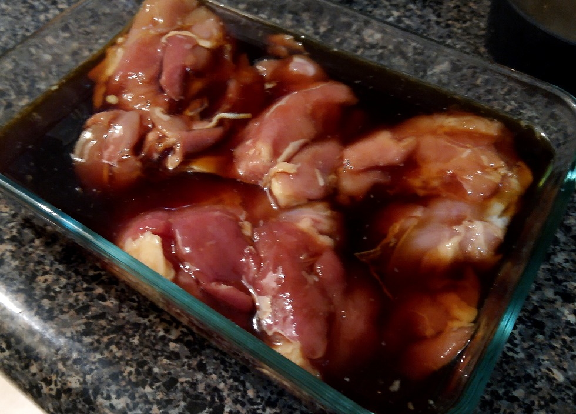
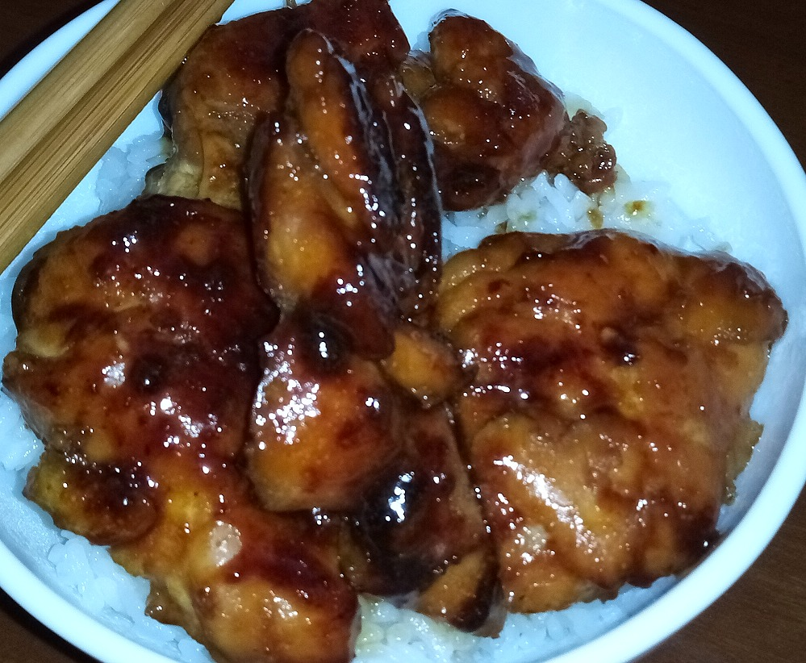

## Intro

The month of November is a special month of the season that we tend to spend with family and friends. The Autumn leaves and cool air are just some of the joys that the season brings to us. This month I personally present one of my favorite dishes that we all can prepare for the holiday. As we are gamers and achievement hunters, it is only fitting that we are given a recipe from the popular video game: [Shaberu! DS Oryouri Navi (Nintendo DS)](https://retroachievements.org/game/14705)

**Shaberu! DS Oryouri Navi** is a recipe book all fit onto a DS cartridge with step by step instructions for cooking many traditional dishes. While the game is written in Japanese, a personal friend has provided us their very own translation of recipe #133.

## Teriyaki Chicken

**Serves**: 2 portions

**Equipment:**

- Shallow dish
- Frying pan with lid
- Plate
- Paper towels

**Ingredients:**

- 240g chicken thighs (preferably skin-on, boneless)
- 1 tsp vegetable oil

**Marinade:**

- 1/4 cup cooking saké (ryourishu)
- 1/4 cup dark Japanese soy sauce
- 1/4 cup mirin
- 1 tsp ginger juice (liquid obtained from grating fresh ginger root)

**Instructions:**

1. Pierce the chicken thigh skins with a fork
2. Mix the marinade ingredients in a shallow dish
3. Marinade the chicken for 20 minutes, flipping it a few times
4. Remove the chicken from the marinade and remove excess liquid. Reserve the marinade
5. Heat the vegetable oil at medium heat in a frying pan
6. Place the chicken thighs skin side down in the frying pan
7. When the skin side is golden brown, flip the chicken
8. Lower the heat, put a lid on the frying pan, and steam the chicken for 8 minutes
9. Turn off the heat and move the chicken to a plate
10. Remove excess oil from the pan using a paper towel
11. Add the reserved marinade to the frying pan and turn on the heat again
12. Once the liquid boils, add the chicken back to the pan
13. Cook the chicken while rocking the pan to coat it evenly, until fully cooked
14. Cut the chicken into bite-size pieces, and serve with grilled shishito peppers seasoned with soy sauce, and/or over rice 

## Photos

**Chicken basking in marinade before cooking:**

**Ready to eat teriyaki chicken served with rice:**

