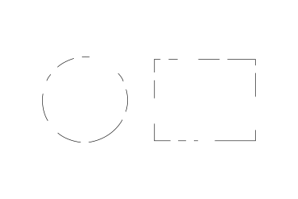
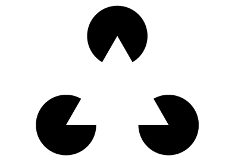

Cool, but wtf is Gestalt?

According to the wikipedia, [Gestalt](https://en.wikipedia.org/wiki/Gestalt_psychology) is school of psychology that says that we usually perceive entire patterns, not merely individual components. This view is sometimes summarized using the adage "the whole is more than the sum of its parts".

Let's jump to some visual examples and you'll see it very clearly.

Look at this image:

Most likely you immediately saw a circle and a rectangle there. You first saw  the "whole" thing, not the dots and dashes.

If you want to be really strict you could argue that a rectangle should have four straight lines and four right angles. And, well, dots and dashes are not straight lines, so it's not possible to make a rectangle with them. But if they're arranged in a certain way... damn!, look at that picture above! You are seeing a rectangle there!

Let's take another example with some Pacmans:

Alright, this time you probably noticed the 3 Pacmans, but I'm sure you still see the triangle there.

By checking how long is that Gestalt's wikipedia page it's noticeable that there's a lot more to talk about it, but I think you got the idea: we perceive the whole, easier than we perceive each of its parts.

What I actually want to highlight here is when we do NOT perceive the whole. And it usually happens when **we** or **the things we do** are the parts of the whole.

If you're reading this, I'm assuming you are part of the RetroAchievements community. And the things you do here are also parts of it.

Here are some examples of things that you may be seeing like just insignificant ones:

- You talk to your friend "hey check this retrogaming website! they create achievements for old games!"

- You enjoyed an achievement set and go to the set creator's profile page and say "hey thanks for creating achievements for the `[COOL GAME HERE]`"

- You post some suggestions for an achievement set on the forums.

- You warned a unwary user asking for ROMs in the forums that we cannot share copyrighted material here.

- You opened a ticket for a buggy achievement providing valuable info and the steps to reproduce the bug.

- You write a couple of paragraphs for the Play This Set section of this magazine.

- etc...

If you look at each one of these actions in isolation, you may not perceive them as a big deal. But try to "zoom out" a bit. Try to see the impact of each one of those little things.

- When you invite a friend to check the project they can become interested in creating achievements, or [contributing with the project in any other way](https://docs.retroachievements.org/How-to-contribute-if-you-are-not-a-developer/).

- When you give a positive feedback about an achievement set to its author, it ~~can~~ surely will encourage them to keep creating more content.

- When you suggest new achievements in a game's forum topic, someone can pick those ideas and implement them. And the whole community will be able to enjoy that work.

- When you warn people to stop asking for copyright material in our forums you are contributing to the longevity of the project, keeping us away from legal problems.

I could keep with more examples, but I think you got the idea, right?

Do not undervalue any of your small contributions to this project. You can see them as little things, but be aware that all those little things together is what makes this community so amazing.

