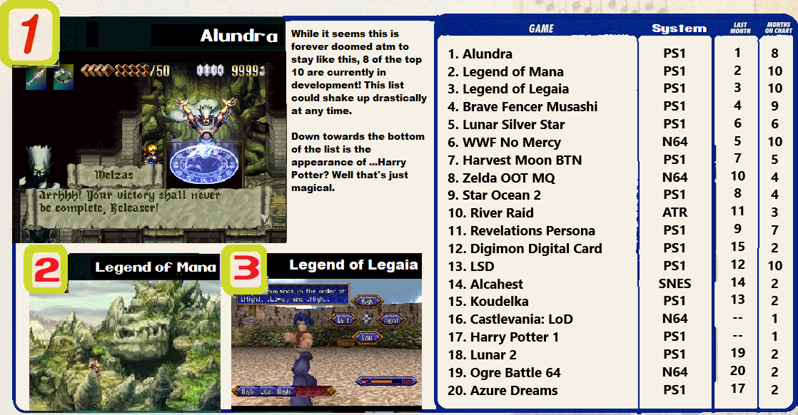
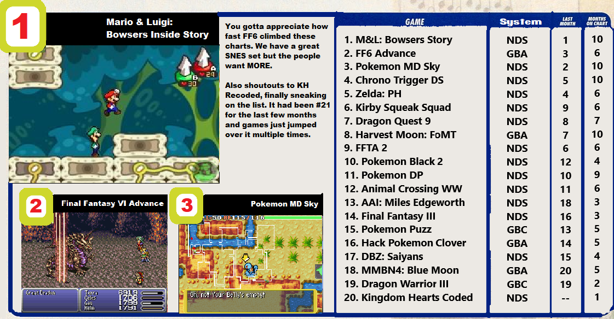

## Intro

Check out what the most wanted games on RetroAchievements are.

## How to Request

Just enter in the game's page and click on "Request Set". You don't have an unlimited amount of requests, though.

You start with none, then you get one when you reach 2.5k points, then you get a new one each 5k points (until 20k). Then you get a new one each 10k points (until a maximum of 20 requests, which happens at 180k points). Then you have a new one each 20k points indefinitely.

You also get the right to make one more request for each year you are a member of RetroAchievements.org.

**Now, Let's check which missing sets the community wants more for November/2020.**

## For Consoles

## For Handhelds

## Some Stats

| System | Total Requests | Most Requested Game |
| - | - | - |
| Atari 2600 | 15 | River Raid |
| Atari 7800 | 5 | Alien Brigade |
| Coleco | 2 | Carnival |
| NES | 229  | Fire Emblem: Shadow Dragon and the Blade of Light |
| SNES | 280 | Alcahest |
| Virtual Boy | 2  | Teleroboxer |
| N64 | 102 | WWF No Mercy |
| SG1000 | 1 | Lode Runner |
| Master System | 34 | Lucky Dime Caper |
| Genesis | 192 | ToeJam and Earl 2 |
| Sega CD | 24 | Shining Force CD |
| Sega 32X | 10 | Star Wars Arcade |
| Sega Saturn | 42 | Guardian Heroes |
| TG16 | 49 | Bomberman 93 |
| PS1 | 301 | Alundra |
| Arcade | 178 | DonPachi |
| Apple II | 12 | Oregon Trail |
| PC8000 | 3 | Emmy 2 |
| Atari Lynx | 5 | Batman Returns |
| Wonderswan | 4 | Makai Toushi SaGa |
| Gameboy | 77 | James Bond 007 |
| GBC | 53 | Pokemon Puzzle Challenge |
| GBA | 168 | Final Fantasy 6 Advance |
| NDS | 179 | Mario and Luigi Bowsers Inside Story |
| Pokemon Mini | 2 | Pokemon Zany Cards | 
| Game Gear | 20 | Ristar |
| Neo Geo Pocket | 5 | SNK Vs Capcom Match of the Millenium |
| MSX | 7 | Vampire Killer |
| 3DO | 8 | Alone in the Dark |

## Most Wanted Hack/Homebrew

1. ~Hack~ Pokemon - Clover (Game Boy Advance)
2. ~Hack~ JUMP 1/2 \| Janked Up Mario Party 1/2 (SNES)
3. ~Hack~ Final Fantasy VI: Brave New World (SNES)
4. ~Hack~ Mario's Mystery Meat (SNES)
5. ~Hack~ Mario Adventure (NES)

## Random Tidbits

- PS1 hits over 300 requests!

