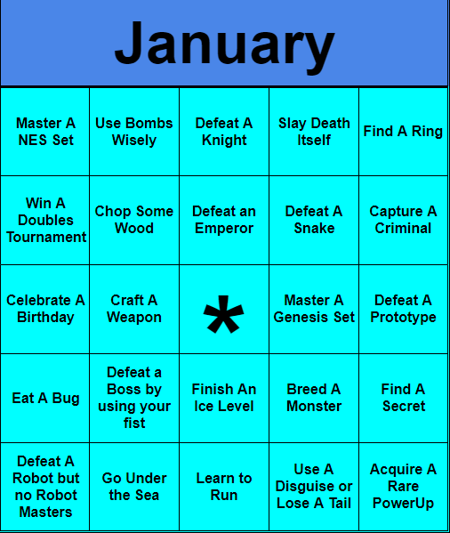

## December's Bingo Winner

  
  

## Bingo

To win this BINGO you are going to need to play some RetroAchievements! The basics of Bingo is to make a line of 5 (vertically, horizontally, or diagonal). You get the middle square `*` as a freebie, but you don't have to use it. You choose to play and finish the board the way you want, but how do you mark off a square?

Each square asks you to do a certain activity, your task is to find a specific achievement on the site that corresponds to that. Then you do the achievement and mark your square off. **Make sure to keep a list of which achievements you use for what!**

The first player to get a bingo and send it to  on Site DM or Discord will be listed in next issue as a winner!

**Bonus:** The first person to mark off every square on their bingo card with a different achievement will also be listed in the winners of next issue
