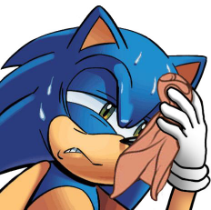

## Intro

Phew! What a tough year!

I kinda enjoy reading about past historical facts, but I'm not sure if feel the same
about experiencing one. Well, let's not focus on what is beyond our control and
instead do our best to stay alive during this pandemic thing.

If you're reading this, congratulations on surviving 2020! :trophy:

And please keep on it. I wish you all a great year and #StaySafe.

Now, let's check what to expect from this RANews issue.

## Quick Overview

What to expect from this issue.

### Editorial

Let's remember some cool things that the community made over the last year in this 2020 in review.

### The Devember Event

It was one of the cool thing that happened in the last year. But as it was so outstandingly cool,
it deserves a dedicated page for it. Just to show what the heroes of this community were able
to do.

### Play This Set

Community members talking about their favorite sets and why you should play them. Cool stuff!

### RAGuide

A nice guide for the Suikoden (PlayStation) game, made by .

**ALERT!** The guides usually contain spoilers about the game.

### RAViews

Check 's opinion about which Yu-Gi-Oh! game is right for you.

### Current Events

List of running events in the RetroAchievements scene that are still open to join.

### HotCheevs Monthly

List of achievement sets released in the last month.

### Top Players

Some statistics about the top 300 players of RetroAchievements and how they progressed over the last month.

### Most Wanted Games

List of games with no achievement sets that community is excited to see. Hopefully it can encourage some achievement creators to pick a game and create a set for it.

### Revisions and Rescores

Which sets got a revision or a rescore.

### Art Updates

Which sets got their game icons and/or badges changed.

### Fun

Mixing games with videogames and RetroAchievements. Funny stuff being created by .

### Community Works

Showing off what the RetroAchievements fans are producing outside from here.

## How to Contribute

If you have an idea for an article to be published in the RANews, please go to the  profile page and send us a message.

Keep in mind that the article must be written in markdown format. If you don’t know it, you can learn it in 10 minutes following this online tutorial here: <https://commonmark.org/help/tutorial/> (it’s pretty similar to what you may be already using on discord).

## Acknowledgements

The RANews project wouldn't be possible without the contributions of many passionate community members.

Special thanks goes to these guys:

- First and foremost: all the achievement creators who dedicate their free time to produce content for the whole community to enjoy.
- , whose dedication and enthusiasm allowed me to focus on the layout and technical aspects of the project while he was gathering content.
-  for creating the cover for this issue.
-  for collecting many useful/interesting data to be published here.
-  for the top players info.
-  for creating the RANews logo.
-  for the RAViews article.
-  for the Devember article.
- All those who wrote for the "Play This Set" segment:
  - 
  - 
  - 
  - 
  - 
  - 
  - 