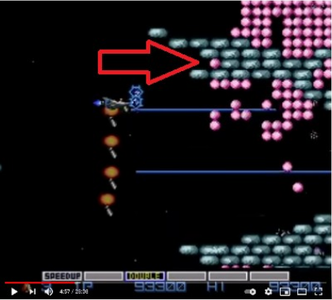
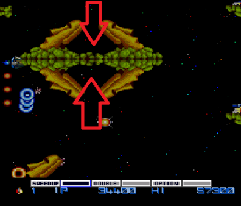
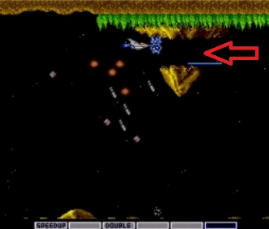
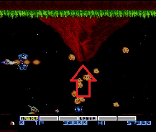
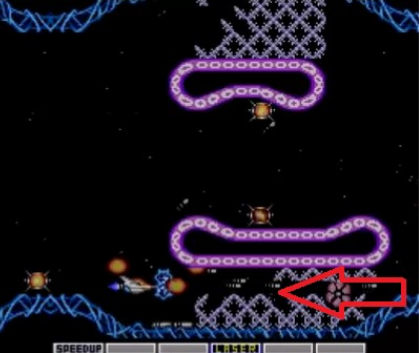

## Intro

[**Editor's Note**: this is not a detailed guide, with instructions to unlock every single achievement of a game. It's just an article with instructions to reach some secret spots of the game and the meaning of some special items.]

Nine months ago, I deved a set for Gradius, PC-Engine. The Gradius Series is one of my favourite, I remember playing the hell out of Gradius and Lifeforce on NES (with my brother) when I was young.

Only years later I discovered the PC Engine port, with its special stage, Wasteland, that does not appear in any other version.

It’s a great game, a tough one, but definitely a classic. Still, compared to the NES version, I thought it lacked some easter eggs: in the NES version you can get bonus points if you fly through certain spots, hidden extra lives too... Nothing like that on the PC Engine version (that’s why I created achievements such as [Nothing To See Here](https://retroachievements.org/achievement/110818) and [Nothing to See Here II](https://retroachievements.org/achievement/110819)).

Little did I know that there ARE secrets in this game, FIVE full bonus stages filled with capsules, extra lives and extra points, and even three types of capsules you can’t find anywhere else in the game!

Thanks to player , I recently added new achievements and useful tips on how to enter those secret stages. Nothing on gamefaqs.com, they are indeed very secret!

## Special Capsules

First I will copy what  told me about the special capsules you can find:

- Yellow capsule - Points
- Green capsule - 1-Up
- Pink capsule - Rapid Fire (lasts a short time)
- Grey capsule - Stops the auto-scrolling screen (so you can clear space and/or collect more items).

You can string together points by collecting more of the yellow capsules. Their point total rises as you collect them (100, 200, 400, 600, 800, 1,000). The counter stops at 1,000. As long as you don't miss any of the yellow capsules. Then you will continue to be awarded 1,000 points every time you collect one. If you miss one, then their value will drop back down to 100 once it clears the screen.

Only yellow capsules that appear on the screen affect this. Some of them are hidden behind pellets. If you don't reveal those capsules, then the game won't count them as being missed. Some of the yellow capsules reappear in the same spot after you collect them. Those ones can be collected eight times before they disappear for good. 

## Secret Bonus Stages

### Bonus Stage #1

Located on Stage 2 - About 70 seconds in (near the end of the stage, at the wall of pink pellets), you will come across a single pink pellet resting between two narrow grey platforms. Destroy it and fly into its space while the hundreds digit in your score is a 3, 5, or 7.

### Bonus Stage #2

Located on Stage 3 - About 60 seconds in, there are four Moai heads connected toa smaller platform. Fly down in between the two located on top. The passage looks too narrow because of the angle of the Moai heads but the hitboxes make it possible. Bonus Stage #3 (Also located on Stage 3) - Same area, but fly in between the two Moai heads on the bottom.

### Bonus Stage #3

Also located on Stage 3 - Same area as Bonus Stage #2 above, but fly in between the two Moai heads on the bottom.

### Bonus Stage #4

Located on Stage 4 - About 50 seconds into the stage, a small mountain with a hole through the middle will appear at the top of the screen.

Fly through it, this just activates the bonus stage, like turning on a switch.

About 20 seconds later, you come across a volcano. Carefully, fly into the area from where the boulders are erupting. It seems tricky because they are constantly shooting out, but it's easier than it looks.

### Bonus Stage #5

Located on Stage 7 - About 70 seconds in (right before the boss), clear a space and fly directly underneath the lower pink platform while your power meter is empty (no power-up icons can be highlighted).

