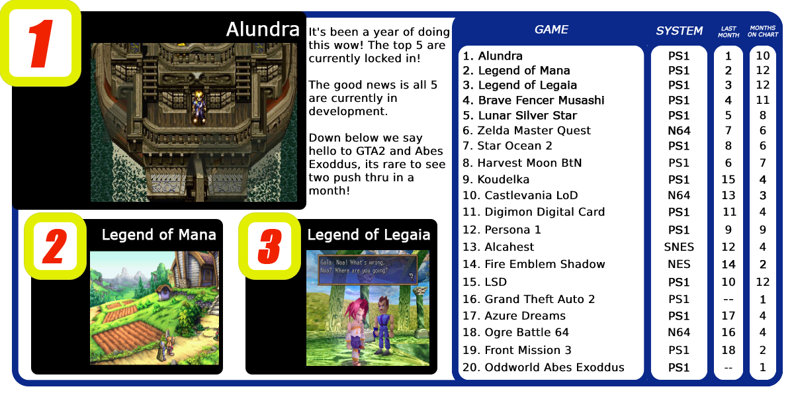
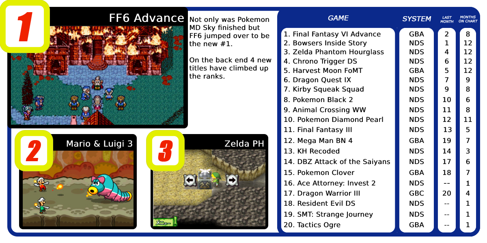

## Intro

Check out what the most wanted games on RetroAchievements are.

## How to Request

Just enter in the game's page and click on "Request Set". You don't have an unlimited amount of requests, though.

You start with none, then you get one when you reach 2.5k points, then you get a new one each 5k points (until 20k). Then you get a new one each 10k points (until a maximum of 20 requests, which happens at 180k points). Then you have a new one each 20k points indefinitely.

You also get the right to make one more request for each year you are a member of RetroAchievements.org.

**Now, Let's check which missing sets the community wants more for February/2020.**

## For Consoles

## For Handhelds

## Some Stats

| System | Total Requests | Most Requested Game |
| - | - | - |
| Atari 2600 | 17 | Cosmic Ark |
| Atari 7800 | 4 | Alien Brigade |
| Coleco | 2 | Carnival |
| NES | 258 | Fire Emblem: Shadow Dragon and the Blade of Light |
| SNES | 307 | Alcahest |
| Virtual Boy | 3 | Teleroboxer |
| N64 | 104 | OOT Master Quest |
| SG1000 | 1 | Lode Runner |
| Master System | 42 | Wonder Boy |
| Genesis | 208 | ToeJam and Earl 2 |
| Sega CD | 22 | Secret of Monkey Island |
| Sega 32X | 10 | Star Wars Arcade |
| Sega Saturn | 46 | Guardian Heroes |
| TG16 | 51 | Neutopia II |
| PS1 | 322 | Alundra |
| Arcade | 199 | DonPachi |
| Apple II | 12 | Oregon Trail |
| PC8000 | 7 | Emmy 2 |
| Atari Lynx | 5 | Batman Returns |
| Wonderswan | 4 | Makai Toushi SaGa |
| Gameboy | 87 | James Bond 007 |
| GBC | 58 | Dragon Warrior III |
| GBA | 185 | Final Fantasy 6 Advance |
| NDS | 190 | Mario and Luigi Bowsers Inside Story |
| Pokemon Mini | 1 | Cortex |
| Game Gear | 17 | Ax Battler |
| Neo Geo Pocket | 5 | SNK Vs Capcom Match of the Millenium |
| MSX | 9 | Vampire Killer |
| 3DO | 13 | Wolfenstein 3D |

## Most Wanted Hack/Homebrew

1. ~Hack~ Pokemon - Clover (Game Boy Advance)
2. ~Hack~ Mario Adventure (NES)
3. ~Hack~ Mario's Mystery Meat (SNES)
5. ~Hack~ Mario's Keytastrophe: Rebirth Edition (SNES)
4. ~Hack~ Banjo-Dreamie (Nintendo 64)

