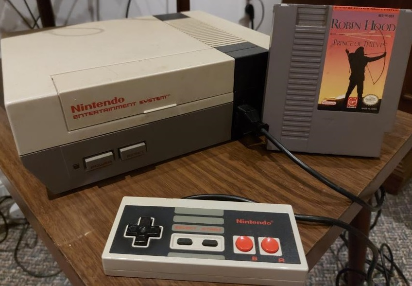
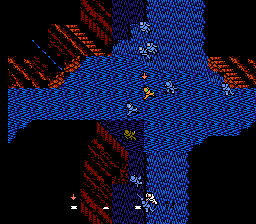
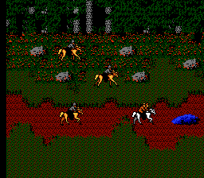
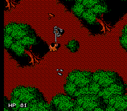
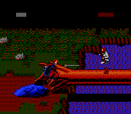
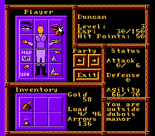

<figure style="text-align:center;float:right;width:50%;height:50%;">

<figcaption>
My own copy of "Robin Hood: Prince of Thieves" with my NES
</figcaption>
</figure>
This game really brings me back to my childhood, while some loved Mario, Zelda and Mega Man, Robin Hood was the game I talked more about when I was a kid. I am not sure what it was, but it was a game I loved and probably still to this day, one of my favourite NES games.

It was not well known but this RPG Adventure kept me busy for hours on end after school and on weekends. It has some great music; some great gameplay and it is just overall fun to just go up with your sword and slash the hell out of some of the big bad Nottingham soldiers.

<figure style="float:left;text-align:center">

<figcaption>Robin and his band fending off the Swarming soldiers</figcaption>
</figure>
To start with, this game starts off with you in Jerusalem in jail and you need to break out. It is at this point that you break out and form your party with your new friends. Not only that but the variety of gameplay is quite good. You have your typical roaming around the map as Robin, you have a side view duel with your sword and closer to the end of the first stage, you fight an all out war with your party against a swarm of soldiers.

Later, in the game you even have a scene where you are on a horse being chased by soldiers. Overall, the game has quite a bit to offer.

<figure style="float:right;text-align:center">

<figcaption>The chase scene when fleeing to Sherwood Forest</figcaption>
</figure>
I think one of the other things I loved about this game is that it was one of the first where I played what felt like a story. Mario didn't really have much of one and the original story for Zelda (which is a series I love), you only really got the story if you read it on the title page and well, let's face it, who had time to read that when you just want to play the game! Ha ha. But with Robin Hood, it was playing the story of Robin Hood with dialogue, epic action, and heroism.

|  |  |
|:-:|:-:|
| Robin fighting a soldier in the Sherwood Forest | Robin dueling Little John |

The game just offered so much to me as a child. It was the story of Robin Hood but also his band and it was not only Robin Hood, but you also had to keep an eye out on your other characters.

<figure style="float:right;text-align:center">

<figcaption>Maintaining the equipment and status of your party</figcaption>
</figure>
You could equip weapons and armour on them, you’d need to keep track of their health and when it got down, you had items such as food like chicken, bread and apples, you could use bandages  and/or potions. Then there were the affects of equipping stuff. Each item had their own stats and such. You could get weapons that did various things, you had daggers, bows, swords, with various types. You could equip a massive sword you found, equip your bow (or a special multi firing bow) and use the arrows you collected on your adventure, equip carious types of armour to increase yours and your party member’s defense. There were also other items such as keys to open chests, torches to light up caverns and it just makes the game feel like an overall adventure.

Looking back, I am glad to have discovered this game. It is probably one of the best games I have played on the NES and surely one of the more iconic games for me in my gaming life. It brought me so much joy and probably one of the games that brought me into gaming. I highly recommend it to anyone who loves adventure games and action RPGs because that is what this game it and it is one of the few games on the NES that has a story telling throughout the entire game. 

<figure style="text-align:center">

<figcaption>
Me playing "Robin Hood: Prince of Thieves"
</figcaption>
</figure>