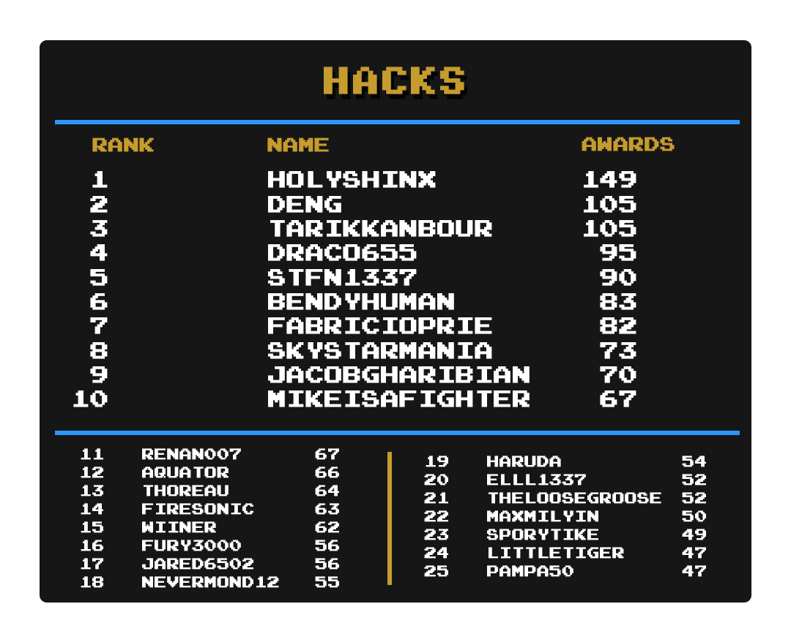

## Intro

We often look to the leaderboard to see who has the most points, and those gamers work very hard to be the best. Some live, eat, and breathe fire for achievements and their quest for MORE POINTS. I wanted to take a look at a different approach to the best gamers on this site. Some of our best gamers are mastery chasers, and some even stay on one particular system.

So, here's the current list of Top Mastery and your champions, give it up to these users they worked their butts off to prove that points are one side of this story, Masteries are the other side.

Special thanks to  for creating the nice-looking images for the rankings

## Current Champions

| :joystick: System | :trophy: Champions |
| - | - |
| Gameboy |  |
| Gameboy Color |  |
| Gameboy Advance |  |
| Virtual Boy |  &  |
| Nintendo DS |  |
| NES |  |
| SNES |  |
| N64 |  |
| Master System | 
| Mega Drive |  |
| GameGear |  |
| Saturn |  |
| PlayStation |  |
| Arcade |  |
| Atari 2600 |  |
| Pokemon Mini |  &  |
| Watara |  |
| PC Engine |  |
| Hack Champ |  |
| Homebrew Champ |  |

## Updates by System

- Arcade: marcelosnp jumps from off the list all the way to #7
- Atari2600: RetroChris81 is building towards overthrowing PMniac, putting up a whopping 12 masteries in June
- GameGear: Tayadaoc and Thoreau have appeared in the Top 25 as Jungon creeps towards the top
- GB: Wendigo appears at #25 this month, Shootzy will likely hit 100 mastered by August
- GBA: Infernum slides in at #15, and metalbubble403 wakes and sets his eyes on bonecrusher!
- GBC: Bendy came and conquered the GBC Champion spot, but watch out Bendy! Guineu put up 12 as well in June!
- Genesis: Really quiet here but mikeisafighter only 2 away from Champion slot here
- Hacks: In this competitive category FabricioPrie earned 9 hacks this month and that wasn't good enough to move up in the leaderboard
- Homebrew: Our new category debuts with BendyHuman as the champion, but Deng is literally right behind him!
- N64: Aquator takes her throne dethroning the once Champion Draco655. But watch out for BenTobitt he is a man on a mission!
- NDS: A lot of action all around here but welcome to the top 25 FireSonic!
- NES: Welcome mx01 onto the list at #21!
- PCEngine: Transistor is the lone warrior climbing the ranks here
- PKMN Mini: Guineu and Nevermond12 are now in a dead heat race to be the mini champ!
- PS1: Minibt takes over as Champion with a whopping 11 month mastery in June
- Saturn: Boldewin is trying to stretch his lead and with good reason as newcomer Kiparis88 went from off the board to 2nd!
- SMS: The most exciting mastery race is here between Jungon, Wendigo, and PMniac. A war of Master system has started!
- SNES: Sarconius has leaped into the top 10, Ramosgamer81 is creeping on danibodom
- Watara: Watch out for Sarconius on the rise!

## Individual System Rankings

### Game Boy

### Game Boy Color

### Game Boy Advance

### Nintendo DS

### NES

### SNES

### N64

### Master System

### Mega Drive

### GameGear

### Saturn

### PlayStation

### Arcade

### Atari 2600

### Pokemon Mini

### Watara

### PC Engine

### Hack Champ

### Homebrew Champ

