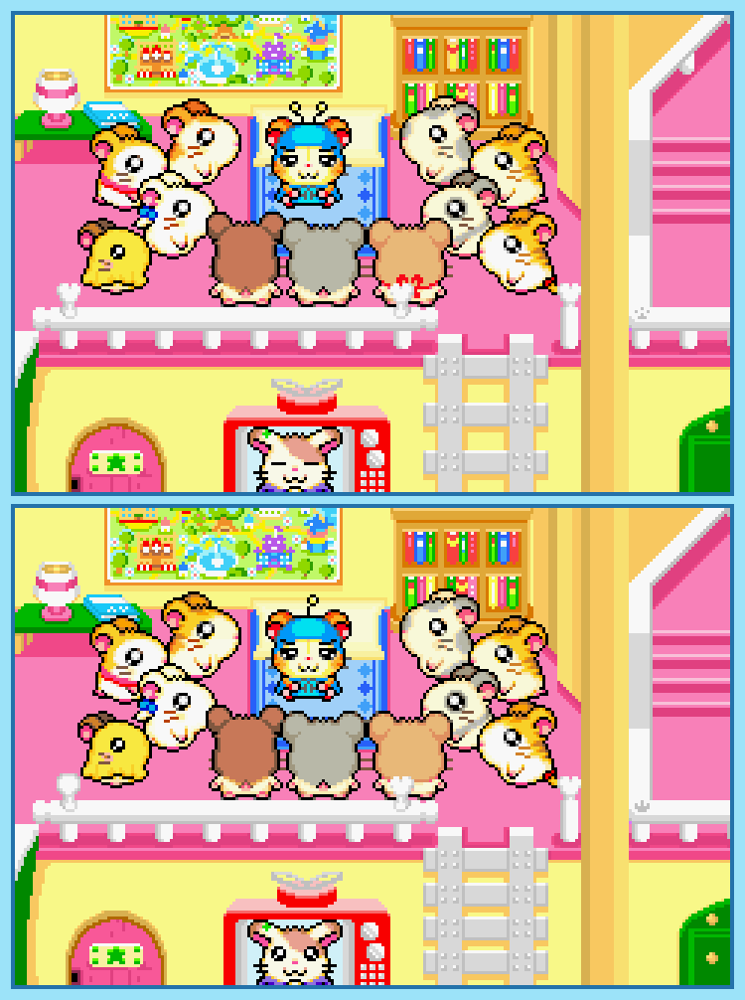

## Last Month's Winners

Yeah, we had two.

 

  
  

 

  
  

## Spot the Difference

Today Bijou saw a wonderful rainbow and another Ham-Ham, Prince Bo, fell down from it because his magical umbrella, which allows him to create rainbow, loses its colors. It seems like that the same thing which caused the umbrella to lose the colors also changed several objects in the Ham-Ham base. Can you find all 10 differences in the lower image?

## About the Game

| Game | Console | Genre | 
|------|---------|-------| 
| <a class="gameicon-link" href="https://retroachievements.org/game/9596" target="_blank" rel="noopener">  Hamtaro: Rainbow Rescue</a> | Game Boy Advance | Role-Playing (RPG) |

Suggested by TheFetishMachine.

**Note:** The first user who finds all 10 differences and sends proof to SporyTike via Site DM or Discord will be listed in the next issue as the winner. Additionally a random selected user which submitted the solution until the end of the month will be chosen to select the game of the next picture.
