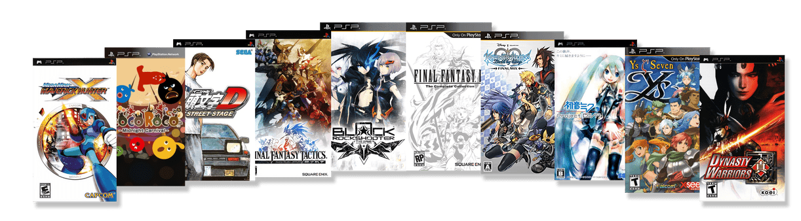
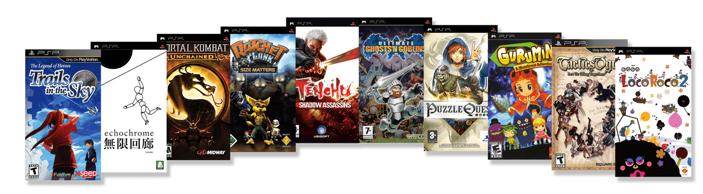
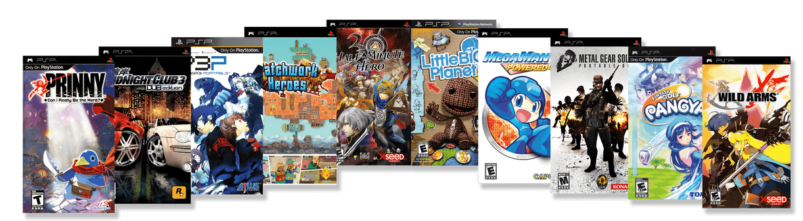
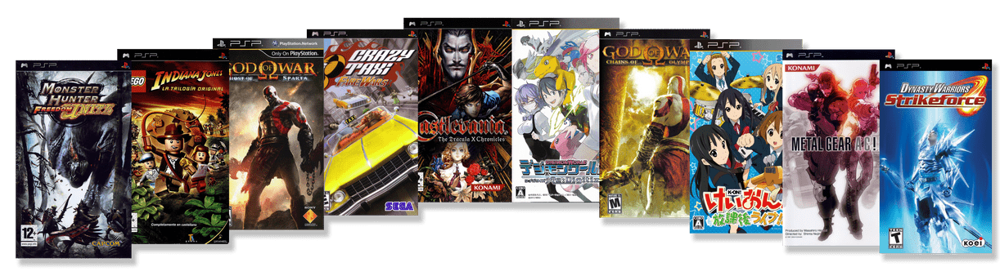

## Announcing PSP's Launch Window Library

After years of inspirational quotes from Abraham Lincoln, Ghandi, and Marmaduke telling us 'PSP is All We Need', I'm proud to announce on behalf of Jamiras, KickMeElmo, televandalist, QA Team, and, of course, our brothers from the [libretro project](https://www.libretro.com/), your launch window releases for the Playstation Portable system. 

This is our 35th system on RetroAchievements, and we couldn't be more proud of all the hardwork these developers have put into their sets so far behind the scenes!

In this article you're going to see the games our achievement creators are working on and a quick description of the game.

Some sets have already been completed, and will be available upon the console's release to RetroAchievements! Some others are still under development.

Official release is planned for late September or early October, so stay tuned!

**NOTE:** These are *currently active claims* and are subject to change at any time.

## First Row

**Mega Man Maverick Hunter X**

- By: GalacticSpear and AlexGatao
- **Available At PSP Launch!**

> Have you played the first Mega Man X title? Well at one point Capcom was interested in remaking the original few X games to match the more modern Playstation style. They only got this one out though and it even included a semi-retconned origin in the form of a new anime OVA included. The game is essentially the same as the first game but now when you beat it you can play the new Vile mode in an alternate What If? story.

**LocoRoco: Midnight Carnival**

- By: SporyTike
- **Available At PSP Launch!**

> Locoroco Midnight Carnival is a wacky, yet creative platformer that utilizes the use of only the L and R buttons! Using these buttons let you tilt the world to adjust where your yellow blob goes. Hold them both to jump to your prize!

**Initial D: Street Stage**

- By: Lewis50248
- **Available At PSP Launch!**

> Do you like Ridge Racer? Do you like Anime characters? This psp title has the high action seen in most Ridge Racer games with an anime heavy soundtrack.

**Final Fantasy Tactics: The War of the Lions**

- By: siouxerskate

> A grand remake of the Playstation 1 classic that rebalances the content, puts a pretty coat of paint and really gives players the definitive version of the Final Fantasy Tactics series. And yes Final Fantasy VII fans, Cloud Strife is still in the game.

**Black Rock Shooter: The Game**

- By: MGNS8M

> Ever wanted to play a turn based shooter rpg? Taking the concept previously used by Parasite Eve and adding a dash of anime to get this recipe. Fun Fact, this is one of 16 possible releases on the PSP that came out after RetroAchievements was formed.

**Final Fantasy IV: The Complete Collection**

- By: SnowPin and Ryudo
- **Available At PSP Launch!**

> The classic fourth entry in Final Fantasy gets a beautiful definitive version for the psp that some would say is the true Pixel Remaster. Also included aside from the base game is Interlude and the After Years. The latter is the fully fledged sequel that many didn't get to play when it was released on the WiiWare service.

**Kingdom Hearts: Birth By Sleep Final Mix**

- By: AlmightyXor

> Find out what happened before Kingdom Hearts 1 following the stories of Aqua, Ventus, and Terra around incidents that occurred during the Mark of Mastery exam. This version of Birth By Sleep has more of everything from attacks to arena missions and even a Bonus Secret Episode!

**Hatsune Miku: Project DIVA**

- By: lordpsycho
- **Available At PSP Launch!**

> Hatsune Miku is a Rhythm game about a vocaloid. Mash the right buttons to timing and listen to some pop.

**Ys Seven**

- By: DanielARP

> Ys Seven is an extremely under rated and forgotten entry in the series that is a killer app for the PSP. Featuring multiple party combinations and faster than ever game play, this is one action RPG you cannot miss.

**Dynasty Warriors**

- By: Bearfax62

> Dynasty Warriors isn't a port of one of the console editions and instead is considered a spinoff title from the mainline series. All the classic features of the franchise are present though!

## Second Row

**The Legend of Heroes: Trails in the Sky**

- By: televandalist
- **Available At PSP Launch!**

> The first game in the Legend of Heroes subseries that some say is the Marvel Cinematic Universe of RPGs. The beauty of this franchise is found in how everything matters from simple townspeople to major story events. The entire world grows and evolves with the player in this first entry.

**Echochrome**

- By: Tybis

> A game with minimalistic graphics and perception, Echochrome is a puzzle game about controlling a stick figure man touching the other shadows of himself in the world. What makes it magical is the focus on how the world changes by the angle we see it. At one angle a corner is a pit, and at another corner its a pathway.

**Mortal Kombat: Unchained**

- By: zxmega

> Unchained is a renamed version of Deception for the PSP handheld. Unlike other handheld Mortal Kombat attempts of the past this one is a faithful adaptation of the PS2 era classic.

**Ratchet & Clank: Size Matters**

- By: Infernox

> The often forgotten Size Matters is a full Ratchet and Clank adventure focusing on as many tiny jokes and scenarios as it can. The game features all the 3rd person shooter combat and comedy that the main console versions.

**Tenchu: Shadow Assassins**

- By: blendedsea

> The final game in the main Tenchu series, Shadow Assassins is considered best on PSP. If you like stealth and planning, then you will be at home with Shadow Assassins.

**Ultimate Ghosts N Goblins**

- By: Zpeligo
- **Available At PSP Launch!**

> One of the hardest franchises returns on the PSP with a reimagining of the first game. Just be warned only the strong survive and only those that collect everything get to actually see the ending!

**Puzzle Quest: Challenge of the Warlords**

- By: TeddyWestside

> What happens when an RPG has a baby with Bejeweled's match 3 concept? You get the epic Puzzle Quest. Difficult but always intriguing, play the game that started an entire subgenre of its own.

**Gurumin: A Monstrous Adventure**

- By: Kayesay

> Gurumin is a Legend of Zelda clone where your main character is armed with a stick...with a drill on the end of it! Filled to the brim with adorable and cute, this hidden gem will excite many Nintendo fans seeking familiarity.

**Tactics Ogre: Let Us Cling Together**

> Tactics Ogre takes place after Ogre Battle SNES but at the same time as Ogre Battle 64. This is a remaster of the original game of the same name that launched in the late 1990s. The DNA of games like Final Fantasy Tactics are rooted in the Ogre series. While it may seem daunting those that venture inside come out all smiles.

**LocoRoco 2**

- By: Etron

> Although the sequel to the first game was the third game released for the system, this one adds in new abilities like swimming to the yellow blobs arsenal.

## Third Row

**Prinny: Can I Really Be The Hero?**

- By: pinguupinguu

> One of the hardest 2D platformers ever created with a set aiming to be even harder. Prinny is a side story from the Disgaea series that truly hates you. Seriously, this game has a vendetta against you!

**Midnight Club 3: DUB Edition**

- By: BigWeedSmokerMan
- **Available At PSP Launch!**

> Race thru San Diego, Atlanta and Detroit at night with a bunch of mid 2000s hip hop and rock music. Grab your pink slips and hit the streets hard.

**Shin Megami Tensei Persona 3: Portable**

- By: Altomar

> This port of the PS2 classic does lose a bit in graphics but it gains a lot in Quality of Life. Along with the standard game there is a new alternative game starring a female protagonist. She get unique social links and even some unique songs that differentiate her story.

**Patchwork Heroes**

- By: StingX2

> Do you like Qix? Then you might like this game which is Qix with a funky steampunk theme and story mode. Play as the captain who needs to literally cut warships apart before they destroy his people's home, but don't forget to save the captured civilians along the way! We Came, We Saw!

**Half-Minute Hero**

- By: msdmario

> You have 30 seconds to save the world can you do it? Filled with comedy and chaos, Half Minute Hero is a wildly different take on the RPG format. Each stage is its own miniature rpg and the way to victory unfolds more like a puzzle than your standard RPG game. With multiple modes, and alternate paths take Half Minute Hero for a short spin.

**LittleBigPlanet**

- By: ZZKer

> The Sony classic 2.5D platformer hits the PSP and brings all the charm of the console release onto the handheld. Grab, push, pull, and pop bubbles as you play in the world of fabric and cardboard.

**Mega Man Powered Up**

- By: ikki5 and GalacticSpear
- **Available At PSP Launch!**

> Capcom remade the original Mega Man for PSP but instead of just remaking it they made the game super cute and chibi. Along with that you can now play the game as every robot master giving the entire game a different feel when you get to play as say Cut Man!

**Metal Gear Solid: Portable Ops**

- By: wilhitewarrior
- **Available At PSP Launch!**

> Taking place during the MGS3 era, Portable Ops has you build the army that Big Boss would eventually be known for. All the action stealth fanatics love is back in this mission based stealth affair.

**Pangya: Fantasy Golf**
- By: voiceofautumn

> It is golf, on the psp...with anime!

**Wild Arms XF**

- By: BrunoKiko

> What happens when you combine the world of Wild Arms western sci fi with Final Fantasy Tactics? You get this spinoff game on the PSP of course.

## Fourth Row

**Monster Hunter Freedom Unite**

- By: SlashTangent

> Are you ready for the biggest set to ever hit Retroachievements? One of the hardest to learn series gets its first set on RA, and it is going to be brutal. Hack, slash, and grind endlessly praying RNG is on your side when Freedom Unite hits RA.

**LEGO Indiana Jones: The Original Adventures**

- By: pinguupinguu
- **Available At PSP Launch!**

> Get ready to build your legos as pinguupinguu brings the noise, oh wait that's just Willie Scott screaming! Whip your way through standard lego levels then come back in free play to collect everything. Watch out for snakes!

**God of War: Ghost of Sparta**

- By: CosmicZeppelin

> The PSP sequel offers 25% more gameplay than the first. Otherwise this game is the standard quick time event heavy, gore filled hack and slash gamers have come to love!

**Crazy Taxi Fare Wars**

- By: mopain85

> Many have fond memories of Crazy Taxi and you can relive them with this collection containing both Crazy Taxi games! Get reckless and earn some money!

**Castlevania: The Dracula X Chronicles**

- By: Shmelyoff

> A collection featuring Rondo of Blood and Symphony of the Night. Rondo is completely remade in 2.5D and is the first time the game was released in English. SotN is the same game you know from PS1 but it includes the infamous Saturn exclusive corridor!

**Digimon World: Re-Digitize**

- By: Mario2188

> Did you know this is the middle child of a trilogy of Digimon games? It is a sequel to Digimon World 1 and the game after this one is Next Order on Vita/PS4. This trilogy is the only one to feature actual training and raising of the digital monsters while other Digimon games treat it more like Pokemon

**God of War: Chains of Olympus**

- By: Bartis1989

> The first of the two PSP God of Wars features a tale involving sacrifice and duty. Filled with the hack and slash game play gamers love, don't miss out on this giant sized pocket adventure.

**K-ON Houkago Live**

- By: KingS1zzle

> A rhythm game based on the anime show featuring the light music club of an all girls school. Jam with the girls and their catchy tunes as you mash the buttons to the music!

**Metal Gear Acid**

- By: BahamutVoid

> What if Metal Gear was a turn based strategy card game? That is the question posed to you playing Acid as the game plays like a strange combination of XCOM and some weird card battler.

**Dynasty Warriors: Strikeforce**

- By: SporyTike

> Strikeforce is a lighter, faster paced take on the Dynasty Warriors formula. Focused originally on multiplayer for the console editions the handheld version will have you being the every warrior fighting by yourself.
