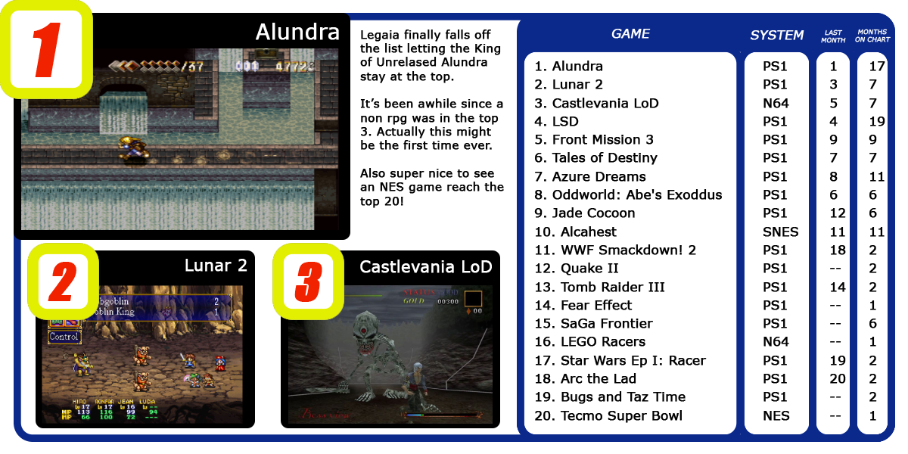
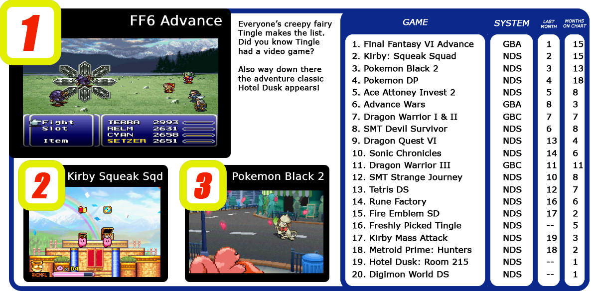
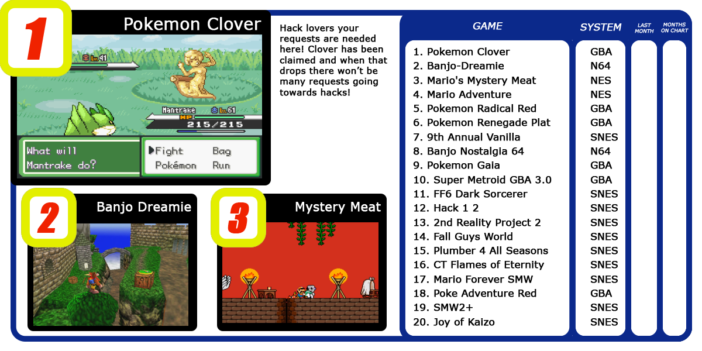

## Intro

Check out what the most wanted games on RetroAchievements are.

## How to Request

Just enter in the game's page and click on "Request Set". You don't have an unlimited amount of requests, though.

You start with none, then you get one when you reach 2.5k points, then you get a new one each 5k points (until 20k). Then you get a new one each 10k points (until a maximum of 20 requests, which happens at 180k points). Then you have a new one each 20k points indefinitely.

You also get the right to make one more request for each year you are a member of RetroAchievements.org.

**Now, Let's check which missing sets the community wants more!**

## For Consoles

## For Handhelds

## Hacks

## Current Stats

If you want to check the current most requested sets, follow this link: <https://retroachievements.org/setRequestList.php>.

