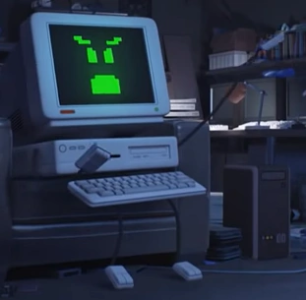

## Intro

This article is a message to all RA staff members but also for everyone who cares about RA.

As the leadership is always keeping their eyes on the people who are involved in and dedicated to this project, if you are one of these people and, *most importantly*, you can communicate well and respectfully with others, there's a good chance that sooner or later you will be part of the RA Staff.

My goal here is to share my thoughts on how to keep Retro Achievements a long-lasting project and how focusing on yourself first, and on RA later, can help the project to stay alive in this [infinite game](/issues/2020-11/editorial).

## About Me

Last month I retired from RA administration and posted [my farewell message here](https://retroachievements.org/viewtopic.php?t=13825). The plan is to also be less active around here, and I came back now just to do the RANews handover to  (thanks for taking it, dude! :heart:).

After 5 years of practically breathing RA everyday (with a short break due to a burnout in mid 2019) I realized that I also need to unlock some RL achievements (specially the ones related to my own kids). Also, as I'm a 40 years old guy now 👴, I suspect that this thing called midlife crisis also influenced this decision.

During this time being part of the leadership of this project, I was able to interact with 3 generations of staff members. This allowed me to observe certain behavior patterns that have taken place and will certainly continue to happen. My hope here is that those who read this article can at least be aware of this and try to do something about it.

## RA is Awesome!

As we all know, RetroAchievements is a freaking awesome concept!

In addition to the actual gaming thing, there's also the social aspect. We're working and interacting with many people from several coutries around the globe, sharing the same passion as us!

Let's be honest and use the correct term: **RA is addictive!**

## The Staff Member's Path

It all starts with an innocent gameplay that becomes a bit more serious as we want to unlock the achievements. And then we start to interact with other people who also enjoy playing these retrogames and unlocking achievements

A bit later we start to get a bit more involved with the project. Creating achievements, joining events, creating art for badges, suggesting achievements, writing articles for RANews, etc...

At this point, depending on how much you contribute and how well you communicate with people, there is a possibility that you will be invited to join some team of contributors. Depending on your motivations, desires and personality traits, you may even be invited to the moderation team or QA. If you reach this point you'll realize the astonishing amount of work required to keep the RetroAchievements ecosystem working the way it is today.

If by chance you are at an age or situation where you have to work IRL to pay your bills and/or support your family, it won't be rare that you will find yourself somehow working harder for RA than for the job that makes you money.

For outsiders, this may seem kinda weird, but for us it's not. We love RA so hard and we want to see it shine, right? But when reaching this point we must be mindful about the impacts of such dedication in the private sphere **and** in the RA ecosystem.

## The Risks of So Much Dedication

It can be that sense of belonging, that feeling of being part of something bigger I mentioned [in a previous editorial](/issues/2021-08/editorial.html#where-it-is-aka-a-love-letter), it can be community members showing their appreciation for our work... There are many reasons why we feel compelled to keep working for RA.

As we said above, RA is addictive. And we weren't just talking about gaming. Somehow working for RA is also addictive. In the [Wikpedia's page for Addiction](https://en.wikipedia.org/wiki/Addiction), we see this:

> a biopsychosocial disorder characterized by **compulsive engagement** in rewarding stimuli despite adverse consequences.

This **compulsive engagement** for work is what we usually call "workaholic", right? The only caveat is that when working for RA you don't make any money, you do it for pure love. But, regardless, this behavior is still dangerous.

Every RA staff member should be constantly asking themselves:

- Do I need to pay more attention to my health?
- Does my family need more of my attention?
- Am I doing well with my work/studies/RL demands?
- Do I have any financial debt?

<figure style="float:right;text-align:center">

</figure>

Please, I have no intention of giving a moral lesson here. I don't want to sound like Mr. Small, the hippie school counselor from The Amazing World of Gumball.

It's not my intention to be too involved on contributors' private matters. After all, each person is (should be) accountable for their own choices.

My real intention is to highlight that:

**Working for RA while neglecting RL demands cannot be considered a badge of virtue.**

The consequences of this are extremely harmful. And I'm not just referring to the obvious harm in your health/family/work/studies, but also the harm caused in the RA environment and your RA fellows.

When you believe that neglecting your RL in favor of RA is a virtue, things like this can happen:

- You can feel more important than your peers (who are working for RA as volunteers).
- You can start demanding (or implying that) other volunteers should also do their sacrifices to work for RA with the same degree of dedication.

The issue is that volunteer work is to be done when people can **and** want. They cannot be charged to do it.

## Sad Truths

If you still think that sacrificing your RL for RA is a noble attitude and that people will respect you because of your effort, I need to share with you what I realized after witnessing 3 generations of RA staffers come and go: **"The Internet" doesn't really care about you**.  That's sad, but true.

<figure style="float:left;text-align:center">

<figcaption>"The Internet" from The Amazing World of Gumball</figcaption>
</figure>

I also realized an even sadder thing: for some reason the negative aspects of your personality will be remembered more than your positive contributions.

Maybe the people who directly worked with you will remember your great contributions. But as soon as you go, and the people who worked with you also go, your great deeds will quickly be considered as something that "was always there", and only the drama you were involved in will continue to be mentioned here and there.

Rarely will anyone give you credit for what you've done. And when you are about to take the credit, it can be accompanied with a little belittling remark like "anyone could have done it".

## My Appeal

I'm not saying all those things above to demotivate you from contributing with RA. Even with those sad truths it feels great to be part of this project and share our passion with like-minded people!

My appeal here is that if you sacrificing yourself for the sake of RA, please stop it! :pray:

You know, "The Internet" doesn't give a damn about your sacrifices and you'll most likely be plagued by feelings of ingratitude.

If you love this project and want see it shine:

**Take care of yourself before worrying about RA.**

If you feel like I'm still talking like a hypocrite, pretending that I care about you, let me put it in another way:

**You will be much more useful for RA living a healthy life than otherwise.**

P.S.: Also, be nice to each other and stay away from drama! :wink:

