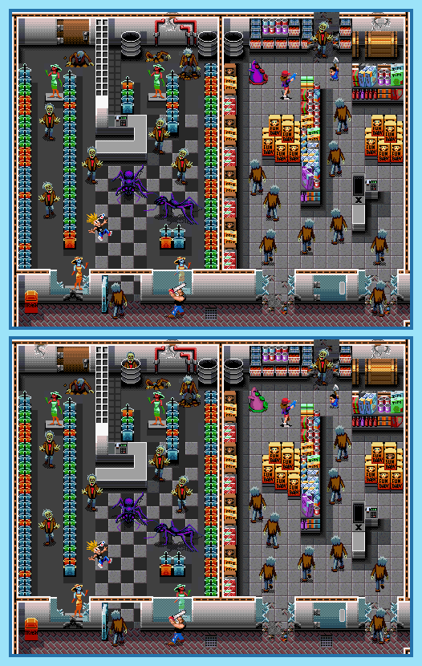

## Last Month's Winner

  
  

## Spot the Difference

It was always somewhat chaotic in Zeke's and Julie's neighborhood but this time it's even worst. Everyone is getting attacked by monsters like Zombies, Werewolfs, Vampires and Horror-Dolls. And what is even worse, there are 10 things different in the current scene. Can you find all 10 differences in the lower image?

## About the Game

| Game                                                                                                                                                                                                                                                         | Console | Genre            |
| ------------------------------------------------------------------------------------------------------------------------------------------------------------------------------------------------------------------------------------------------------------ | ------- | ---------------- |
| <a class="gameicon-link" href="https://retroachievements.org/game/405" target="_blank" rel="noopener">  Zombies Ate My Neighbors</a> | SNES    | Action » General |

* Suggested by: 

**Note:** The first user who finds all 10 differences and sends proof to  via Site DM or Discord will be listed in the next issue as the winner. Additionally, a random selected user which submitted the solution until the end of the month will be chosen to select the game of the next picture.
