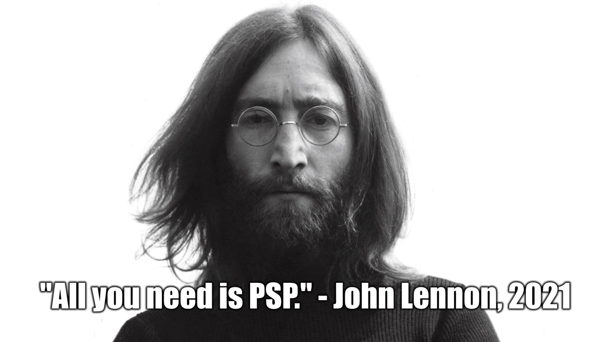

### The PSP Rollout and Launch

A little over a year ago,  and  worked on updates to RALibretro that enabled hardware rendering. The most known perk to this was that N64 would run in RALib instead of N64 development being exclusive to the standalone. I’m not going to pretend to know the more techy aspects of it and anything else I say about that would end up being corrected by  anyway. However, one “hidden” perk to that update was that the PPSSPP core actually ran in RALib and memory was exposed. 

[This is shortly after I found out](https://u.cubeupload.com/televandalist/pppppppspppppppppp.png) I was my own worst enemy here because I proceeded to not shut up about it... and still haven't.

As exciting as that was, there was a laundry list of issues that needed to be worked out before it was viable for achievement development and players. I have no background in programming, so I was also at the mercy of waiting on updates. All I could do was test, test, and test some more. 

Then back in May, I started DMing devs to gauge interest in PSP sets. I wanted to see how much "claim overlap" there would be and figured it would be better to get those resolved ASAP.  volunteered to help contact devs so I could focus on organizing the data and continue testing games. Sometime in August,  had the hashing for PSP worked out. That's when we started contacting devs again to lock-in their claims and to plan a rollout schedule. The overall plan was to try and make PSP support feel like an actual console launch instead of an "Oh, by the way..." news update. Remember the Sega Saturn launch? 

We continued to hype it up and revealed more details each week.  helped coordinate and manage the rollout until the final week, in which I had to fly solo. That's another matter entirely and still pending resolution. Point is, I am making sure  gets credit where credit is due.

Anyway, the most work put into the rollout was done by our achievement developers, which we locked in a dark room and didn't let them out for an entire month. All in all, I think it was a success and the launch went better than we could have anticipated. At the time of writing this, I'm also making a survey for devs to see how they felt about it. So, thanks again to all who contributed.

Launch day for PSP consisted of 38 sets being promoted to core. 36 base sets, a bonus set, and a subset. The previous record was held by PS1, which had 23 sets at launch and 35 by the end of the first month. You guys crushed it. :heart:

| Game                                                                                                                                                                                                                                                                                                                                                 | Developer(s)                                          | Genre             |
| ---------------------------------------------------------------------------------------------------------------------------------------------------------------------------------------------------------------------------------------------------------------------------------------------------------------------------------------------------- | ----------------------------------------------------- | ----------------- |
| <a class="gameicon-link" href="https://retroachievements.org/game/6352" target="_blank" rel="noopener">  20Q</a>                                                                                                                                  |                                 | Trivia            |
| <a class="gameicon-link" href="https://retroachievements.org/game/3541" target="_blank" rel="noopener">  Corpse Party</a>                                                                                                                |                                | Adventure         |
| <a class="gameicon-link" href="https://retroachievements.org/game/10387" target="_blank" rel="noopener">  Crisis Core: Final Fantasy VII</a>                                                                           |                                   | Action-RPG        |
| <a class="gameicon-link" href="https://retroachievements.org/game/3466" target="_blank" rel="noopener">  Crystal Defenders</a>                                                                                                      |                                   | Tower Defense     |
| <a class="gameicon-link" href="https://retroachievements.org/game/10478" target="_blank" rel="noopener">  Dynasty Warriors</a>                                                                                                       |                                 | Hack and Slash    |
| <a class="gameicon-link" href="https://retroachievements.org/game/3053" target="_blank" rel="noopener">  Dynasty Warriors: Strikeforce</a>                                                                              |                                 | Hack and Slash    |
| <a class="gameicon-link" href="https://retroachievements.org/game/2977" target="_blank" rel="noopener">  Echochrome</a>                                                                                                                    |                                     | Puzzle            |
| <a class="gameicon-link" href="https://retroachievements.org/game/2922" target="_blank" rel="noopener">  Evangelion New Theatrical Edition: 3nd Impact</a>                                              |                                | Rhythm-Action     |
| <a class="gameicon-link" href="https://retroachievements.org/game/3169" target="_blank" rel="noopener">  Final Fantasy IV: The Complete Collection</a>                                                      |  and            | RPG               |
| <a class="gameicon-link" href="https://retroachievements.org/game/3474" target="_blank" rel="noopener">  Gitaroo-Man Lives!</a>                                                                                                    |                                | Rhythm-Action     |
| <a class="gameicon-link" href="https://retroachievements.org/game/3921" target="_blank" rel="noopener">  Hatsune Miku: Project DIVA</a>                                                                                    |                                | Rhythm            |
| <a class="gameicon-link" href="https://retroachievements.org/game/3923" target="_blank" rel="noopener">  Hatsune Miku: Project DIVA 2nd</a>                                                                            |                                | Rhythm            |
| <a class="gameicon-link" href="https://retroachievements.org/game/3516" target="_blank" rel="noopener">  Hatsune Miku: Project DIVA Extend</a>                                                                      |                                | Rhythm            |
| <a class="gameicon-link" href="https://retroachievements.org/game/6964" target="_blank" rel="noopener">  Impossible Game, The</a>                                                                                                |                                 | Platformer        |
| <a class="gameicon-link" href="https://retroachievements.org/game/3995" target="_blank" rel="noopener">  Initial D: Street Stage</a>                                                                                          |                                | Racing            |
| <a class="gameicon-link" href="https://retroachievements.org/game/3519" target="_blank" rel="noopener">  K-ON! Ho-kago Live!!</a>                                                                                                |                                | Rhythm-Action     |
| <a class="gameicon-link" href="https://retroachievements.org/game/10479" target="_blank" rel="noopener">  Legend of Heroes, The: Trails in the Sky FC</a>                                                 |                             | RPG               |
| <a class="gameicon-link" href="https://retroachievements.org/game/11115" target="_blank" rel="noopener">  Legend of Heroes, The: Trails in the Sky FC [Subset - NG Nightmare]</a> |                             | RPG               |
| <a class="gameicon-link" href="https://retroachievements.org/game/3993" target="_blank" rel="noopener">  LEGO Indiana Jones: The Original Adventures</a>                                                  |                              | Action-Adventure  |
| <a class="gameicon-link" href="https://retroachievements.org/game/3218" target="_blank" rel="noopener">  LocoRoco: Midnight Carnival</a>                                                                                  |                                 | Platformer        |
| <a class="gameicon-link" href="https://retroachievements.org/game/3571" target="_blank" rel="noopener">  Me & My Katamari</a>                                                                                                        |                                | Puzzle-Action     |
| <a class="gameicon-link" href="https://retroachievements.org/game/2973" target="_blank" rel="noopener">  Medal of Honor: Heroes</a>                                                                                            |                              | Action-FPS        |
| <a class="gameicon-link" href="https://retroachievements.org/game/3582" target="_blank" rel="noopener">  Mega Man Powered Up</a>                                                                                                  |  and       | Action-Platformer |
| <a class="gameicon-link" href="https://retroachievements.org/game/3219" target="_blank" rel="noopener">  Mega Man: Maverick Hunter X</a>                                                                                  |  and  | Action-Platformer |
| <a class="gameicon-link" href="https://retroachievements.org/game/3589" target="_blank" rel="noopener">  Metal Gear Solid: Portable Ops</a>                                                                            |                            | Action-Stealth    |
| <a class="gameicon-link" href="https://retroachievements.org/game/3888" target="_blank" rel="noopener">  Midnight Club 3: DUB Edition</a>                                                                                |                          | Racing            |
| <a class="gameicon-link" href="https://retroachievements.org/game/3732" target="_blank" rel="noopener">  Monster Hunter Freedom Unite</a>                                                                                |                              | Action-RPG        |
| <a class="gameicon-link" href="https://retroachievements.org/game/2981" target="_blank" rel="noopener">  Monster Hunter Freedom Unite [Bonus]</a>                                                                |                              | Action-RPG        |
| <a class="gameicon-link" href="https://retroachievements.org/game/3974" target="_blank" rel="noopener">  Pangya Fantasy Golf</a>                                                                                                  |                             | Sports            |
| <a class="gameicon-link" href="https://retroachievements.org/game/2971" target="_blank" rel="noopener">  Peggle</a>                                                                                                                            |                             | Puzzle-Action     |
| <a class="gameicon-link" href="https://retroachievements.org/game/3164" target="_blank" rel="noopener">  Persona 3 Portable</a>                                                                                                    |                                   | RPG               |
| <a class="gameicon-link" href="https://retroachievements.org/game/3717" target="_blank" rel="noopener">  Puzzle Quest: Challenge of the Warlords</a>                                                          |                             | Puzzle-RPG        |
| <a class="gameicon-link" href="https://retroachievements.org/game/3261" target="_blank" rel="noopener">  Route 66</a>                                                                                                                        |                                 | Hidden Object     |
| <a class="gameicon-link" href="https://retroachievements.org/game/6415" target="_blank" rel="noopener">  Shinseiki Evangelion: Girlfriend of Steel 2nd Portable</a>                            |                                   | Visual Novel      |
| <a class="gameicon-link" href="https://retroachievements.org/game/3203" target="_blank" rel="noopener">  Tekken: Dark Resurrection</a>                                                                                      |                                   | 3D Fighting       |
| <a class="gameicon-link" href="https://retroachievements.org/game/3984" target="_blank" rel="noopener">  Tenchu: Shadow Assassins</a>                                                                                        |                                | Action-Stealth    |
| <a class="gameicon-link" href="https://retroachievements.org/game/3587" target="_blank" rel="noopener">  Ultimate Ghosts 'n Goblins</a>                                                                                    |                                   | Action-Platformer |
| <a class="gameicon-link" href="https://retroachievements.org/game/3944" target="_blank" rel="noopener">  Wild Arms XF</a>                                                                                                                |                                 | Strategy-RPG      |

Hopefully one of these days, I'll be able to play some of them. In the meantime, have fun!
