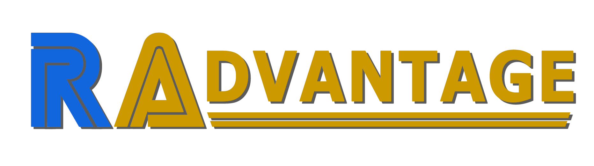

RAdvantage is where you share your tricks about how to unlock that one specific challenging achievement that took you hours to do.

Examples:

- where you farmed extra-lives
- where's that spot where the boss can't hit you
- or even your super-personal approach to get it done!

And if your strategy is hard to describe with words, no problem! Send us some images or even a video.

Submit your tricks to RANews! Go to  page and then "Send Private Message".

**NOTE: Be sure to provide the link to the achievement you're writing about!** :wink:

## Super Mario 64 (Nintendo 64)

| Achievement                                                                                                                                                                                                                                                               | Game                                                                                                                                                                                                                                                                   |
| ------------------------------------------------------------------------------------------------------------------------------------------------------------------------------------------------------------------------------------------------------------------------- | ---------------------------------------------------------------------------------------------------------------------------------------------------------------------------------------------------------------------------------------------------------------------- |
| <a class="gameicon-link" href="https://retroachievements.org/achievement/126519" target="_blank" rel="noopener">  Treasure VII</a> | <a class="gameicon-link" href="https://retroachievements.org/game/10003" target="_blank" rel="noopener">  Super Mario 64 (Nintendo 64)</a> |

- Tip by: 

107 outside and 26 inside. Try to push all the bullies perpendicular to the edge and not in an angle so the coin lands near you and not the lava. For the last two bullies in the volcano, push the bottom one to a lower platform so you can get the coin easier and the top one near the bottom half of the ledge and dive directly after him to catch the coin in time.

## Misadventures of Tron Bonne, The (PlayStation)

| Achievement                                                                                                                                                                                                                                                                                                            | Game                                                                                                                                                                                                                                                                                                       |
| ---------------------------------------------------------------------------------------------------------------------------------------------------------------------------------------------------------------------------------------------------------------------------------------------------------------------- | ---------------------------------------------------------------------------------------------------------------------------------------------------------------------------------------------------------------------------------------------------------------------------------------------------------- |
| <a class="gameicon-link" href="https://retroachievements.org/achievement/162274" target="_blank" rel="noopener">  The Quick Adventures of Tron Bonne</a> | <a class="gameicon-link" href="https://retroachievements.org/game/11304" target="_blank" rel="noopener">  Misadventures of Tron Bonne, The (PlayStation)</a> |

- Tip by: 

They say that time is money, and this challenge takes that to a literal extreme. Luckily, there's a clear path to success, as follows:
Bank 1 -> Bank 2 -> Nakkai Ruins (Get Pipe) -> Bank 3 -> Nakkai Ruins (Dianna's Tear) -> Farm 1-3 -> Get RICH

In Bank 1, you'll want to take along Servbot #31, the Bazooka Dev. Make absolutely certain ALL of your Servbots explore at least 5 houses (Shoot the dogs to make sure they don't get scared away), so #31's Brains raises, which unlocks Bazooka development. You can quickly defeat Denise by picking up her car with her in it (The Gustaff's grab range is LAAAARGE!), taking two or three steps back, and throwing it at her when she bails. In Bank 2, you'll want to have your Servbots steal tires and lights from the police cars and riot shields from the officers, as you'll need them to fund bazooka development. Otherwise, just run fast.

In your first trip to Nakkai Ruins, make a beeline for the chest with the pipe and immediately leave. For safety you'll want to pick up the Zenny dropped by Reaverbots you defeat, but don't bother with anything else. Use it to build the Bazooka and use that to plow through Bank 3. If you'd like, you can nab some more riot shields and destroy the bomb-turrets to pay for health upgrades and E-tanks, but it's not necessary. You can also squeeze through the two trucks that try to ram you, which looks scary and only saves a couple seconds but will make you feel like a badass.

When you return to the Ruins, again run straight for your objective: Dianna's Tear. If the hippo Reaverbot gives you trouble, feel free to upgrade #1's speed and attack (Takes ~5 minutes) then hand him the red cap. This will significantly boost your damage output. With the hippo defeated, the tear will net you your first million and unlock the farm missions. These are pretty straightforward, just make sure to fire bombs at the ground-bound bird robots as soon as your Servbot gets ahold of an animal, because if any get loose (Especially on Farm 3) they can waste a ton of your time. Nab a couple of Birdbots along the way if you feel you need some extra cash.

Once the 2 million goal has been met, it's as simple as mashing through cutscenes and firing bombs at Glyde and Loath until you reach the end. I cleared (With many mistakes and safety cash gathering) at roughly the 45-minute mark, so there's lots of room for error, even if you're not confident.

## Fester's Quest (NES)

| Achievement                                                                                                                                                                                                                                                                  | Game                                                                                                                                                                                                                                                  |
| ---------------------------------------------------------------------------------------------------------------------------------------------------------------------------------------------------------------------------------------------------------------------------- | ----------------------------------------------------------------------------------------------------------------------------------------------------------------------------------------------------------------------------------------------------- |
| <a class="gameicon-link" href="https://retroachievements.org/achievement/19158" target="_blank" rel="noopener">  Alien computer</a> | <a class="gameicon-link" href="https://retroachievements.org/game/1685" target="_blank" rel="noopener">  Fester's Quest (NES)</a> |

- Tip by: 

You can beat the computer with the homing missiles by standing in a spot down and to the right of center. It can’t hit you there. Otherwise, this is sort of tricky.

## ~Demo~ Metroid Prime Hunters: First Hunt (Nintendo DS)

<table>
    <thead>
        <tr>
            <th>Achievement</th>
            <th>Game</th>
        </tr>
    </thead>
    <tbody>
        <tr>
            <td><a class="gameicon-link" href="https://retroachievements.org/achievement/136089" target="_blank" rel="noopener">  Rolling Around at the Speed of Sound</a></td>
            <td rowspan=3><a class="gameicon-link" href="https://retroachievements.org/game/17239" target="_blank" rel="noopener">  ~Demo~ Metroid Prime Hunters: First Hunt (Nintendo DS)</a></td>
        </tr>
        <tr>
            <td><a class="gameicon-link" href="https://retroachievements.org/achievement/136090" target="_blank" rel="noopener">  No Module Left Behind</a></td>
        </tr>
        <tr>
            <td><a class="gameicon-link" href="https://retroachievements.org/achievement/136091" target="_blank" rel="noopener">  You Missed Almost All of Them</a></td>
        </tr>
    </tbody>
</table>

- Tip by: 

Nothing worse than playing through Morph Ball training only to lose a run because of an accidental morph ball boost activation. Constantly spamming morph ball bombs throughout the run will prevent the morph ball boost from activating, making these achievements a lot easier to get. 

## Club Penguin: Elite Penguin Force (Nintendo DS)

| Achievement                                                                                                                                                                                                                                                                              | Game                                                                                                                                                                                                                                                                                                        |
| ---------------------------------------------------------------------------------------------------------------------------------------------------------------------------------------------------------------------------------------------------------------------------------------- | ----------------------------------------------------------------------------------------------------------------------------------------------------------------------------------------------------------------------------------------------------------------------------------------------------------- |
| <a class="gameicon-link" href="https://retroachievements.org/achievement/135821" target="_blank" rel="noopener">  Selective Fisherman</a> | <a class="gameicon-link" href="https://retroachievements.org/game/9260" target="_blank" rel="noopener">  Club Penguin: Elite Penguin Force (Nintendo DS)</a> |

- Tip by: 

Shoot for smaller fish if you can for this. Keep an eye out for sharks that chomp, jellyfish that sting, and anything else that can kill your attempt! If you stick near the top of the level, you’ll reel in much quicker with less risk!