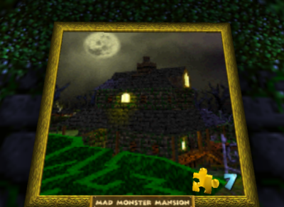
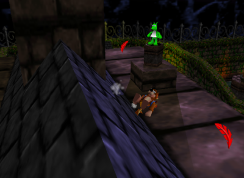
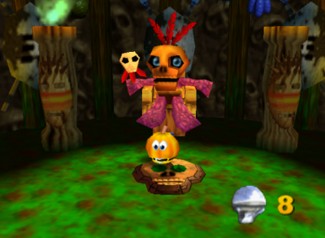

<figure style="text-align:center;float:right;width:50%;height:50%;">

<figcaption>
My own copy of Banjo-Kazooie with my (’s really) N64
</figcaption>
</figure>

There are many great games out there for the N64. The N64 probably has some of the greatest games of all time, games like The Legend of Zelda: Ocarina of Time, Super Mario 64, Conker’s Bad Fur Day and so on.

Today however, I would like to talk about one of my favourites for the system, Banjo-Kazooie.

I remember back when the game released in the summer of 1998, it was something I wanted to experience. It was the first game I had ever rented myself and I was completely in love with the game, it is also a game that (kind of) fits the theme for October and Halloween, your main villain is a Witch and one of the best levels in the game is a haunted level. The game is essentially a game where you go from world to world, exploring each one and getting all the collectables in each one.

<figure style="float:left;text-align:center">

<figcaption>Banjo-Kazooio Box Art</figcaption>
</figure>

To start with, the game begins with you asleep in your house and the witch Gruntilda comes in and kidnaps your little sister and when wake up, you hear that she’s gone, and you set out to rescue her while the evil witch’s plan is to use her to steal her beauty, which is something I find odd because at the beginning of the game, you see them about ready to flip the switch which means the entire game takes place only over a short time… apparently, unless I am missing something here.

Overall, the game has some neat and creative mechanics, lots of moves to learn for both you and your bird companion and even some upgrades to find. The music is great and is some of my favourite in video games. One of the levels, which is called Mad Monster Manion, it is essentially a haunted mansion with a haunted church. The design is great, and you have many areas in the game. There is the mansion and church which I mentioned above and several other side areas such as a hedge maze, a creepy swamp which has a well which feels like a haunted well. Skeletons essentially roam the level as well as gravestones which look to hurt you when they see you.

|  |  |
|:-:|:-:|
| Completing a puzzle painting to gain access to a level. | Banjo on top of the Mansion collecting a Jinjo, one of the game’s collectables. |

One of the other things I loved about this game the creativity they put into it. To get to the church you need to race against the clock and when you enter, you are in this huge church with an organ you can play and are even “taught” how to play by the hand “playing” the music. Other things, you use a character called Mumbo to transform into various other characters, in this level, you are a pumpkin. There is tons of humour as well, for example, there is a toilet, as a bear, you are too big but as a little pumpkin, you are small enough to hop in the bowl and be flushed down to the lovely sewage below to collect one of the puzzle pieces. Another example is there are flower pots which you can crap out eggs into, and if one goes in, flowers will grow from it and it was say “Thank You” though, some will argue it says something a bit more… vulgar.

<figure style="max-width:400px;float:right;text-align:center">

<figcaption>Being turned into a pumpkin by Mumbo</figcaption>
</figure>

Overall, this game as a child has given so much to my childhood. The game is a blast, fun and creative levels, lots of moves to find and use, moves that include being able to fly, use your bird legs to climb steep slopes, shoot like a rocket when flying to attack your enemies and more. There were also several minigames and puzzles which were usually to spell the game’s name. There was one of these in the level Mad Monster Mansion in the shed. The other great thing I loved about the game was the exploring factor, every level had places to explore and same with the overworld. Exploring everything would help as you could find “Cheeto” books which would give you codes in increase your max number of eggs, feathers, or gold feathers. There were even cheats you could get to change the shape of your body which gave you reasons to explore.

Remembering back, I was happy I was introduced to this game and got to experience it as a child. I ended up renting it 3 times to be able to complete it and I never actually owned a copy of it until I was an adult and my wife and I (girlfriend at the time) were able to buy a copy when a collector’s store was closing down. It is one of the best N64 games I have played, and I would recommend it to anyone who has yet to experience the game.

