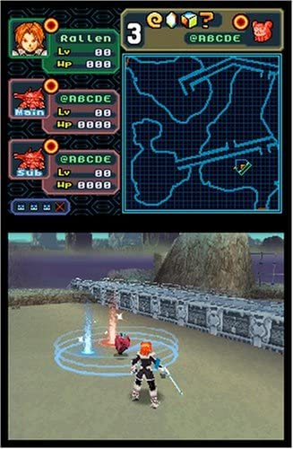
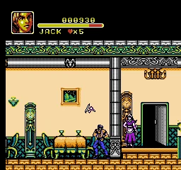
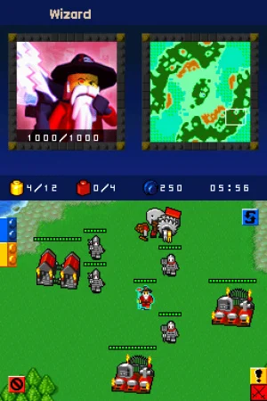
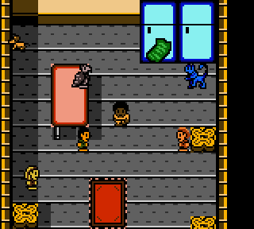
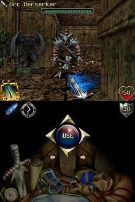
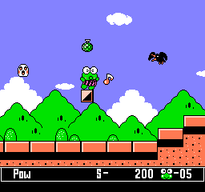
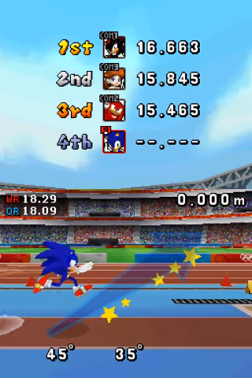
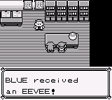
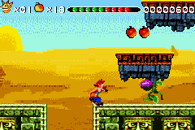
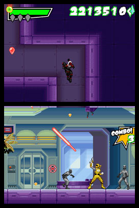

## Spectrobes: Beyond the Portals (Nintendo DS)

| Game                                                                                                                                                                                                                                                                       | Console     | Genre      |
| -------------------------------------------------------------------------------------------------------------------------------------------------------------------------------------------------------------------------------------------------------------------------- | ----------- | ---------- |
| <a class="gameicon-link" href="https://retroachievements.org/game/16575" target="_blank" rel="noopener">  Spectrobes: Beyond the Portals</a> | Nintendo DS | Action RPG |

<figure style="text-align:center;float:right;width:40%;height:50%">

</figure>

Spectrobes beyond the portals. This strangely original Gem came from the minds at Disney and was actually fantastic. It made use of all the DS gimmicks including touch screen and microphone which may make it difficult for set building with current emulation, but this is my dream list damn it and I wanna dig up fossils and breathe them back to life with my screams. Also, when you dig up these adorable little former fossils be sure to dig up some gems as well. They eat them. Crunchy gemstones. Yummy.
 

## ~Unlicensed~ Titenic (NES)

| Game                                                                                                                                                                                                                                                  | Console | Genre     |
| ----------------------------------------------------------------------------------------------------------------------------------------------------------------------------------------------------------------------------------------------------- | ------- | --------- |
| <a class="gameicon-link" href="https://retroachievements.org/game/8654" target="_blank" rel="noopener">  ~Unlicensed~ Titenic</a> | NES     | Adventure |

<figure style="text-align:center;float:left;width:40%;height:50%">

</figure>

Titenic. Yep. You read that right. Titenic. Arguably everyone's favorite Beat em Up game starring Jack and Rose. Yeah it's a bootleg, but honestly it's fairly playable for a bootleg. Bash everyone in sight just like a normal beat em up. Avoid the mice. Don't drown and try not to look too closely at the clocks.
 

## LEGO Battles (Nintendo DS)

| Game                                                                                                                                                                                                                                  | Console     | Genre              |
| ------------------------------------------------------------------------------------------------------------------------------------------------------------------------------------------------------------------------------------- | ----------- | ------------------ |
| <a class="gameicon-link" href="https://retroachievements.org/game/7627" target="_blank" rel="noopener">  LEGO Battles</a> | Nintendo DS | Real-time strategy |

<figure style="text-align:center;float:right;width:40%;height:50%;">

</figure>

Do you love games like Age of Empires, and Warcraft, and Battle for Middle Earth, But wish there was a version for kids, LEGO Battles has you covered? Play through 6 campaigns of 15 levels of civilizations style gameplay with the charm and humor that we all know and love from LEGO. No Minifig left behind.
 

## Animorphs (Game Boy Color)

| Game                                                                                                                                                                                                                            | Console        | Genre         |
| ------------------------------------------------------------------------------------------------------------------------------------------------------------------------------------------------------------------------------- | -------------- | ------------- |
| <a class="gameicon-link" href="https://retroachievements.org/game/2583" target="_blank" rel="noopener">  Animorphs</a> | Game Boy Color | Adventure RPG |

<figure style="text-align:center;float:left;width:40%;height:50%">

</figure>

Animorphs was a series that was massive in the 90s and so even video game companies tried to cash in on it. But rather than come up with an original concept they just reused what worked. If you are sick of playing Pokémon subsets then this is the game for you. It plays like a worse Pokémon game and even has a password system but if you enjoy Pokémon style RPGs then this is something for you.
 

## Orcs and Elves (Nintendo DS)

| Game                                                                                                                                                                                                                                       | Console     | Genre      |
| ------------------------------------------------------------------------------------------------------------------------------------------------------------------------------------------------------------------------------------------ | ----------- | ---------- |
| <a class="gameicon-link" href="https://retroachievements.org/game/16755" target="_blank" rel="noopener">  Orcs and Elves</a> | Nintendo DS | Action RPG |

<figure style="text-align:center;float:right;width:40%;height:50%">

</figure>

Orcs and Elves is a dungeon crawler from the brilliant minds at id Software except they didn't think brilliantly when it came to systems to put this game on. This gem of a game only released on J2ME and the Nintendo DS which are both bizarre choices for a dungeon crawler. But it manages to do it brilliantly with the DS version actually adding content. A solid game well deserving of a set.
 

## Kero Kero Keroppi no Daibouken 2: Donuts Ike ha Oosawagi (NES)

| Game                                                                                                                                                                                                                                                                                                                          | Console | Genre      |
| ----------------------------------------------------------------------------------------------------------------------------------------------------------------------------------------------------------------------------------------------------------------------------------------------------------------------------- | ------- | ---------- |
| <a class="gameicon-link" href="https://retroachievements.org/game/4051" target="_blank" rel="noopener">  Kero Kero Keroppi no Daibouken 2: Donuts Ike ha Oosawagi</a> | NES     | Platformer |

<figure style="text-align:center;float:left;width:40%;height:50%">

</figure>

Kero Kero Keroppi no Daibouken 2: Donuts Ike ha Oosawagi is a game that can be best described as bizarre. The first game in the series was a childrens puzzle game for the NES, but the second game went a completely different direction. This is a platformer where you play as Keroppi, a cute frog from the same universe as Hello Kitty. You will be shooting words from your mouth and collecting cupcakes and all around jumping around being adorable in a platformer that was designed for kids and is fun for all.
 

## Mario & Sonic at the Olympic Games (Nintendo DS)

| Game                                                                                                                                                                                                                                                                               | Console     | Genre  |
| ---------------------------------------------------------------------------------------------------------------------------------------------------------------------------------------------------------------------------------------------------------------------------------- | ----------- | ------ |
| <a class="gameicon-link" href="https://retroachievements.org/game/14812" target="_blank" rel="noopener">  Mario & Sonic at the Olympic Games</a> | Nintendo DS | Sports |

<figure style="text-align:center;float:right;width:40%;height:50%">

</figure>

Mario and sonic at the Olympic Games will no doubt be another difficult game to support on RA but would still be a dream come true. I spent many hours and broke multiple styluses playing this game, and it would be nice to have more motivation of Cheevos to replay it on an emulator. You will have your favorite Nintendo and Sega characters running and jumping and throwing things in Beijing, China.
 

## ~Hack~ Twitch Plays Pokemon: Anniversary Red (Game Boy)

| Game                                                                                                                                                                                                                                                                                                   | Console  | Genre         |
| ------------------------------------------------------------------------------------------------------------------------------------------------------------------------------------------------------------------------------------------------------------------------------------------------------ | -------- | ------------- |
| <a class="gameicon-link" href="https://retroachievements.org/game/17399" target="_blank" rel="noopener">  ~Hack~ Twitch Plays Pokémon: Anniversary Red</a> | Game Boy | Adventure RPG |

<figure style="text-align:center;float:left;width:40%;height:50%">

</figure>

Since (at the time of writing) everyone is doing Pokémon subsets I would like to request we get a version where I can Catch Em All. Anniversary Red was made for Twitch Plays Pokémon to allow them to truly catch them all and the crazy idiots did it. A true catch-a-thon and all Pokémon are available to encounter in Gen 1. I am not the biggest fan of Pokémon hacks and subsets but if you guys are gonna keep making them please keep TPP Anniversary Red in mind.
 

## ~Unlicensed~ Crash Advance IV (Game Boy Advance)

| Game                                                                                                                                                                                                                                                                     | Console          | Genre      |
| ------------------------------------------------------------------------------------------------------------------------------------------------------------------------------------------------------------------------------------------------------------------------ | ---------------- | ---------- |
| <a class="gameicon-link" href="https://retroachievements.org/game/17942" target="_blank" rel="noopener">  ~Unlicensed~ Crash Advance IV</a> | Game Boy Advance | Platformer |

<figure style="text-align:center;float:right;width:40%;height:50%">

</figure>

How can you describe Crash Advance IV? Terrible? Atrocious? God Awful? Yeah, that about sums it up. From the developers that brought you such gems as Donkey Kong 5: The Journey of Over Time and Space for the GBC and Sonic 3 Fighter Sonic for the GBA comes Crash Advance IV. Another game built on the same engine as their other platformers Crash Advance IV brings absolutely nothing to the table. And that's exactly why it deserves a set. This is exactly the kind of bootleg meme fodder that RA users eat up. Give it a set guys. It deserves it.
 

## Power Rangers: Super Legends (Nintendo DS)

| Game                                                                                                                                                                                                                                                                   | Console     | Genre            |
| ---------------------------------------------------------------------------------------------------------------------------------------------------------------------------------------------------------------------------------------------------------------------- | ----------- | ---------------- |
| <a class="gameicon-link" href="https://retroachievements.org/game/17943" target="_blank" rel="noopener">  Power Rangers: Super Legends</a> | Nintendo DS | Action-Adventure |

<figure style="text-align:center;float:left;width:40%;height:50%">

</figure>

Power Rangers Super Legends was released for the 15th anniversary of Power Rangers. Released alongside the operation overdrive TV series it was designed to show off the history of the series without contradicting any of the continuity that Power Rangers is surprisingly good at keeping. The DS version received lower reviews than its Console counterpart which is quite unfair. Super Legends for DS combines some puzzle solving alongside Beat Em Up style game play. With a wide variety of Rangers to play as, a range of levels from across the franchise and fan favorite villains and rangers. All in all it would be a good choice to make a set for alongside the other forgotten games that RA gives life to.
