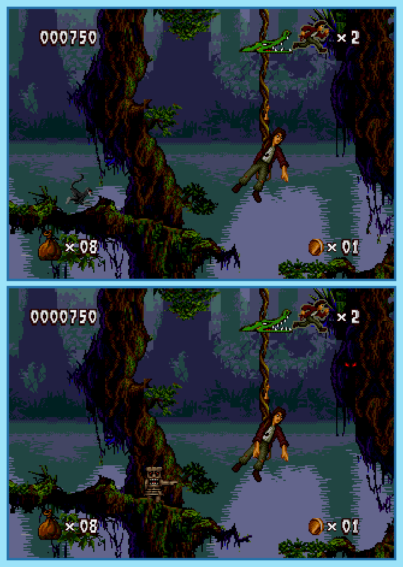

## Last Month's Winner

  
  

## Spot the Difference

Pitfall Harry Junior is on his newest adventure, deep inside a Mayan jungle. While he searches for temples he got lost and currently is trying to find his way out of the jungle. He walked into a circle and was already here before, but some things have changes since then. Can you find all 10 differences in the lower image?

## About the Game

| Game                                                                                                                                                                                                                                                                  | Console    | Genre           |
| --------------------------------------------------------------------------------------------------------------------------------------------------------------------------------------------------------------------------------------------------------------------- | ---------- | --------------- |
| <a class="gameicon-link" href="https://retroachievements.org/game/4389" target="_blank" rel="noopener">  Pitfall: The Mayan Adventure</a> | Mega Drive | Action Platform |

* Suggested by: 

**Note:** The first user who finds all 10 differences and sends proof to  via Site DM or Discord will be listed in the next issue as the winner. Additionally, a random selected user which submitted the solution until the end of the month will be chosen to select the game of the next picture.
