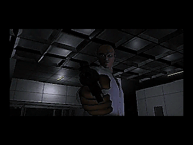
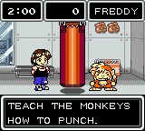
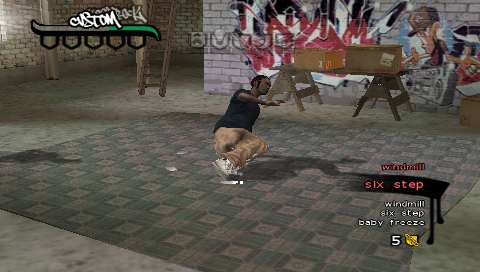
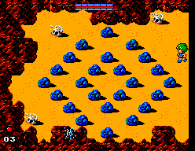

## D | D no Shokutaku (3DO Interactive Multiplayer)

| Game                                                                                                                                                                                                                                                 | Console                     | Genre     |
| ---------------------------------------------------------------------------------------------------------------------------------------------------------------------------------------------------------------------------------------------------- | --------------------------- | --------- |
| <a class="gameicon-link" href="https://retroachievements.org/game/16709" target="_blank" rel="noopener">  D \| D no Shokutaku</a> | 3DO Interactive Multiplayer | Adventure |

* Writeup by: 

<figure style="text-align:center;float:right;width:50%;height:50%">

<figcaption></figcaption>
</figure>

A creepy atmospheric survival horror game unique to it's time. D is unique in many ways compared to traditional games. The game runs fully on pre rendered full motion video clip. An unforgiving feature of no save points throughout the game and the first person view enhances the immersion you get as playing the game's story. Every choice has the potential for consequence, every time you open a door into a new area, what will be in store for you? The gritty feel of the game, storyline with a twist, and multiple endings make you finish feeling accomplished, but wanting to know more. What are the other endings? What happens next?!

*Screenshot via MobyGames
 

## Monkey Puncher (Game Boy Color)

| Game                                                                                                                                                                                                                                      | Console        | Genre                      |
| ----------------------------------------------------------------------------------------------------------------------------------------------------------------------------------------------------------------------------------------- | -------------- | -------------------------- |
| <a class="gameicon-link" href="https://retroachievements.org/game/4192" target="_blank" rel="noopener">  Monkey Puncher</a> | Game Boy Color | Pet Sim, Sports Management |

* Writeup by: 

<figure style="text-align:center;float:left;width:30%;height:50%">

</figure>

No, this isn’t a game where you get to punch monkeys. Instead, it’s a game where you train a monkey to punch other monkeys! I'm sure that's not legal, but you’re doing it to save your kidnapped family, so that makes it fine, right? It’s a pretty silly game, especially with the odd translation.

Monkey Puncher is kind of a pet simulator, but also a sports management game? You take care of your monkey like a pet and manage its mood, but you also want it to work out and get its stats raised so you can earn prize money from bouts. You start out with a basic monkey and train them via minigames. Once you lock into a match, you can only spectate and cheer on your monkey. You can also buy other monkeys with different fighting styles.
 

## B-Boy (PlayStation Portable)

| Game                                                                                                                                                                                                                     | Console              | Genre          |
| ------------------------------------------------------------------------------------------------------------------------------------------------------------------------------------------------------------------------ | -------------------- | -------------- |
| <a class="gameicon-link" href="https://retroachievements.org/game/18131" target="_blank" rel="noopener">  B-Boy</a> | PlayStation Portable | Rhythm Dancing |

* Writeup by: 

<figure style="text-align:center;float:right;width:50%;height:50%">

</figure>

A video game about *breakdancing*? From the developers that made DJ Hero, imagine a game similar to Bust-a-Groove, added with a combat mechanics system similar to Xenogears or Saga Frontier 2. Not only do you need to maintain a rhythm, but you would need to learn and implement new dance moves by using different button combinations in battles if you want to make it to the top. In Livin' Da Life (career mode) You begin as a beginner break-dancer learning the fundamentals such as toprock, footwork, power moves, freezes, special entries, and dissing/finishing moves. While you play this game, you will get a decent understanding of how the b-boy/b-girl culture works. The dance moves and the difficulty portrayed is pretty authentic in terms of representation. There's also a decent soundtrack made of the more popular battle tracks that will surely make you move.
 

## Golvellius: Valley of Doom (Master System)

| Game                                                                                                                                                                                                                                                               | Console       | Genre      |
| ------------------------------------------------------------------------------------------------------------------------------------------------------------------------------------------------------------------------------------------------------------------ | ------------- | ---------- |
| <a class="gameicon-link" href="https://retroachievements.org/game/10001" target="_blank" rel="noopener">  Golvellius: Valley of Doom</a> | Master System | Action-RPG |

* Writeup by: 

<figure style="text-align:center;float:left;width:40%;height:50%">

</figure>

First released on the MSX in Japan in 1987, Sega would port Golvellius to the Master System and release it worldwide a year later.  Dubbed by some as a 'Zelda Killer', this game blends side-scrolling and overhead action with Zelda-style adventuring. Its music also impresses, and much like Phantasy Star, differs sufficiently whether you're playing the Japanese or Western versions.

While three games in the series exist (For the MSX, Master System, and MSX2, respectively), they each follow the same story, and interestingly enough, all end on a cliffhanger that was never resolved.  Its developer, Compile, would move on to create the Puyo Puyo series!
 
