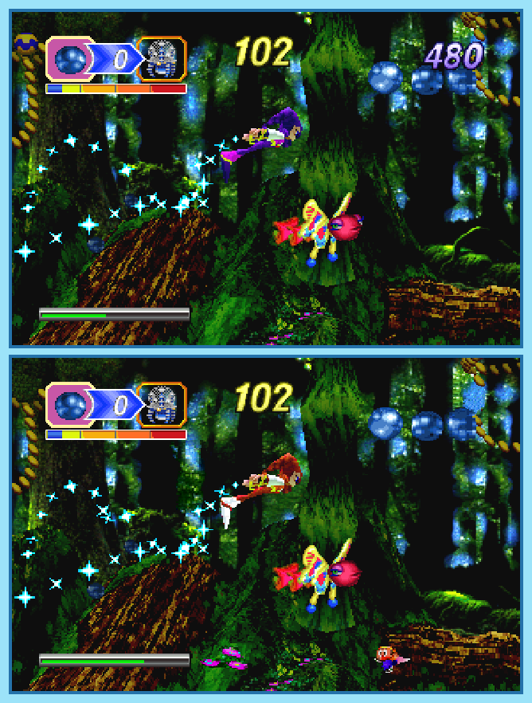

## Last Month's Winner

  
  

## Spot the Difference

Dreams allow to see and do many things, that would normally be impossible. It's goes even that far that many dreams feel realistic, which can either be very cool or very terrifying. Luckily, NiGHTS helps you to navigate safely through the dreams. However, not every dream is the same and so there are 10 differences between both dreams, can you find all of them?

## About the Game

| Game                                                                                                                                                                                                                                                     | Console | Genre  |
| -------------------------------------------------------------------------------------------------------------------------------------------------------------------------------------------------------------------------------------------------------- | ------- | ------ |
| <a class="gameicon-link" href="https://retroachievements.org/game/14527" target="_blank" rel="noopener">  NiGHTS into Dreams...</a> | Saturn  | Action |

* Suggested by: 

**Note:** The first user who finds all 10 differences and sends proof to  via Site DM or Discord will be listed in the next issue as the winner. Additionally, a random selected user which submitted the solution until the end of the month will be chosen to select the game of the next picture.
