## About

This is not an official manual, walkthrough, or critical review. This document is a simple guide for the current achievement set available on [RetroAchievements](https://retroachievements.org/game/3652). This guide will give the player tips on earning the achievements, hash compatibility, and any other necessary or useful information.


## Synopsis

Set Difficulty: 4/10  
Approximate time to Master: 12-20 hours  
Minimum Number of Playthroughs Needed: 1 (can earn every achievement on a single new file, without starting over)  
Number of Missable Achievements: 0
Does Difficulty Affect Achievements?: Minigames (5 achievements, hard difficulty required)

## Introduction

*Densetsu no Stafy 2* is a platformer game with elements of swimming in water (marketed as a "marine action" game in Japan). The player takes the role of Starfy, the titular yellow, star-shaped hero. This game was released by TOSE in 2003 for the Game Boy Advance and re-released in 2016 for the Wii U Virtual Console. This game, like the other first four Starfy games, was released only in Japan. It is playable without knowing any Japanese, although there are a couple places that require a minute or two of trial and error. 

Even though this is the second game in the Starfy series, you're welcome to play the Starfy games in any order. The gameplay is generally not contingent on prior knowledge of the other Starfy games. As you'll realize from playing this game and other Starfy games, Starfy games are a bit more focused on puzzle solving and a lot heavier on dialogue compared to traditional platformers. Yes, this means that all the dialogue is in Japanese, but most areas are fairly linear anyway. I hope this makes for a casual experience as you meet all the characters Starfy's colorful cast has to offer.

In general, this game expands on the enemies and NPC's from the first game. The terrain is also designed a bit more openly, owing to some of Starfy's new abilities, like a double jump, that allow him to traverse larger areas.

## Story

*Densetsu no Stafy 2* continues the story after its predecessor, *Densetsu no Stafy*. Ogura, the antagonist, was imprisoned in a jar in the previous game. But in the intro for this game, he breaks out with the help of his ten children, the Puchi Ogura. Ogura kidnaps Starfy's mom, and it's up to Starfy and his best friend, Moe, to save her. 

Similar to the first game, Starfy and Moe fell from Starfy's home kingdom in the sky, Pufftop, and into the ocean. Their first pit stop is to meet up with Old Man Lobber to get Starfy's mom's whereabouts. Starfy has to traverse eleven different stages to reach, fight, and eventually defeat Ogura at Ogura's Castle to rescue his mom. Starfy's mom dropped several treasures across the world while she was kidnapped, and so you're following the trail of treasures in each stage to progress through the game.

Similar to the previous game, the gameplay revolves around helping various characters as you progress. You'll unlock several abilities and items with the help of these NPC's, too. You'll find that the Puchi Ogura are wreaking havoc on the indigenous background characters, so you'll also fight each of the Puchi Ogura along the way.

## Extra Controls

Every one of Starfy's moves in this game has a sign with a helpful visual explanation on how to perform them. Some menu controls, however, are more obtuse. I have listed important controls below:

**File Select**

- SELECT: Deletes selected file
- L Button: Lets you pick one file to copy over the second file you've selected

**World Map/Stage Map**

- L Button: Takes you to the shop (once you've cleared Stage 1-3)
- R Button: Takes you to Moe's house (once you've cleared Stage 3-5)

**Pause Menu**

- START: Press when inside an area to go to the pause menu. This lets you view your abilities, inventory, vehicles, etc. Also takes you out of the pause menu when pressed again.
- START + SELECT: Press when in the pause menu to exit back to the stage map. Useful for retrying area-specific challenge achievements. **Only available after you've beaten the game once.**
  - As pressing only START un-pauses you, I recommend holding SELECT first, and then pressing START with it.

## Save Support

This game has three save file slots. You may use any file to earn achievements.

The game generally autosaves when you menu to the world map or stage map and after you collect a treasure. You can also manually save within an area by touching a Mermaid (pink clam shells, can't miss them). You can also create suspend saves (one-use saves) at any time by pressing START while in an area to go to the pause menu, and then exiting your emulator while paused, although Mermaid saves are so common that I see little reason to use suspend saves.

Do note that some area-specific challenge achievements do not allow Mermaid or suspend saves (you must enter from the Stage map and play the area from start to finish). Boss battle-related achievements also do not allow suspend saves in the middle of the fight (you must initiate the fight and fulfil the challenge in one sitting). **When in doubt, check the challenge indicator.** It should show up in the right area/boss arena, if and only if you met these save restrictions (and additional requirements).

## Compatibility

There is but one ROM (Japanese) registered to this game with the following md5:

```
0635251b85657f9c1de295546da09aeb
```

Currently, there are no known English patches for this game.

## Walkthrough

Remember that no achievement in this game is missable. You're either guaranteed to unlock it during your first playthrough or have the opportunity to retry it.

**Step 1: Main Story Progression (18 Achievements)** 

These achievements are earned starting from a new file to when you defeat Ogura for the first time. One achievement per stage completion, plus six more for unlocking each of Starfy's abilities. Also includes one "freebie" as a precursor to an area-specific challenge...

**Step 2: Boss Challenges (13 Achievements)**

These achievements are earned by fighting bosses with certain restrictions. You can earn these achievements alongside Step 1. However, you can still re-fight each boss once you've beaten the game, with one caveat (more on that later).

**Step 3: Second Quest (15 Achievements)**

Earned by fulfilling the requirements of getting the good ending (complete all the extra areas, then defeat Ogura again). These are pretty self-explanatory. Although you only need to beat the extra areas to get the good ending, you might as well beat all the areas for 100%.

**Step 4: 100% Quest (12 Achievements)**

Earned by unlocking everything this game has to offer: Clothing/Accessories, music, photographs, and picture book entries. This requires playing every minigame and buying everything in the shop. This step and Step 3 will likely take the longest.

**Step 5: Area-Specific Challenges (6 Achievements)**

Earned by completing certain areas with additional restrictions. These are quite short individually (2-3 minutes) and test your movement a bit.

**Step 6: Miscellaneous (1 Achievements)**

One easter egg to top off this set at 65 achievements worth 424 total points.

### Step 1: Main Story Progression

         

Lobber's Cave/Gluglug Lagoon/Turtle Tropics/Slippery Iceberg/Fountain Forest/Pitch Dark Cave/Yo-Ho Mountains/Pufftop/Resshi Lake/Waterfall Wall (5 each)

*Clear Stage X during the main story*

Pretty straightforward, these are unlocked when you beat the last area in each stage. These are 1-4, 2-4, 3-5, 4-5, 5-5, 6-5, 7-5, 8-6, 9-6, and 10-6. Note that extra areas open up after you beat the game, so don't worry about the "complete every area" achievements for now.

Also, I recommend that you start collecting pearls right away. You'll need them for the shop achievements later down, and it'll cut out some of the repetitious pearl grinding. Take your time to explore some side paths or go out of your way to get some more pearls...

     

Herman Helper (1)/Flying Squirrel Power (2)/Ninja Cat Power (3)/Barreling Through (3)/Like a Meteor (2)/Frog's Ancient Power (3)

These achievements are also guaranteed unlocks on your first playthrough in their respective areas, corresponding to new abilities that each of these NPCs teach Starfy. They are generally unlocked as soon as you talk to the respective NPC after completing their task, or in the case of 3-4 or 8-2, as soon as you learn the new ability.


Combo Striker (1)

*Defeat any five enemies in rapid succession and get some bonus pearls as a reward.*

Self-explanatory. For a really easy way to get this achievement, in Stage 1-4, as you enter the boss door, there's a line of five enemy Unu (red/black fish) for you to kill consecutively. Every kill combo at 5 and above gets you one big pearl worth 5 total pearls. 

You may want to collect extra pearls this way as you progress through the game in preparation to buy stuff from the shop. I highly recommend that you buy stuff from the shop as you play, as any pearls you get beyond the cap of 9999 get wasted.

#### Places You Might Get Stuck

As this is a Japan-only game that's also heavy on dialogue, there are a few places that are not intuitive to English speakers on where to progress. Normally, it's obvious that you just have to go through a couple doors to get certain items or talk to certain NPC's, but I've outlined the exceptions to this gameplay loop:

##### 5-3

There's a puzzle where you have to spin attack the symbols in the correct order. The order is based on the Japanese syllables of the symbols' names, but to English speakers, this appears arbitrary. Here are the symbols you must hit in the correct order:

- Puzzle 1: Banana, Plum, Watermelon, Pumpkin
- Puzzle 2: Watermelon, Orange Pepper, Pickle, Apple
- Puzzle 3: Watermelon, Oyster, Squid, Pumpkin

##### 6-2

When you get to the room with the red, blue, and yellow orbs, put the red one in the hole with the pig, the yellow one in the hole with the bird, and the blue one in the hole with the fish.

##### 9-5

You'll reach a point where you'll have to answer a series of questions (see image below)


Answer the second (bottom) option for the first question, then the first (top) option for the rest of them. If you mess up, move closer to Moe to begin the cutscene again.


Sealed Again? (10)

*Defeat Ogura for the first time and rescue Mama Star!*

Self-explanatory, unlocks as soon as you're in the first ending cutscene. Note that beating the game unlocks some features, namely the START + SELECT shortcut and some more options in Moe's House (Sea Jams, Picture Book, and Treasure Items). You probably have a good chunk of picture book entries filled out already, but you start out with 0/50 music and 0/45 treasures, so your postgame treasure hunt's just getting started!

### Step 2: Boss Challenges

You may get these achievements the first time around, or you can re-fight the bosses after you've beaten the game. The catch is that, on subsequent boss fights, the bosses get slightly harder. Maybe the bosses' attacks are harder to dodge or move faster. On the other hand, for the earlier bosses, you can use all of your new abilities to maneuver more easily.

Regardless, before every boss fight (including each of the final boss's forms) is a convenient Mermaid save to record your progress. In case you mess up the challenge, you can just reset the game without having to replay the whole area. Thus, the "retry factor" is minimal here.

Also, the number of the Puchi Ogura conveniently matches the stage number you encounter them in (Puchi Ogura 1 is in Stage 1, Puchi Ogura 2 is in Stage 2, etc.)


Still a Pushover (5)

*Defeat Konk and Puchi Ogura 1 without using the A button*

Fairly simple, you're just not allowed to hold the A button to swim faster. Just attack Konk when he's out of his shell, and avoid him when he's in his shell and moving from side to side or falling. It's a little trickier to hit Konk when he's at the water surface, considering you can't jump out of the water normally. Just attack him at the peak of your ascent and you'll still be able to hit him.


Fried Duck Bike (5)

*Defeat Puchi Ogura 2 and Pekin Duck Model without going above the water current*

Just wait for the boss to charge at you a couple of times, and when its flame is put out, that's your chance to attack it. The verticality restriction (can't go above the water current) means you're going to have to position the boss a bit more strategically. Make sure the boss is vulnerable in an area that you can attack it while still meeting the challenge requirement.

Fun fact: You can cheese this boss by camping at one of the top corners, as the boss can't actually reach you up there. It was at this point in development that I decided that some bosses damageless were too short and/or uninteresting and swapped them out for some analogously easy restrictions.


Sneak Attack the Moth (5)

*Defeat Puchi Ogura 3 and Kiremoth without dashing*

This boss has a couple attacks, like the dive, flames, and powder, but only one of them makes the boss vulnerable: the one where the boss falls straight down in a spiked cocoon. Remember that dashing and spin attacking both use the B button, so be careful not to hold B while on the ground. Rather, jump towards the boss and press B in the air to attack it without going into the dashing animation.


Freezeflame Frenzy (5)

*Defeat Puchi Ogura 4 without taking damage*

This boss has both a fire dragon and an ice dragon form, and you're required to lure it to the opposite elemental statue to use it to damage the boss. The boss only has one attack, the radial/curving fire and ice balls, but the boss also chases you faster the lower its health gets.


Stop Sucking up the Water! (5)

*Defeat Puchi Ogura 5 and Numan without taking damage*

This boss hides in the sand surrounding the pool of water. Watch its eyes to see where the boss is, and try to keep the boss in your FOV. If you're axis-aligned with the boss after some time, it will come out and charge at you. Attack the boss from the sides or from behind (not the front) to damage it. Each time you damage the boss, it creates a current to try to suck up Starfy. Swim away. At lower HP, the boss creates fake clones of herself, which have identical eyes when they're hiding. Be sure to watch all sides and not get hit by the boss or a clone that moved from off-screen...

Note that in the postgame, this boss moves much faster. However, by that point, you also have the upgraded Star Spins unlocked to match the boss's speed.


Not that Big of a Guy (5)

*Defeat Puchi Ogura 6 without Air Jumping or taking damage*

This boss charges at you right away. You can't use your double jump for the challenge, so time a full-powered dashing jump to dodge the boss. When the boss pounds the ground, remember that you can spin away the falling boulders. Every time you damage the boss, it starts jumping around. Dash carefully to evade the boss, and get ready to jump over it once it starts charging at you again.


Precise Defusal (5)

*Defeat Puchi Ogura 7 and Manda Z without taking damage*

In every attack, the boss is vulnerable from only the top. This boss first moves from one side of the screen to another. Attacking it is pretty straightforward here. Then, it spins up a ring of four planes to try to hit you. You can spin attack these planes without taking damage. At low HP, the boss moves into the background to launch a volley of bombs to the foreground, where you are. You *can't* attack these bombs without taking damage, so move carefully, and also watch for when the boss moves across the screen (in the foreground) at the same time the bombs are falling.


Illusions Crushed (5)

*Defeat Puchi Ogura 8 and Yurikarugo without attacking any fake clones of the boss*

Pretty straightforward boss. Also vulnerable from only the top. Remember that the real boss has a shadow, though it can be hard to see with the poor lighting of the boss arena.


Spinning 'Staches (5)

*Defeat Puchi Ogura 9 and Jiiyan without pressing the B button more than 10 times*

This boss fight can be rather short. You just need to attack Puchi Ogura 9 (the small yellow thing), and then attack Jiiyan (the brown thing with a big moustache) fast enough to damage the boss, and repeat this four more times. Just be careful where you spin attack, as you can't miss even once. The boss also shoots out moustache projectiles that are pretty easy to avoid.


Bested the Last Child (10)

*Defeat Puchi Ogura 10 without taking damage or killing any of his minions*

This boss positions its spiked helmet either below or above himself, so you just have to attack the boss where the spiked helmet is *not* located. Float carefully between the waterfalls to avoid attacking or getting hit by any of the minions that fall down. Unlike other bosses, this boss has a long invincibility period before it starts moving/becomes vulnerable again. The boss also doesn't spawn minions during this period. With good timing, you can attack the boss as soon as he becomes vulnerable, over and over again, and defeat him before he moves around too much.


Not so Invincible Now... (5)

*Defeat Ogura's first form without taking damage*

This boss has either 10 (first playthrough) or 15 (subsequent playthroughs) effective HP. It only has three attacks. If the boss spits out mini whirlpools or fireballs, then carefully avoid them and attack the boss from below. For every visual HP you take off the boss, it gets all fired up and starts charging at you. You can't damage the boss here, so just swim away from it, using your upgraded Star Spin for bursts in speed, until its invincibility wears off.


Deflated (10)

*Defeat Ogura's second form without taking damage*

This boss has either 10 (first playthrough) or 15 (subsequent playthroughs) effective HP. It again, only has a handful of attacks. The icicles are easy to avoid, the bombs and the spiked ball(s) less so. You can hit the boss from below when it's using either of these attacks, but be careful not to get hit in return. For every visual HP you take off the boss, it turns red and starts bouncing around before returning to its usual attack pattern. It's not too bad to avoid, until the boss summons wind at low HP, making every attack a little harder to dodge. Move very carefully around its projectiles, especially the bombs at low HP.


Full-Fisted Fight (10)

*Defeat Ogura's third form without taking damage and by destroying either of Ogura's hands no more than once*

This boss has either 15 (first playthrough) or 25 (subsequent playthroughs) effective HP. The boss is generally vulnerable at the eyes, and only when Ogura is *not* using its eyes or mouth to attack. This boss has quite a few attacks: Its hands shoot out either fireballs or icicles, it can open its mouth to try to suck you in or to throw bombs, and it can shoot out a huge laser. Each of these attacks is telegraphed; practice distinguishing these tells.

For each visual HP you take off the boss (only at <=3HP on your first playthrough), it moves to the background and sends out flaming meteors to try to hit you. Sidestep them very carefully, and don't double-back into one.

At 1 visual HP remaining, this boss has one last trick: If you don't kill it in time and it has both of its hands, it will heal back 1 HP (equivalent to 3 or 5 more hits you need on the boss)! The boss can repeat this healing indefinitely, so your only hope is to either finish off his remaining HP or destroy one of the boss's hands to stop the healing. The boss recovers its hands on a timer, so you'll want to time your one free hand destruction just right for you to kill the boss in time. Each hand starts out with either 4 HP (first playthrough) or 8 HP (subsequent playthroughs). I would chip one of the hands down to low HP, then focus on Ogura's eyes, then destroy the low HP hand when he tries to heal.

Destroying the hands normally disables Ogura's other attacks, but with this achievement restriction, you'll have to endure them all until the very end.


With all the bosses out of the way, now it's time to focus on the postgame progression, specifically, getting the good ending, as you'll be collecting more treasures along the way en route to 100%.

### Step 3: Second Quest


All Equipped for Exploration (5)

*Visit past friends and upgrade every one of your vehicles*

Upgraded vehicles are required to access all the extra areas, so this achievement is a small pre-requisite to your treasure hunt. In case you forgot which areas have NPCs that give you vehicles, here's a list:

1. The Balloon in Stage 2-3
2. The Sea Skater in Stage 4-2
3. Ryun, the dragon, in Stage 8-1
4. The costume in Stage 9-3

These should line up with in-game sprites of the vehicles on the stage maps, too.

          

*Complete every area in Stage X (except 11-6)* (75 total points)

Self-explanatory. There are 8-10 areas per stage, and if you upgraded all of your vehicles, you should have them all unlocked. Do note that all the areas in the main story have had all of their cutscenes and puzzles removed, so traversing them should be much easier. I'd still recommend checking out the side paths for some extra pearls...

The challenge comes from doing all the extra areas. The platforming's a little more challenging, and there may be fewer save Mermaids, but there's nothing too crazy. Just keep in mind some gimmicks regarding some of your abilities:

- Using the Shooting Star ability to kill an enemy refreshes your Air Jump. It's often required that you chain multiple Air Jumps/Shooting Stars in a row on enemies to travel vertically (or horizontally).
- When using the Koala/Crocodile costume, you'll often have to scare certain enemies to render them safe to stand on for some time. Some areas have big vertical sections (looking at you, Stage 4-9) that require you to hop on of one of these enemies, make them become harmful again and move up a little, then scare them again as you're jumping on top of them to repeat the process and gain height. It might be a pain to "hover" on these types of enemies, but for some areas, it's the only way up.

Also, Stage 11-6 should be the last area you beat. If you haven't met the requirements of the good ending (see: the next achievement), then you just unlock another "meh" ending, and you will have essentially re-fought Ogura for nothing.


One More Treasure to Go (25)

*Collect all 44 treasure items scattered across the world*

If you unlocked the previous eleven achievements, you should also get this one. The reason for this separation is that, you're not required to replay main story areas to get the good ending (just the extras), but I still wanted to include a reward for completing every area per stage, as some stepping stones to 100%.


Celebration... for Now (10)

*Defeat Ogura with at least 44 treasures and seal him away for good!*

Self-explanatory. *This* is where you replay 11-6. If you did this right, then you should have unlocked treasure #45, the crown! You'll also get a more celebratory ending and an alternate credits roll, which leads to the next achievement...

If you already have a completed save file prior to this set being released, then you can still get this achievement by defeating Ogura with all 45 treasures.


Backstory Time (1)

*Watch the second Credits Roll to the very end after the good ending*

The title speaks for itself. I won't spoil anything, so just watch the slideshow of events that happened. You may not earn this achievement by re-watching the Credits Roll in Moe's House, only after defeating Ogura. As such, do *not* reset the game during the ending cutscenes or Credits Roll, or you'll have to beat Ogura again to get back to this position where you can trigger this achievement.

### Step 4: 100% Quest

And now, some odds and ends. By now, you've unlocked the bulk of the music, clothing/accessories, and picture book entries, but there are still a few things that need to be done. Starting with all the minigames. (In case you don't know, the minigames are located at Moe's house. It is the second menu option down from the top left). You start out with only easy difficulty (top option) for each minigame. Beat the minigames on easy to unlock normal difficulty (middle option), and then beat them on normal to unlock hard difficulty (bottom option)

The controls are all very similar. D-Pad Left/Right moves Moe at the bottom of the screen, and the A button makes him shoot. Remember that holding the B button while moving makes Moe move faster!


Bomb Expert (5)

*Complete the bomb blasting minigame on hard difficulty.*

Pretty straightforward. Just mash A to explode the bombs, but not too much, as there is a maximum number of projectiles you can have on the screen at one time. Hard difficulty has some bombs that move differently, but this should still be an easy affair.


Colorful Block Buster (5)

*Complete the block matching minigame on hard difficulty.*

Literally just a 1-dimensional "match 3" type of minigame. Hard difficulty requires more matches. You get bonus time for each match, too, so this minigame should be straightforward.


Critter Sorter (5)

*Complete the mice crossing minigame on hard difficulty*

You're controlling platforms on pulleys by shooting Starfy, as usual, and you want the yellow mice to make it to the other side and the purple mice to fall into the lava. The mice themselves weigh down the platforms, so you'll have to adjust them accordingly. There's no immediate penalty for sorting the mice wrong, but watch your time. Hard difficulty has more mice that appear at a time and a higher point requirement.


Playtime with Moe's Family (5)

*Complete the clam minigame on hard difficulty*

Instead of shooting Starfy, you're spitting up water to keep Moe's siblings in the air. Hard difficulty requires you to keep up all three siblings in 60 seconds. Try to keep them bunched together, or stay in between them if one of them decides to nose-dive. Remember that Moe's siblings collide with each other.


Tightrope Buddy (5)

*Complete the tightrope walking minigame on hard difficulty*

Shooting water under Starfy makes him move. You also have to keep the green/orange fuzzy enemy things away from him by spraying water at them. Hard difficulty requires you to go back and forth 4 times in 60 seconds. Just keep an eye out for enemies that appear from or fall off screen, as well as enemies falling above Starfy, and you should beat this minigame.

If you noticed after beating every one of these minigames on hard difficulty, you've unlocked 5 additional clothing/accessories, one for each minigame. More for your collection later, but the rest of them are unlocked in the shop!

   

Clutching Those Pearls/Regular at Lovely's/Mad Shopper/The Whole Catalogue (22 total points)

*Buy every item in Lovely's shop (1st/2nd/3rd/4th batch)*

Here's where all that pearl grinding pays off. The pearl amount in the icon indicates the number of pearls required to buy everything in that batch. You must re-enter the shop after you've bought everything in that batch to move onto the next one. 

In total, you need about 25,000 pearls to buy everything. If you've been collecting pearls and buying stuff at the shop regularly, you should have a good chunk of this requirement. As for good pearl grinding spots, there seems to be no definitive area that gives significantly more pearls. Some story areas with side paths, like 8-1, 8-5, 9-6, 11-4 and 11-5, have dead ends with lots of pearls, which may be your go-to. Postgame areas are generally hit-or-miss with pearl counts; I try to avoid any area with a slow vehicle section. Remember that re-entering a door reloads all the enemies, so you could also find a good spot to chain kills. Also, the START + SELECT exit to stage map automatically saves all of your pearls, so you can re-enter and collect them again and again without going all the way to the treasure chest at the end!

Update: 8-5 seems to be the way to go. Thanks to the shortcut doors, there's almost no platforming involved and you can snag 50 pearls in each of the 4 side rooms pretty easily, totaling ~200 pearls per trip. My play-testing shows that I got roughly 5,000 pearls in 30 minutes.


Symphonic Sea Jams (10)

*Collect all 50 music tracks*

You get 49/50 of the music by replaying story areas, which you should have already done. Lovely gives you the last music track after you've bought *everything* in her shop!


Full Wardrobe (25)

*Collect all 99 clothing and accessories*

As mentioned earlier, you get five of these by beating each minigame on hard. The rest, you get either from completing main story/post story areas, or by buying from the shop. This achievement triggers upon receiving the 99th clothing item/accessory from any of these sources.


Every Friend and Foe (25)

*Complete all 236 Picture Book entries*

(The picture book is accessed in Moe's house, being the fourth option down from the top-left.) You probably have around 200 entries just by progressing through the main story/postgame. Some enemies are in obscure places and warrant an entire subsection dedicated to finding them all. This achievement triggers as soon as you've logged your last entry.

#### Rare Enemy Hunt

A select few enemies in this game are "rare" in the sense that they only appear after you've beaten the game once.  Most of them appear in story areas you've already cleared, and they're often found on side paths. So, you'll generally have to go out of your way to find them. This section will list a location for each of these rare enemies. Note that some of these enemies appear in multiple places, so for those, I've just picked out the most convenient one. Any other "common" enemy is probably already logged in your picture book by the time you unlock it.

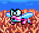 #008: Tobeuo

Enter Stage 1-4, then enter the middle door at the top above the water. Proceed rightward on the moving platforms to hit this enemy before it flies away!

 #009: Void

Enter Stage 1-3, then enter the door at "12 o'clock". You'll find a lone one.

 #010: Nogo

Enter Stage 1-3, then enter the door at "3 o'clock". Note that you can't kill these guys, so just touch one of them to log it in your picture book.

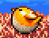 #018 Bellybird

Enter Stage 2-3 and make your way to the second screen. You'll find this enemy flopping about on the upper-left corner.

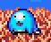 #027: Nubble

Enter Stage 2-2, then enter the first door to your right. Fall down and you'll find this one on a platform about halfway down.

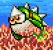 #032: Kagibanrei

Enter Stage 3-4 and enter the first door on the way up, on the left. Once you enter that door, immediately swim to the lower-left corner to find this fish swimming behind the seaweed. Don't lose track of it! *Alternate location: Stage 3-3, first screen.*

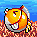 #033: Chingyo

Enter Stage 3-4 and enter the second door on the way up, on the right. Make your way to the lower-right corner and you'll find this fish bouncing around behind some seaweed.

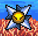 #040: Togesenbon

Enter Stage 3-4 and enter the third door on the way up, on the left. You'll find a couple of these at the top of that room. *Alternate location: Stage 3-8, third screen.*

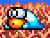 #049: Choby

Enter Stage 4-1 and make your way to the second screen. Enter the first door to your right. Make your way to the end of that path to find a Choby above a Jelatto Sister.

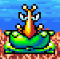 #069: Mandogora

Enter Stage 5-5 and make your way to the second screen. Go up and over, and past Moon (the blue fish) to enter the door at the bottom. Make your way to the end of that path to find this enemy next to a Mermaid. (You can then swim up through the semisolid platform to go back)

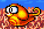 #075: Piyochiyo

Enter Stage 5-3 and move forward until you get to the screen with the bear and the big tree trunk. Enter the middle door, where the symbol chain puzzle used to be. Make your way to the end of this path to find this enemy. Be quick to beat it, or it will hide inside the wall, and you'll have to re-enter this room to have another chance to attack it.

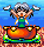 #076: Pearl Sprite

Enter Stage 5-1 and make your way to the second screen. Continue through the door in the middle, at the bottom of a pool of water. Make your way to the end of that path to find a lone Pearl Sprite. This enemy gets logged if you attack it just once, but you may as well kill it to get all of its pearls...

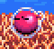 #089: Chikku

Enter Stage 6-4 and make your way to the third screen, which is vertical. Go downwards, and enter the door on the right (you should see a balloon once you're through that door). Either fly the balloon or take the shortcut doors, and you'll find this enemy on top of the "三".

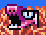 #094: Chikugyo

Enter Stage 6-2 and make your way to the third screen, which should have the fish/pig/bird engravings and their respective doors. Ignore those doors and enter the door to your immediate left, at the bottom. You'll find a pair of these enemies in a pool of water.

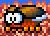 #114: Kasakasa

Enter Stage 7-5 and drop down to the hole at the bottom. Enter the door, and make your way rightward to find a pair of these enemies flying. Be fast, or they'll fly away!

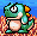 #115: Pitapita

Enter Stage 7-2 and make your way to the third screen. You'll find a couple of these enemies hindering your path, in addition to the falling boulders. *Alternate location: Stage 7-1, at the very end*.

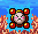 #116: Pizzap

Enter Stage 7-3 and move forward, up until the room with Taiblond (the fish with a camera). Turn around, and enter the door above the door you came from, inside a wall. You'll find a quartet of these enemies in that room.

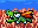 #138: Mantowani

Enter Stage 8-5 and go through the door on the right. Then, enter the door at the top-left (or bottom-left). Either way, go through the shortcut door, and you'll be in a room with 10 big pearls. These enemies will fly across the screen from time to time. *Alternate location: Stage 8-8, third screen*.

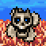 #140: Skulloop

Enter Stage 8-7. A triplet of these enemies will encircle you immediately. Can't miss them. *Alternate location: Stage 8-5, top-right room.*

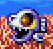 #142: Sukarudon

Enter Stage 8-5 and go through the door on the right. Then, enter the door at the bottom-right. Go through the shortcut door, and you'll be in a similar room with 10 big pearls, but with this lone enemy at the bottom of the water. Like the Nogo, you can't kill this enemy, so just hit it once or let it hit you to log it in your picture book. *Alternate location: Stage 8-1, two side rooms.*

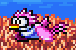 #156: Ukondori

Enter Stage 9-6 and enter the third door on the way up. Ride the swan platform up to find this enemy. Avoid its falling poop...

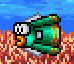 #160: Chumbrella

Enter Stage 9-2 and get to the second screen. Enter the top door in the middle. Take or skip the balloon, and go down and over, past Lovelove (green/white fish) to find a lone Chumbrella.

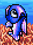 #178: Shakke

Enter Stage 10-3, and make it to the *second* vertical waterfall room. You'll find a group of these as you swim up (watch the falling balls).

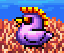 #184: Chikkin

Enter Stage 10-5, and make it to the screen with three different doors. Enter the bottommost one, next to the Mermaid. Continue through the rooms where the picture-matching puzzles used to be, and you'll find a lone Chikkin at the end.

 #200: Flunder

Enter Stage 11-1 and enter the second door to your right. Ride Ryun (the dragon vehicle) to the end of that room, and you'll find this enemy in the next auto-scrolling screen. *Alternate location: 11-5, bottom-left door path (unfortunately, this location is also past an auto-scroller)*

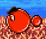 #201: Mayucoin

Enter Stage 11-4 and enter the top-left door. Ride the Koala/Crocodile costume, and make your way downwards in the next screen. You'll find a pair of these at the bottom.

#### Other Entries You May Have Missed

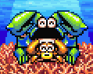 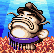 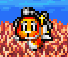 #125-127: Kannin father and child, Fat Cat, Kit Fish

In Stage 7-1, make sure that you **talk** to these NPC's to record them in your picture book. They're some of the only NPC entries that are not "guaranteed" because there are no forced cutscenes involving these characters.

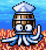 #107: Barrel Squid

In Stage 6-3, this NPC is at the bottom-right of the first screen. There were a couple of these guys in the first game, but this seems to be the only Barrel Squid here...

That's just about every hard-to-find enemy/NPC, so if you're missing any other enemy (particularly vehicle-exclusive ones), that's on you. You're *bound* to run into most other enemies if you're completing every area.

### Step 5: Area-Specific Challenges

By this point in the walkthrough, you have effectively 100%'ed the game. All that's left are some auxiliary challenges...

The "retry factor" here is also minimal. In case you mess up (i.e. the challenge indicator goes away), you can just START + SELECT in the pause menu to return to the stage map to try again.


Don't Touch Anything (10)

*Complete Stage 1-5 without collecting any pearls, taking damage, defeating any enemies, or disturbing any mermaids (retry from stage map)*

Quite a lot going on here. [Full Video Guide.](https://cdn.discordapp.com/attachments/780609366947528716/866872083182518302/Starfy21-5.webm) The first screen has two tight maneuvers you must do. Perform a [well-timed Ultra Star Spin](https://cdn.discordapp.com/attachments/780609366947528716/853446902669770792/ezgif-3-4a13f59e738b.gif) to make it past the set of spikes on the ledge. Then, carefully [fall off this ledge](https://cdn.discordapp.com/attachments/780609366947528716/853449073099800576/ezgif-3-8452623a6102.gif) to avoid the pearls. I do a short hop to start falling faster.

On the second screen, use your Air Jump and Glide abilities to carefully avoid all the crabs and Voids. On the third screen, there are one enemy in the water and one near the water surface. Swim carefully around them. Then, when you climb up top to go to the maze, stay in the middle two holes to avoid any pearls.

For this challenge only, you may not touch Mermaids at all.


Jumping in the Wind (5)

*Complete Stage 3-6 without using the B button (retry from stage map)*

Pretty self-explanatory, particularly for the third screen. Remember that you cannot dash or kill enemies without the B button. While loading Mermaid saves is not allowed, you can still touch them to heal you fully.


Dash Jumps Will Work (5)

*Complete Stage 4-6 without Air Jumping (retry from stage map)*

Also straightforward. There are a couple of platforms where you need to be dashing fast enough to jump high enough without using the Air Jump. Again, healing from Mermaids is fine, but loading Mermaid saves is not.


Bait Them All (10)

*Complete Stage 6-6 without taking damage (retry from stage map)*

Harder than it looks. Remember to keep the piranhas and big fish distracted with meat from the trees to sneak past them, and also that piranhas will try to move towards meat that is behind a wall! Avoid the pink floaty enemies, too, and be careful around those green sword enemies in the third screen; they can hit you through ceilings/floors. [Video Guide](https://cdn.discordapp.com/attachments/780609366947528716/866872100605788190/Starfy26-6.webm)


Plunder Ogura's Castle (5)

*Revisit Stage 11-5 and collect all 180 big or small pearls in the side rooms (pearls from enemies don't count)*

Only explicit pearl collecting achievement in the set. There are 180 individual pearls (big or small) in 11-5 postgame, but big pearls are worth more, so the total comes out to 452. The one harder part is that one of the side rooms has an auto-scroller section, so make sure to pick up every pearl in that room.

In lieu of a challenge indicator, this achievement measures your progress by the number of individual pearls you've collected (as a percentage of 180).

Fun fact: This area in the postgame has the most pearls out of any area, but, because of the auto-scroller section, the pearls earned per unit time is considerably lower...


Starstruck Combo (5)

*In the fourth map of Stage 11-10, defeat all 22 Kurubon in a row without breaking your combo or taking damage*

Best shown with [this webm](https://cdn.discordapp.com/attachments/780609366947528716/866872090380206091/Starfy211-10.webm). Essentially, you're chaining Shooting Stars and Air Jumps across every Kurobon. Notice how every Kurubon at the fifth one and after explodes into a big pearl. If you wait too long after killing and enemy, your combo resets (and the challenge indicator disappears), and they won't all drop big pearls anymore. Follow the webm closely; some combo kills are on a tight timer. One or two of the Kurobon are also "blind" jumps, requiring you to fall down before the camera scrolls all the way.

There's also a save Mermaid at the start of this map, so you can reset the game if you run out of hearts.

One of the demo movies from the title screen also serves as a guide to this exact achievement, but you can't use the demo itself to earn it.

### Step 6: Miscellaneous


Silly Singing (1)

*Make Moe sing in the Sound Room by playing a certain music track*

One little visual achievement to top off this set. Make your way to the Sound Room/Test, go to page 3, and play the second tune up from the bottom right (ヤンキー きぐるみ). This is the only music where the characters have a different animation playing music. You'll have to unlock this music first, but if you've followed this guide all the way up to this point, you already have.

And that's my set. Hope you enjoyed it.