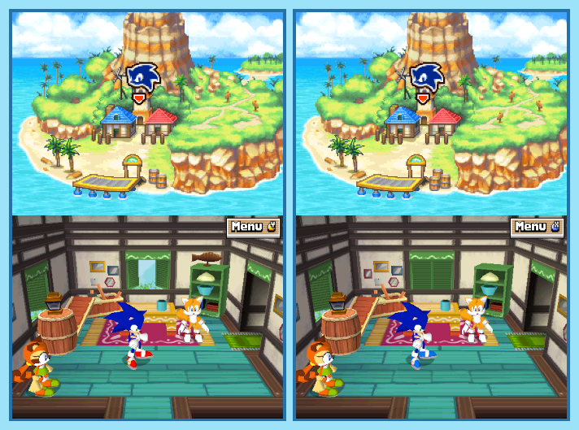

## Last Month's Winner

  
  

## Spot the Difference

While traveling to an unknown source of energy Sonic and Tails get sucked into a hurricane, causing them to land on an unknown island somewhere in the ocean. To their surprise, it seems like the hurricane was some kind of portal to another dimension which is slightly altered. Can you find all 10 differences between both dimensions?

## About the Game

| Game                                                                                                                                                                                                                                                     | Console     | Genre         |
| -------------------------------------------------------------------------------------------------------------------------------------------------------------------------------------------------------------------------------------------------------- | ----------- | ------------- |
| <a class="gameicon-link" href="https://retroachievements.org/game/14807" target="_blank" rel="noopener">  Sonic Rush: Adventure</a> | Nintendo DS | 2D Platformer |

* Suggested by: 

**Note:** The first user who finds all 10 differences and sends proof to  via Site DM or Discord will be listed in the next issue as the winner. Additionally, a random selected user which submitted the solution until the end of the month will be chosen to select the game of the next picture.
