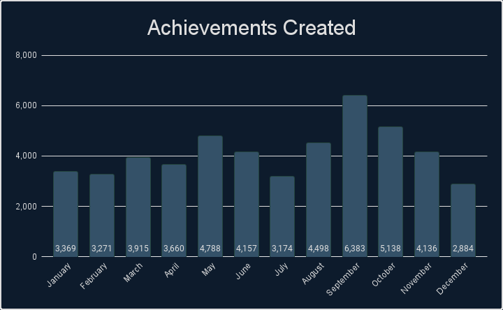
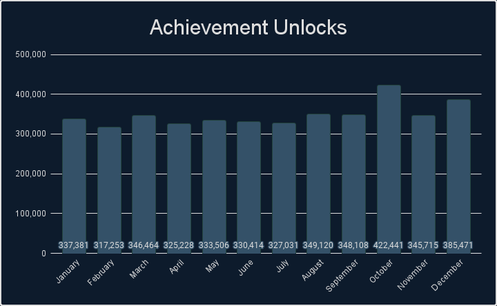
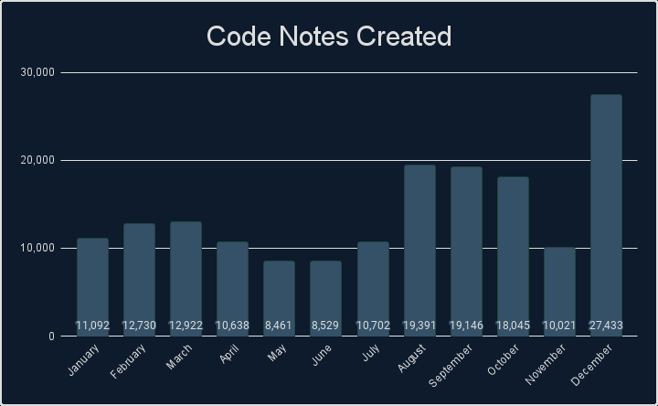
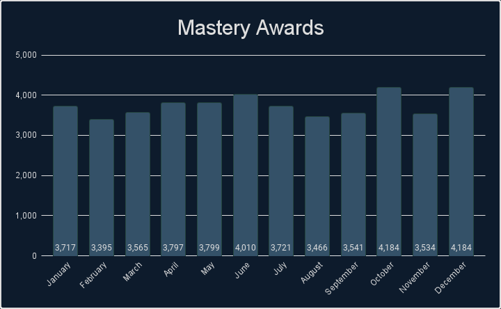
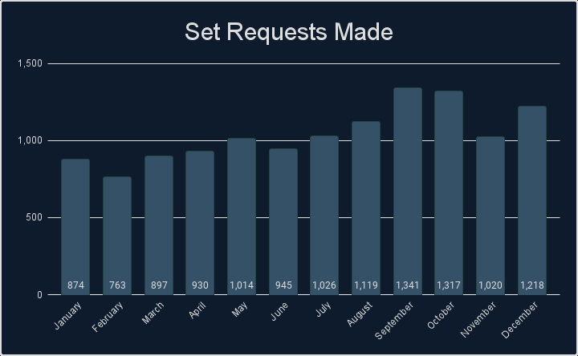
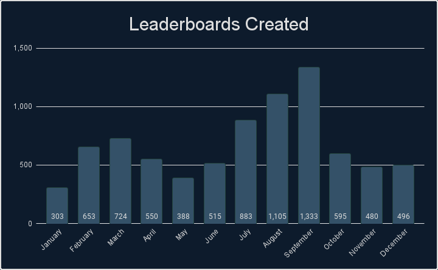

# Intro
If you like looking at stats and data, then you have come to the right place. We've gathered tons of stats from 2021 that cover a wide range of measurable aspects that RetroAchievements offer. Check out what the community has accomplished.

# General Stats
Check out some general stats from this year.

| Number of sets released.                                         | 1,060       |
| Number of achievements released.                                 | 49,373      |
| Number of hardcore achievements earned.                          | 4,168,132   |
| Number of code notes created.                                    | 169,110     |
| Number of mastery awards awarded.                                | 44,913      |
| Number of set requests made.                                     | 12,464      |
| Number of leaderboards created.                                  | 8,025       |
| Number of leaderboard entries submitted.                         | 264,574     |
| Number of users who have earned at least 1 hardcore achievement. | 24,989      |
| Number of total hardcore points earned by players.               | 58,128,440  |
| Number of total hardcore retro points earned by players.         | 171,350,530 |
| Number of user accounts created.                                 | 59,594      |
| Number of new user accounts reaching >=500 points.               | 7,772       |

# Achievements Created

## Monthly Breakdown

## Console Breakdown

    

    <table><thead><tr><th>Console</th><th>Achievements</th></tr></thead><tbody>
        <tr><td>32X</td><td>160</td></tr>
        <tr><td>3DO Interactive Multiplayer</td><td>101</td></tr>
        <tr><td>Apple II</td><td>142</td></tr>
        <tr><td>Arcade</td><td>1,218</td></tr>
        <tr><td>Atari 2600</td><td>377</td></tr>
        <tr><td>Atari 7800</td><td>66</td></tr>
        <tr><td>Atari Jaguar</td><td>59</td></tr>
        <tr><td>Atari Lynx</td><td>20</td></tr>
        <tr><td>ColecoVision</td><td>87</td></tr>
        <tr><td>Game Boy</td><td>1,864</td></tr>
        <tr><td>Game Boy Advance</td><td>4,264</td></tr>
        <tr><td>Game Boy Color</td><td>1,575</td></tr>
        <tr><td>Game Gear</td><td>574</td></tr>
        <tr><td>Intellivision</td><td>143</td></tr>
        <tr><td>Magnavox Odyssey 2</td><td>33</td></tr>
        <tr><td>Master System</td><td>155</td></tr>
        <tr><td>Mega Drive</td><td>3,299</td></tr>
        <tr><td>MSX</td><td>315</td></tr>
    </tbody></table>
    
 

    <table><thead><tr><th>Console</th><th>Achievements</th></tr></thead><tbody>
        <tr><td>Neo Geo Pocket</td><td>212</td></tr>
        <tr><td>NES</td><td>2,618</td></tr>
        <tr><td>Nintendo 64</td><td>2,894</td></tr>
        <tr><td>Nintendo DS</td><td>6,690</td></tr>
        <tr><td>PC Engine</td><td>1,163</td></tr>
        <tr><td>PC-8000/8800</td><td>193</td></tr>
        <tr><td>PC-FX</td><td>82</td></tr>
        <tr><td>PlayStation</td><td>7,023</td></tr>
        <tr><td>PlayStation Portable</td><td>6,979</td></tr>
        <tr><td>Pokemon Mini</td><td>138</td></tr>
        <tr><td>Saturn</td><td>874</td></tr>
        <tr><td>Sega CD</td><td>410</td></tr>
        <tr><td>SG-1000</td><td>133</td></tr>
        <tr><td>SNES</td><td>4,038</td></tr>
        <tr><td>Vectrex</td><td>96</td></tr>
        <tr><td>Virtual Boy</td><td>154</td></tr>
        <tr><td>Watara Supervision</td><td>756</td></tr>
        <tr><td>WonderSwan</td><td>468</td></tr>
    </tbody></table>
    

 

## Top 25 Achievement Creators
Check out the top 25 achievement creators this year, how many achievements they created and what console they created the most achievements for.

| Rank | Developer                      | Achievements | Favorite Console     |
| ---- | ------------------------------ | ------------ | -------------------- |
| 1    |   | 3,157        | Game Boy Advance     |
| 2    |         | 2,461        | PlayStation Portable |
| 3    |       | 2,287        | Nintendo DS          |
| 4    |       | 1,736        | SNES                 |
| 5    |         | 1,578        | PC Engine            |
| 6    |      | 1,461        | PlayStation Portable |
| 7    |  | 1,431        | NES                  |
| 8    |    | 1,379        | Nintendo DS          |
| 9    |        | 1,340        | PlayStation          |
| 10   |   | 1,174        | PlayStation Portable |
| 11   |          | 1,169        | PlayStation Portable |
| 12   |         | 1,074        | Nintendo DS          |
| 13   |    | 1,033        | PlayStation Portable |
| 14   |   | 1,031        | PlayStation          |
| 15   |      | 992          | PlayStation Portable |
| 16   |           | 911          | PC Engine            |
| 17   |       | 758          | PlayStation          |
| 18   |          | 705          | PlayStation          |
| 19   |        | 653          | SNES                 |
| 20   |          | 637          | Mega Drive           |
| 21   |      | 596          | PlayStation Portable |
| 22   |   | 595          | PC Engine            |
| 23   |      | 589          | Mega Drive           |
| 24   |        | 569          | Nintendo 64          |
| 25   |          | 513          | PlayStation          |

## Top 25 Developers
Check out some stats regarding unlocks and points awarded by the developers. Included is the number of unlocks, points and retro points awarded to the players. This data includes all achievements but only counts unlocks during 2021. **Bolded** rows indicate active developers.

| Rank | Developer                         | Unlocks Awarded | Points Awarded | Retro Points Awarded |
| :--- | :-------------------------------- | :-------------: | :------------: | :------------------: |
| 1    |              |     150,987     |   2,304,602    |      7,886,604       |
| 2    |              |     127,988     |   2,008,570    |      7,275,634       |
| 3    | ****     |   **122,918**   | **1,447,694**  |    **4,634,326**     |
| 4    |           |     104,065     |   1,820,320    |      4,126,734       |
| 5    | **** |   **98,383**    | **1,495,008**  |    **5,466,314**     |
| 6    | ****      |   **85,443**    | **1,313,692**  |    **2,163,146**     |
| 7    | ****   |   **78,253**    | **1,276,792**  |    **3,695,130**     |
| 8    |         |     76,945      |    978,470     |      2,586,020       |
| 9    |              |     73,867      |   1,056,408    |      2,528,688       |
| 10   | ****       |   **66,873**    |  **701,226**   |    **2,167,772**     |
| 11   | ****        |   **66,654**    | **1,267,540**  |    **3,934,888**     |
| 12   |           |     65,787      |    721,880     |      1,323,696       |
| 13   | ****    |   **65,680**    |  **697,448**   |    **3,571,782**     |
| 14   |              |     65,110      |    703,456     |      1,664,918       |
| 15   | ****        |   **63,335**    |  **903,884**   |    **3,031,792**     |
| 16   | ****       |   **60,797**    |  **780,374**   |    **1,883,986**     |
| 17   |       |     55,482      |    769,554     |      1,545,938       |
| 18   |             |     51,749      |    860,846     |      1,722,192       |
| 19   | ****     |   **51,055**    |  **602,354**   |    **1,261,994**     |
| 20   | ****       |   **50,642**    |  **662,382**   |    **1,561,732**     |
| 21   |              |     47,859      |    558,856     |      1,617,554       |
| 22   |         |     47,606      |    772,090     |      1,583,076       |
| 23   |          |     47,375      |    672,894     |      1,691,512       |
| 24   | ****     |   **45,497**    |  **670,232**   |    **3,100,644**     |
| 25   |        |     44,930      |    663,882     |      1,274,122       |

\* Hardcore only

# Achievement Unlocks

## Monthly Breakdown

## Console Breakdown

    

    <table><thead><tr><th>Console</th><th>Unlocks</th></tr></thead><tbody>
        <tr><td>32X</td><td>1,793</td></tr>
        <tr><td>3DO Interactive Multiplayer</td><td>4,102</td></tr>
        <tr><td>Apple II</td><td>1,330</td></tr>
        <tr><td>Arcade</td><td>128,867</td></tr>
        <tr><td>Atari 2600</td><td>53,956</td></tr>
        <tr><td>Atari 7800</td><td>2,664</td></tr>
        <tr><td>Atari Jaguar</td><td>319</td></tr>
        <tr><td>Atari Lynx</td><td>1,923</td></tr>
        <tr><td>ColecoVision</td><td>1,922</td></tr>
        <tr><td>Events</td><td>3,766</td></tr>
        <tr><td>Game Boy</td><td>234,037</td></tr>
        <tr><td>Game Boy Advance</td><td>483,356</td></tr>
        <tr><td>Game Boy Color</td><td>122,578</td></tr>
        <tr><td>Game Gear</td><td>24,233</td></tr>
        <tr><td>Intellivision</td><td>1,369</td></tr>
        <tr><td>Magnavox Odyssey 2</td><td>732</td></tr>
        <tr><td>Master System</td><td>37,522</td></tr>
        <tr><td>Mega Drive</td><td>278,350</td></tr>
        <tr><td>MSX</td><td>1,886</td></tr>
    </tbody></table>
    
 

    <table><thead><tr><th>Console</th><th>Unlocks</th></tr></thead><tbody>
        <tr><td>Neo Geo Pocket</td><td>7,071</td></tr>
        <tr><td>NES</td><td>579,624</td></tr>
        <tr><td>Nintendo 64</td><td>290,315</td></tr>
        <tr><td>Nintendo DS</td><td>185,098</td></tr>
        <tr><td>PC Engine</td><td>61,693</td></tr>
        <tr><td>PC-8000/8800</td><td>1,486</td></tr>
        <tr><td>PC-FX</td><td>302</td></tr>
        <tr><td>PlayStation</td><td>666,027</td></tr>
        <tr><td>PlayStation Portable</td><td>73,816</td></tr>
        <tr><td>Pokemon Mini</td><td>8,772</td></tr>
        <tr><td>Saturn</td><td>20,113</td></tr>
        <tr><td>Sega CD</td><td>10,729</td></tr>
        <tr><td>SG-1000</td><td>2,284</td></tr>
        <tr><td>SNES</td><td>862,029</td></tr>
        <tr><td>Vectrex</td><td>584</td></tr>
        <tr><td>Virtual Boy</td><td>3,204</td></tr>
        <tr><td>Watara Supervision</td><td>7,834</td></tr>
        <tr><td>WonderSwan</td><td>2,446</td></tr>
    </tbody></table>
    

 

## Top 25 Users
Check out who has the most achievement unlocks, points, retro points, and mastery awards earned this year.

| Rank | User                           | Achievements | Points  | Retro Points | Mastery Awards |
| ---- | ------------------------------ | :----------: | :-----: | :----------: | :------------: |
| 1    |        |    11,332    | 205,774 |   733,018    |      424       |
| 2    |          |    10,475    | 143,948 |   374,806    |      354       |
| 3    |            |    8,786     | 115,322 |   238,344    |      289       |
| 4    |        |    8,716     | 79,936  |   109,926    |       34       |
| 5    |     |    8,360     | 89,388  |   177,798    |      156       |
| 6    |      |    8,094     | 102,788 |   192,022    |      195       |
| 7    |  |    7,576     | 104,170 |   232,646    |       63       |
| 8    |          |    7,530     | 96,050  |   190,606    |       95       |
| 9    |      |    7,267     | 98,594  |   199,564    |      199       |
| 10   |    |    7,082     | 87,756  |   174,350    |       75       |
| 11   |       |    6,958     | 96,868  |   232,056    |      174       |
| 12   |    |    6,843     | 108,578 |   262,200    |      180       |
| 13   |     |    6,628     | 93,292  |   256,338    |       93       |
| 14   |        |    6,581     | 108,552 |   305,690    |       93       |
| 15   |  |    6,307     | 92,346  |   337,170    |      180       |
| 16   |   |    6,251     | 95,860  |   285,198    |       35       |
| 17   |      |    6,247     | 80,022  |   153,924    |      258       |
| 18   |        |    6,145     | 117,322 |   548,498    |       72       |
| 19   |          |    6,109     | 84,952  |   184,826    |      139       |
| 20   |          |    5,973     | 98,232  |   324,496    |      105       |
| 21   |       |    5,872     | 89,648  |   207,422    |      190       |
| 22   |      |    5,853     | 103,230 |   489,366    |      118       |
| 23   |             |    5,798     | 115,704 |   499,894    |      118       |
| 24   |       |    5,609     | 107,972 |   107,972    |      167       |
| 25   |      |    5,575     | 84,302  |   235,922    |       50       |

## Top 10 Awarded Achievements
Check out which achievements were earned the most this year.

| Rank | Achievement                                                                                                                                                                                                                                                                                               | Game                                                                                                                                                                                                                                                                     | Times Awarded |
| :--- | :-------------------------------------------------------------------------------------------------------------------------------------------------------------------------------------------------------------------------------------------------------------------------------------------------------- | :----------------------------------------------------------------------------------------------------------------------------------------------------------------------------------------------------------------------------------------------------------------------- | :------------ |
| 1    | <a class="gameicon-link" href="https://retroachievements.org/achievement/342" target="_blank" rel="noopener">  Giddy Up!</a>                                          | <a class="gameicon-link" href="https://retroachievements.org/game/228" target="_blank" rel="noopener">  Super Mario World (SNES)</a>             | 2955          |
| 2    | <a class="gameicon-link" href="https://retroachievements.org/achievement/341" target="_blank" rel="noopener">  Unleash The Dragon</a>                        | <a class="gameicon-link" href="https://retroachievements.org/game/228" target="_blank" rel="noopener">  Super Mario World (SNES)</a>             | 2727          |
| 3    | <a class="gameicon-link" href="https://retroachievements.org/achievement/2253" target="_blank" rel="noopener">  I is for Icky Iggy</a>                       | <a class="gameicon-link" href="https://retroachievements.org/game/228" target="_blank" rel="noopener">  Super Mario World (SNES)</a>             | 2231          |
| 4    | <a class="gameicon-link" href="https://retroachievements.org/achievement/4874" target="_blank" rel="noopener">  I Believe I Can Fly</a>                     | <a class="gameicon-link" href="https://retroachievements.org/game/228" target="_blank" rel="noopener">  Super Mario World (SNES)</a>             | 2120          |
| 5    | <a class="gameicon-link" href="https://retroachievements.org/achievement/3159" target="_blank" rel="noopener">  Shroooooms...</a>                                 | <a class="gameicon-link" href="https://retroachievements.org/game/1446" target="_blank" rel="noopener">  Super Mario Bros. (NES)</a>              | 1836          |
| 6    | <a class="gameicon-link" href="https://retroachievements.org/achievement/947" target="_blank" rel="noopener">  You Can Spell!</a>                               | <a class="gameicon-link" href="https://retroachievements.org/game/337" target="_blank" rel="noopener">  Donkey Kong Country (SNES)</a>         | 1783          |
| 7    | <a class="gameicon-link" href="https://retroachievements.org/achievement/48638" target="_blank" rel="noopener">  A new Journey</a>                                | <a class="gameicon-link" href="https://retroachievements.org/game/10003" target="_blank" rel="noopener">  Super Mario 64 (Nintendo 64)</a>   | 1701          |
| 8    | <a class="gameicon-link" href="https://retroachievements.org/achievement/945" target="_blank" rel="noopener">  Tally Me Bananas</a>                           | <a class="gameicon-link" href="https://retroachievements.org/game/337" target="_blank" rel="noopener">  Donkey Kong Country (SNES)</a>         | 1689          |
| 9    | <a class="gameicon-link" href="https://retroachievements.org/achievement/3158" target="_blank" rel="noopener">  Now You're Playing With Fire!</a> | <a class="gameicon-link" href="https://retroachievements.org/game/1446" target="_blank" rel="noopener">  Super Mario Bros. (NES)</a>              | 1645          |
| 10   | <a class="gameicon-link" href="https://retroachievements.org/achievement/2" target="_blank" rel="noopener">  Amateur Collector</a>                            | <a class="gameicon-link" href="https://retroachievements.org/game/1" target="_blank" rel="noopener">  Sonic the Hedgehog (Mega Drive)</a> | 1468          |

\* Hardcore only

# Code Notes

## Monthly Breakdown

## Console Breakdown

    

    <table><thead><tr><th>Console</th><th>Notes</th></tr></thead><tbody>
        <tr><td>32X</td><td>163</td></tr>
        <tr><td>3DO Interactive Multiplayer</td><td>259</td></tr>
        <tr><td>Apple II</td><td>395</td></tr>
        <tr><td>Arcade</td><td>1,875</td></tr>
        <tr><td>Atari 2600</td><td>569</td></tr>
        <tr><td>Atari 7800</td><td>280</td></tr>
        <tr><td>Atari Jaguar</td><td>103</td></tr>
        <tr><td>Atari Lynx</td><td>39</td></tr>
        <tr><td>ColecoVision</td><td>207</td></tr>
        <tr><td>Dreamcast</td><td>2,882</td></tr>
        <tr><td>Game Boy</td><td>3,755</td></tr>
        <tr><td>Game Boy Advance</td><td>12,002</td></tr>
        <tr><td>Game Boy Color</td><td>4,787</td></tr>
        <tr><td>Game Gear</td><td>1,639</td></tr>
        <tr><td>Intellivision</td><td>397</td></tr>
        <tr><td>Magnavox Odyssey 2</td><td>34</td></tr>
        <tr><td>Master System</td><td>508</td></tr>
        <tr><td>Mega Drive</td><td>5,706</td></tr>
        <tr><td>MSX</td><td>446</td></tr>
    </tbody></table>
    
 

    <table><thead><tr><th>Console</th><th>Notes</th></tr></thead><tbody>
        <tr><td>Neo Geo Pocket</td><td>832</td></tr>
        <tr><td>NES</td><td>5,785</td></tr>
        <tr><td>Nintendo 64</td><td>7,712</td></tr>
        <tr><td>Nintendo DS</td><td>29,566</td></tr>
        <tr><td>PC Engine</td><td>1,921</td></tr>
        <tr><td>PC-8000/8800</td><td>316</td></tr>
        <tr><td>PC-FX</td><td>84</td></tr>
        <tr><td>PlayStation</td><td>31,722</td></tr>
        <tr><td>PlayStation Portable</td><td>39,358</td></tr>
        <tr><td>Pokemon Mini</td><td>186</td></tr>
        <tr><td>Saturn</td><td>1,682</td></tr>
        <tr><td>Sega CD</td><td>997</td></tr>
        <tr><td>SG-1000</td><td>151</td></tr>
        <tr><td>SNES</td><td>9,856</td></tr>
        <tr><td>Vectrex</td><td>138</td></tr>
        <tr><td>Virtual Boy</td><td>332</td></tr>
        <tr><td>Watara Supervision</td><td>1,261</td></tr>
        <tr><td>WonderSwan</td><td>945</td></tr>
    </tbody></table>
    

 

## Top 10 Code Note Creators
Check out which developers created the most code notes this year.

    

    <table><thead><tr><th>Rank</th><th>Developer</th><th>Notes</th></tr></thead><tbody>
        <tr><td>1</td><td></td><td>16,384</td></tr>
        <tr><td>2</td><td></td><td>11,280</td></tr>
        <tr><td>3</td><td></td><td>6,716</td></tr>
        <tr><td>4</td><td></td><td>5,693</td></tr>
        <tr><td>5</td><td></td><td>4,470</td></tr>
    </tbody></table>
    
 

    <table><thead><tr><th>Rank</th><th>Developer</th><th>Leaderboards</th></tr></thead><tbody>
        <tr><td>6</td><td></td><td>3,936</td></tr>
        <tr><td>7</td><td></td><td>3,760</td></tr>
        <tr><td>8</td><td></td><td>3,506</td></tr>
        <tr><td>9</td><td></td><td>3,416</td></tr>
        <tr><td>10</td><td></td><td>3,054</td></tr>
    </tbody></table>
    

 

# Mastery Awards

## Monthly Breakdown

## Console Breakdown

    

    <table><thead><tr><th>Console</th><th>Awards</th></tr></thead><tbody>
        <tr><td>32X</td><td>28</td></tr>
        <tr><td>3DO Interactive Multiplayer</td><td>76</td></tr>
        <tr><td>Apple II</td><td>45</td></tr>
        <tr><td>Arcade</td><td>653</td></tr>
        <tr><td>Atari 2600</td><td>1,884</td></tr>
        <tr><td>Atari 7800</td><td>62</td></tr>
        <tr><td>Atari Jaguar</td><td>7</td></tr>
        <tr><td>Atari Lynx</td><td>38</td></tr>
        <tr><td>ColecoVision</td><td>106</td></tr>
        <tr><td>Events</td><td>382</td></tr>
        <tr><td>Game Boy</td><td>3,923</td></tr>
        <tr><td>Game Boy Advance</td><td>4,345</td></tr>
        <tr><td>Game Boy Color</td><td>2,238</td></tr>
        <tr><td>Game Gear</td><td>427</td></tr>
        <tr><td>Intellivision</td><td>57</td></tr>
        <tr><td>Magnavox Odyssey 2</td><td>39</td></tr>
        <tr><td>Master System</td><td>466</td></tr>
        <tr><td>Mega Drive</td><td>3,324</td></tr>
        <tr><td>MSX</td><td>43</td></tr>
    </tbody></table>
    
 

    <table><thead><tr><th>Console</th><th>Awards</th></tr></thead><tbody>
        <tr><td>Neo Geo Pocket</td><td>57</td></tr>
        <tr><td>NES</td><td>7,127</td></tr>
        <tr><td>Nintendo 64</td><td>2,656</td></tr>
        <tr><td>Nintendo DS</td><td>1,366</td></tr>
        <tr><td>PC Engine</td><td>257</td></tr>
        <tr><td>PC-8000/8800</td><td>42</td></tr>
        <tr><td>PC-FX</td><td>8</td></tr>
        <tr><td>PlayStation</td><td>4,308</td></tr>
        <tr><td>PlayStation Portable</td><td>494</td></tr>
        <tr><td>Pokemon Mini</td><td>341</td></tr>
        <tr><td>Saturn</td><td>208</td></tr>
        <tr><td>Sega CD</td><td>87</td></tr>
        <tr><td>SG-1000</td><td>55</td></tr>
        <tr><td>SNES</td><td>9,275</td></tr>
        <tr><td>Vectrex</td><td>6</td></tr>
        <tr><td>Virtual Boy</td><td>46</td></tr>
        <tr><td>Watara Supervision</td><td>418</td></tr>
        <tr><td>WonderSwan</td><td>19</td></tr>
    </tbody></table>
    

 

## Top 25 Mastery Awards

    

    <table><thead><tr><th>Rank</th><th>User</th><th>Awards</th></tr></thead><tbody>
        <tr><td>1</td><td></td><td>424</td></tr>
        <tr><td>2</td><td></td><td>354</td></tr>
        <tr><td>3</td><td></td><td>289</td></tr>
        <tr><td>4</td><td></td><td>258</td></tr>
        <tr><td>5</td><td></td><td>253</td></tr>
        <tr><td>6</td><td></td><td>199</td></tr>
        <tr><td>7</td><td></td><td>195</td></tr>
        <tr><td>8</td><td></td><td>190</td></tr>
        <tr><td>9</td><td></td><td>181</td></tr>
        <tr><td>10</td><td></td><td>180</td></tr>
        <tr><td>11</td><td></td><td>180</td></tr>
        <tr><td>12</td><td></td><td>174</td></tr>
        <tr><td>13</td><td></td><td>167</td></tr>
    </tbody></table>
    
 

    <table><thead><tr><th>Rank</th><th>User</th><th>Awards</th></tr></thead><tbody>
        <tr><td>14</td><td></td><td>163</td></tr>
        <tr><td>15</td><td></td><td>156</td></tr>
        <tr><td>16</td><td></td><td>149</td></tr>
        <tr><td>16</td><td></td><td>149</td></tr>
        <tr><td>18</td><td></td><td>146</td></tr>
        <tr><td>19</td><td></td><td>142</td></tr>
        <tr><td>20</td><td></td><td>139</td></tr>
        <tr><td>21</td><td></td><td>133</td></tr>
        <tr><td>21</td><td></td><td>133</td></tr>
        <tr><td>23</td><td></td><td>133</td></tr>
        <tr><td>24</td><td></td><td>130</td></tr>
        <tr><td>25</td><td></td><td>129</td></tr>
    </tbody></table>
    

 

## Top 10 Single Month Masteries
Check out which users had the most single moth mastery awards this year.

| Rank | User                           | Awards | Month     |
| ---- | ------------------------------ | ------ | --------- |
| 1    |        | 73     | June      |
| 2    |       | 72     | December  |
| 3    |        | 56     | May       |
| 4    |        | 52     | July      |
| 5    |        | 47     | April     |
| 6    |        | 47     | September |
| 7    |        | 44     | December  |
| 8    |          | 43     | June      |
| 9    |  | 39     | January   |
| 10   |        | 39     | February  |

## Top 10 Mastered Sets
Check out which sets were mastered most this year.

| Rank | Game                                                                                                                                                                                                                                                                                                         | Awards |
| ---- | ------------------------------------------------------------------------------------------------------------------------------------------------------------------------------------------------------------------------------------------------------------------------------------------------------------ | ------ |
| 1    | <a class="gameicon-link" href="https://retroachievements.org/game/337" target="_blank" rel="noopener">  Donkey Kong Country (SNES)</a>                                             | 344    |
| 2    | <a class="gameicon-link" href="https://retroachievements.org/game/10434" target="_blank" rel="noopener">  Crash Bandicoot (PlayStation)</a>                                     | 249    |
| 3    | <a class="gameicon-link" href="https://retroachievements.org/game/1627" target="_blank" rel="noopener">  Color a Dinosaur (NES)</a>                                                    | 244    |
| 4    | <a class="gameicon-link" href="https://retroachievements.org/game/228" target="_blank" rel="noopener">  Super Mario World (SNES)</a>                                                 | 243    |
| 5    | <a class="gameicon-link" href="https://retroachievements.org/game/13393" target="_blank" rel="noopener">  ~Homebrew~ Cookie Clicker (NES)</a>                                 | 241    |
| 6    | <a class="gameicon-link" href="https://retroachievements.org/game/466" target="_blank" rel="noopener">  Donkey Kong Country 2: Diddy's Kong Quest (SNES)</a> | 206    |
| 7    | <a class="gameicon-link" href="https://retroachievements.org/game/355" target="_blank" rel="noopener">  Legend of Zelda, The: A Link to the Past (SNES)</a>   | 183    |
| 8    | <a class="gameicon-link" href="https://retroachievements.org/game/7687" target="_blank" rel="noopener">  Caterpillar Construction Zone (Game Boy Color)</a>    | 182    |
| 9    | <a class="gameicon-link" href="https://retroachievements.org/game/9026" target="_blank" rel="noopener">  ~Prototype~ Diablo \| Diablo Junior (Game Boy)</a>    | 179    |
| 10   | <a class="gameicon-link" href="https://retroachievements.org/game/10701" target="_blank" rel="noopener">  ~Test Kit~ SNES Burn-in Test Cartridge (SNES)</a>     | 178    |

# Set Requests

## Monthly Breakdown

## Console Breakdown

    

    <table><thead><tr><th>Console</th><th>Requests</th></tr></thead><tbody>
        <tr><td>32X</td><td>17</td></tr>
        <tr><td>3DO Interactive Multiplayer</td><td>45</td></tr>
        <tr><td>Apple II</td><td>19</td></tr>
        <tr><td>Arcade</td><td>518</td></tr>
        <tr><td>Atari 2600</td><td>36</td></tr>
        <tr><td>Atari 5200</td><td>1</td></tr>
        <tr><td>Atari 7800</td><td>4</td></tr>
        <tr><td>Atari Jaguar</td><td>7</td></tr>
        <tr><td>Atari Lynx</td><td>1</td></tr>
        <tr><td>ColecoVision</td><td>6</td></tr>
        <tr><td>Commodore 64</td><td>3</td></tr>
        <tr><td>DOS</td><td>34</td></tr>
        <tr><td>Dreamcast</td><td>229</td></tr>
        <tr><td>Game Boy</td><td>189</td></tr>
        <tr><td>Game Boy Advance</td><td>883</td></tr>
        <tr><td>Game Boy Color</td><td>225</td></tr>
        <tr><td>Game Gear</td><td>64</td></tr>
        <tr><td>Intellivision</td><td>9</td></tr>
        <tr><td>Magnavox Odyssey 2</td><td>4</td></tr>
        <tr><td>Master System</td><td>128</td></tr>
        <tr><td>Mega Drive</td><td>537</td></tr>
        <tr><td>MSX</td><td>17</td></tr>
        <tr><td>Neo Geo Pocket</td><td>17</td></tr>
    </tbody></table>
    
 

    <table><thead><tr><th>Console</th><th>Requests</th></tr></thead><tbody>
        <tr><td>NES</td><td>672</td></tr>
        <tr><td>Nintendo 3DS</td><td>3</td></tr>
        <tr><td>Nintendo 64</td><td>649</td></tr>
        <tr><td>Nintendo DS</td><td>1,633</td></tr>
        <tr><td>Nokia N-Gage</td><td>1</td></tr>
        <tr><td>PC Engine</td><td>141</td></tr>
        <tr><td>PC-8000/8800</td><td>4</td></tr>
        <tr><td>PC-9800</td><td>46</td></tr>
        <tr><td>PC-FX</td><td>2</td></tr>
        <tr><td>Philips CD-i</td><td>2</td></tr>
        <tr><td>PlayStation</td><td>2,907</td></tr>
        <tr><td>PlayStation Portable</td><td>1,228</td></tr>
        <tr><td>Pokemon Mini</td><td>12</td></tr>
        <tr><td>Saturn</td><td>232</td></tr>
        <tr><td>Sega CD</td><td>119</td></tr>
        <tr><td>SG-1000</td><td>4</td></tr>
        <tr><td>SNES</td><td>1,261</td></tr>
        <tr><td>Super Cassette Vision</td><td>2</td></tr>
        <tr><td>Vectrex</td><td>1</td></tr>
        <tr><td>Virtual Boy</td><td>11</td></tr>
        <tr><td>Watara Supervision</td><td>10</td></tr>
        <tr><td>WonderSwan</td><td>29</td></tr>
        <tr><td>Zeebo</td><td>2</td></tr>
    </tbody></table>
    

 

# Leaderboards

## Monthly Breakdown

## Console Breakdown

    

    <table><thead><tr><th>Console</th><th>Leaderboards</th></tr></thead><tbody>
        <tr><td>Apple II</td><td>4</td></tr>
        <tr><td>Arcade</td><td>113</td></tr>
        <tr><td>Atari 2600</td><td>69</td></tr>
        <tr><td>Atari 7800</td><td>55</td></tr>
        <tr><td>Atari Jaguar</td><td>3</td></tr>
        <tr><td>ColecoVision</td><td>12</td></tr>
        <tr><td>Dreamcast</td><td>124</td></tr>
        <tr><td>Game Boy</td><td>244</td></tr>
        <tr><td>Game Boy Advance</td><td>289</td></tr>
        <tr><td>Game Boy Color</td><td>231</td></tr>
        <tr><td>Game Gear</td><td>31</td></tr>
        <tr><td>Intellivision</td><td>29</td></tr>
        <tr><td>Magnavox Odyssey 2</td><td>4</td></tr>
        <tr><td>Master System</td><td>22</td></tr>
        <tr><td>Mega Drive</td><td>671</td></tr>
        <tr><td>MSX</td><td>68</td></tr>
        <tr><td>NES</td><td>287</td></tr>
    </tbody></table>
    
 

    <table><thead><tr><th>Console</th><th>Leaderboards</th></tr></thead><tbody>
        <tr><td>Nintendo 64</td><td>1,010</td></tr>
        <tr><td>Nintendo DS</td><td>1,304</td></tr>
        <tr><td>PC Engine</td><td>83</td></tr>
        <tr><td>PC-8000/8800</td><td>4</td></tr>
        <tr><td>PC-FX</td><td>1</td></tr>
        <tr><td>PlayStation</td><td>647</td></tr>
        <tr><td>PlayStation Portable</td><td>1,511</td></tr>
        <tr><td>Pokemon Mini</td><td>43</td></tr>
        <tr><td>Saturn</td><td>33</td></tr>
        <tr><td>Sega CD</td><td>8</td></tr>
        <tr><td>SG-1000</td><td>10</td></tr>
        <tr><td>SNES</td><td>759</td></tr>
        <tr><td>Vectrex</td><td>6</td></tr>
        <tr><td>Virtual Boy</td><td>11</td></tr>
        <tr><td>Watara Supervision</td><td>185</td></tr>
        <tr><td>WonderSwan</td><td>24</td></tr>
    </tbody></table>
    

 

## Top 10 Leaderboard Creators
Check out which developers created the most leaderboards this year.

    

    <table><thead><tr><th>Rank</th><th>Developer</th><th>Leaderboards</th></tr></thead><tbody>
        <tr><td>1</td><td></td><td>1,649</td></tr>
        <tr><td>2</td><td></td><td>837</td></tr>
        <tr><td>3</td><td></td><td>451</td></tr>
        <tr><td>4</td><td></td><td>368</td></tr>
        <tr><td>5</td><td></td><td>348</td></tr>
    </tbody></table>
    
 

    <table><thead><tr><th>Rank</th><th>Developer</th><th>Leaderboards</th></tr></thead><tbody>
        <tr><td>6</td><td></td><td>275</td></tr>
        <tr><td>7</td><td></td><td>237</td></tr>
        <tr><td>8</td><td></td><td>231</td></tr>
        <tr><td>9</td><td></td><td>206</td></tr>
        <tr><td>10</td><td></td><td>177</td></tr>
    </tbody></table>
    

 
