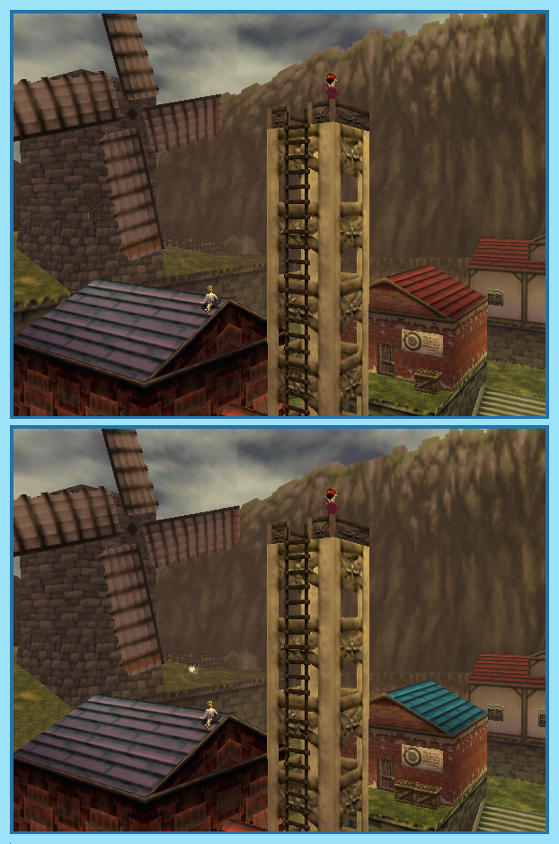

## Last Month's Winner

  
  

## Spot the Difference

Ganondorf is trying to conquer Hyrule and Link must travel through time to become a hero strong enough to be able to stop him. While visiting Kakariko Link notices that several changes were made to it over the years. Can you find all 10 differences between both versions?

## About the Game

| Game                                                                                                                                                                                                                                                                                     | Console     | Genre             |
| ---------------------------------------------------------------------------------------------------------------------------------------------------------------------------------------------------------------------------------------------------------------------------------------- | ----------- | ----------------- |
| <a class="gameicon-link" href="https://retroachievements.org/game/10113" target="_blank" rel="noopener">  Legend of Zelda, The: Ocarina of Time</a> | Nintendo 64 | Action, Adventure |

* Suggested by: 

**Note:** The first user who finds all 10 differences and sends proof to  via Site DM or Discord will be listed in the next issue as the winner. Additionally, a random selected user which submitted the solution until the end of the month will be chosen to select the game of the next picture.
