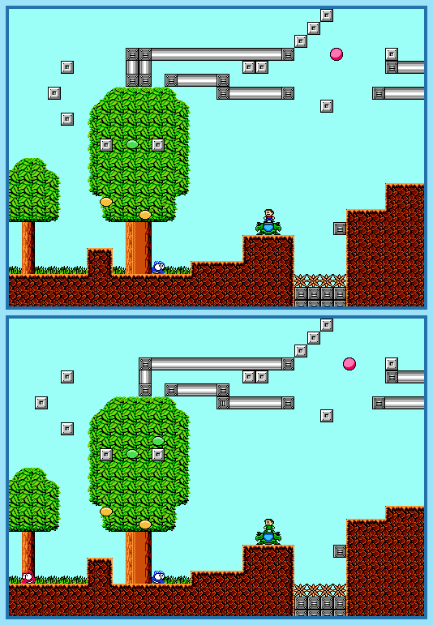

## Last Month's Winner

  
  

## Spot the Difference

A strange increase of activity was monitored at the abadoned fortress Il'Akab. With the help of Timmy, Dr. Tina Byers tries to discover the source of the activity. Right after Timmy went to his adventure, they discovered that it would be way to dangers to just go without any protection and so they equip Timmy with a combat suit so he can protect himself. When Timmy starts his next try, they notice that the environment changed a bit and they need help to discover all 10 changes.

## About the Game

| Game                                                                                                                                                                                                                                                                                          | Console | Genre      |
| --------------------------------------------------------------------------------------------------------------------------------------------------------------------------------------------------------------------------------------------------------------------------------------------- | ------- | ---------- |
| <a class="gameicon-link" href="https://retroachievements.org/game/5090" target="_blank" rel="noopener">  ~Homebrew~ Battle Kid: Fortress of Peril</a> | NES     | Platformer |

* Suggested by: 

**Note:** The first user who finds all 10 differences and sends proof to  via Site DM or Discord will be listed in the next issue as the winner. Additionally, a random selected user which submitted the solution until the end of the month will be chosen to select the game of the next picture.
