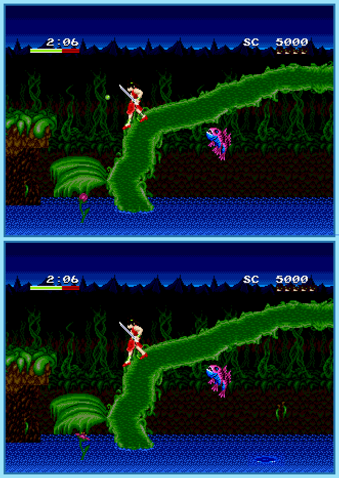

## Last Month's Winner

  
  

## Spot the Difference

For centuries the Mano family is slaying demons to make the world a better place. While going on the next adventure, Yohko Mano notices that the lake looks different than usual. Shortly after she notices that demons disguise themselves in the environment to attack her from behind. Help Yohko to find all 10 differences to strike back.

## About the Game

| Game                                                                                                                                                                                                                                                                                   | Console    | Genre         |
| -------------------------------------------------------------------------------------------------------------------------------------------------------------------------------------------------------------------------------------------------------------------------------------- | ---------- | ------------- |
| <a class="gameicon-link" href="https://retroachievements.org/game/12822" target="_blank" rel="noopener">  Mamono Hunter Yohko: Dai-7 no Keisho</a> | Mega Drive | 2D Platformer |

* Suggested by: 

**Note:** The first user who finds all 10 differences and sends proof to  via Site DM or Discord will be listed in the next issue as the winner. Additionally, a random selected user which submitted the solution until the end of the month will be chosen to select the game of the next picture.
