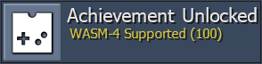

# Intro
So long DevNews. Hello Community News. We are changing this page to feature news for all the community members, including news on new console support, Quality Assurance, Developer Compliance, Web updates, Developer tool updates, Discord updates, DevQuest, QualityQuest, and more. If you have any information you would like to see monthly in this article please let us know. With that, lets see what all has happened in the RA Community throughout the month of April.

# Console Support

## Arduboy

  

Arduboy is a miniature game system the size of a credit card with over 200 free games to play. The games are all open source so, if interested, you could learn to code and create your own games. More information about the Arduboy can be found [here](https://www.arduboy.com/).

You can check out which games currently have achievement sets [here](https://retroachievements.org/gameList.php?c=71).

## WASM-4

  

WASM-4 is a low-level fantasy game console for building small games with WebAssembly. Game cartridges (ROMs) are small, self-contained `.wasm` files that can be built with any programming language that compiles to WebAssembly. More information about the WASM-4 can be found [here](https://wasm4.org/).

You can check out which games currently have achievement sets [here](https://retroachievements.org/gameList.php?c=72).

## A Look Towards the Future
While it's always exciting to get new system support, there is also a lot of work that goes into it. We need time to test core functionality and to properly expose memory. Developers need time to look through the game list, pick some games and create the sets for them. It's not something that happens over night. Here is a look at some potential upcoming rollout systems, please keep in mind that there is no current ETA for any of these.
- CHIP-8
- Fairchild Channel F
- Mega Duck
- PS2
- Sega Pico
- Uzebox

# Quality Assurance & Developer Compliance
The [QA Team Restructure](http://retroachievements.org/viewtopic.php?t=16241) was finally implemented on 04/27/2022. The main goal of this QATeam Restructure was to split the current roles of the `@QATeam` into three: `Quality Assurance`, `Developer Compliance` and `DevQuest`. Quality Assurance would focus on achievements set quality with respect to logic and writing. Developer Compliance would focus on adherence and updates to the Developer Code of Conduct. DevQuest would focus on maintaining DevQuest spreadsheet, tracking claims and completed quests, voting on new quests, etc.

The three teams can all be reached by either sending a message to the site accounts (,  and ) or by pinging the role in Discord.

## Quality Assurance
- Cleared out and `~Z~`'d the following game IDs: 6476, 6477, 6478, 6479, 5038, 5039, 5040, 5041.
- [Dark License to Kill subset](https://retroachievements.org/game/19007) approved for Goldeneye 007.
- Gold Medals subset approved for Dragon Warrior III.
- Approved sets for [~Homebrew~ DMG Express](https://retroachievements.org/game/6477) and [~Homebrew~ Transmissions](https://retroachievements.org/game/6478).
- Demoted [18916](https://retroachievements.org/achievement/18916), [18922](https://retroachievements.org/achievement/18922) and [27025](https://retroachievements.org/achievement/27025) based on a revision vote.
- Approved set for [~Hack~ Fall Guys World](https://retroachievements.org/game/17068).

## Developer Compliance
Nothing to report from April for this team given we only had a few days. New users are getting acclimated to how the team operates. More to come in the next issue.

# Site Updates
## RAWeb Version 1.84
- Add recent masteries page by [@Tsearo](https://github.com/Tsearo) in [#571](https://github.com/RetroAchievements/RAWeb/pull/571)
- Split Site Awards into Game/Event/Site Awards by [@Jamiras](https://github.com/Jamiras) in [#937](https://github.com/RetroAchievements/RAWeb/pull/937)
- Separate subsets from similar games by [@Jamiras](https://github.com/Jamiras)s in [#940](https://github.com/RetroAchievements/RAWeb/pull/940)
- Add pagination to games list; replace dev filter with has achievements filter by [@Jamiras](https://github.com/Jamiras) in [#942](https://github.com/RetroAchievements/RAWeb/pull/942)
- Allow merging aliased hubs by [@Jamiras](https://github.com/Jamiras) in [#939](https://github.com/RetroAchievements/RAWeb/pull/939)
- More detailed achievement modification messages by [@Tsearo](https://github.com/Tsearo) in [#947](https://github.com/RetroAchievements/RAWeb/pull/947)
- Show user game history on ticket page by [@Jamiras](https://github.com/Jamiras) in [#945](https://github.com/RetroAchievements/RAWeb/pull/945)
- Hide controlpanel sidebar until user is registered by [@Jamiras](https://github.com/Jamiras) in [#943](https://github.com/RetroAchievements/RAWeb/pull/943)
- Reset account to unverified when user changes their email address by [@Jamiras](https://github.com/Jamiras) in [#944](https://github.com/RetroAchievements/RAWeb/pull/944)
- Escape apostrophes in hash descriptions by [@Jamiras](https://github.com/Jamiras) in [#948](https://github.com/RetroAchievements/RAWeb/pull/948)
- PHP 8 compatibility by [@luchaos](https://github.com/luchaos) in [#935](https://github.com/RetroAchievements/RAWeb/pull/935)
- Use PHP 8 language features (using Rector) by [@luchaos](https://github.com/luchaos) in [#911](https://github.com/RetroAchievements/RAWeb/pull/911)
- Ignore achievements with no retro ratio when determining easiest achievements by [@Jamiras](https://github.com/Jamiras) in [#941](https://github.com/RetroAchievements/RAWeb/pull/941)
- Lazy load images for completion list by [@Jamiras](https://github.com/Jamiras) in [#946](https://github.com/RetroAchievements/RAWeb/pull/946)
- Fix inbox output sanitization by [@luchaos](https://github.com/luchaos) in [#936](https://github.com/RetroAchievements/RAWeb/pull/936)

[Full Changelog](https://github.com/RetroAchievements/RAWeb/releases/tag/1.84.0)

## RAWeb Version 1.84.1
- Allow award groups to be ordered by [@Jamiras](https://github.com/Jamiras) in #950
- Remove pagination for per-console games with achievements lists by [@Jamiras](https://github.com/Jamiras) in #951
- Start with collapsible sections collapsed by [@Jamiras](https://github.com/Jamiras) in #949

[Full Changelog](https://github.com/RetroAchievements/RAWeb/releases/tag/1.84.0)

# RATools
##  RATools Version 1.8.5
- Many improvements to generating scripts from existing achievements
  - Support for generating from local achievements
  - Support for built-in macros
  - Support for compound code note sizes i.e. "[32-bit float]"
  - Convert `PauseIf` with hitcounts/`ResetNextIf` logic to `disable_when()`
  - Convert `AddHits` chain to `tally()`
  - Fix exception if macro has no parameter
  - Fix exception when no tickets are found
- Add `array_map()` function
- Add `tally_of()` function
- Add logic to convert "A<1\|\|A>1" into "A!=1"
- Support for multiple conditions in a `ResetNextIf` using `OrNext`
- Make error more user-friendly when an if expression cannot be evaluated at compile time
- Fix multiple conditions in a `repeated()` in `measured(when=)` getting split into separate `MeasuredIf`s

[Full Changelog](https://github.com/Jamiras/RATools/releases/tag/v1.8.5)

# Discord Updates
Several Discord updates this month as a reault of the [QA Team Restructure](http://retroachievements.org/viewtopic.php?t=16241) and developer preparation

## Role Additions

| Role                    | Purpose                                                                                                                              |
| :---------------------- | :----------------------------------------------------------------------------------------------------------------------------------- |
| `@QA-Maintainer`        | Formally named `@QA-Team`, renamed as part of the QA Team Restructure. Helps maintain the several Quality Assurance discord teams.   |
| `@Dev-Compliance`       | New role for new team created during the QA Team Restructure. Handles any Developer Code of Conduct related topics.                  |
| `@DevQuest`             | New role for new team created during the QA Team Restructure. Handles DevQuest related topics.                                       |
| `@Compatibility-Tester` | New role for new team created during the QA Team Restructure. Helps to test ROM compatibility for existing sets.                     |
| `@Set-Repair`           | Role and team resseructedew team created during the QA Team Restructure. Help to fix sets that are highly exploitable or vulnerable. |

## Channel Additions

| Channel                 | Purpose                                                                                            |
| :---------------------- | :------------------------------------------------------------------------------------------------- |
| `#ardu-wasm-rollout`    | Discussion and preperation channel for developers to get ready for the Arduboy and WASM-4 rollout. |
| `#auction-house`        | Allows devs to "bib" on highly exploitable or vulnerable old sets to become the new author.        |
| `#compatibility-tester` | Discussion channel for the `@Compatibility-Tester` members.                                        |
| `#devs-help-me`         | A help me channel dedicated to the developer questions.                                            |
| `#devquest-discussion`  | Discussion channel for the `@DevQuest` members.                                                    |
| `#devquest-inbox`       | Messages to the  site user get forwarded here.                                |
| `#dev-compliance`       | Discussion channel for the `@Dev-Compliance` members.                                              |
| `#dev-compliance-log`   | Log channel for notable DevCompliance actions.                                                     |
| `#dev-compliance-inbox` | Messages to the  site user get forwarded here.                           |
| `#pcsx2-testing`        | Discussion and testing channel for developers interested in PS2 achievements creation.             |
| `#qualityquest`         | Discussion and submission channel for QualityQuest.                                                |
| `#qualityquest-inbox`   | Messages to the  site user get forwarded here.                            |
| `#set-repair`           | Discussion channel for the `@Set-Repair` members.                                                  |

## Addition Updates
- RABot `!contact` command updated to add DevQuest, QualityQuest and to reflect the QA Team Restructure changes.
- `#tickets-cleanup` has been locked down to the `@Ticket-Hounds` role in an effort to turn that role into a team that handles closing out bad tickets, forwarding manual unlick requests, and organizes Devember.

# DevQuest
## DevQuest Awards
<a class="gameicon-link" href="https://retroachievements.org/game/15940" target="_blank" rel="noopener">  [DevQuest 001] Ticket Massacre</a>
  - 
  

<a class="gameicon-link" href="https://retroachievements.org/game/15957" target="_blank" rel="noopener">  [DevQuest 002] Summer Set Repair</a>
  -  for [Terranigma](https://retroachievements.org/game/242), [Doom II](https://retroachievements.org/game/2531) & [Quest: Brian's Journey](https://retroachievements.org/game/4919)
  

<a class="gameicon-link" href="https://retroachievements.org/game/15953" target="_blank" rel="noopener">  [DevQuest 003] Singles In Your Area</a>
  - 
  - 
  - 
  - 
  - 
  - 
  

<a class="gameicon-link" href="https://retroachievements.org/game/15907" target="_blank" rel="noopener">  [DevQuest 006] The Unwanted</a>
  -  for [Turntablist - DJ Battle](https://retroachievements.org/game/19382)
  -  for [Flink (The Misadventures of Flink)](https://retroachievements.org/game/16025)
  -  for [Mr. Driller](https://retroachievements.org/game/14597)
  -  for [Golden Axe](https://retroachievements.org/game/17245)
  -  for [Word Munchers](https://retroachievements.org/game/18715)
  

<a class="gameicon-link" href="https://retroachievements.org/game/17758" target="_blank" rel="noopener">  [DevQuest 007] Most Wanted</a>
  -  for [Kirby Squeak Squad](https://retroachievements.org/game/14700)
  -  for [Rayman 2: The Great Escape](https://retroachievements.org/game/3492)
  -  for [Dragon Quest Heroes: Rocket Slime](https://retroachievements.org/game/16254)
  -  for [Ultimate Mortal Kombat 3](https://retroachievements.org/game/14654)
  

<a class="gameicon-link" href="https://retroachievements.org/game/15918" target="_blank" rel="noopener">  [DevQuest 008] World Traveler</a>
  -  for [Dream Master (NES)](https://retroachievements.org/game/12878) & [Puyo Puyo Sun 64 (Nintendo 64)](https://retroachievements.org/game/13113)
  -  for [L.O.L.: Lack of Love (Dreamcast)](https://retroachievements.org/game/10840) & [Engacho! (PlayStation)](https://retroachievements.org/game/18493)
  -  for [Mother 1+2 (Game Boy Advance)](https://retroachievements.org/game/2595) & [Momotarou Dengeki \| Momotaro Thunderbolt (Game Boy)](https://retroachievements.org/game/18793)
  

<a class="gameicon-link" href="https://retroachievements.org/game/15937" target="_blank" rel="noopener">  [DevQuest 009] Launch Party!</a>
  -  for [Sonic Adventure 2](https://retroachievements.org/game/3417)
  -  for [Beach Buggy Simulator](https://retroachievements.org/game/9674)
  -  for [~Homebrew~ A Prelude To Chaos](https://retroachievements.org/game/19002)
  -  for [Jet Set Radio \| Jet Grind Radio](https://retroachievements.org/game/3403)
  -  for [Klax](https://retroachievements.org/game/14348)
  

<a class="gameicon-link" href="https://retroachievements.org/game/1280" target="_blank" rel="noopener">  [DevQuest 011] Happy Birthday RA!</a>
  -  for [Bonkers](https://retroachievements.org/game/4174)
  -  for [Double Dragon V: The Shadow Falls (Mega Drive)](https://retroachievements.org/game/538)
  -  for [Pyramid Magic (Mega Drive)](https://retroachievements.org/game/164)
  -  for [Pagemaster, The (Mega Drive)](https://retroachievements.org/game/4381)
  -  for [Tom and Jerry: Frantic Antics! (Mega Drive)](https://retroachievements.org/game/4477)
  -  for [Chase H.Q. II \| Super H.Q. (Mega Drive)](https://retroachievements.org/game/4462)
  -  for [Wings of Wor \| Gynoug (Mega Drive)](https://retroachievements.org/game/330)
  -  for [BattleTech: A Game of Armored Combat (Mega Drive)](https://retroachievements.org/game/4162)
  

<a class="gameicon-link" href="https://retroachievements.org/game/672" target="_blank" rel="noopener">  [DevQuest 012] Hacker's Habit</a>
  -  for [~Hack~ Super Metroid: Harvest](https://retroachievements.org/game/18807) & [~Hack~ Final Fantasy IV: Unprecedented Crisis (SNES)](https://retroachievements.org/game/18833)
  -  for [~Hack~ Fire Emblem: Vision Quest (Game Boy Advance)](https://retroachievements.org/game/4873) & [~Hack~ Super Boss Collection (SNES)](https://retroachievements.org/game/18819)
  -  for [~Hack~ Rockman 5: Air Sliding](https://retroachievements.org/game/16500) & [~Hack~ Fall Guys World](https://retroachievements.org/game/17068)
  

<a class="gameicon-link" href="https://retroachievements.org/game/862" target="_blank" rel="noopener">  [DevQuest 014] Laudable Leaderboards</a>
  - 
  - 
  

<a class="gameicon-link" href="https://retroachievements.org/game/809" target="_blank" rel="noopener">  [DevQuest 015] Console Conqueror</a>
  - 

# QualityQuest
The goal of this event is to help the website as a whole, whether it be rescores, grammar corrections, ticket save states or full game save states. This event can evolve over time to include more if the community would like, but this is a good starting point for the event.

## Community Contributions

| Category    | Contribution                                                                                                            |
| ----------- | ----------------------------------------------------------------------------------------------------------------------- |
| Save States | 89 Games with full save states received 3,418 Total save states received States for 22 different tickets received |
| Grammar     | 201 Achievement grammar corrections received & updated                                                                  |
| Art         | 5 Incorrect badge sizes fixed                                                                                           |