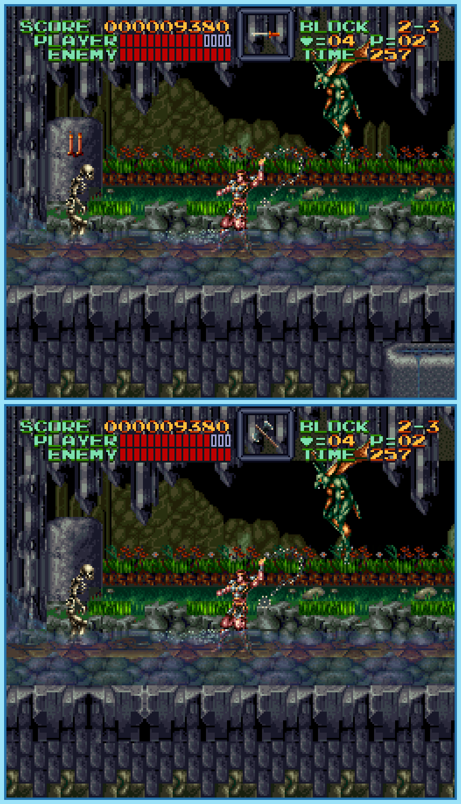

## Last Month's Winner

  
  

## Spot the Difference

Simon Belmont is on his quest to defeat the vampire lord Dracula. The castle he enters is able to change environment in no time allowing monsters to appear right in front of his eyes. Discover the 10 differences to give Simon an advantage.

## About the Game

| Game                                                                                                                                                                                                                                                 | Console | Genre          |
| ---------------------------------------------------------------------------------------------------------------------------------------------------------------------------------------------------------------------------------------------------- | ------- | -------------- |
| <a class="gameicon-link" href="https://retroachievements.org/game/562" target="_blank" rel="noopener">  Super Castlevania IV</a> | SNES    | 2D Platforming |

* Suggested by: 

**Note:** The first user who finds all 10 differences and sends proof to  via Site DM or Discord will be listed in the next issue as the winner. Additionally, a random selected user which submitted the solution until the end of the month will be chosen to select the game of the next picture.
