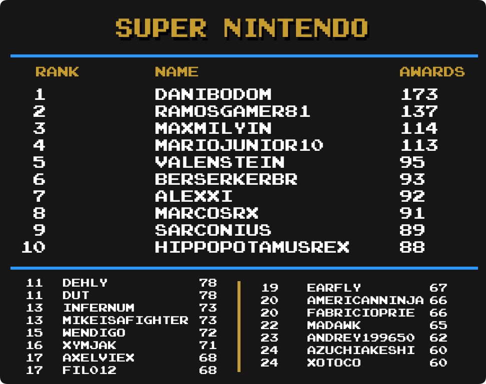

## Intro

We are going to take a look at another metric for greatness, Mastery Awards. Mastery awards are given to users when they complete every achievement for a given set in hardcore mode. Users wear mastery awards as a badge of honor on their profile page representing all the hard work they put into truly becoming a master of the game.

Below we will take a look at which users rank among the best with the most mastery awards in several categories well as notable updates from the previous month to each individual category. Check to see how you rank among the rest of the community members.

Special thanks to  for creating the ranking image templates.

## Current Champions

| :joystick: Category         | :trophy: Champions                                                                                        | Mastery Awards |
| --------------------------- | --------------------------------------------------------------------------------------------------------- | -------------- |
| Total Awards                |                                                                                     | 658            |
| 3DO Interactive Multiplayer |                                                                                     | 5              | <!-- 43 -->  |
| Amstrad CPC                 |                                                                               | 12             | <!-- 37 -->  |
| Apple II                    |                                                                                     | 12             | <!-- 38 -->  |
| Arcade                      |                                                                                        | 50             | <!-- 27 -->  |
| Atari 2600                  |                                                                                     | 94             | <!-- 25 -->  |
| Atari 7800                  |                                                                                     | 8              | <!-- 51 -->  |
| Atari Jaguar                |                                                                                     | 4              | <!-- 17 -->  |
| Atari Lynx                  | , ,  &  | 3              | <!-- 13 -->  |
| ColecoVision                |                                                                                     | 8              | <!-- 44 -->  |
| Dreamcast                   |                                                                                | 19             | <!-- 40 -->  |
| Events                      |                                                                              | 26             | <!-- 101 --> |
| Game Boy                    |                                                                                    | 120            | <!-- 4 -->   |
| Game Boy Advance            |                                                                            | 106            | <!-- 5 -->   |
| Game Boy Color              |                                                                               | 50             | <!-- 6 -->   |
| Game Gear                   |                                                                                     | 58             | <!-- 15 -->  |
| Hack Champ                  |                                                                                  | 188            | <!--  -->    |
| Homebrew Champ              |                                                                                  | 126            | <!--  -->    |
| Intellivision               |                                                                                     | 10             | <!-- 45 -->  |
| Magnavox Odyssey 2          |  &                                                        | 4              | <!-- 23 -->  |
| Master System               |                                                                                     | 60             | <!-- 11 -->  |
| Mega Drive                  |                                                                                        | 116            | <!-- 1 -->   |
| MSX                         |                                                                                     | 7              | <!-- 29 -->  |
| Nintendo 64                 |                                                                                  | 43             | <!-- 2 -->   |
| Neo Geo Pocket              |                                                                                    | 4              | <!-- 14 -->  |
| NES                         |                                                                                  | 233            | <!-- 7 -->   |
| Nintendo DS                 |                                                                                     | 61             | <!-- 18 -->  |
| PC Engine                   |                                                                                   | 35             | <!-- 8 -->   |
| PC-8000/8800                |                                                                                     | 9              | <!-- 47 -->  |
| PC-FX                       |  &                                                   | 3              | <!-- 49 -->  |
| PlayStation                 |                                                                               | 75             | <!-- 12 -->  |
| PlayStation Portable        |                                                                                     | 23             | <!-- 41 -->  |
| Pokémon Mini                |                                                                                  | 19             | <!-- 24 -->  |
| Sega 32X                    |  &                                                              | 2              | <!-- 10 -->  |
| Sega Saturn                 |                                                                                   | 13             | <!-- 39 -->  |
| Sega CD                     |                                                                                   | 5              | <!-- 9 -->   |
| SG-1000                     |  &                                                            | 7              | <!-- 33 -->  |
| SNES                        |                                                                                  | 173            | <!-- 3 -->   |
| Vectrex                     |                                                                                     | 3              | <!-- 46 -->  |
| Virtual Boy                 |                                                                                 | 5              | <!-- 28 -->  |
| Watara Supervision          |                                                                                  | 41             | <!-- 63 -->  |
| WonderSwan                  |                                                                                   | 3              | <!-- 53 -->  |

## Notable Milestones

600 Mastery Awards
- 

400 Mastery Awards
- 

300 Mastery Awards
- 
- 

200 Mastery Awards
- 
- 
- 
- 

100 Mastery Awards
- 
- 
- 
- 
- 
- 
- 
- 
- 
- 

## Category Rankings

### Total Awards (Including Hacks)

  

-  extends the 1st place lead with 25 new mastery awards this month.
-  moves into 7th place with 16 new mastery awards this month.
-  has made it into the top 25 and is in 21st place.

### Total Awards (Excluding Hacks)

  

-  extends the 1st place lead with 25 new mastery awards this month.
-  moves into 3rd place with 45 new mastery awards this month.
-  has made it into the top 25 and is in 24th place.
-  has made it into the top 25 and is in 25th place.

### Events

  

-  remains in 1st place.
-  has moved up 7 spots into a tie for 15th place.
-  has made it into the top 25 and is in a 4-way tie for 17th place.
-  has made it into the top 25 and is in 7-way tie for 21st place.

### Amstrad CPC

  

- , , and  take the top 3 spots on the first Amstrad CPC leaderboard.

### Arcade

  

-  remains on top with 50 total mastery awards.
-  moves into 3rd place with 5 new mastery awards this month.
-  has made it into the top 25 and is in 9th place.
-  has made it into the top 25 and is in a 5-way tie for 15th place.

### Atari 2600

  

-  remains in 1st with 2 new mastery awards this month.
-  moves into 8th place with 10 new mastery awarcs this month.
-  has made it into the top 25 and is tied in 21st place.

### Dreamcast

  

-  remains in 1st with 8 new mastery awards this month.
-  moves into 2nd place with 4 new mastery awards this month.
- , , , , ,  and  have all made it into the top 25.

### Game Boy

  

-  remains on top with 120 mastery awards.
-  has made it into the top 25 and is in 11th place.
-  has made it into the top 25 and is in 16th place.
-  and  have made it into the top 25 and are in a 3-way tie for 22nd place.

### Game Boy Advance

  

-  stays on top with 106 total mastery awards.
-  has made it into the top 25 and is in a 5-way tie for 21st place.

### Game Boy Color

  

-  moves into 1st place with 22 new mastery awards this month
-  moves up 6 places into 5th place with 6 new mastery awards this month.

### Game Gear

  

-  remains in 1st place with 1 new mastery awards this month.
-  moves up 6 places into 7th place with 6 new mastery awards this month.
-  has made it into the top 25 and is in a 13-way tie for 24th place.

### Hack Champ

  

-  still has a commanding lead with 188 mastery awards.
-  moves up 3 places into 8th place with 16 new mastery awards this month.
-  has made it into the top 25 and is in 25th place.

### Homebrew Champ

  

-  remains on top with 126 total mastery awards.
-  has made it into the top 25 and is in a tie for 19th place.
-  has made it into the top 25 and is in a 5-way tie for 21st place.

### Master System

  

-  remains in 1st place 60 total mastery awards.
-  has made it into the top 25 and is in a 3-way tie for 11th place.

### Mega Drive

  

-  remains in 1st place 116 total mastery awards.
-  moves up 7 places into a tie for 18th place with 5 new mastery awards this month.

### Nintendo 64

  

-  remains in 1st place with 43 mastery awards.
-  moves up 10 places into a tie for 12th place with 3 new mastery awards this month.

### NES

  

-  remains in 1st place with 233 total master awards.
-  moves into a tie for 10th place with 5 new mastery awards this month.

### Nintendo DS

  

-  remains in 1st place with 61 total master awards.
-  moves into a tie for 9th place with 3 new mastery awards this month.
-  has made it into the top 25 and is in a 3-way tie for 19th place.

### PC Engine

  

-  remains in the top spot.
-  moves into a tie for 8th place with 1 new mastery awards this month.

### PlayStation

  

-  remain in 1st with 75 total master awards.
-  has moved up 8 places into a tie for 16th place with 10 new mastery awards this month.
-  has made it into the top 25 and is in 23rd place.

### PlayStation Portable

  

-  holds onto the lead with 23 total mastery awards.
-  moves into 3rd place with 4 new mastery awards this month.
-  and  have made it into the top 25 and are in a 3-way tie for 20th place.

### Pokémon Mini

  

-  remains in 1st with 19 total mastery awards.
-  moves into a 3-way tie for 5th place with 3 new mastery awards this month.
-  has made it into the top 25 and is in a 7-way tie for 10th place.
-  has made it into the top 25 and is in 9-way tie for 17th place.

### Saturn

  

-  continues to hold the lead, but a few new users look to be in striking distance.
-  has made it into the top 25 and is in 2nd place.
-  has made it into the top 25 and is in a 5-way tie for 4th place.

### SNES

  

-  extends their 1st place lead by 4 new mastery awards this month.
-  moved up 3 places into a tie for 13th place with 4 new mastery awards this month.
-  has made it into the top 25 and is tied for 24th place.

### Watara Supervision

  

-  has a slight lead over  for 1st place.
-  has moved into 3rd place with 6 new mastery awards this month.
-  has made it into the top 25 and is in a tie for 11th place.
-  has made it into the top 25 and is in a 7-way tie for 18th place.
