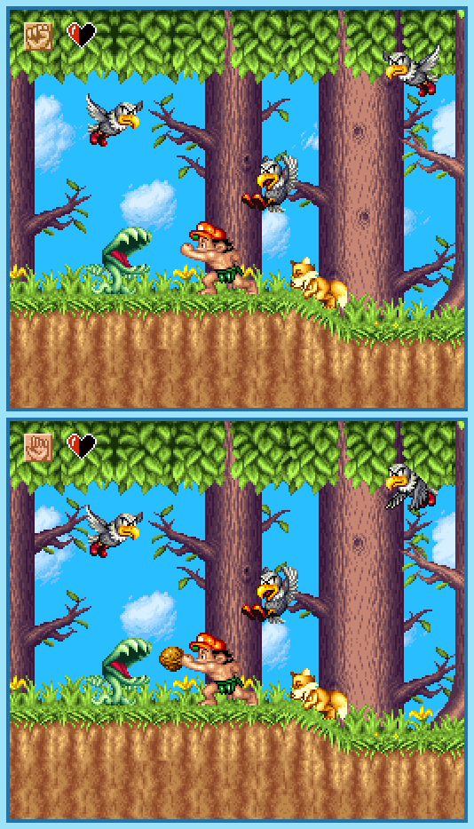

## Last Month's Winner

  
  

## Spot the Difference

After a storm, Master Higgins wakes up on an island and remembers nothing. As he explores the island, he notices that some parts of the island look similar to those in his memories, even if they are a little different. Can you find all 10 differences?

## About the Game

| Game                                                                                                                                                                                                                                                             | Console | Genre                     |
| ---------------------------------------------------------------------------------------------------------------------------------------------------------------------------------------------------------------------------------------------------------------- | ------- | ------------------------- |
| <a class="gameicon-link" href="https://retroachievements.org/game/1197" target="_blank" rel="noopener">  Super Adventure Island II</a> | SNES    | Platforming, Metroidvania |

* Suggested by: 

**Note:** The first user who finds all 10 differences and sends proof to  via Site DM or Discord will be listed in the next issue as the winner. Additionally, a random selected user which submitted the solution until the end of the month will be chosen to select the game of the next picture.
