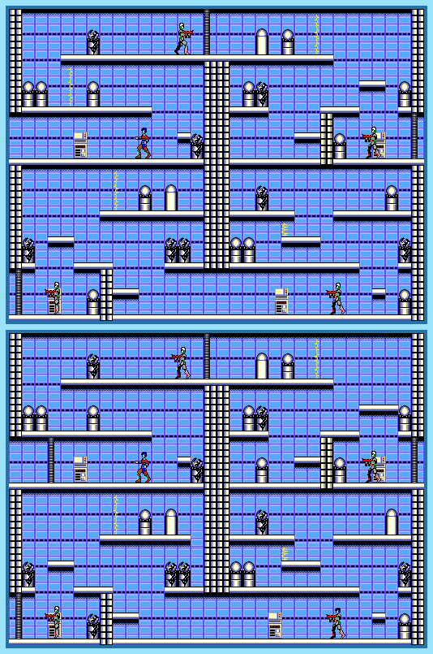

## Last Month's Winner

  
  

## Spot the Difference

To destroy the Nohza Empire's base the White Knight J.J. is sent to Planet X. The underground laboratory he needs to go through feels like a maze, rooms look very similar with only a few differences. Can you find all 10 differences?

## About the Game

| Game                                                                                                                                                                                                                         | Console       | Genre              |
| ---------------------------------------------------------------------------------------------------------------------------------------------------------------------------------------------------------------------------- | ------------- | ------------------ |
| <a class="gameicon-link" href="https://retroachievements.org/game/10969" target="_blank" rel="noopener">  Zillion</a> | Master System | Action-Platforming |

* Suggested by: 

**Note:** The first user who finds all 10 differences and sends proof to  via Site DM or Discord will be listed in the next issue as the winner. Additionally, a random selected user which submitted the solution until the end of the month will be chosen to select the game of the next picture.
