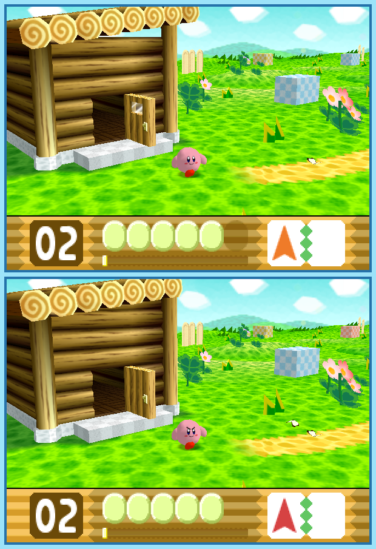

## Last Month's Winner

  
  

## Spot the Difference

On his quest to save the galaxy Kirby needs to pass the planet Pop Star in which he encounters his first enemies. After defeating a giant N-Z in an old shack and leaving the building, Kirby notices that some things have changed. Can you find all 10 differences?

  

## About the Game

| Game                                                                                                                                                                                                                                                                   | Console     | Genre       |
| ---------------------------------------------------------------------------------------------------------------------------------------------------------------------------------------------------------------------------------------------------------------------- | ----------- | ----------- |
| <a class="gameicon-link" href="https://retroachievements.org/game/10246" target="_blank" rel="noopener">  Kirby 64: The Crystal Shards</a> | Nintendo 64 | Platforming |

* Suggested by: 

**Note:** The first user who finds all 10 differences and sends proof to  via Site DM or Discord will be listed in the next issue as the winner. Additionally, a random selected user which submitted the solution until the end of the month will be chosen to select the game of the next picture.
