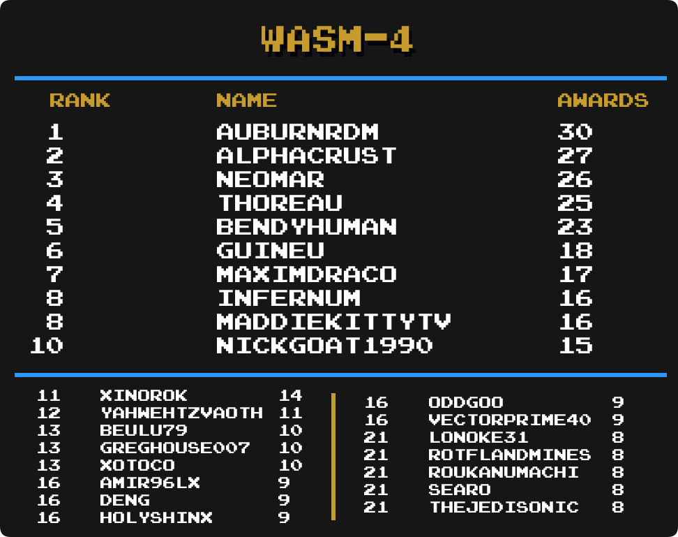

## Intro

We are going to take a look at another metric for greatness, Mastery Awards. Mastery awards are given to users when they complete every achievement for a given set in hardcore mode. Users wear mastery awards as a badge of honor on their profile page representing all the hard work they put into truly becoming a master of the game.

Below we will take a look at which users rank among the best with the most mastery awards in several categories well as notable updates from the previous month to each individual category. Check to see how you rank among the rest of the community members.

Special thanks to  for creating the ranking image templates.

\* Data as of November 1st 2022.

## Current Champions

| :joystick: Category         | :trophy: Champions                                                             | Mastery Awards |
| --------------------------- | ------------------------------------------------------------------------------ | -------------- |
| Total Awards                |                                                          | 966            |
| 3DO Interactive Multiplayer |                                                         | 12             | <!-- 43  --> |
| Amstrad CPC                 |                                                    | 15             | <!-- 37  --> |
| Apple II                    |                                                          | 12             | <!-- 38  --> |
| Arcade                      |                                                       | 74             | <!-- 27  --> |
| Arduboy                     |                                                       | 35             | <!-- 71  --> |
| Atari 2600                  |                                                          | 96             | <!-- 25  --> |
| Atari 7800                  |                                                          | 11             | <!-- 51  --> |
| Atari Jaguar                |                                                          | 7              | <!-- 17  --> |
| Atari Lynx                  |  &                                 | 5              | <!-- 13  --> |
| ColecoVision                |                                                          | 10             | <!-- 44  --> |
| Dreamcast                   |                                                     | 19             | <!-- 40  --> |
| Events                      |                                                   | 28             | <!-- 101 --> |
| Fairchild Channel F         | ,  &    | 19             | <!-- 57  --> |
| Game Boy                    |                                                         | 125            | <!-- 4   --> |
| Game Boy Advance            |                                                 | 115            | <!-- 5   --> |
| Game Boy Color              |                                                    | 58             | <!-- 6   --> |
| Game Gear                   |                                                          | 64             | <!-- 15  --> |
| Hack Champ                  |                                                       | 204            | <!--     --> |
| Homebrew Champ              |                                                       | 171            | <!--     --> |
| Intellivision               |                                                          | 14             | <!-- 45  --> |
| Magnavox Odyssey 2          |                                                          | 8              | <!-- 23  --> |
| Master System               |                                                          | 78             | <!-- 11  --> |
| Mega Drive                  |                                                             | 120            | <!-- 1   --> |
| Mega Duck                   |                                                    | 12             | <!-- 69  --> |
| MSX                         |                                                          | 10             | <!-- 29  --> |
| Nintendo 64                 |                                                       | 47             | <!-- 2   --> |
| Neo Geo Pocket              |                                                       | 8              | <!-- 14  --> |
| NES                         |                                                       | 244            | <!-- 7   --> |
| Nintendo DS                 |                                                          | 72             | <!-- 18  --> |
| PC Engine                   |                                                        | 38             | <!-- 8   --> |
| PC-8000/8800                |                                                          | 11             | <!-- 47  --> |
| PC-FX                       |  &                        | 4              | <!-- 49  --> |
| PlayStation                 |                                                          | 83             | <!-- 12  --> |
| PlayStation 2               |                                                     | 17             | <!-- 21  --> |
| PlayStation Portable        |                                                          | 36             | <!-- 41  --> |
| Pokémon Mini                |                                                      | 32             | <!-- 24  --> |
| Sega 32X                    |                                                           | 4              | <!-- 10  --> |
| Sega Saturn                 |                                                            | 15             | <!-- 39  --> |
| Sega CD                     |                                                            | 9              | <!-- 9   --> |
| SG-1000                     |  &                                 | 9              | <!-- 33  --> |
| SNES                        |                                                       | 205            | <!-- 3   --> |
| Vectrex                     |                                                          | 9              | <!-- 46  --> |
| Virtual Boy                 |  &                             | 11             | <!-- 28  --> |
| WASM-4                      |                                                       | 30             | <!-- 72  --> |
| Watara Supervision          |                                                       | 42             | <!-- 63  --> |
| WonderSwan                  | ,  &  | 3              | <!-- 53  --> |

## Notable Milestones

### 800 Mastery Awards

||||

### 400 Mastery Awards

||||

### 200 Mastery Awards

||||

### 100 Mastery Awards

||||
||||
||||
||||
||||

## Category Rankings

### Total Awards

  

*  remains in 1st with 966 total mastery awards.
*  has moved up 1 spot and is in 11th place.
*  has moved up 1 spot and is in 17th place.
*  has moved up 2 spots and is in 18th place.
*  has moved up 1 spot and is tied for 21th place.
*  has made it into the top 25 and is in 23th place.

### Total Awards (Excluding Hacks)

  

*  remains in 1st with 944 total mastery awards.
*  has moved up 1 spot and is in 4th place.
*  has moved up 1 spot and is tied for 13th place.
*  has moved up 2 spots and is tied for 15th place.
*  has moved up 1 spot and is in 18th place.
*  has moved up 3 spots and is in 19th place.
*  has moved up 1 spot and is in 20th place.
*  has moved up 2 spots and is tied for 22th place.

### Events

  

*  remains in 1st with 28 total mastery awards.
*  has moved up 1 spot and is tied for 3 place.
*  has made it into the top 25 and is in a 3-way tie for 25th place.

### Amstrad CPC

  

*  remains in 1st with 15 total mastery awards.
*  has moved up 2 spots and is in a 3-way tie for 3rd place.
*  has made it into the top 25 and is in a 38-way tie for 20th place.

### Apple II

  

* ,  &  hold the top 3 spots in Apple II's Top Mastery debut.

### Arcade

  

*  remains in 1st with 74 total mastery awards.
*  has made it into the top 25 and is in 14th place.

### Arduboy

  

*  remains in 1st with 35 total mastery awards.
*  has moved up 11 spots and is tied for 4th place.
*  has made it into the top 25 and is tied for 8th place.
*  &  have made it into the top 25 and are in a 5-way tie for 18th place.

### Atari 2600

  

*  remains in 1st with 96 total mastery awards.
*  has moved up 7 spots and is tied for 14th place.

### Dreamcast

  

*  remains in 1st with 19 total mastery awards.
*  &  have made it into the top 25 and are in a 15-way tie for 18th place.

### Fairchild Channel F

  

*  has moved up 1 spots and is in a 3-way tie for 1st place with  & .
*  &  have made it into the top 25 and are in a 3-way tie for 12th place.
*  &  have made it into the top 25 and are in a 5-way tie for 17th place.
*  has made it into the top 25 and is in a 5-way tie for 22nd place.

### Game Boy

  

*  remains in 1st with 125 total mastery awards.
*  has moved up 2 spots and is in a 3-way tie for 19th place.

### Game Boy Advance

  

*  remains in 1st with 115 total mastery awards.
*  has moved up 2 spots and is in a 3-way tie for 15th place.
*  has moved up 1 spot and is tied for 18th place.

### Game Boy Color

  

*  remains in 1st with 58 total mastery awards.
*  has made it into the top 25 and is in 8th place.
*  has moved up 1 spot and is in a 3-way tie for 10th place.

### Game Gear

  

*  remains in 1st with 64 total mastery awards.
*  has moved up 3 spots and is tied for 9th place.
*  has moved up 3 spots and is in 17th place.
*  &  have made it into the top 25 and are in a 8-way tie for 18th place.

### Hack Champ

  

*  remains in 1st with 204 total mastery awards.
*  has moved up 3 spots and is tied for 14th place.
*  has made it into the top 25 and is tied for 19th place.

### Homebrew Champ

  

*  remains in 1st with 171 total mastery awards.
*  has moved up 7 spots and is tied for 10th place.
*  has moved up 7 spots and is in 12th place.
*  has moved up 2 spots and is in 21th place.
*  has made it into the top 25 and is in 22th place.

### Master System

  

*  remains in 1st with 78 total mastery awards.
*  has moved up 2 spots and is in a 3-way tie for 8th place.
*  has made it into the top 25 and is in a 7-way tie for 25th place.

### Mega Drive

  

*  remains in 1st with 120 total mastery awards.
*  has moved up 2 spots and is in a 3-way tie for 9th place.
*  has made it into the top 25 and is tied for 14th place.

### Mega Duck

  

* , , ,  &  hold the top 3 spots in Mega Duck's Top Mastery debut.

### Nintendo 64

  

*  remains in 1st with 47 total mastery awards.
*  has moved up 1 spot and is tied for 7th place.
*  has moved up 1 spot and is tied for 10th place.
*  has moved up 1 spot and is tied for 12th place.

### NES

  

*  remains in 1st with 244 total mastery awards.
*  has moved up 1 spot and is in 2nd place.
*  has moved up 3 spots and is in 19th place.
*  has made it into the top 25 and is in 25th place.

### Nintendo DS

  

*  remains in 1st with 72 total mastery awards.
*  has moved up 1 spot and is tied for 2nd place.
*  has moved up 5 spots and is in a 6-way tie for 19th place.

### PC-8000/8800

  

*  remains in 1st with 11 total mastery awards.
*  has made it into the top 25 and is in a 15-way tie for 16th place.

### PC Engine

  

*  remains in 1st with 38 total mastery awards.
*  has moved up 3 spots and is in a 4-way tie for 13th place.
*  has made it into the top 25 and is in a 4-way tie for 20th place.
*  has made it into the top 25 and is in a 7-way tie for 24th place.

### PlayStation

  

*  remains in 1st with 83 total mastery awards.
*  has moved up 3 spots and is in a 3-way tie for 9th place.
*  &  have moved up 1 spot and are in a 3-way tie for 15th place.

### PlayStation 2

  

* ,  &  hold the top 3 spots in PlayStation 2's Top Mastery debut.

### PlayStation Portable

  

*  remains in 1st with 36 total mastery awards.
*  has moved up 4 spots and is tied for 14th place.
*  has made it into the top 25 and is in a 5-way tie for 21th place.

### Pokémon Mini

  

*  remians in 1st having mastered all 32 sets.
*  has moved up 2 spots and is tied for 3rd place.
*  &  have made it into the top 25 and are in a 3-way tie for 14th place.
*  has made it into the top 25 and is in a 5-way tie for 18th place.
*  &  have made it into the top 25 and are in a 9-way tie for 23rd place.

### Sega Saturn

  

*  remains in 1st with 15 total mastery awards.
*  has moved up 8 spots and is in a 4-way tie for 12th place.
*  has made it into the top 25 and is in a 11-way tie for 16th place.

### Sega CD

  

*  remains in 1st with 9 total mastery awards.
*  has moved up 3 spots and is in a 3-way tie for 2nd place.
*  has moved up 2 spots and is in a 3-way tie for 5th place.
*  &  have made it into the top 25 and are in a 39-way tie for 18th place.

### SNES

  

*  remains in 1st with 205 total mastery awards.
*  has moved up 2 spots and is tied for 12th place.
*  has moved up 1 spot and is tied for 16th place.

### Virtual Boy

  

*  has moved up 1 spot and is in a 3-way tie for 1st place with  & .
*  has moved up 2 spots and is tied for 4th place.
*  &  have made it into the top 25 and are in a 33-way tie for 19th place.

### WASM-4

  

*  remains in 1st with 30 total mastery awards.
*  has made it into the top 25 and is in 2nd place.
*  has moved up 7 spots and is in a 3-way tie for 13th place.
*  has moved up 7 spots and is in a 5-way tie for 16th place.
*  has made it into the top 25 and is in a 5-way tie for 16th place.

### Watara Supervision

  

*  remains in 1st with 42 total mastery awards.
*  has made it into the top 25 and is in 14th place.
