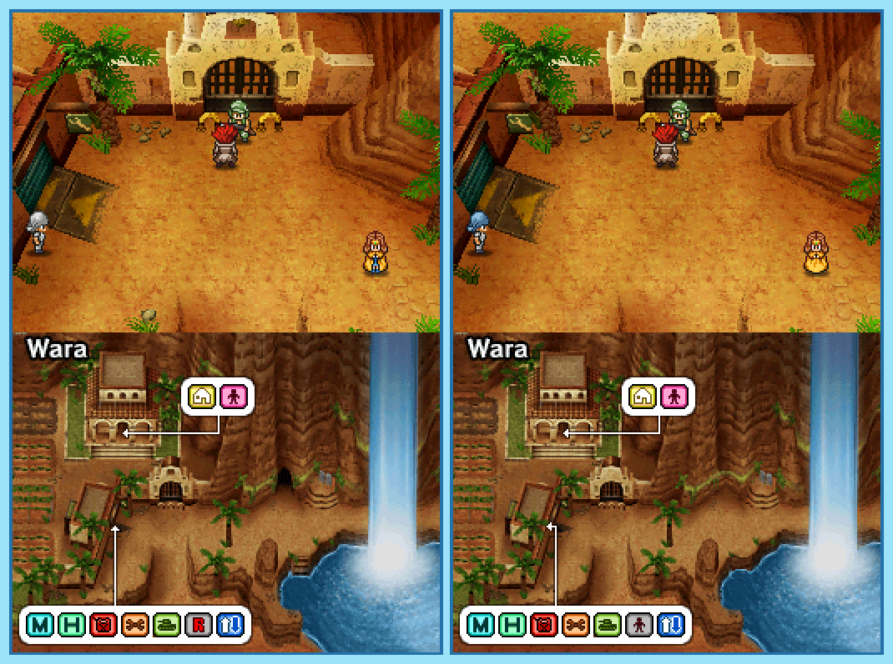

## Last Month's Winner

  
  

Once an hero was revived in a town called Crying Mama by a genius scientist. Without knowing his name or the cause of his death he goes on a journey to solve those questions. On his adventure he visits the town Wara which looks familiar, but some things are different compared to his memories. Can you find all 10 differences?

  

## About the Game

| Game                                                                                                                                                                                                                                                                   | Console     | Genre       |
| ---------------------------------------------------------------------------------------------------------------------------------------------------------------------------------------------------------------------------------------------------------------------- | ----------- | ----------- |
| <a class="gameicon-link" href="https://retroachievements.org/game/21459" target="_blank" rel="noopener">  Metal Max 3</a> | Nintendo DS | Role-Playing Game |

* Suggested by: 

**Note:** The first user who finds all 10 differences and sends proof to  via Site DM or Discord will be listed in the next issue as the winner. Additionally, a random selected user which submitted the solution until the end of the month will be chosen to select the game of the next picture.
