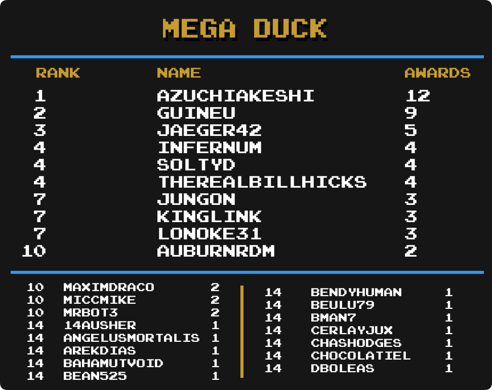

## Intro

We are going to take a look at another metric for greatness, Mastery Awards. Mastery awards are given to users when they complete every achievement for a given set in hardcore mode. Users wear mastery awards as a badge of honor on their profile page representing all the hard work they put into truly becoming a master of the game.

Below we will take a look at which users rank among the best with the most mastery awards in several categories well as notable updates from the previous month to each individual category. Check to see how you rank among the rest of the community members.

Special thanks to  for creating the ranking image templates.

\* Data as of December 1st 2022.

## Current Champions

| :joystick: Category         | :trophy: Champions                                                             | Mastery Awards |
| --------------------------- | ------------------------------------------------------------------------------ | -------------- |
| Total Awards                |                                                          | 1000           |
| 3DO Interactive Multiplayer |                                                         | 12             | <!-- 43  --> |
| Amstrad CPC                 |                                                    | 15             | <!-- 37  --> |
| Apple II                    |                                                          | 12             | <!-- 38  --> |
| Arcade                      |                                                       | 75             | <!-- 27  --> |
| Arduboy                     |                                                       | 35             | <!-- 71  --> |
| Atari 2600                  |                                                          | 99             | <!-- 25  --> |
| Atari 7800                  |                                                          | 11             | <!-- 51  --> |
| Atari Jaguar                |                                                          | 7              | <!-- 17  --> |
| Atari Lynx                  |  &                                 | 5              | <!-- 13  --> |
| ColecoVision                |                                                          | 10             | <!-- 44  --> |
| Dreamcast                   |                                                     | 19             | <!-- 40  --> |
| Events                      |                                                   | 28             | <!-- 101 --> |
| Fairchild Channel F         | ,  &    | 19             | <!-- 57  --> |
| Game Boy                    |                                                         | 125            | <!-- 4   --> |
| Game Boy Advance            |                                                 | 117            | <!-- 5   --> |
| Game Boy Color              |                                                    | 59             | <!-- 6   --> |
| Game Gear                   |                                                          | 65             | <!-- 15  --> |
| Hack Champ                  |                                                       | 204            | <!--     --> |
| Homebrew Champ              |                                                       | 182            | <!--     --> |
| Intellivision               |                                                          | 14             | <!-- 45  --> |
| Magnavox Odyssey 2          |                                                          | 8              | <!-- 23  --> |
| Master System               |                                                          | 79             | <!-- 11  --> |
| Mega Drive                  |                                                             | 126            | <!-- 1   --> |
| Mega Duck                   |                                                    | 12             | <!-- 69  --> |
| MSX                         |                                                          | 14             | <!-- 29  --> |
| Nintendo 64                 |                                                       | 47             | <!-- 2   --> |
| Neo Geo Pocket              |                                                       | 8              | <!-- 14  --> |
| NES                         |                                                       | 244            | <!-- 7   --> |
| Nintendo DS                 |                                                          | 72             | <!-- 18  --> |
| PC Engine                   |                                                        | 33             | <!-- 8   --> |
| PC Engine CD                |                                                        | 10             | <!-- 76  --> |
| PC-8000/8800                |                                                          | 11             | <!-- 47  --> |
| PC-FX                       |  &                        | 4              | <!-- 49  --> |
| PlayStation                 |                                                          | 83             | <!-- 12  --> |
| PlayStation 2               |                                                        | 24             | <!-- 21  --> |
| PlayStation Portable        |                                                          | 37             | <!-- 41  --> |
| Pokémon Mini                |                                                      | 32             | <!-- 24  --> |
| Sega 32X                    |                                                           | 4              | <!-- 10  --> |
| Sega Saturn                 |                                                            | 16             | <!-- 39  --> |
| Sega CD                     |                                                            | 10             | <!-- 9   --> |
| SG-1000                     |  &                                 | 9              | <!-- 33  --> |
| SNES                        |                                                       | 208            | <!-- 3   --> |
| Vectrex                     |                                                          | 9              | <!-- 46  --> |
| Virtual Boy                 |                                                          | 12             | <!-- 28  --> |
| WASM-4                      |                                                       | 30             | <!-- 72  --> |
| Watara Supervision          |                                                       | 42             | <!-- 63  --> |
| WonderSwan                  | ,  &  | 3              | <!-- 53  --> |

## Notable Milestones

### 1,000 Mastery Awards

||||

### 800 Mastery Awards

||||

### 600 Mastery Awards

||||

### 400 Mastery Awards

||||

### 300 Mastery Awards

||||

### 200 Mastery Awards

||||
||||

### 100 Mastery Awards

||||
||||
||||
||||
||||

## Category Rankings

### Total Awards

  

*  remains in 1st and is the first user to reach 1000 total mastery awards!!
*  has moved up 1 spot and is in 2nd place.
*  has moved up 3 spots and is in 8th place.
*  has moved up 5 spots and is in 18th place.

### Total Awards (Excluding Hacks)

  

*  remains in 1st with 977 total mastery awards.
*  has moved up 1 spot and is in 9th place.
*  has moved up 1 spot and is in 11th place.
*  has moved up 1 spot and is tied for 15th place.
*  has moved up 4 spots and is tied for 15th place.
*  has moved up 5 spots and is in 18th place.

### Events

  

*  remains in 1st with 28 total mastery awards.
*  has moved up 2 spots and is in 5th place.
*  has moved up 1 spot and is tied for 10th place.
*  has moved up 1 spot and is in a 4-way tie for 12th place.
*  has moved up 1 spot and is in a 4-way tie for 12th place.
*  has made it into the top 25 and is in a 3-way tie for 18th place.
*  has moved up 4 spots and is in a 3-way tie for 18th place.

### Amstrad CPC

  

*  remains in 1st with 15 total mastery awards.
*  has made it into the top 25 and is in a 10-way tie for 11th place.

### Apple II

  

*  remains in 1st with 12 total mastery awards.
*  has moved up 13 spots and is in a 6-way tie for 5th place.
*  has made it into the top 25 and is in a 18-way tie for 15th place.

### Arcade

  

*  remains in 1st with 75 total mastery awards.
*  &  have moved up multiple spots and are tied for 15th place.
*  has moved up 4 spots and is in a 5-way tie for 17th place.
*  has moved up 2 spots and is in a 3-way tie for 22nd place.

### Arduboy

  

*  remains in 1st with 35 total mastery awards.
*  has moved up 1 spot and is in 3rd place.
*  has made it into the top 25 and is in 13th place.
*  has moved up 4 spots and is in a 6-way tie for 19th place.

### Atari 2600

  

*  remains in 1st with 99 total mastery awards.
*  has moved up 10 spots and is in 5th place.
*  has moved up 4 spots and is in a 3-way tie for 13th place.
*  has moved up 2 spots and is tied for 19th place.
*  has made it into the top 25 and is in a 3-way tie for 24th place.

### Dreamcast

  

*  remains in 1st with 19 total mastery awards.
*  has moved up 6 spots and is in a 3-way tie for 5th place.

### Fairchild Channel F

  

*  remains in 1st with 19 total mastery awards.
*  has moved up 7 spots and is tied for 6th place.
*  has moved up 5 spots and is in a 3-way tie for 13th place.
*  &  have moved up multiple spots and are in a 4-way tie for 16th place.
*  has made it into the top 25 and is in a 4-way tie for 20th place.

### Game Boy

  

*  remains in 1st with 125 total mastery awards.
*  has moved up 4 spots and is tied for 17th place.
*  has moved up 5 spots and is tied for 19th place.

### Game Boy Advance

  

*  remains in 1st with 117 total mastery awards.
*  has moved up 2 spots and is in a 3-way tie for 20th place.
*  has made it into the top 25 and is tied for 23rd place.

### Game Boy Color

  

*  remains in 1st with 59 total mastery awards.
*  has moved up 1 spot and is in 2nd place.
*  has moved up 3 spots and is in 5th place.
*  has moved up 1 spot and is in 10th place.

### Game Gear

  

*  remains in 1st with 65 total mastery awards.
*  has moved up 1 spot and is tied for 14th place.

### Hack Champ

  

*  remains in 1st with 204 total mastery awards.
*  has moved up 1 spot and is in 2nd place.
*  has moved up 6 spots and is in 5th place.
*  has moved up 1 spot and is tied for 13th place.
*  has moved up 1 spot and is in 17th place.
*  has moved up 1 spot and is tied for 18th place.

### Homebrew Champ

  

*  remains in 1st with 182 total mastery awards.
*  has moved up 4 spots and is in 6th place.
* , , &  have moved up multiple spots and are in a 4-way tie for 8th place.
*  has made it into the top 25 and is tied for 17th place.
*  has made it into the top 25 and is tied for 20th place.
*  has moved up 4 spots and is tied for 20th place.

### Master System

  

*  remains in 1st with 79 total mastery awards.
*  has moved up 2 spots and is in a 3-way tie for 14th place.

### Mega Drive

  

*  remains in 1st with 126 total mastery awards.
*  has moved up 1 spot and is in 7th place.
*  has made it into the top 25 and is in a 3-way tie for 19th place.

### Mega Duck

  

*  remains in 1st with 12 total mastery awards.
*  has moved up 4 spots and is in 2nd place.
* , , &  have made it into the top 25 and are in a 41-way tie for 14th place.

### Nintendo 64

  

*  remains in 1st with 47 total mastery awards.
*  has moved up 2 spots and is in a 3-way tie for 10th place.
*  &  have moved up multiple spots and are in a 3-way tie for 14th place.

### NES

  

*  remains in 1st with 244 total mastery awards.
*  has moved up 3 spots and is in 16th place.
*  has moved up 1 spot and is tied for 21st place.
*  has made it into the top 25 and is tied for 25th place.

### Nintendo DS

  

*  remains in 1st with 72 total mastery awards.
*  has moved up 1 spot and is in 2nd place.
*  has made it into the top 25 and is tied for 16th place.
*  has made it into the top 25 and is in 18th place.
*  has moved up 1 spot and is in a 3-way tie for 19th place.

### PC Engine

  

* , , &  hold the top 3 spots with the PC Engine CD split.

### PC Engine CD

  

* , , &  hold the top 3 spots on the new PC Engine CD leaderboard.

### PC-8000/8800

  

*  remains in 1st with 11 total mastery awards.
*  has moved up 1 spot and is in 4th place.

### PlayStation

  

*  remains in 1st with 83 total mastery awards.
*  has moved up 1 spot and is in 7th place.
*  has moved up 3 spots and is in 8th place.
*  has moved up 1 spot and is in 15th place.
*  has moved up 2 spots and is tied for 18th place.

### PlayStation 2

  

*  has taken 1st place with 24 total mastery awards.
*  has moved up 6 spots and is tied for 3rd place.
*  has made it into the top 25 and is tied for 5th place.
*  has made it into the top 25 and is in 7th place.
*  has made it into the top 25 and is in a 3-way tie for 8th place.
*  has moved up 14 spots and is in a 3-way tie for 8th place.
*  has moved up 1 spot and is in a 6-way tie for 11th place.
*  has made it into the top 25 and is in a 6-way tie for 11th place.
*  has moved up 5 spots and is in a 8-way tie for 17th place.
* , , , &  have made it into the top 25 and is in a 8-way tie for 17th place.

### PlayStation Portable

  

*  remains in 1st with 37 total mastery awards.
*  has moved up 1 spot and is tied for 2nd place.
*  has moved up 1 spot and is in 5th place.
*  has moved up 2 spots and is in a 3-way tie for 9th place.
*  &  have moved up multiple spots and are in a 4-way tie for 14th place.
*  has moved up 4 spots and is in a 4-way tie for 18th place.

### Pokémon Mini

  

*  remains in 1st with 34 total mastery awards.
*  &  have moved up multiple spots and are tied for 7th place.
*  has moved up 6 spots and is tied for 11th place.
*  has made it into the top 25 and is in a 4-way tie for 15th place.
*  has made it into the top 25 and is in a 5-way tie for 20th place.

### Sega Saturn

  

*  remains in 1st with 16 total mastery awards.
*  has made it into the top 25 and is in a 5-way tie for 12th place.

### Sega CD

  

*  remains in 1st with 10 total mastery awards.
*  &  have moved up multiple spots and are in a 5-way tie for 2nd place.
* , , , &  have made it into the top 25 and are in a 14-way tie for 9th place.

### SNES

  

*  remains in 1st with 208 total mastery awards.
*  has moved up 4 spots and is in 7th place.
*  has moved up 1 spot and is in a 4-way tie for 20th place.

### Virtual Boy

  

*  has taken 1st place with 12 total mastery awards.
*  has moved up 12 spots and is in a 3-way tie for 7th place.
*  has made it into the top 25 and is in a 3-way tie for 7th place.
*  &  have moved up multiple spots and are in a 5-way tie for 10th place.
*  has moved up 7 spots and is in a 9-way tie for 15th place.
*  &  have made it into the top 25 and are in a 9-way tie for 15th place.

### WASM-4

  

*  remains in 1st with 30 total mastery awards.
*  has moved up 8 spots and is tied for 11th place.
*  has moved up 2 spots and is in a 7-way tie for 17th place.
*  &  have made it into the top 25 and are in a 7-way tie for 17th place.
*  has made it into the top 25 and is in a 6-way tie for 24th place.

### Watara Supervision

  

*  remains in 1st with 42 total mastery awards.
*  has moved up 3 spots and is tied for 11th place.
