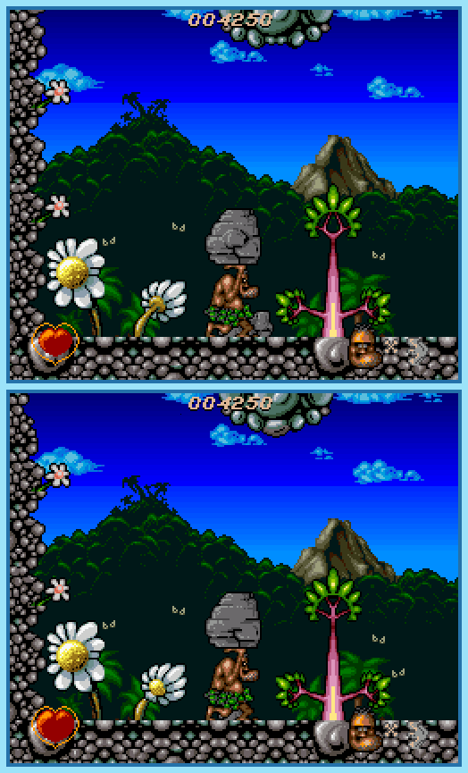

## Last Month's Winners

<table><thead><tr><th>Rank</th><th>User</th></tr></thead><tbody>
  <tr><td></td><td>

</td></tr>
  <tr><td>🥈</td><td></td></tr>
  <tr><td>🥉</td><td></td></tr>
  <tr><td>🏅</td><td></td></tr>
</tbody></table>

Since the Stone Age, the earth has changed a lot. Flora and fauna have developed a lot and there are hardly any remnants of the past. The Neanderthal Chuck Rock noticed these changes during his lifetime on his daily routines. Can you find all 10 differences?

  

## About the Game

| Game                                                                                                                                                                                                                             | Console | Genre       |
| -------------------------------------------------------------------------------------------------------------------------------------------------------------------------------------------------------------------------------- | ------- | ----------- |
| <a class="gameicon-link" href="https://retroachievements.org/game/331" target="_blank" rel="noopener">  Chuck Rock</a> | SNES    | Platforming |

* Suggested by: 

**Note:** The first user who finds all 10 differences and sends proof to  via Site DM or Discord will be listed in the next issue as the winner. Additionally, a random selected user which submitted the solution until the end of the month will be chosen to select the game of the next picture.
