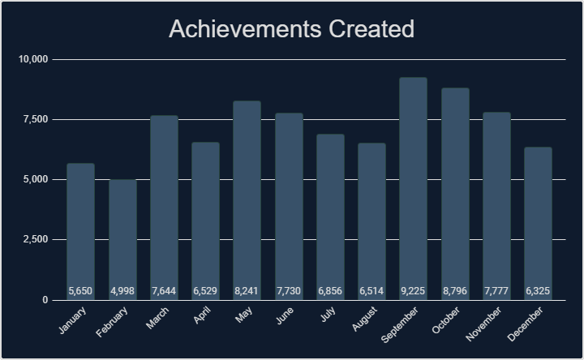
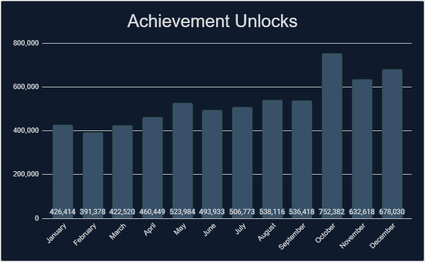
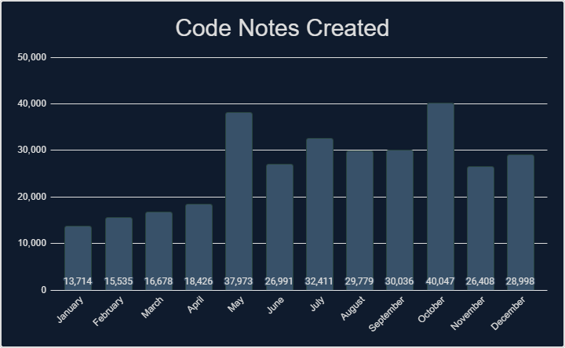
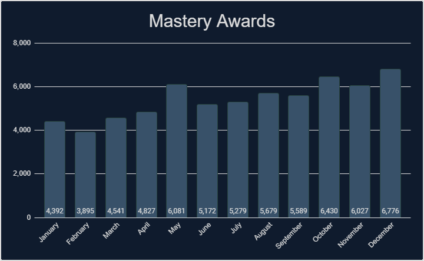
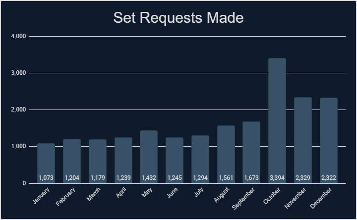
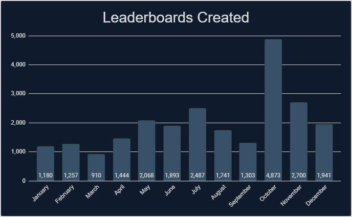

# Intro
If you like looking at stats and data, then you have come to the right place. We've gathered tons of stats from 2022 that cover a wide range of measurable aspects that RetroAchievements offer. Check out what the community has accomplished.

# General Stats
Check out some general stats from this year.

| Number of sets released.                                         | 1,431       |
| Number of achievements released.                                 | 80,559      |
| Number of hardcore achievements earned.                          | 6,363,015   |
| Number of code notes created.                                    | 306,018     |
| Number of mastery awards awarded.                                | 64,688      |
| Number of set requests made.                                     | 19,945      |
| Number of leaderboards created.                                  | 22,910      |
| Number of leaderboard entries submitted.                         | 650,075     |
| Number of users who have earned at least 1 hardcore achievement. | 44,604      |
| Number of total hardcore points earned by players.               | 42,622,890  |
| Number of total hardcore retro points earned by players.         | 108,362,622 |
| Number of user accounts created.                                 | 117,651     |
| Number of new user accounts reaching >=500 points.               | 4,360       |

# Achievements Created

## Monthly Breakdown

## Console Breakdown

    

    <table><thead><tr><th>Console</th><th>Achievements</th></tr></thead><tbody>
        <tr><td>32X</td><td>94</td></tr>
        <tr><td>3DO Interactive Multiplayer</td><td>288</td></tr>
        <tr><td>Amstrad CPC</td><td>1,063</td></tr>
        <tr><td>Apple II</td><td>182</td></tr>
        <tr><td>Arcade</td><td>2,445</td></tr>
        <tr><td>Arduboy</td><td>852</td></tr>
        <tr><td>Atari 2600</td><td>241</td></tr>
        <tr><td>Atari 7800</td><td>94</td></tr>
        <tr><td>Atari Jaguar</td><td>275</td></tr>
        <tr><td>Atari Lynx</td><td>297</td></tr>
        <tr><td>ColecoVision</td><td>89</td></tr>
        <tr><td>Dreamcast</td><td>4,499</td></tr>
        <tr><td>Events</td><td>280</td></tr>
        <tr><td>Fairchild Channel F</td><td>240</td></tr>
        <tr><td>Game Boy</td><td>1,667</td></tr>
        <tr><td>Game Boy Advance</td><td>3,650</td></tr>
        <tr><td>Game Boy Color</td><td>2,451</td></tr>
        <tr><td>Game Gear</td><td>565</td></tr>
        <tr><td>Intellivision</td><td>49</td></tr>
        <tr><td>Magnavox Odyssey 2</td><td>67</td></tr>
        <tr><td>Master System</td><td>440</td></tr>
        <tr><td>Mega Drive</td><td>2,229</td></tr>
    </tbody></table>
    
 

    <table><thead><tr><th>Console</th><th>Achievements</th></tr></thead><tbody>
        <tr><td>Mega Duck</td><td>581</td></tr>
        <tr><td>MSX</td><td>299</td></tr>
        <tr><td>Neo Geo Pocket</td><td>479</td></tr>
        <tr><td>NES</td><td>4,524</td></tr>
        <tr><td>Nintendo 64</td><td>2,323</td></tr>
        <tr><td>Nintendo DS</td><td>7,069</td></tr>
        <tr><td>PC Engine</td><td>369</td></tr>
        <tr><td>PC Engine CD</td><td>462</td></tr>
        <tr><td>PC-8000/8800</td><td>155</td></tr>
        <tr><td>PC-FX</td><td>168</td></tr>
        <tr><td>PlayStation</td><td>7,490</td></tr>
        <tr><td>PlayStation 2</td><td>18,134</td></tr>
        <tr><td>PlayStation Portable</td><td>7,869</td></tr>
        <tr><td>Pokemon Mini</td><td>119</td></tr>
        <tr><td>Saturn</td><td>1,399</td></tr>
        <tr><td>Sega CD</td><td>482</td></tr>
        <tr><td>SG-1000</td><td>38</td></tr>
        <tr><td>SNES</td><td>5,150</td></tr>
        <tr><td>Vectrex</td><td>121</td></tr>
        <tr><td>Virtual Boy</td><td>365</td></tr>
        <tr><td>WASM-4</td><td>400</td></tr>
        <tr><td>Watara Supervision</td><td>41</td></tr>
        <tr><td>WonderSwan</td><td>665</td></tr>
    </tbody></table>
    

 

## Top 25 Achievement Creators
Check out the top 25 achievement creators this year, how many achievements they created and what console they created the most achievements for.

| Rank | Developer                       | Achievements | Favorite Console     |
| ---- | ------------------------------- | ------------ | -------------------- |
| 1    |             | 2,820        | PlayStation 2        |
| 2    |    | 2,754        | Game Boy Advance     |
| 3    |      | 2,623        | PlayStation 2        |
| 4    |          | 2,087        | SNES                 |
| 5    |    | 1,964        | PlayStation 2        |
| 6    |     | 1,927        | Nintendo DS          |
| 7    |        | 1,899        | PlayStation 2        |
| 8    |          | 1,881        | PlayStation 2        |
| 9    |       | 1,545        | PlayStation Portable |
| 10   |           | 1,514        | PlayStation 2        |
| 11   |        | 1,461        | Nintendo DS          |
| 12   |           | 1,368        | Dreamcast            |
| 13   |       | 1,302        | PlayStation 2        |
| 14   |    | 1,237        | PlayStation Portable |
| 15   |   | 1,197        | PlayStation 2        |
| 16   |   | 1,186        | PlayStation Portable |
| 17   |       | 1,183        | PlayStation Portable |
| 18   |        | 1,142        | Nintendo DS          |
| 19   |       | 1,110        | PlayStation Portable |
| 20   |         | 1,088        | PlayStation 2        |
| 21   |    | 1,049        | PlayStation 2        |
| 22   |            | 1,029        | PlayStation 2        |
| 23   |  | 967          | NES                  |
| 24   |    | 953          | PlayStation 2        |
| 25   |       | 943          | Game Boy Color       |

## Top 25 Developers
Check out some stats regarding unlocks and points awarded by the developers. Included is the number of unlocks, points and retro points awarded to the players. This data includes all achievements but only counts unlocks during 2022.

| Rank | Developer                      | Unlocks Awarded | Points Awarded | Retro Points Awarded |
| :--- | :----------------------------- | :-------------: | :------------: | :------------------: |
| 1    |   |     166,098     |   1,299,257    |      4,904,083       |
| 2    |           |     162,434     |   1,194,920    |      3,212,916       |
| 3    |       |     157,540     |    918,319     |      2,130,970       |
| 4    |           |     154,942     |   1,184,863    |      3,738,298       |
| 5    |   |     145,240     |   1,091,797    |      2,881,875       |
| 6    |            |     136,332     |    756,638     |      1,897,222       |
| 7    |        |     133,964     |   1,099,601    |      2,120,280       |
| 8    |        |     107,308     |    799,824     |      1,236,598       |
| 9    |            |     99,705      |    545,892     |      1,859,124       |
| 10   |           |     96,522      |    504,579     |      1,019,840       |
| 11   |      |     92,834      |    580,098     |      1,301,312       |
| 12   |          |     90,791      |    609,022     |      1,703,714       |
| 13   |          |     90,462      |    633,454     |      1,606,782       |
| 14   |      |     88,240      |    477,198     |      1,191,610       |
| 15   |   |     86,315      |    558,429     |      1,347,735       |
| 16   |  |     84,505      |    612,003     |      2,245,730       |
| 17   |           |     82,367      |    584,487     |      1,250,368       |
| 18   |   |     80,976      |    443,981     |      1,085,805       |
| 19   |          |     80,215      |    754,268     |      1,868,018       |
| 20   |         |     78,493      |    486,283     |      1,088,861       |
| 21   |         |     75,077      |    477,131     |      1,007,036       |
| 22   |       |     72,700      |    422,947     |       750,035        |
| 23   |        |     70,377      |    356,166     |       589,376        |
| 24   |          |     68,412      |    569,539     |      1,084,320       |
| 25   |       |     64,683      |    460,669     |      2,006,530       |

\* Hardcore only

# Achievement Unlocks

## Monthly Breakdown

## Console Breakdown

    

    <table><thead><tr><th>Console</th><th>Unlocks</th></tr></thead><tbody>
        <tr><td> 32X                         </td><td>5,614</td></tr>
        <tr><td> 3DO Interactive Multiplayer </td><td>8,127</td></tr>
        <tr><td> Amstrad CPC                 </td><td>7,027</td></tr>
        <tr><td> Apple II                    </td><td>4,723</td></tr>
        <tr><td> Arcade                      </td><td>178,343</td></tr>
        <tr><td> Arduboy                     </td><td>19,839</td></tr>
        <tr><td> Atari 2600                  </td><td>74,182</td></tr>
        <tr><td> Atari 7800                  </td><td>5,023</td></tr>
        <tr><td> Atari Jaguar                </td><td>2,770</td></tr>
        <tr><td> Atari Lynx                  </td><td>3,846</td></tr>
        <tr><td> ColecoVision                </td><td>2,715</td></tr>
        <tr><td> Dreamcast                   </td><td>127,536</td></tr>
        <tr><td> Events                      </td><td>7,814</td></tr>
        <tr><td> Fairchild Channel F         </td><td>6,017</td></tr>
        <tr><td> Game Boy                    </td><td>316,675</td></tr>
        <tr><td> Game Boy Advance            </td><td>622,695</td></tr>
        <tr><td> Game Boy Color              </td><td>196,783</td></tr>
        <tr><td> Game Gear                   </td><td>30,765</td></tr>
        <tr><td> Intellivision               </td><td>2,681</td></tr>
        <tr><td> Magnavox Odyssey 2          </td><td>2,021</td></tr>
        <tr><td> Master System               </td><td>58,998</td></tr>
        <tr><td> Mega Drive                  </td><td>367,342</td></tr>
    </tbody></table>
    
 

    <table><thead><tr><th>Console</th><th>Unlocks</th></tr></thead><tbody>
        <tr><td> Mega Duck                   </td><td>4,350</td></tr>
        <tr><td> MSX                         </td><td>5,452</td></tr>
        <tr><td> Neo Geo Pocket              </td><td>9,715</td></tr>
        <tr><td> NES                         </td><td>771,001</td></tr>
        <tr><td> Nintendo 64                 </td><td>357,223</td></tr>
        <tr><td> Nintendo DS                 </td><td>259,312</td></tr>
        <tr><td> PC Engine                   </td><td>60,173</td></tr>
        <tr><td> PC Engine CD                </td><td>17,217</td></tr>
        <tr><td> PC-8000/8800                </td><td>4,216</td></tr>
        <tr><td> PC-FX                       </td><td>1,383</td></tr>
        <tr><td> PlayStation                 </td><td>981,065</td></tr>
        <tr><td> PlayStation 2               </td><td>463,966</td></tr>
        <tr><td> PlayStation Portable        </td><td>197,808</td></tr>
        <tr><td> Pokemon Mini                </td><td>16,876</td></tr>
        <tr><td> Saturn                      </td><td>37,472</td></tr>
        <tr><td> Sega CD                     </td><td>22,389</td></tr>
        <tr><td> SG-1000                     </td><td>3,177</td></tr>
        <tr><td> SNES                        </td><td>1,058,145</td></tr>
        <tr><td> Vectrex                     </td><td>2,262</td></tr>
        <tr><td> Virtual Boy                 </td><td>9,739</td></tr>
        <tr><td> WASM-4                      </td><td>11,520</td></tr>
        <tr><td> Watara Supervision          </td><td>6,381</td></tr>
        <tr><td> WonderSwan                  </td><td>10,637</td></tr>
    </tbody></table>
    

 

## Top 25 Users
Check out who has the most achievement unlocks, points, retro points, and mastery awards earned this year.

| Rank | User                          | Achievements | Points  | Retro Points | Mastery Awards |
| ---- | ----------------------------- | :----------: | :-----: | :----------: | :------------: |
| 1    |    |    17,815    | 183,720 |   518,178    |      297       |
| 2    |      |    17,355    | 132,080 |   302,219    |      549       |
| 3    |       |    13,324    | 59,220  |    88,535    |       90       |
| 4    |       |    12,469    | 75,393  |   129,609    |      349       |
| 5    |       |    10,956    | 91,772  |   250,375    |      452       |
| 6    |           |    10,362    | 69,977  |   154,637    |      181       |
| 7    |        |    10,155    | 72,571  |   168,361    |      172       |
| 8    |         |    9,982     | 78,084  |   233,492    |      432       |
| 9    |     |    9,740     | 72,305  |   190,227    |      100       |
| 10   |         |    9,135     | 64,476  |   144,308    |      371       |
| 11   |   |    9,119     | 93,134  |   239,518    |      159       |
| 12   |      |    8,647     | 68,351  |   181,667    |      125       |
| 13   |       |    8,611     | 65,025  |   234,023    |      155       |
| 14   |         |    8,490     | 57,902  |   155,459    |      215       |
| 15   |  |    8,345     | 62,585  |   148,436    |      199       |
| 16   |    |    8,339     | 43,805  |    78,036    |      178       |
| 17   |       |    7,989     | 63,224  |   167,257    |      110       |
| 18   |     |    7,880     | 71,508  |   335,416    |      174       |
| 19   |    |    7,858     | 67,667  |   211,543    |      159       |
| 20   |   |    7,612     | 41,753  |    75,795    |       83       |
| 21   |         |    7,602     | 62,327  |   196,721    |       87       |
| 22   |         |    7,507     | 45,536  |    78,437    |       78       |
| 23   |     |    7,422     | 52,749  |   158,899    |      270       |
| 24   |   |    7,267     | 53,412  |   142,703    |      194       |
| 25   |   |    7,169     | 56,919  |   164,037    |      147       |

## Top 25 Awarded Achievements
Check out which achievements were earned the most this year.

| Rank | Achievement                                                                                                                                                                                                                                                                                                | Game                                                                                                                                                                                                                                                                                                           | Times Awarded |
| :--- | :--------------------------------------------------------------------------------------------------------------------------------------------------------------------------------------------------------------------------------------------------------------------------------------------------------- | :------------------------------------------------------------------------------------------------------------------------------------------------------------------------------------------------------------------------------------------------------------------------------------------------------------- | :------------ |
| 1    | <a class="gameicon-link" href="https://retroachievements.org/achievement/342" target="_blank" rel="noopener">  Giddy Up!</a>                                           | <a class="gameicon-link" href="https://retroachievements.org/game/228" target="_blank" rel="noopener">  Super Mario World (SNES)</a>                                                   | 4,891         |
| 2    | <a class="gameicon-link" href="https://retroachievements.org/achievement/341" target="_blank" rel="noopener">  Unleash The Dragon</a>                         | <a class="gameicon-link" href="https://retroachievements.org/game/228" target="_blank" rel="noopener">  Super Mario World (SNES)</a>                                                   | 4,498         |
| 3    | <a class="gameicon-link" href="https://retroachievements.org/achievement/2253" target="_blank" rel="noopener">  I is for Icky Iggy</a>                        | <a class="gameicon-link" href="https://retroachievements.org/game/228" target="_blank" rel="noopener">  Super Mario World (SNES)</a>                                                   | 3,429         |
| 4    | <a class="gameicon-link" href="https://retroachievements.org/achievement/3159" target="_blank" rel="noopener">  Shroooooms...</a>                                 | <a class="gameicon-link" href="https://retroachievements.org/game/1446" target="_blank" rel="noopener">  Super Mario Bros. (NES)</a>                                                    | 3,350         |
| 5    | <a class="gameicon-link" href="https://retroachievements.org/achievement/4874" target="_blank" rel="noopener">  I Believe I Can Fly</a>                      | <a class="gameicon-link" href="https://retroachievements.org/game/228" target="_blank" rel="noopener">  Super Mario World (SNES)</a>                                                   | 3,258         |
| 6    | <a class="gameicon-link" href="https://retroachievements.org/achievement/947" target="_blank" rel="noopener">  You Can Spell!</a>                                | <a class="gameicon-link" href="https://retroachievements.org/game/337" target="_blank" rel="noopener">  Donkey Kong Country (SNES)</a>                                               | 2,904         |
| 7    | <a class="gameicon-link" href="https://retroachievements.org/achievement/3158" target="_blank" rel="noopener">  Now You're Playing With Fire!</a> | <a class="gameicon-link" href="https://retroachievements.org/game/1446" target="_blank" rel="noopener">  Super Mario Bros. (NES)</a>                                                    | 2,855         |
| 8    | <a class="gameicon-link" href="https://retroachievements.org/achievement/48638" target="_blank" rel="noopener">  A new Journey</a>                                 | <a class="gameicon-link" href="https://retroachievements.org/game/10003" target="_blank" rel="noopener">  Super Mario 64 (Nintendo 64)</a>                                         | 2,836         |
| 9    | <a class="gameicon-link" href="https://retroachievements.org/achievement/2" target="_blank" rel="noopener">  Amateur Collector</a>                            | <a class="gameicon-link" href="https://retroachievements.org/game/1" target="_blank" rel="noopener">  Sonic the Hedgehog (Mega Drive)</a>                                       | 2,826         |
| 10   | <a class="gameicon-link" href="https://retroachievements.org/achievement/9" target="_blank" rel="noopener">  That Was Easy</a>                                    | <a class="gameicon-link" href="https://retroachievements.org/game/1" target="_blank" rel="noopener">  Sonic the Hedgehog (Mega Drive)</a>                                       | 2,636         |
| 11   | <a class="gameicon-link" href="https://retroachievements.org/achievement/945" target="_blank" rel="noopener">  Tally Me Bananas</a>                            | <a class="gameicon-link" href="https://retroachievements.org/game/337" target="_blank" rel="noopener">  Donkey Kong Country (SNES)</a>                                               | 2,626         |
| 12   | <a class="gameicon-link" href="https://retroachievements.org/achievement/3250" target="_blank" rel="noopener">  Top of the Flagpole</a>                     | <a class="gameicon-link" href="https://retroachievements.org/game/1446" target="_blank" rel="noopener">  Super Mario Bros. (NES)</a>                                                    | 2,405         |
| 13   | <a class="gameicon-link" href="https://retroachievements.org/achievement/3219" target="_blank" rel="noopener">  What Are You Doing Up There?</a>   | <a class="gameicon-link" href="https://retroachievements.org/game/1446" target="_blank" rel="noopener">  Super Mario Bros. (NES)</a>                                                    | 2,319         |
| 14   | <a class="gameicon-link" href="https://retroachievements.org/achievement/3223" target="_blank" rel="noopener">  I'm a Super Star!</a>                         | <a class="gameicon-link" href="https://retroachievements.org/game/1446" target="_blank" rel="noopener">  Super Mario Bros. (NES)</a>                                                    | 2,226         |
| 15   | <a class="gameicon-link" href="https://retroachievements.org/achievement/3251" target="_blank" rel="noopener">  Celebrate in Style</a>                       | <a class="gameicon-link" href="https://retroachievements.org/game/1446" target="_blank" rel="noopener">  Super Mario Bros. (NES)</a>                                                    | 2,205         |
| 16   | <a class="gameicon-link" href="https://retroachievements.org/achievement/82635" target="_blank" rel="noopener">  What is a Man?</a>                               | <a class="gameicon-link" href="https://retroachievements.org/game/11240" target="_blank" rel="noopener">  Castlevania: Symphony of the Night (PlayStation)</a> | 2,156         |
| 17   | <a class="gameicon-link" href="https://retroachievements.org/achievement/3220" target="_blank" rel="noopener">  I Know a Shortcut!</a>                       | <a class="gameicon-link" href="https://retroachievements.org/game/1446" target="_blank" rel="noopener">  Super Mario Bros. (NES)</a>                                                    | 2,142         |
| 18   | <a class="gameicon-link" href="https://retroachievements.org/achievement/943" target="_blank" rel="noopener">  Illuminating</a>                                    | <a class="gameicon-link" href="https://retroachievements.org/game/355" target="_blank" rel="noopener">  Legend of Zelda, The: A Link to the Past (SNES)</a>     | 2,098         |
| 19   | <a class="gameicon-link" href="https://retroachievements.org/achievement/4126" target="_blank" rel="noopener">  Prepare For Take-Off</a>                   | <a class="gameicon-link" href="https://retroachievements.org/game/1995" target="_blank" rel="noopener">  Super Mario Bros. 3 (NES)</a>                                                | 2,088         |
| 20   | <a class="gameicon-link" href="https://retroachievements.org/achievement/3152" target="_blank" rel="noopener">  If I Were A Rich Man</a>                   | <a class="gameicon-link" href="https://retroachievements.org/game/1446" target="_blank" rel="noopener">  Super Mario Bros. (NES)</a>                                                    | 2,041         |
| 21   | <a class="gameicon-link" href="https://retroachievements.org/achievement/347" target="_blank" rel="noopener">  Morton Enough</a>                                   | <a class="gameicon-link" href="https://retroachievements.org/game/228" target="_blank" rel="noopener">  Super Mario World (SNES)</a>                                                   | 1,998         |
| 22   | <a class="gameicon-link" href="https://retroachievements.org/achievement/2251" target="_blank" rel="noopener">  Another Kind of Flying</a>                | <a class="gameicon-link" href="https://retroachievements.org/game/228" target="_blank" rel="noopener">  Super Mario World (SNES)</a>                                                   | 1,908         |
| 23   | <a class="gameicon-link" href="https://retroachievements.org/achievement/944" target="_blank" rel="noopener">  Fighter</a>                                              | <a class="gameicon-link" href="https://retroachievements.org/game/355" target="_blank" rel="noopener">  Legend of Zelda, The: A Link to the Past (SNES)</a>     | 1,883         |
| 24   | <a class="gameicon-link" href="https://retroachievements.org/achievement/27180" target="_blank" rel="noopener">  1-UP</a>                                                  | <a class="gameicon-link" href="https://retroachievements.org/game/1446" target="_blank" rel="noopener">  Super Mario Bros. (NES)</a>                                                    | 1,865         |
| 25   | <a class="gameicon-link" href="https://retroachievements.org/achievement/82936" target="_blank" rel="noopener">  Rutabaga!</a>                                         | <a class="gameicon-link" href="https://retroachievements.org/game/10434" target="_blank" rel="noopener">  Crash Bandicoot (PlayStation)</a>                                       | 1,801         |

\* Hardcore only

# Code Notes

## Monthly Breakdown

## Console Breakdown

    

    <table><thead><tr><th>Console</th><th>Notes</th></tr></thead><tbody>
        <tr><td> 32X                         </td><td>149</td></tr>
        <tr><td> 3DO Interactive Multiplayer </td><td>480</td></tr>
        <tr><td> Amstrad CPC                 </td><td>1,881</td></tr>
        <tr><td> Apple II                    </td><td>592</td></tr>
        <tr><td> Arcade                      </td><td>4,560</td></tr>
        <tr><td> Arduboy                     </td><td>1,271</td></tr>
        <tr><td> Atari 2600                  </td><td>357</td></tr>
        <tr><td> Atari 7800                  </td><td>306</td></tr>
        <tr><td> Atari Jaguar                </td><td>268</td></tr>
        <tr><td> Atari Lynx                  </td><td>136</td></tr>
        <tr><td> ColecoVision                </td><td>273</td></tr>
        <tr><td> Dreamcast                   </td><td>13,347</td></tr>
        <tr><td> Events                      </td><td>2</td></tr>
        <tr><td> Fairchild Channel F         </td><td>339</td></tr>
        <tr><td> Game Boy                    </td><td>3,577</td></tr>
        <tr><td> Game Boy Advance            </td><td>16,135</td></tr>
        <tr><td> Game Boy Color              </td><td>6,681</td></tr>
        <tr><td> Game Gear                   </td><td>1,446</td></tr>
        <tr><td> Hubs                        </td><td>38</td></tr>
        <tr><td> Intellivision               </td><td>94</td></tr>
        <tr><td> Magnavox Odyssey 2          </td><td>85</td></tr>
        <tr><td> Master System               </td><td>1,011</td></tr>
        <tr><td> Mega Drive                  </td><td>4,960</td></tr>
    </tbody></table>
    
 

    <table><thead><tr><th>Console</th><th>Notes</th></tr></thead><tbody>
        <tr><td> Mega Duck                   </td><td>544</td></tr>
        <tr><td> MSX                         </td><td>508</td></tr>
        <tr><td> Neo Geo Pocket              </td><td>1,235</td></tr>
        <tr><td> NES                         </td><td>18,837</td></tr>
        <tr><td> Nintendo 64                 </td><td>4,843</td></tr>
        <tr><td> Nintendo DS                 </td><td>27,259</td></tr>
        <tr><td> PC Engine                   </td><td>792</td></tr>
        <tr><td> PC Engine CD                </td><td>610</td></tr>
        <tr><td> PC-8000/8800                </td><td>234</td></tr>
        <tr><td> PC-FX                       </td><td>518</td></tr>
        <tr><td> PlayStation                 </td><td>27,369</td></tr>
        <tr><td> PlayStation 2               </td><td>118,737</td></tr>
        <tr><td> PlayStation Portable        </td><td>33,520</td></tr>
        <tr><td> Pokemon Mini                </td><td>153</td></tr>
        <tr><td> Saturn                      </td><td>6,449</td></tr>
        <tr><td> Sega CD                     </td><td>1,399</td></tr>
        <tr><td> SG-1000                     </td><td>82</td></tr>
        <tr><td> SNES                        </td><td>12,463</td></tr>
        <tr><td> TIC-80                      </td><td>1</td></tr>
        <tr><td> Vectrex                     </td><td>213</td></tr>
        <tr><td> Virtual Boy                 </td><td>555</td></tr>
        <tr><td> WASM-4                      </td><td>744</td></tr>
        <tr><td> Watara Supervision          </td><td>23</td></tr>
        <tr><td> WonderSwan                  </td><td>1,878</td></tr>
    </tbody></table>
    

 

## Top 10 Code Note Creators
Check out which developers created the most code notes this year.

    

    <table><thead><tr><th>Rank</th><th>Developer</th><th>Notes</th></tr></thead><tbody>
        <tr><td>1</td><td></td><td>21,902</td></tr>
        <tr><td>2</td><td></td><td>20,304</td></tr>
        <tr><td>3</td><td></td><td>12,668</td></tr>
        <tr><td>4</td><td></td><td>8,744</td></tr>
        <tr><td>5</td><td></td><td>8,453</td></tr>
    </tbody></table>
    
 

    <table><thead><tr><th>Rank</th><th>Developer</th><th>Notes</th></tr></thead><tbody>
        <tr><td>6</td><td></td><td>7,225</td></tr>
        <tr><td>7</td><td></td><td>7,051</td></tr>
        <tr><td>8</td><td></td><td>6,754</td></tr>
        <tr><td>9</td><td></td><td>6,552</td></tr>
        <tr><td>10</td><td></td><td>6,501</td></tr>
    </tbody></table>
    

 

# Mastery Awards

## Monthly Breakdown

## Console Breakdown

    

    <table><thead><tr><th>Console</th><th>Awards</th></tr></thead><tbody>
        <tr><td>32X                         </td><td>121</td></tr>
        <tr><td>3DO Interactive Multiplayer </td><td>194</td></tr>
        <tr><td>Amstrad CPC                 </td><td>143</td></tr>
        <tr><td>Apple II                    </td><td>155</td></tr>
        <tr><td>Arcade                      </td><td>1,333</td></tr>
        <tr><td>Arduboy                     </td><td>1,110</td></tr>
        <tr><td>Atari 2600                  </td><td>2,531</td></tr>
        <tr><td>Atari 7800                  </td><td>90</td></tr>
        <tr><td>Atari Jaguar                </td><td>46</td></tr>
        <tr><td>Atari Lynx                  </td><td>70</td></tr>
        <tr><td>ColecoVision                </td><td>151</td></tr>
        <tr><td>Dreamcast                   </td><td>766</td></tr>
        <tr><td>Events                      </td><td>808</td></tr>
        <tr><td>Fairchild Channel F         </td><td>558</td></tr>
        <tr><td>Game Boy                    </td><td>4,842</td></tr>
        <tr><td>Game Boy Advance            </td><td>5,407</td></tr>
        <tr><td>Game Boy Color              </td><td>2,600</td></tr>
        <tr><td>Game Gear                   </td><td>499</td></tr>
        <tr><td>Intellivision               </td><td>140</td></tr>
        <tr><td>Magnavox Odyssey 2          </td><td>127</td></tr>
        <tr><td>Master System               </td><td>673</td></tr>
        <tr><td>Mega Drive                  </td><td>4,141</td></tr>
    </tbody></table>
    
 

    <table><thead><tr><th>Console</th><th>Awards</th></tr></thead><tbody>
        <tr><td>Mega Duck                   </td><td>105</td></tr>
        <tr><td>MSX                         </td><td>136</td></tr>
        <tr><td>Neo Geo Pocket              </td><td>147</td></tr>
        <tr><td>NES                         </td><td>8,383</td></tr>
        <tr><td>Nintendo 64                 </td><td>3,015</td></tr>
        <tr><td>Nintendo DS                 </td><td>2,029</td></tr>
        <tr><td>PC Engine                   </td><td>330</td></tr>
        <tr><td>PC Engine CD                </td><td>95</td></tr>
        <tr><td>PC-8000/8800                </td><td>95</td></tr>
        <tr><td>PC-FX                       </td><td>64</td></tr>
        <tr><td>PlayStation                 </td><td>6,073</td></tr>
        <tr><td>PlayStation 2               </td><td>3,002</td></tr>
        <tr><td>PlayStation Portable        </td><td>1,015</td></tr>
        <tr><td>Pokemon Mini                </td><td>1,379</td></tr>
        <tr><td>Saturn                      </td><td>273</td></tr>
        <tr><td>Sega CD                     </td><td>248</td></tr>
        <tr><td>SG-1000                     </td><td>85</td></tr>
        <tr><td>SNES                        </td><td>9,966</td></tr>
        <tr><td>Vectrex                     </td><td>100</td></tr>
        <tr><td>Virtual Boy                 </td><td>249</td></tr>
        <tr><td>WASM-4                      </td><td>934</td></tr>
        <tr><td>Watara Supervision          </td><td>346</td></tr>
        <tr><td>WonderSwan                  </td><td>114</td></tr>
    </tbody></table>
    

 

## Top 25 Mastery Awards

    

    <table><thead><tr><th>Rank</th><th>User</th><th>Awards</th></tr></thead><tbody>
        <tr><td>1</td><td></td><td>549</td></tr>
        <tr><td>2</td><td></td><td>452</td></tr>
        <tr><td>3</td><td></td><td>432</td></tr>
        <tr><td>4</td><td></td><td>371</td></tr>
        <tr><td>5</td><td></td><td>349</td></tr>
        <tr><td>6</td><td></td><td>297</td></tr>
        <tr><td>7</td><td></td><td>289</td></tr>
        <tr><td>8</td><td></td><td>270</td></tr>
        <tr><td>9</td><td></td><td>260</td></tr>
        <tr><td>10</td><td></td><td>238</td></tr>
        <tr><td>11</td><td></td><td>236</td></tr>
        <tr><td>12</td><td></td><td>217</td></tr>
        <tr><td>13</td><td></td><td>214</td></tr>
    </tbody></table>
    
 

    <table><thead><tr><th>Rank</th><th>User</th><th>Awards</th></tr></thead><tbody>
        <tr><td>14</td><td></td><td>213</td></tr>
        <tr><td>15</td><td></td><td>199</td></tr>
        <tr><td>16</td><td></td><td>194</td></tr>
        <tr><td>17</td><td></td><td>192</td></tr>
        <tr><td>18</td><td></td><td>187</td></tr>
        <tr><td>19</td><td></td><td>181</td></tr>
        <tr><td>20</td><td></td><td>178</td></tr>
        <tr><td>21</td><td></td><td>177</td></tr>
        <tr><td>22</td><td></td><td>177</td></tr>
        <tr><td>23</td><td></td><td>177</td></tr>
        <tr><td>24</td><td></td><td>174</td></tr>
        <tr><td>25</td><td></td><td>172</td></tr>
    </tbody></table>
    

 

## Top 10 Single Month Masteries
Check out which users had the most single month mastery awards this year.

| Rank | User                            | Awards | Month     |
| ---- | ------------------------------- | ------ | --------- |
| 1    |        | 123    | March     |
| 2    |         | 104    | September |
| 3    |           | 102    | September |
| 4    |       | 92     | November  |
| 5    |       | 84     | May       |
| 6    |  | 83     | November  |
| 7    |        | 83     | May       |
| 8    |         | 82     | January   |
| 9    |           | 77     | July      |
| 10   |        | 69     | July      |

## Top 25 Mastered Sets
Check out which sets were mastered most this year.

| Rank | Game                                                                                                                                                                                                                                                                                                                                                 | Awards |
| ---- | ---------------------------------------------------------------------------------------------------------------------------------------------------------------------------------------------------------------------------------------------------------------------------------------------------------------------------------------------------- | ------ |
| 1    | <a class="gameicon-link" href="https://retroachievements.org/game/337" target="_blank" rel="noopener">  Donkey Kong Country (SNES)</a>                                                                                     | 313    |
| 2    | <a class="gameicon-link" href="https://retroachievements.org/game/10434" target="_blank" rel="noopener">  Crash Bandicoot (PlayStation)</a>                                                                             | 299    |
| 3    | <a class="gameicon-link" href="https://retroachievements.org/game/18331" target="_blank" rel="noopener">  ~Homebrew~ ~Demo~ Zelda Mini (Pokemon Mini)</a>                                                 | 235    |
| 4    | <a class="gameicon-link" href="https://retroachievements.org/game/11279" target="_blank" rel="noopener">  Spyro the Dragon (PlayStation)</a>                                                                           | 233    |
| 5    | <a class="gameicon-link" href="https://retroachievements.org/game/706" target="_blank" rel="noopener">  Kirby's Dream Land (Game Boy)</a>                                                                               | 231    |
| 6    | <a class="gameicon-link" href="https://retroachievements.org/game/1" target="_blank" rel="noopener">  Sonic the Hedgehog (Mega Drive)</a>                                                                             | 226    |
| 7    | <a class="gameicon-link" href="https://retroachievements.org/game/637" target="_blank" rel="noopener">  Mega Man X (SNES)</a>                                                                                                       | 215    |
| 8    | <a class="gameicon-link" href="https://retroachievements.org/game/228" target="_blank" rel="noopener">  Super Mario World (SNES)</a>                                                                                         | 214    |
| 9    | <a class="gameicon-link" href="https://retroachievements.org/game/515" target="_blank" rel="noopener">  Pokemon FireRed Version (Game Boy Advance)</a>                                                     | 208    |
| 10   | <a class="gameicon-link" href="https://retroachievements.org/game/9026" target="_blank" rel="noopener">  ~Prototype~ Diablo \| Diablo Junior (Game Boy)</a>                                            | 207    |
| 11   | <a class="gameicon-link" href="https://retroachievements.org/game/3229" target="_blank" rel="noopener">  Mario's Early Years: Fun With Numbers (SNES)</a>                                                | 205    |
| 12   | <a class="gameicon-link" href="https://retroachievements.org/game/724" target="_blank" rel="noopener">  Pokemon Red Version \| Pokemon Blue Version (Game Boy)</a>                             | 204    |
| 13   | <a class="gameicon-link" href="https://retroachievements.org/game/355" target="_blank" rel="noopener">  Legend of Zelda, The: A Link to the Past (SNES)</a>                                           | 201    |
| 14   | <a class="gameicon-link" href="https://retroachievements.org/game/13393" target="_blank" rel="noopener">  ~Homebrew~ Cookie Clicker (NES)</a>                                                                         | 196    |
| 15   | <a class="gameicon-link" href="https://retroachievements.org/game/723" target="_blank" rel="noopener">  Pokemon Yellow Version: Special Pikachu Edition (Game Boy)</a>                     | 196    |
| 16   | <a class="gameicon-link" href="https://retroachievements.org/game/1627" target="_blank" rel="noopener">  Color a Dinosaur (NES)</a>                                                                                            | 195    |
| 17   | <a class="gameicon-link" href="https://retroachievements.org/game/1689" target="_blank" rel="noopener">  Fisher-Price: Perfect Fit (NES)</a>                                                                          | 191    |
| 18   | <a class="gameicon-link" href="https://retroachievements.org/game/17393" target="_blank" rel="noopener">  ~Homebrew~ ~Demo~ Pokemon Orange (Pokemon Mini)</a>                                         | 188    |
| 19   | <a class="gameicon-link" href="https://retroachievements.org/game/19339" target="_blank" rel="noopener">  LEGO Star Wars: The Video Game (PlayStation 2)</a>                                           | 183    |
| 20   | <a class="gameicon-link" href="https://retroachievements.org/game/19548" target="_blank" rel="noopener">  Ardu-EZ Button (Arduboy)</a>                                                                                       | 182    |
| 21   | <a class="gameicon-link" href="https://retroachievements.org/game/10701" target="_blank" rel="noopener">  ~Test Kit~ SNES Burn-in Test Cartridge (SNES)</a>                                             | 180    |
| 22   | <a class="gameicon-link" href="https://retroachievements.org/game/11260" target="_blank" rel="noopener">  Spyro 2: Ripto's Rage! \| Spyro 2: Gateway to Glimmer (PlayStation)</a> | 179    |
| 23   | <a class="gameicon-link" href="https://retroachievements.org/game/15729" target="_blank" rel="noopener">  ~Homebrew~ Sonic Arena (Pokemon Mini)</a>                                                             | 179    |
| 24   | <a class="gameicon-link" href="https://retroachievements.org/game/18258" target="_blank" rel="noopener">  ~Hack~ ~Homebrew~ Rick Astley: The Game (Game Boy)</a>                                   | 164    |
| 25   | <a class="gameicon-link" href="https://retroachievements.org/game/466" target="_blank" rel="noopener">  Donkey Kong Country 2: Diddy's Kong Quest (SNES)</a>                                         | 163    |

# Set Requests

## Monthly Breakdown

## Console Breakdown

    

    <table><thead><tr><th>Console</th><th>Requests</th></tr></thead><tbody>
        <tr><td>32X                         </td><td>28</td></tr>
        <tr><td>3DO Interactive Multiplayer </td><td>46</td></tr>
        <tr><td>Amiga                       </td><td>11</td></tr>
        <tr><td>Amstrad CPC                 </td><td>21</td></tr>
        <tr><td>Apple II                    </td><td>42</td></tr>
        <tr><td>Arcade                      </td><td>758</td></tr>
        <tr><td>Arduboy                     </td><td>3</td></tr>
        <tr><td>Atari 2600                  </td><td>36</td></tr>
        <tr><td>Atari 5200                  </td><td>1</td></tr>
        <tr><td>Atari 7800                  </td><td>9</td></tr>
        <tr><td>Atari Jaguar                </td><td>13</td></tr>
        <tr><td>ColecoVision                </td><td>6</td></tr>
        <tr><td>Dreamcast                   </td><td>945</td></tr>
        <tr><td>Fairchild Channel F         </td><td>2</td></tr>
        <tr><td>Game Boy                    </td><td>188</td></tr>
        <tr><td>Game Boy Advance            </td><td>841</td></tr>
        <tr><td>Game Boy Color              </td><td>227</td></tr>
        <tr><td>Game Gear                   </td><td>76</td></tr>
        <tr><td>Intellivision               </td><td>12</td></tr>
        <tr><td>Magnavox Odyssey 2          </td><td>4</td></tr>
        <tr><td>Master System               </td><td>169</td></tr>
        <tr><td>Mega Drive                  </td><td>546</td></tr>
        <tr><td>Mega Duck                   </td><td>3</td></tr>
    </tbody></table>
    
 

    <table><thead><tr><th>Console</th><th>Requests</th></tr></thead><tbody>
        <tr><td>MSX                         </td><td>29</td></tr>
        <tr><td>Neo Geo CD                  </td><td>2</td></tr>
        <tr><td>Neo Geo Pocket              </td><td>15</td></tr>
        <tr><td>NES                         </td><td>714</td></tr>
        <tr><td>Nintendo 64                 </td><td>645</td></tr>
        <tr><td>Nintendo DS                 </td><td>1,529</td></tr>
        <tr><td>PC Engine                   </td><td>52</td></tr>
        <tr><td>PC Engine CD                </td><td>81</td></tr>
        <tr><td>PC-8000/8800                </td><td>13</td></tr>
        <tr><td>PC-FX                       </td><td>2</td></tr>
        <tr><td>PlayStation                 </td><td>2,756</td></tr>
        <tr><td>PlayStation 2               </td><td>5,877</td></tr>
        <tr><td>PlayStation Portable        </td><td>1,800</td></tr>
        <tr><td>Pokemon Mini                </td><td>2</td></tr>
        <tr><td>Saturn                      </td><td>281</td></tr>
        <tr><td>Sega CD                     </td><td>126</td></tr>
        <tr><td>SG-1000                     </td><td>4</td></tr>
        <tr><td>SNES                        </td><td>1,314</td></tr>
        <tr><td>Super Cassette Vision       </td><td>1</td></tr>
        <tr><td>Virtual Boy                 </td><td>7</td></tr>
        <tr><td>WASM-4                      </td><td>2</td></tr>
        <tr><td>WonderSwan                  </td><td>28</td></tr>
        <tr><td>ZX Spectrum                 </td><td>6</td></tr>
    </tbody></table>
    

 

# Leaderboards

## Monthly Breakdown

## Console Breakdown

    

    <table><thead><tr><th>Console</th><th>Leaderboards</th></tr></thead><tbody>
        <tr><td>32X                         </td><td>80</td></tr>
        <tr><td>3DO Interactive Multiplayer </td><td>181</td></tr>
        <tr><td>Amstrad CPC                 </td><td>80</td></tr>
        <tr><td>Apple II                    </td><td>14</td></tr>
        <tr><td>Arcade                      </td><td>307</td></tr>
        <tr><td>Arduboy                     </td><td>142</td></tr>
        <tr><td>Atari 2600                  </td><td>47</td></tr>
        <tr><td>Atari 7800                  </td><td>22</td></tr>
        <tr><td>Atari Jaguar                </td><td>14</td></tr>
        <tr><td>Atari Lynx                  </td><td>10</td></tr>
        <tr><td>ColecoVision                </td><td>25</td></tr>
        <tr><td>Dreamcast                   </td><td>1,390</td></tr>
        <tr><td>Fairchild Channel F         </td><td>20</td></tr>
        <tr><td>Game Boy                    </td><td>579</td></tr>
        <tr><td>Game Boy Advance            </td><td>705</td></tr>
        <tr><td>Game Boy Color              </td><td>762</td></tr>
        <tr><td>Game Gear                   </td><td>341</td></tr>
        <tr><td>GameCube                    </td><td>1</td></tr>
        <tr><td>Intellivision               </td><td>15</td></tr>
        <tr><td>Magnavox Odyssey 2          </td><td>16</td></tr>
        <tr><td>Master System               </td><td>84</td></tr>
        <tr><td>Mega Drive                  </td><td>783</td></tr>
    </tbody></table>
    
 

    <table><thead><tr><th>Console</th><th>Leaderboards</th></tr></thead><tbody>
        <tr><td>Mega Duck                   </td><td>156</td></tr>
        <tr><td>MSX                         </td><td>67</td></tr>
        <tr><td>Neo Geo Pocket              </td><td>4</td></tr>
        <tr><td>NES                         </td><td>674</td></tr>
        <tr><td>Nintendo 64                 </td><td>750</td></tr>
        <tr><td>Nintendo DS                 </td><td>2,372</td></tr>
        <tr><td>PC Engine                   </td><td>26</td></tr>
        <tr><td>PC Engine CD                </td><td>67</td></tr>
        <tr><td>PC-8000/8800                </td><td>7</td></tr>
        <tr><td>PC-FX                       </td><td>13</td></tr>
        <tr><td>PlayStation                 </td><td>4,145</td></tr>
        <tr><td>PlayStation 2               </td><td>7,139</td></tr>
        <tr><td>PlayStation Portable        </td><td>1,517</td></tr>
        <tr><td>Pokemon Mini                </td><td>18</td></tr>
        <tr><td>Saturn                      </td><td>250</td></tr>
        <tr><td>Sega CD                     </td><td>3</td></tr>
        <tr><td>SG-1000                     </td><td>49</td></tr>
        <tr><td>SNES                        </td><td>590</td></tr>
        <tr><td>Vectrex                     </td><td>15</td></tr>
        <tr><td>Virtual Boy                 </td><td>57</td></tr>
        <tr><td>WASM-4                      </td><td>51</td></tr>
        <tr><td>Watara Supervision          </td><td>2</td></tr>
        <tr><td>WonderSwan                  </td><td>207</td></tr>
    </tbody></table>
    

 

## Top 10 Leaderboard Creators
Check out which developers created the most leaderboards this year.

    

    <table><thead><tr><th>Rank</th><th>Developer</th><th>Leaderboards</th></tr></thead><tbody>
        <tr><td>1</td><td></td><td>3,992</td></tr>
        <tr><td>2</td><td></td><td>2,005</td></tr>
        <tr><td>3</td><td></td><td>1,835</td></tr>
        <tr><td>4</td><td></td><td>1,376</td></tr>
        <tr><td>5</td><td></td><td>858</td></tr>
    </tbody></table>
    
 

    <table><thead><tr><th>Rank</th><th>Developer</th><th>Leaderboards</th></tr></thead><tbody>
        <tr><td>6</td><td></td><td>809</td></tr>
        <tr><td>7</td><td></td><td>726</td></tr>
        <tr><td>8</td><td></td><td>588</td></tr>
        <tr><td>9</td><td></td><td>478</td></tr>
        <tr><td>10</td><td></td><td>410</td></tr>
    </tbody></table>
    

 
