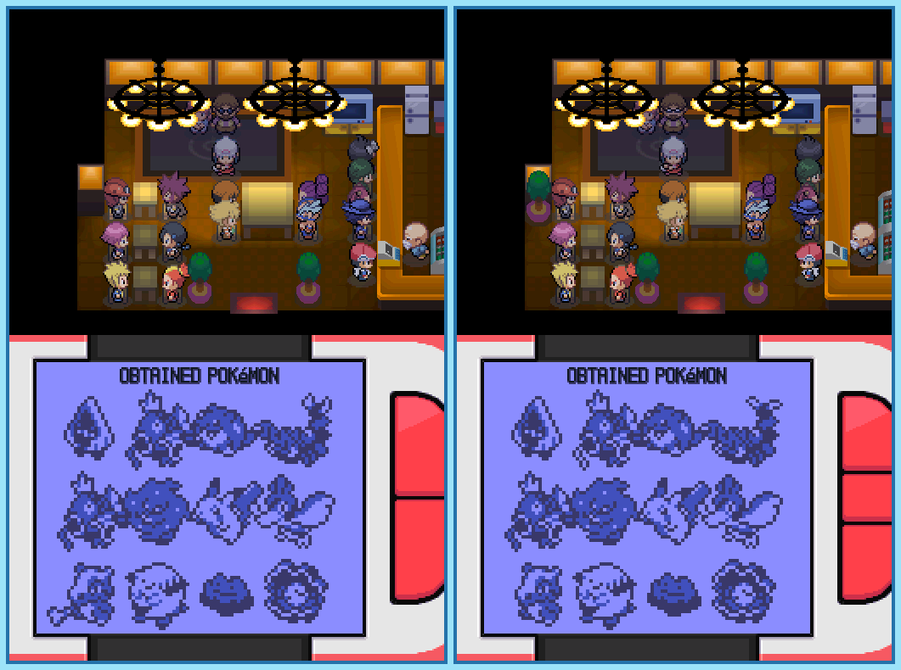

## Last Month's Winners

<table><thead><tr><th>Rank</th><th>User</th></tr></thead><tbody>
  <tr><td></td><td>

</td></tr>
  <tr><td>🥈</td><td></td></tr>
  <tr><td>🥉</td><td></td></tr>
  <tr><td>🏅</td><td></td></tr>
  <tr><td>🏅</td><td></td></tr>
</tbody></table>

On her journey Dawn is traveling into the Distortion World, the homeland of the legendary Pokémon Giratina. Giratina is able to create alternative dimensions and tries to trick Dawn into forgetting her origin. Can you find all 10 differences?

  

## About the Game

| Game                                                                                                                                                                                                                                                                           | Console     | Genre             |
| ------------------------------------------------------------------------------------------------------------------------------------------------------------------------------------------------------------------------------------------------------------------------------ | ----------- | ----------------- |
| <a class="gameicon-link" href="https://retroachievements.org/game/16196" target="_blank" rel="noopener">  ~Hack~ Pokemon Renegade Platinum</a> | Nintendo DS | Role-Playing Game |

* Suggested by: 

**Note:** The first user who finds all 10 differences and sends proof to  via Site DM or Discord will be listed in the next issue as the winner. Additionally, a random selected user which submitted the solution until the end of the month will be chosen to select the game of the next picture.
