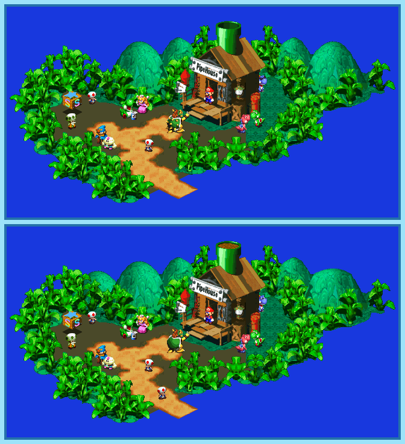

## Last Month's Winners

<table><thead><tr><th>Rank</th><th>User</th></tr></thead><tbody>
  <tr><td></td><td>

</td></tr>
  <tr><td>🥈</td><td></td></tr>
  <tr><td>🥉</td><td></td></tr>
  <tr><td>🏅</td><td></td></tr>
  <tr><td>🏅</td><td></td></tr>
  <tr><td>🏅</td><td></td></tr>
  <tr><td>🏅</td><td></td></tr>
  <tr><td>🏅</td><td></td></tr>
  <tr><td>🏅</td><td></td></tr>
</tbody></table>

There are many stories about Super Mario but today I want to tell you about the Legend of the Seven Stars. Once upon a time Mario needed to rescue Mushroom Kingdom with the help of Princess Toadstool, Bowser, a doll and even a cloud creature. It's unknown what exactly happened back then but the story is always the same beside a few differences... Can you find all 10 differences?

  <a href="https://tinyurl.com/2p8uraz8" />
  

## About the Game

| Game                                                                                                                                                                                                                                                   | Console | Genre                             |
| ------------------------------------------------------------------------------------------------------------------------------------------------------------------------------------------------------------------------------------------------------ | ------- | --------------------------------- |
| <a class="gameicon-link" href="https://retroachievements.org/game/471" target="_blank" rel="noopener">  Super Mario RPG: Legend of the Seven Stars</a> | SNES    | Role-Playing Game, Turn-based RPG |

* Suggested by: 

**Note:** The first user who finds all 10 differences and sends proof to  via Site DM or Discord will be listed in the next issue as the winner. Additionally, a random selected user which submitted the solution until the end of the month will be chosen to select the game of the next picture.
