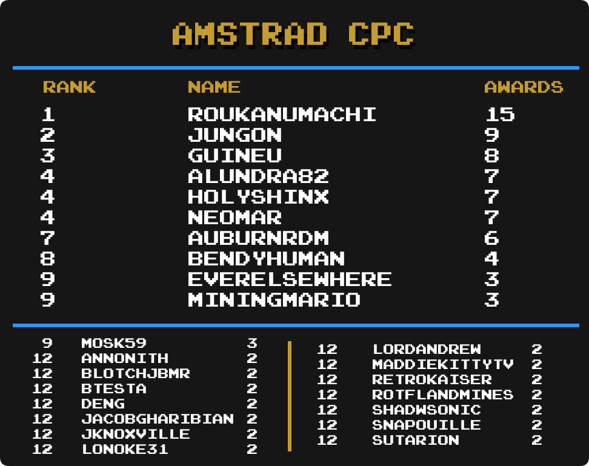

## Intro

We are going to take a look at another metric for greatness, Mastery Awards. Mastery awards are given to users when they complete every achievement for a given set in hardcore mode. Users wear mastery awards as a badge of honor on their profile page representing all the hard work they put into truly becoming a master of the game.

Below we will take a look at which users rank among the best with the most mastery awards in several categories well as notable updates from the previous month to each individual category. Check to see how you rank among the rest of the community members.

Special thanks to  for creating the ranking image templates.

\* Data as of March 1st 2023.

 

## Current Champions

| :joystick: Category         | :trophy: Champions                                                                                                                                                     | Mastery Awards |
| --------------------------- | ---------------------------------------------------------------------------------------------------------------------------------------------------------------------- | -------------- |
| Total Awards                |                                                                                                                                                  | 1040           |
| Event Awards                |                                                                                                                  | 18             | <!-- 101 --> |
| Site Awards                 |                                                                                                                    | 23             | <!-- 101 --> |
| 3DO Interactive Multiplayer |                                                                                                                                                 | 12             | <!-- 43  --> |
| Amstrad CPC                 |                                                                                                                                            | 15             | <!-- 37  --> |
| Apple II                    |                                                                                                                                                  | 12             | <!-- 38  --> |
| Arcade                      |                                                                                                                                                  | 65             | <!-- 27  --> |
| Arduboy                     |                                                                                                                                                  | 36             | <!-- 71  --> |
| Atari 2600                  |                                                                                                                                                  | 105            | <!-- 25  --> |
| Atari 7800                  |                                                                                                                                                  | 13             | <!-- 51  --> |
| Atari Jaguar                |                                                                                                                                                  | 7              | <!-- 17  --> |
| Atari Lynx                  |                                                                                                                         | 5              | <!-- 13  --> |
| ColecoVision                |                                                                                                                                                  | 14             | <!-- 44  --> |
| Dreamcast                   |                                                                                                                                             | 19             | <!-- 40  --> |
| Fairchild Channel F         |                                                                                                                                              | 24             | <!-- 57  --> |
| Game Boy                    |                                                                                                                                                 | 129            | <!-- 4   --> |
| Game Boy Advance            |                                                                                                                                         | 128            | <!-- 5   --> |
| Game Boy Color              |                                                                                                                                            | 96             | <!-- 6   --> |
| Game Gear                   |                                                                                                                                                  | 73             | <!-- 15  --> |
| Hack Champ                  |                                                                                                                                               | 213            | <!--     --> |
| Homebrew Champ              |                                                                                                                                               | 203            | <!--     --> |
| Intellivision               |                                                                                                                                                  | 17             | <!-- 45  --> |
| Magnavox Odyssey 2          |                                                                                                                                                  | 8              | <!-- 23  --> |
| Master System               |                                                                                                                                                  | 82             | <!-- 11  --> |
| Mega Drive                  |                                                                                                                                                     | 133            | <!-- 1   --> |
| Mega Duck                   |                                                                                                                                            | 12             | <!-- 69  --> |
| MSX                         |                                                                                                                                                  | 14             | <!-- 29  --> |
| Nintendo 64                 |                                                                                                                                               | 47             | <!-- 2   --> |
| Neo Geo Pocket              |                                                                                                                                               | 9              | <!-- 14  --> |
| NES                         |                                                                                                                                               | 244            | <!-- 7   --> |
| Nintendo DS                 |                                                                                                                                                  | 78             | <!-- 18  --> |
| PC Engine                   |                                                                                                                                                | 36             | <!-- 8   --> |
| PC Engine CD                |                                                                                                                                                | 10             | <!-- 76  --> |
| PC-8000/8800                |                                                                                                                                                    | 14             | <!-- 47  --> |
| PC-FX                       |                                                                                                                                                  | 6              | <!-- 49  --> |
| PlayStation                 |                                                                                                                                                  | 90             | <!-- 12  --> |
| PlayStation 2               |                                                                                                                                                | 29             | <!-- 21  --> |
| PlayStation Portable        |                                                                                                                                                  | 38             | <!-- 41  --> |
| Pokémon Mini                |                                                                                                                                              | 36             | <!-- 24  --> |
| Sega 32X                    |                                                                                                                           | 3              | <!-- 10  --> |
| Sega Saturn                 |                                                                                                                                                    | 16             | <!-- 39  --> |
| Sega CD                     |                                                                                                                                                  | 14             | <!-- 9   --> |
| SG-1000                     |                                                                                                                                                  | 12             | <!-- 33  --> |
| SNES                        |                                                                                                                                               | 213            | <!-- 3   --> |
| Vectrex                     |                                                                                                                                                  | 9              | <!-- 46  --> |
| Virtual Boy                 |                                                                                                                                              | 15             | <!-- 28  --> |
| WASM-4                      |                                                                                                                                               | 33             | <!-- 72  --> |
| Watara Supervision          |                                                                                                                                            | 47             | <!-- 63  --> |
| WonderSwan                  |       | 3              | <!-- 53  --> |

## Notable Milestones

### 700 Site Awards Earned

||||

### 500 Site Awards Earned

||||

### 400 Site Awards Earned

||||

### 300 Site Awards Earned

||||

### 200 Site Awards Earned

||||
||||
||||

### 100 Site Awards Earned

||||
||||
||||
||||
||||

## Category Rankings

### Total Awards

  

*  remains in 1st with 1040 total mastery awards.
*  has moved up 1 spot and is in 4th place.
*  has moved up 1 spot and is in 16th place.
*  has moved up 2 spots and is in 18th place.

### Total Awards (Excluding Hacks)

  

*  remains in 1st with 1017 total mastery awards.
*  has moved up 1 spot and is tied for 3rd place.
*  has moved up 1 spot and is in 6th place.
*  has moved up 3 spots and is tied for 17th place.
*  has made it into the top 25 and is tied for 25th place.

### Event Awards

  

*  has joined  in 1st place with 18 total mastery awards.
*  has moved up 2 spots and is in 4th place.
*  has moved up 3 spots and is in 5th place.
*  has moved up 4 spots and is in a 3-way tie for 6th place.
*  has moved up 3 spots and is in a 4-way tie for 13th place.
*  has moved up 1 spot and is in a 4-way tie for 13th place.
*  has moved up 4 spots and is in a 7-way tie for 17th place.
*  has moved up 1 spot and is in a 7-way tie for 17th place.
*  &  have made it into the top 25 and are in a 9-way tie for 24th place.

### Site Awards

  

*  has joined  in 1st with 23 total mastery awards.
*  has moved up 1 spot and is in a 3-way tie for 5th place.
*  has moved up 1 spot and is in 8th place.
*  has moved up 2 spots and is in a 6-way tie for 11th place.
*  has moved up 7 spots and is in a 3-way tie for 17th place.

### Amstrad CPC

  

*  remains in 1st with 15 total mastery awards.
*  has moved up 7 spots and is in a 3-way tie for 9th place.
* ,  &  have made it into the top 25 and are in a 16-way tie for 12th place.

### Apple II

  

*  remains in 1st with 12 total mastery awards.
*  has moved up 1 spot and is in 2nd place.
*  has moved up 1 spot and is in a 4-way tie for 5th place.
*  has made it into the top 25 and is in a 4-way tie for 5th place.
*  has moved up 2 spots and is in a 6-way tie for 9th place.
*  has made it into the top 25 and is in a 6-way tie for 9th place.
*  has moved up 3 spots and is in a 7-way tie for 15th place.
*  has moved up 5 spots and is in a 7-way tie for 15th place.
*  has made it into the top 25 and is in a 7-way tie for 15th place.
*  &  have made it into the top 25 and are in a 17-way tie for 22nd place.

### Arcade

  

*  remains in 1st with 65 total mastery awards.
*  has moved up 1 spot and is in 4th place.
*  has moved up 1 spot and is in 6th place.
*  has moved up 1 spot and is in 13th place.
*  has made it into the top 25 and is tied for 14th place.
*  has made it into the top 25 and is tied for 16th place.
*  has moved up 1 spot and is in a 4-way tie for 18th place.
*  has moved up 4 spots and is in a 4-way tie for 18th place.

### Arduboy

  

*  remains in 1st with 36 total mastery awards.
*  has moved up 2 spots and is in a 3-way tie for 10th place.
*  has moved up 1 spot and is tied for 13th place.
*  has moved up 5 spots and is in 17th place.
*  has moved up 2 spots and is in a 6-way tie for 18th place.
*  has moved up 5 spots and is in a 6-way tie for 18th place.

### Atari 2600

  

*  remains in 1st with 105 total mastery awards.
*  has moved up 2 spots and is tied for 11th place.
*  has moved up 1 spot and is tied for 19th place.
*  has moved up 2 spots and is tied for 22nd place.

### Dreamcast

  

*  remains in 1st with 19 total mastery awards.
*  has moved up 8 spots and is in a 4-way tie for 6th place.
*  &  have made it into the top 25 and are in a 5-way tie for 18th place.
*  has made it into the top 25 and is in a 19-way tie for 23rd place.

### Fairchild Channel F

  

*  remains in 1st with 24 total mastery awards.
*  has moved up 15 spots and is tied for 7th place.
*  has moved up 3 spots and is in 10th place.
*  has moved up 3 spots and is in a 4-way tie for 11th place.
*  has made it into the top 25 and is in a 3-way tie for 15th place.
*  has made it into the top 25 and is in a 5-way tie for 18th place.
*  has moved up 1 spot and is in a 5-way tie for 18th place.
*  has moved up 2 spots and is in a 7-way tie for 23rd place.
*  &  have made it into the top 25 and are in a 7-way tie for 23rd place.

### Game Boy

  

*  remains in 1st with 129 total mastery awards.
*  has moved up 1 spot and is in 5th place.
*  has moved up 9 spots and is in 11th place.
*  has moved up 3 spots and is in a 4-way tie for 15th place.
*  has moved up 1 spot and is tied for 21st place.

### Game Boy Advance

  

*  remains in 1st with 128 total mastery awards.
*  has moved up 1 spot and is tied for 11th place.
*  has moved up 1 spot and is tied for 20th place.

### Game Boy Color

  

*  remains in 1st with 96 total mastery awards.
*  has moved up 3 spots and is in 14th place.
*  has made it into the top 25 and is in a 3-way tie for 22nd place.
*  has made it into the top 25 and is in a 6-way tie for 25th place.

### Game Gear

  

*  remains in 1st with 73 total mastery awards.
*  has moved up 1 spot and is in a 3-way tie for 9th place.
*  &  have moved up 1 spot and are tied for 12th place.

### Hack Champ

  

*  remains in 1st with 213 total mastery awards.
*  has moved up 1 spot and is tied for 8th place.
*  has moved up 1 spot and is in 10th place.
*  has moved up 2 spots and is in 11th place.
*  has moved up 3 spots and is in 15th place.
*  has moved up 3 spots and is in 16th place.
*  has moved up 1 spot and is in a 3-way tie for 21st place.
*  has moved up 2 spots and is in a 3-way tie for 21st place.

### Homebrew Champ

  

*  remains in 1st with 203 total mastery awards.
*  has moved up 5 spots and is in 9th place.
*  has moved up 4 spots and is in 13th place.
*  has moved up 1 spot and is in 14th place.
*  has moved up 2 spots and is in 17th place.
*  has moved up 1 spot and is in 20th place.
*  has moved up 1 spot and is tied for 22nd place.
*  has made it into the top 25 and is tied for 22nd place.

### Master System

  

*  remains in 1st with 82 total mastery awards.
*  has moved up 3 spots and is in 8th place.
*  has moved up 2 spots and is in a 4-way tie for 14th place.
*  has moved up 3 spots and is in a 3-way tie for 18th place.
*  &  have made it into the top 25 and are in a 6-way tie for 21st place.

### Mega Drive

  

*  remains in 1st with 133 total mastery awards.
*  has moved up 2 spots and is tied for 14th place.
*  has moved up 2 spots and is in a 4-way tie for 19th place.
*  has made it into the top 25 and is in a 4-way tie for 19th place.

### Mega Duck

  

*  remains in 1st with 12 total mastery awards.
*  has moved up 1 spot and is tied for 3rd place.
*  has made it into the top 25 and is in a 5-way tie for 8th place.

### Nintendo 64

  

*  remains in 1st with 47 total mastery awards.
*  has moved up 1 spot and is in 7th place.
*  &  have moved up 3 spots and are in a 5-way tie for 17th place.

### NES

  

*  remains in 1st with 244 total mastery awards.
*  has moved up 1 spot and is in 9th place.
*  has made it into the top 25 and is in 24th place.

### Nintendo DS

  

*  remains in 1st with 78 total mastery awards.
*  has moved up 3 spots and is in a 4-way tie for 7th place.
*  has moved up 1 spot and is in 12th place.
*  has moved up 2 spots and is tied for 16th place.
*  has made it into the top 25 and is in a 7-way tie for 25th place.

### PC Engine

  

*  remains in 1st with 36 total mastery awards.
*  has moved up 2 spots and is tied for 3rd place.
*  has moved up 2 spots and is tied for 6th place.
*  has moved up 2 spots and is in a 3-way tie for 10th place.
*  has moved up 4 spots and is tied for 13th place.

### PC Engine CD

  

*  remains in 1st with 10 total mastery awards.

### PC-8000/8800

  

*  remains in 1st with 14 total mastery awards.
*  has moved up 8 spots and is in a 3-way tie for 8th place.
*  has made it into the top 25 and is in a 9-way tie for 11th place.

### PlayStation

  

*  remains in 1st with 90 total mastery awards.
*  has moved up 3 spots and is in a 3-way tie for 19th place.

### PlayStation 2

  

*  remains in 1st with 29 total mastery awards.
*  has moved up 1 spot and is in 3rd place.
*  has moved up 3 spots and is tied for 4th place.
*  has moved up 12 spots and is in a 4-way tie for 6th place.
*  has made it into the top 25 and is in a 4-way tie for 6th place.
*  has moved up 11 spot and is in a 4-way tie for 6th place.
*  has moved up 6 spots and is in a 4-way tie for 10th place.
*  has moved up 9 spots and is in a 4-way tie for 10th place.
*  has made it into the top 25 and is in a 4-way tie for 10th place.
*  has moved up 1 spot and is in a 10-way tie for 14th place.
* ,  &  have made it into the top 25 and are in a 10-way tie for 14th place.
*  has made it into the top 25 and is in a 7-way tie for 24th place.

### PlayStation Portable

  

*  remains in 1st with 38 total mastery awards.
*  has moved up 1 spot and is tied for 4th place.
*  has moved up 1 spot and is in 6th place.
*  has made it into the top 25 and is tied for 24th place.

### Pokémon Mini

  

*  remains in 1st with 36 total mastery awards.
*  has moved up 7 spots and is in a 4-way tie for 10th place.
*  has moved up 2 spots and is in a 4-way tie for 14th place.
*  has moved up 4 spots and is in a 4-way tie for 14th place.
*  has moved up 2 spots and is in a 3-way tie for 20th place.

### Sega Saturn

  

*  remains in 1st with 16 total mastery awards.
*  has made it into the top 25 and is in a 12-way tie for 18th place.

### Sega CD

  

*  has taken 1st place with 14 total mastery awards.
*  has made it into the top 25 and is in a 4-way tie for 4th place.
*  has moved up 5 spots and is in a 6-way tie for 8th place.
*  has moved up 7 spots and is in a 6-way tie for 8th place.
*  has made it into the top 25 and is in a 18-way tie for 14th place.

### SNES

  

*  remains in 1st with 213 total mastery awards.
*  has moved up 2 spots and is in a 3-way tie for 7th place.
*  has moved up 2 spots and is in a 3-way tie for 7th place.
*  has made it into the top 25 and is tied for 25th place.

### Virtual Boy

  

*  remains in 1st with 15 total mastery awards.
*  has moved up 2 spots and is tied for 5th place.
*  has made it into the top 25 and is in a 11-way tie for 18th place.

### WASM-4

  

*  remains in 1st with 33 total mastery awards.
*  has moved up 4 spots and is in 3rd place.
*  &  have moved up 2 spots and are in a 3-way tie for 8th place.
*  has moved up 6 spots and is in a 3-way tie for 12th place.
*  &  have moved up 6 spots and are in a 6-way tie for 15th place.
*  has moved up 7 spots and is in a 6-way tie for 15th place.
*  has made it into the top 25 and is in a 6-way tie for 15th place.
*  has made it into the top 25 and is tied for 21st place.
*  has made it into the top 25 and is in a 3-way tie for 23rd place.

### Watara Supervision

  

*  remains in 1st with 47 total mastery awards.
