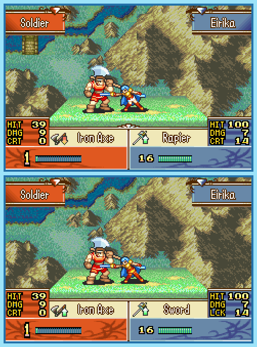

## Last Month's Winners

<table><thead><tr><th>Rank</th><th>User</th></tr></thead><tbody>
  <tr><td></td><td>

</td></tr>
  <tr><td>🥈</td><td></td></tr>
  <tr><td>🥉</td><td></td></tr>
  <tr><td>🏅</td><td></td></tr>
  <tr><td>🏅</td><td></td></tr>
  <tr><td>🏅</td><td></td></tr>
  <tr><td>🏅</td><td></td></tr>
  <tr><td>🏅</td><td></td></tr>
</tbody></table>

On her journey to Grado, Eirika was attacked by strong enemy forces and lost her life in battle. Because of Renais' deep sorrow, one of the gods has decided to rewind the time and give her another chance of encounter. While most of her memories seem to be the same, some things have changed. Can you find all 10 Differences?

  

## About the Game

| Game                                                                                                                                                                                                                  | Console     | Genre               |
| --------------------------------------------------------------------------------------------------------------------------------------------------------------------------------------------------------------------- | ----------- | ------------------- |
| <a class="gameicon-link" href="https://retroachievements.org/game/2482" target="_blank" rel="noopener">  Fire Emblem: The Sacred Stones</a> | Game Boy Advance | Tactical RPG |

* Suggested by: 

**Note:** The first user who finds all 10 differences and sends proof to  via Site DM or Discord will be listed in the next issue as the winner. Additionally, a random selected user which submitted the solution until the end of the month will be chosen to select the game of the next picture.
