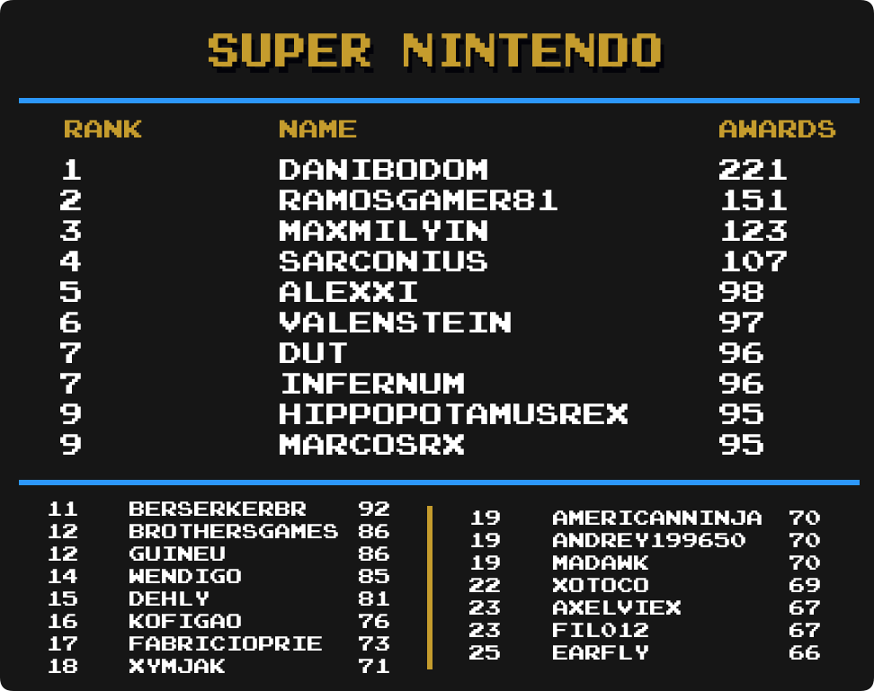

## Intro

We are going to take a look at another metric for greatness, Mastery Awards. Mastery awards are given to users when they complete every achievement for a given set in hardcore mode. Users wear mastery awards as a badge of honor on their profile page representing all the hard work they put into truly becoming a master of the game.

Below we will take a look at which users rank among the best with the most mastery awards in several categories well as notable updates from the previous month to each individual category. Check to see how you rank among the rest of the community members.

Special thanks to  for creating the ranking image templates.

\* Data as of May 1st 2023.

 

## Current Champions

<table>
    <tr style="text-align: left;"><th>:joystick: Category</th><th>:trophy: Champions</th><th>Mastery Awards</th><th></th></tr>
    <tr><td>

Total Awards

</td>               <td></td>                                 <td>1089</td><th><!--     --></th></tr>
    <tr><td>

Event Awards

</td>               <td> </td><td>20</td><td><!-- 101 --></td></tr>
    <tr><td>

Site Awards

</td>                <td></td>                                   <td>25</td><td><!-- 101 --></td></tr>
    <tr><td>

3DO Interactive Multiplayer

</td><td></td>                                <td>12</td><td><!-- 43  --></td></tr>
    <tr><td>

Amstrad CPC

</td>                <td></td>                           <td>15</td><td><!-- 37  --></td></tr>
    <tr><td>

Apple II

</td>              <td></td>                             <td>13</td><td><!-- 38  --></td></tr>
    <tr><td>

Arcade

</td>                  <td></td>                                 <td>65</td><td><!-- 27  --></td></tr>
    <tr><td>

Arduboy

</td>                <td></td>                                 <td>41</td><td><!-- 71  --></td></tr>
    <tr><td>

Atari 2600

</td>                <td></td>                                 <td>111</td><td><!-- 25  --></td></tr>
    <tr><td>

Atari 7800

</td>                <td></td>                                 <td>13</td><td><!-- 51  --></td></tr>
    <tr><td>

Atari Jaguar

</td>            <td></td>                                 <td>9</td><td><!-- 17  --></td></tr>
    <tr><td>

Atari Lynx

</td>                <td> </td>       <td>5</td><td><!-- 13  --></td></tr>
    <tr><td>

ColecoVision

</td>      <td></td>                                 <td>17</td><td><!-- 44  --></td></tr>
    <tr><td>

Dreamcast

</td>            <td></td>                            <td>19</td><td><!-- 40  --></td></tr>
    <tr><td>

Fairchild Channel F

</td>  <td></td>                             <td>26</td><td><!-- 57  --></td></tr>
    <tr><td>

Game Boy

</td>                    <td></td>                                <td>135</td><td><!-- 4   --></td></tr>
    <tr><td>

Game Boy Advance

</td>           <td></td>                        <td>142</td><td><!-- 5   --></td></tr>
    <tr><td>

Game Boy Color

</td>             <td></td>                           <td>102</td><td><!-- 6   --></td></tr>
    <tr><td>

Game Gear

</td>                   <td></td>                                 <td>73</td><td><!-- 15  --></td></tr>
    <tr><td>

Hacks

</td>                      <td></td>                              <td>216</td><td><!--     --></td></tr>
    <tr><td>

Homebrews

</td>                  <td></td>                              <td>218</td><td><!--     --></td></tr>
    <tr><td>

Intellivision

</td>    <td></td>                                 <td>17</td><td><!-- 45  --></td></tr>
    <tr><td>

Magnavox Odyssey 2

</td>    <td></td>                                 <td>11</td><td><!-- 23  --></td></tr>
    <tr><td>

Master System

</td>    <td></td>                                 <td>83</td><td><!-- 11  --></td></tr>
    <tr><td>

Mega Drive

</td>                  <td></td>                                    <td>133</td><td><!-- 1   --></td></tr>
    <tr><td>

Mega Duck

</td>            <td></td>                           <td>12</td><td><!-- 69  --></td></tr>
    <tr><td>

MSX

</td>                        <td></td>                                 <td>14</td><td><!-- 29  --></td></tr>
    <tr><td>

Nintendo 64

</td>                <td></td>                              <td>53</td><td><!-- 2   --></td></tr>
    <tr><td>

Neo Geo Pocket

</td>             <td></td>                              <td>11</td><td><!-- 14  --></td></tr>
    <tr><td>

NES

</td>                        <td></td>                              <td>244</td><td><!-- 7   --></td></tr>
    <tr><td>

Nintendo DS

</td>                 <td></td>                                 <td>84</td><td><!-- 18  --></td></tr>
    <tr><td>

Nintendo DSi

</td>               <td></td>                            <td>15</td><td><!-- 78  --></td></tr>
    <tr><td>

PC Engine

</td>                  <td></td>                               <td>36</td><td><!-- 8   --></td></tr>
    <tr><td>

PC Engine CD

</td>      <td></td>                               <td>10</td><td><!-- 76  --></td></tr>
    <tr><td>

PC-8000/8800

</td>       <td></td>                                   <td>14</td><td><!-- 47  --></td></tr>
    <tr><td>

PC-FX

</td>                    <td></td>                                 <td>7</td><td><!-- 49  --></td></tr>
    <tr><td>

PlayStation

</td>                <td></td>                                 <td>95</td><td><!-- 12  --></td></tr>
    <tr><td>

PlayStation 2

</td>              <td></td>                               <td>39</td><td><!-- 21  --></td></tr>
    <tr><td>

PlayStation Portable

</td>       <td></td>                                 <td>45</td><td><!-- 41  --></td></tr>
    <tr><td>

Pokémon Mini

</td>      <td></td>                             <td>36</td><td><!-- 24  --></td></tr>
    <tr><td>

Sega 32X

</td>                   <td></td>                                <td>4</td><td><!-- 10  --></td></tr>
    <tr><td>

Sega Saturn

</td>             <td></td>                                   <td>16</td><td><!-- 39  --></td></tr>
    <tr><td>

Sega CD

</td>                    <td></td>                                 <td>16</td><td><!-- 9   --></td></tr>
    <tr><td>

SG-1000

</td>                <td> </td>       <td>13</td><td><!-- 33  --></td></tr>
    <tr><td>

SNES

</td>                      <td></td>                              <td>221</td><td><!-- 3   --></td></tr>
    <tr><td>

Vectrex

</td>                <td></td>                                 <td>10</td><td><!-- 46  --></td></tr>
    <tr><td>

Virtual Boy

</td>        <td> </td>   <td>15</td><td><!-- 28  --></td></tr>
    <tr><td>

WASM-4

</td>                  <td>  </td><td>40</td><td><!-- 72  --></td></tr>
    <tr><td>

Watara Supervision

</td> <td></td>                           <td>47</td><td><!-- 63  --></td></tr>
    <tr><td>

WonderSwan

</td>          <td></td>                                <td>5</td><td><!-- 53  --></td></tr>
</table>

## Notable Milestones

### 500 Mastery Awards

||||

### 500 Mastery Awards

||||

### 500 Mastery Awards

||||
||||

### 500 Mastery Awards

||||
||||

### 500 Mastery Awards

||||
||||
||||
||||
||||
||||
||||

## Category Rankings

### Total Awards

  

*  remains in 1st with 1089 total mastery awards.
*  has moved up 1 spot and is in 11th place.
*  has moved up 2 spots and is in 12th place.
*  has moved up 1 spot and is in 19th place.
*  has moved up 1 spot and is in 22nd place.
*  has made it into the top 25 and is tied for 23rd place.
*  has made it into the top 25 and is in 25th place.

### Total Awards (Excluding Hacks)

  

*  remains in 1st with 1066 total mastery awards.
*  has moved up 1 spot and is in 15th place.
*  has moved up 1 spot and is in 16th place.
*  has made it into the top 25 and is in 21st place.
*  has made it into the top 25 and is in 25th place.

### Event Awards

  

*  remains in 1st with 20 total mastery awards.
*  has moved up 1 spot and is tied for 10th place.
*  &  have moved up 3 spots and are tied for 14th place.
*  has moved up 3 spots and is in a 9-way tie for 16th place.
*  &  have moved up 4 spots and are in a 9-way tie for 16th place.
* ,  &  have made it into the top 25 and are in a 9-way tie for 16th place.
*  has made it into the top 25 and is in a 8-way tie for 25th place.

### Site Awards

  

*  remains in 1st with 25 total mastery awards.
*  has moved up 1 spot and is tied for 3rd place.
*  has moved up 3 spots and is in 8th place.
*  has moved up 6 spots and is in 13th place.
*  &  have moved up 4 spots and are in a 7-way tie for 14th place.

### Amstrad CPC

  

*  remains in 1st with 15 total mastery awards.
*  has moved up 1 spot and is in a 3-way tie for 8th place.
*  &  have made it into the top 25 and are in a 18-way tie for 12th place.

### Apple II

  

*  has taken 1st place with 13 total mastery awards.
*  has moved up 8 spots and is tied for 4th place.
*  has moved up 1 spot and is in a 5-way tie for 6th place.
*  has moved up 1 spot and is in a 3-way tie for 11th place.
*  has moved up 4 spots and is in a 5-way tie for 14th place.
*  has moved up 5 spots and is in a 8-way tie for 19th place.
*  &  have made it into the top 25 and are in a 8-way tie for 19th place.

### Arcade

  

*  remains in 1st with 65 total mastery awards.
*  has moved up 4 spots and is tied for 12th place.
*  has made it into the top 25 and is in 18th place.
*  has moved up 1 spot and is in a 4-way tie for 20th place.
*  has moved up 3 spots and is in a 4-way tie for 20th place.
*  has made it into the top 25 and is in a 4-way tie for 20th place.

### Arduboy

  

*  remains in 1st with 41 total mastery awards.
*  has moved up 2 spots and is in 3rd place.
*  has moved up 3 spots and is in 8th place.
*  has moved up 4 spots and is tied for 11th place.
*  has moved up 1 spot and is in 18th place.
*  has moved up 2 spots and is in a 4-way tie for 19th place.
*  has moved up 4 spots and is in a 4-way tie for 19th place.
*  has made it into the top 25 and is in a 4-way tie for 25th place.

### Atari 2600

  

*  remains in 1st with 111 total mastery awards.
*  has made it into the top 25 and is in 7th place.
*  has moved up 6 spots and is in 10th place.
*  has moved up 2 spots and is tied for 17th place.

### Dreamcast

  

*  remains in 1st with 19 total mastery awards.
*  has moved up 8 spots and is in a 6-way tie for 7th place.
*  has made it into the top 25 and is in a 8-way tie for 13th place.
*  has moved up 4 spots and is in a 11-way tie for 21st place.
* ,  &  have made it into the top 25 and are in a 11-way tie for 21st place.

### Fairchild Channel F

  

*  remains in 1st with 26 total mastery awards.
*  has made it into the top 25 and is tied for 6th place.
*  has moved up 2 spots and is in 8th place.
*  has moved up 1 spot and is in a 4-way tie for 11th place.
*  has made it into the top 25 and is in a 4-way tie for 21st place.
*  &  have moved up 2 spots and are in a 4-way tie for 21st place.

### Game Boy

  

*  remains in 1st with 135 total mastery awards.
*  has moved up 2 spots and is tied for 9th place.
*  has moved up 1 spot and is tied for 11th place.
*  has moved up 4 spots and is tied for 14th place.
*  has made it into the top 25 and is in a 3-way tie for 22nd place.

### Game Boy Advance

  

*  remains in 1st with 142 total mastery awards.
*  has moved up 1 spot and is tied for 4th place.
*  has moved up 1 spot and is in 9th place.
*  has moved up 1 spot and is tied for 11th place.
*  &  have moved up 1 spot and are in a 3-way tie for 18th place.
*  has moved up 3 spots and is tied for 21st place.
*  has made it into the top 25 and is tied for 23rd place.

### Game Boy Color

  

*  remains in 1st with 102 total mastery awards.
*  has moved up 1 spot and is in 10th place.
*  has moved up 2 spots and is tied for 11th place.
*  has made it into the top 25 and is in a 3-way tie for 14th place.
*  has moved up 3 spots and is in a 3-way tie for 14th place.
*  has moved up 2 spots and is in a 4-way tie for 20th place.
*  has made it into the top 25 and is in a 4-way tie for 20th place.
*  has made it into the top 25 and is in a 5-way tie for 24th place.

### Game Gear

  

*  remains in 1st with 73 total mastery awards.
*  has moved up 2 spots and is tied for 8th place.
*  has moved up 1 spot and is in a 3-way tie for 10th place.
*  has moved up 3 spots and is tied for 18th place.
*  has moved up 5 spots and is tied for 18th place.

### Hack Champ

  

*  remains in 1st with 218 total mastery awards.
*  has moved up 2 spots and is in 7th place.
*  has moved up 1 spot and is in 9th place.
*  has moved up 1 spot and is in 11th place.
*  has moved up 1 spot and is in a 3-way tie for 13th place.
*  has moved up 1 spot and is in 16th place.
*  has moved up 3 spots and is in 19th place.
*  has made it into the top 25 and is in 25th place.

### Homebrew Champ

  

*  remains in 1st with 216 total mastery awards.
*  has moved up 1 spot and is in 7th place.
*  has moved up 2 spots and is in 10th place.
*  has moved up 7 spots and is in 12th place.
*  has moved up 1 spot and is tied for 14th place.
*  has moved up 3 spots and is tied for 19th place.
*  has made it into the top 25 and is tied for 23rd place.

### Master System

  

*  remains in 1st with 83 total mastery awards.
*  has moved up 12 spots and is in 6th place.

### Mega Drive

  

*  remains in 1st with 133 total mastery awards.
*  has moved up 1 spot and is in 7th place.
*  has moved up 1 spot and is in 12th place.
*  has moved up 1 spot and is tied for 18th place.

### Mega Duck

  

*  remains in 1st with 12 total mastery awards.
*  has moved up 1 spot and is tied for 3rd place.
*  has moved up 18 spots and is in a 3-way tie for 6th place.
*  has made it into the top 25 and is in a 67-way tie for 24th place.

### Nintendo 64

  

*  remains in 1st with 53 total mastery awards.
*  has moved up 4 spots and is tied for 4th place.
*  has moved up 3 spots and is in 10th place.
*  has moved up 1 spot and is in a 3-way tie for 11th place.
*  has moved up 3 spots and is in a 7-way tie for 17th place.
*  has made it into the top 25 and is in a 7-way tie for 17th place.

### NES

  

*  remains in 1st with 244 total mastery awards.
*  has moved up 1 spot and is tied for 9th place.
*  has moved up 1 spot and is tied for 15th place.
*  has moved up 1 spot and is in 23rd place.

### Nintendo DS

  

*  remains in 1st with 84 total mastery awards.
*  has moved up 1 spot and is in 2nd place.
*  has moved up 1 spot and is tied for 11th place.
*  has moved up 2 spots and is tied for 16th place.
*  has made it into the top 25 and is tied for 18th place.

### Nintendo DSi

  

*  has taken 1st place with 15 total mastery awards.
*  has made it into the top 25 and is in 2nd place.

### PC Engine

  

*  remains in 1st with 36 total mastery awards.
*  has moved up 1 spot and is in a 4-way tie for 10th place.
*  has made it into the top 25 and is in a 7-way tie for 19th place.

### PC Engine CD

  

*  remains in 1st with 10 total mastery awards.

### PC-8000/8800

  

*  remains in 1st with 14 total mastery awards.
*  has moved up 1 spot and is in 5th place.
*  has moved up 6 spots and is in a 5-way tie for 9th place.
*  has moved up 6 spots and is in a 10-way tie for 14th place.
*  has made it into the top 25 and is in a 10-way tie for 14th place.

### PlayStation

  

*  remains in 1st with 95 total mastery awards.
*  has moved up 2 spots and is tied for 8th place.
*  has moved up 2 spots and is in 12th place.
*  has moved up 1 spot and is in 15th place.
*  has moved up 2 spots and is in 17th place.
*  has moved up 1 spot and is in a 3-way tie for 18th place.
*  has made it into the top 25 and is tied for 24th place.

### PlayStation 2

  

*  remains in 1st with 39 total mastery awards.
*  has moved up 1 spot and is tied for 2nd place.
*  has moved up 2 spots and is in a 3-way tie for 4th place.
*  has moved up 4 spots and is in a 3-way tie for 4th place.
*  &  have moved up 6 spots and are in a 3-way tie for 9th place.
*  has moved up 2 spots and is in a 3-way tie for 9th place.
*  has moved up 2 spots and is in a 4-way tie for 12th place.
*  has moved up 8 spots and is in a 4-way tie for 12th place.
*  has moved up 1 spot and is in a 6-way tie for 16th place.
*  &  have made it into the top 25 and are in a 6-way tie for 16th place.
*  has moved up 1 spot and is in a 3-way tie for 22nd place.
*  has made it into the top 25 and is in a 5-way tie for 25th place.

### PlayStation Portable

  

*  remains in 1st with 45 total mastery awards.
*  has moved up 3 spots and is in a 4-way tie for 10th place.
*  has moved up 5 spots and is in a 7-way tie for 19th place.
*  has made it into the top 25 and is in a 7-way tie for 19th place.

### Pokémon Mini

  

*  remains in 1st with 36 total mastery awards.
*  has moved up 1 spot and is tied for 4th place.
*  has moved up 8 spots and is tied for 7th place.
*  has made it into the top 25 and is tied for 11th place.
*  has moved up 2 spots and is in a 4-way tie for 17th place.
*  has made it into the top 25 and is in a 4-way tie for 17th place.
*  has moved up 3 spots and is tied for 21st place.

### Sega Saturn

  

*  remains in 1st with 16 total mastery awards.
*  has moved up 1 spot and is in 5th place.
* , ,  &  have moved up 1 spot and are in a 6-way tie for 6th place.
*  has moved up 7 spots and is in a 8-way tie for 12th place.
*  has made it into the top 25 and is in a 13-way tie for 20th place.

### Sega CD

  

*  remains in 1st with 16 total mastery awards.
*  has moved up 3 spots and is tied for 3rd place.
*  has moved up 6 spots and is in a 8-way tie for 9th place.
*  has made it into the top 25 and is in a 8-way tie for 9th place.

### SNES

  

*  remains in 1st with 221 total mastery awards.
*  has moved up 2 spots and is in 6th place.
*  has moved up 2 spots and is tied for 7th place.
*  has moved up 4 spots and is tied for 12th place.
*  has moved up 1 spot and is in 16th place.

### Virtual Boy

  

*  remains in 1st with 15 total mastery awards.
*  has moved up 4 spots and is in a 3-way tie for 5th place.

### WASM-4

  

*  remains in 1st with 42 total mastery awards.
*  has made it into the top 25 and is tied for 2nd place.
*  has made it into the top 25 and is tied for 12th place.
*  has moved up 4 spots and is in a 3-way tie for 17th place.
*  has made it into the top 25 and is in a 6-way tie for 20th place.

### Watara Supervision

  

*  remains in 1st with 47 total mastery awards.
*  has moved up 1 spot and is tied for 7th place.
*  has made it into the top 25 and is tied for 16th place.
*  has moved up 2 spots and is tied for 16th place.
