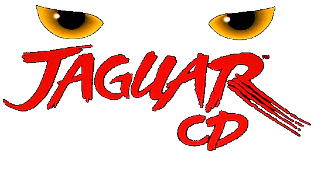

  

Few consoles are as emblematic of the downfall of a company as the Atari Jaguar CD. After all, the historical arcade publisher was a giant of the industry for a very long time: from the birth of the Arcade scene to the famous 80’s market crash, Atari was a name synonymous with video games itself.

While none of the video game actors of the time emerged intact from it, Atari never really recovered and never again reached its previous glory. Despite decent sales for the Atari 5200 and 7800 models, Nintendo and Sega are here now and are taking a considerable part of the market. Even the handheld space is not safe, as Atari realized after the failed Lynx project, eaten alive by the Game Boy.

Not the type to throw the towel, the company started working on its new console in a bid to claw its way back to the top it would eventually become the Jaguar! Launched in 1993, the console boasts technical specifications that are above the concurrence, which surely will do the trick. Right?

With an impressive and very marketable 64-bit system (kinda) and a price very fair for the market at the time, it unfortunately launched in an undercooked state and with a severe lack of games. Having a lot of bits is nice; having games that use them is better! Another glaring absence were the Japanese games, but the console tried to become successful without them and at least managed to garner some goodwill with titles such as Doom, Tempest 2000, or Alien vs. Predator.

Unfortunately, the bad reputation coming from almost all the other games coupled with very few units being distributed and the consumer demands still preferring Nintendo and Sega’s offers, resulted in the console selling very, very poorly. Exact numbers are not available, but it is widely believed that by the time of its death, it had sold around 150 000 units only…

One of the things Atari tried to revitalize interest in the console and the reason we are talking about the Jaguar today is the CD add-on. Regular Jaguar games were cartridge based and systems such as the Saturn and the PlayStation showed that having a CD-based format could bring a lot of advantages for music quality or cutscenes. And so it was in that very painful context that the Atari Jaguar CD was finally released in late September of 1995.

Sadly, the addon release was too little, too late, for a console that had already entered a death spiral. Seeing the writing on the wall, Atari finally pulled the plug and killed most, if not all, of the planned game releases and was finally out of the console publishing market. At least until the Atari VCS but uh… it’s not retro, and we really don’t need to talk about it.

So, what are we working with here? The CD-ROM format meant that the storage capacity for the games was greatly improved, but because the Jaguar can’t do anything right, it also came with a myriad of technical issues that caused slowdowns and bugs. When you strip out the marketing terminology, that’s pretty much the only thing this addon improved over the initial offer, which as a reminder was already not that great. "Throw Jaguar’s AWESOME games into the mix and you’ll have the MOST POWERFUL video game system out there". Now that’s a bold claim!

In the end, only 13 retail games were released for the Jaguar CD, of which four got a set on RetroAchievement. Out of those four, three take great advantage of the CD format, providing great looking graphics but following the same interactive movie gameplay. The last one is a long but a tad bland real-time strategy game involving Bald people's crusade against those who still have hair.

Out of the remaining games with no sets, we have a rough 3D shooter with Battlemorph, the After Burner inspired Blue Lightning, a janky adventure game with Highlander, Hover Strike, another 3D shooter with a more grounded approach, Iron Soldier II, a sequel to another Jaguar game where you control a giant robot in a 3D environment, a decent port of the classic puzzle game Myst, the dino fighting game Primal Rage, a sliding puzzle game with Vid Grid, and finally a racing game with World Tour Racing.

And that’s it! That’s all the official Jaguar CD titles ever released! In the years since the console's death, similar to its non-addon counterpart, the homebrew scene has developed and given a bit of a new life to the system. However, it’s not as easy to get into as other consoles such as the GBA or NES, so the offer is still somewhat limited and most of them do not take advantage of the console specs.

Still, it’s most likely that it’s there that you will find the most fun with the console so if you are interested in video game history it’s worth a look! While so far it doesn’t look like we will have any additional set releasees for it soon, a special shoutout goes to televandalist’s darling game Black ICE\White Noise: it’s a cyberpunk adventure game prototype with a retail release that got canceled and we’re sure it’s going to work in the emulator any time soon. For sure. Any moment now all the emulation bugs it’s subject to will magically solve themselves and we will be able to get a set on RA. Yep.