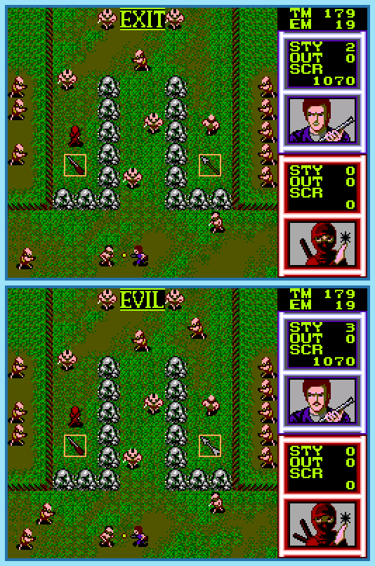

## Last Month's Winners

<table><thead><tr><th>Rank</th><th>User</th></tr></thead><tbody>
  <tr><td></td><td>

</td></tr>
  <tr><td>🥈</td><td></td></tr>
  <tr><td>🥉</td><td></td></tr>
  <tr><td>🏅</td><td></td></tr>
  <tr><td>🏅</td><td></td></tr>
</tbody></table>

A supercomputer experiment went wrong and many citizens were taken as hostages. To rescue them three brave warriors need to beat all levels and defeat the final boss. Currently two of the warriors are struggling with a level and needed to restart it but their second playthrough seems to be a bit different. Can you find all 10 differences?

  

## About the Game

| Game                                                                                                                                                                                                                      | Console       | Genre           |
| ------------------------------------------------------------------------------------------------------------------------------------------------------------------------------------------------------------------------- | ------------- | --------------- |
| <a class="gameicon-link" href="https://retroachievements.org/game/11659" target="_blank" rel="noopener">  Gain Ground</a> | Master System | Action Strategy |

* Suggested by: 

**Note:** The first user who finds all 10 differences and sends proof to  via Site DM or Discord will be listed in the next issue as the winner. Additionally, a random selected user which submitted the solution until the end of the month will be chosen to select the game of the next picture.
