## Intro

We are going to take a look at another metric for greatness, Mastery Awards. Mastery awards are given to users when they complete every achievement for a given set in hardcore mode. Users wear mastery awards as a badge of honor on their profile page representing all the hard work they put into truly becoming a master of the game.

Below we will take a look at which users rank among the best with the most mastery awards in several categories well as notable updates from the previous month to each individual category. Check to see how you rank among the rest of the community members.

Special thanks to  for creating the ranking image templates.

\* Data as of July 1st 2023.

 

## Current Champions

<table>
    <tr style="text-align: left;"><th>:joystick: Category</th><th>:trophy: Champions</th><th>Mastery Awards</th><th></th></tr>
    <tr><td>

Total Awards

</td>               <td></td>                                 <td>1134</td><th><!--     --></th></tr>
    <tr><td>

Event Awards

</td>               <td> </td><td>21</td><td><!-- 101 --></td></tr>
    <tr><td>

Site Awards

</td>                <td></td>                                   <td>25</td><td><!-- 101 --></td></tr>
    <tr><td>

3DO Interactive Multiplayer

</td><td> </td>      <td>12</td><td><!-- 43  --></td></tr>
    <tr><td>

Amstrad CPC

</td>                <td></td>                           <td>15</td><td><!-- 37  --></td></tr>
    <tr><td>

Apple II

</td>              <td></td>                             <td>13</td><td><!-- 38  --></td></tr>
    <tr><td>

Arcade

</td>                  <td> </td>  <td>65</td><td><!-- 27  --></td></tr>
    <tr><td>

Arduboy

</td>                <td></td>                                 <td>43</td><td><!-- 71  --></td></tr>
    <tr><td>

Atari 2600

</td>                <td></td>                                 <td>119</td><td><!-- 25  --></td></tr>
    <tr><td>

Atari 7800

</td>                <td></td>                                 <td>14</td><td><!-- 51  --></td></tr>
    <tr><td>

Atari Jaguar

</td>            <td></td>                                 <td>9</td><td><!-- 17  --></td></tr>
    <tr><td>

Atari Jaguar CD

</td>      <td></td>                           <td>8</td><td><!-- 71  --></td></tr>
    <tr><td>

Atari Lynx

</td>                <td> </td>       <td>8</td><td><!-- 13  --></td></tr>
    <tr><td>

ColecoVision

</td>      <td></td>                                 <td>17</td><td><!-- 44  --></td></tr>
    <tr><td>

Dreamcast

</td>            <td></td>                            <td>19</td><td><!-- 40  --></td></tr>
    <tr><td>

Fairchild Channel F

</td>  <td> </td> <td>27</td><td><!-- 57  --></td></tr>
    <tr><td>

Game Boy

</td>                    <td></td>                                <td>140</td><td><!-- 4   --></td></tr>
    <tr><td>

Game Boy Advance

</td>           <td></td>                        <td>148</td><td><!-- 5   --></td></tr>
    <tr><td>

Game Boy Color

</td>             <td></td>                              <td>110</td><td><!-- 6   --></td></tr>
    <tr><td>

Game Gear

</td>                   <td></td>                                 <td>75</td><td><!-- 15  --></td></tr>
    <tr><td>

Hacks

</td>                      <td></td>                            <td>221</td><td><!--     --></td></tr>
    <tr><td>

Homebrews

</td>                  <td></td>                              <td>224</td><td><!--     --></td></tr>
    <tr><td>

Intellivision

</td>    <td></td>                                 <td>17</td><td><!-- 45  --></td></tr>
    <tr><td>

Magnavox Odyssey 2

</td>    <td></td>                                 <td>14</td><td><!-- 23  --></td></tr>
    <tr><td>

Master System

</td>    <td></td>                                 <td>90</td><td><!-- 11  --></td></tr>
    <tr><td>

Mega Drive

</td>                  <td></td>                                    <td>133</td><td><!-- 1   --></td></tr>
    <tr><td>

Mega Duck

</td>            <td></td>                           <td>12</td><td><!-- 69  --></td></tr>
    <tr><td>

MSX

</td>                        <td></td>                                 <td>14</td><td><!-- 29  --></td></tr>
    <tr><td>

Nintendo 64

</td>                <td></td>                              <td>60</td><td><!-- 2   --></td></tr>
    <tr><td>

Neo Geo Pocket

</td>             <td></td>                              <td>12</td><td><!-- 14  --></td></tr>
    <tr><td>

NES

</td>                        <td></td>                              <td>244</td><td><!-- 7   --></td></tr>
    <tr><td>

Nintendo DS

</td>                 <td></td>                                 <td>87</td><td><!-- 18  --></td></tr>
    <tr><td>

Nintendo DSi

</td>               <td></td>                            <td>27</td><td><!-- 78  --></td></tr>
    <tr><td>

PC Engine

</td>                  <td></td>                               <td>36</td><td><!-- 8   --></td></tr>
    <tr><td>

PC Engine CD

</td>      <td> </td>   <td>10</td><td><!-- 76  --></td></tr>
    <tr><td>

PC-8000/8800

</td>       <td></td>                                   <td>14</td><td><!-- 47  --></td></tr>
    <tr><td>

PC-FX

</td>                    <td></td>                                 <td>7</td><td><!-- 49  --></td></tr>
    <tr><td>

PlayStation

</td>                <td></td>                                 <td>98</td><td><!-- 12  --></td></tr>
    <tr><td>

PlayStation 2

</td>              <td></td>                               <td>48</td><td><!-- 21  --></td></tr>
    <tr><td>

PlayStation Portable

</td>       <td></td>                                 <td>48</td><td><!-- 41  --></td></tr>
    <tr><td>

Pokémon Mini

</td>      <td></td>                             <td>36</td><td><!-- 24  --></td></tr>
    <tr><td>

Sega 32X

</td>                   <td></td>                                <td>4</td><td><!-- 10  --></td></tr>
    <tr><td>

Sega Saturn

</td>             <td></td>                                   <td>16</td><td><!-- 39  --></td></tr>
    <tr><td>

Sega CD

</td>                    <td></td>                                 <td>17</td><td><!-- 9   --></td></tr>
    <tr><td>

SG-1000

</td>                <td></td>                                 <td>15</td><td><!-- 33  --></td></tr>
    <tr><td>

SNES

</td>                      <td></td>                              <td>222</td><td><!-- 3   --></td></tr>
    <tr><td>

Vectrex

</td>                <td></td>                                 <td>11</td><td><!-- 46  --></td></tr>
    <tr><td>

Virtual Boy

</td>        <td> </td>   <td>17</td><td><!-- 28  --></td></tr>
    <tr><td>

WASM-4

</td>                  <td></td>                               <td>46</td><td><!-- 72  --></td></tr>
    <tr><td>

Watara Supervision

</td> <td></td>                           <td>47</td><td><!-- 63  --></td></tr>
    <tr><td>

WonderSwan

</td>          <td></td>                                <td>5</td><td><!-- 53  --></td></tr>
</table>

## Notable Milestones

### 1,000 Mastery Awards

||||

### 600 Mastery Awards

||||

### 500 Mastery Awards

||||

### 400 Mastery Awards

||||

### 300 Mastery Awards

||||
||||

### 200 Mastery Awards

||||
||||

### 100 Mastery Awards

||||
||||
||||
||||
||||
||||
||||

## Category Rankings

### Total Awards

  

### Total Awards (Excluding Hacks)

  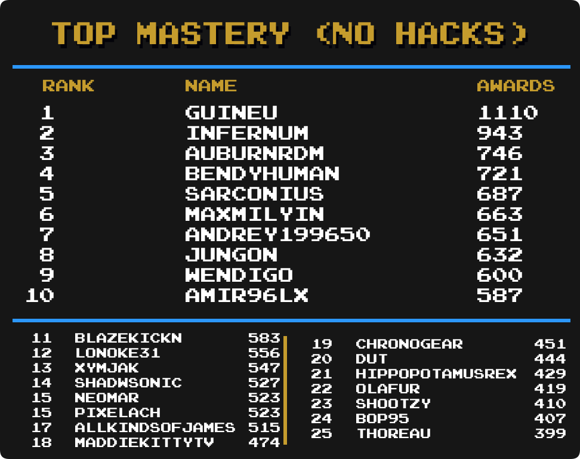

*  remains in 1st with 1134 total mastery awards.
*  has moved up 1 spot and is in 10th place.
*  has moved up 1 spot and is in 11th place.
*  has moved up 6 spots and is in 13th place.
*  has moved up 1 spot and is in 14th place.
*  has made it into the top 25 and is tied for 22nd place.

### Event Awards

  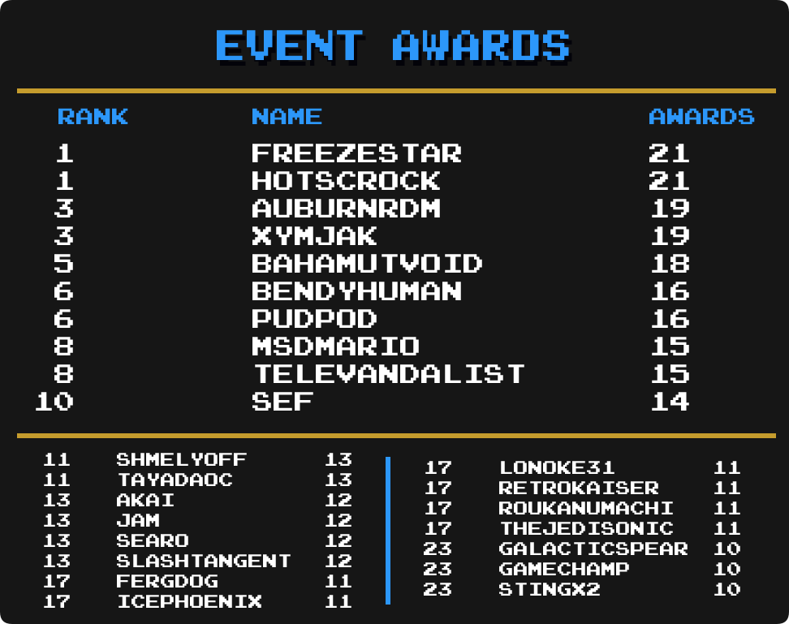

*  &  remain in 1st with 21 total mastery awards.
*  has moved up 3 spots and is in a 4-way tie for 13th place.

### Site Awards

  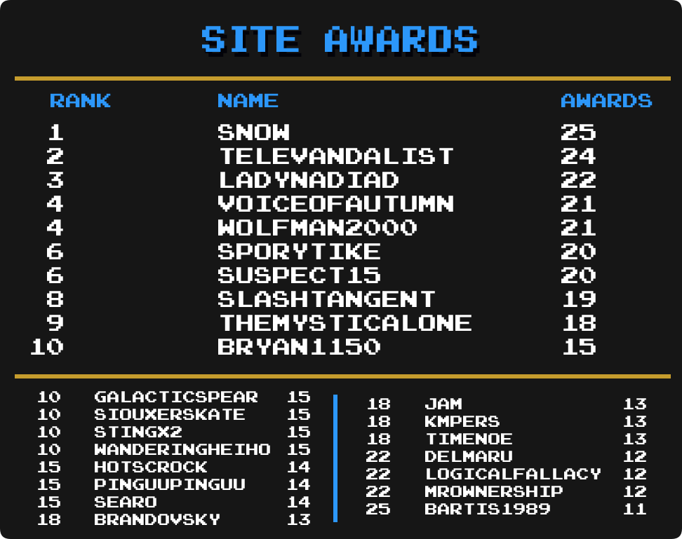

*  remains in 1st with 16 total mastery awards.
*  has moved up 8 spots and is in a 9-way tie for 11th place.

### Amstrad CPC

  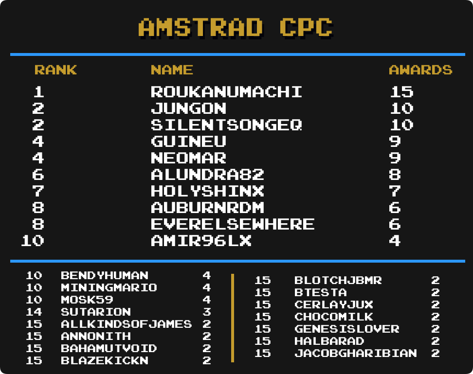

*  remains in 1st with 15 total mastery awards.
*  has moved up 2 spots and is tied for 2nd place.
*  has moved up 1 spot and is in a 4-way tie for 10th place.
*  has made it into the top 25 and is in 14th place.
*  has made it into the top 25 and is in a 23-way tie for 15th place.
*  has made it into the top 25 and is in a 23-way tie for 15th place.
*  has made it into the top 25 and is in a 23-way tie for 15th place.

### Apple II

  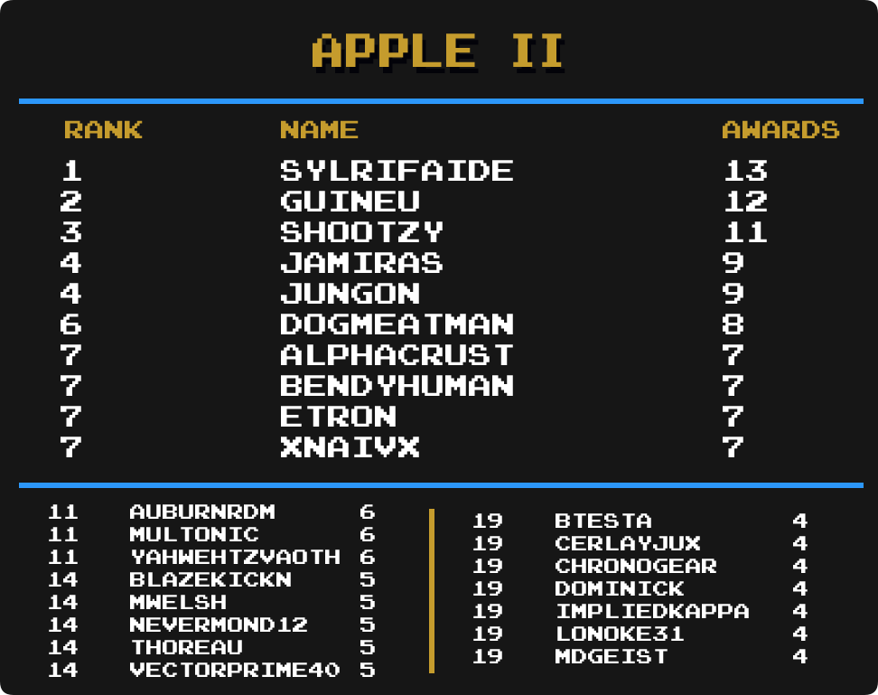

*  remains in 1st with 13 total mastery awards.

### Arcade

  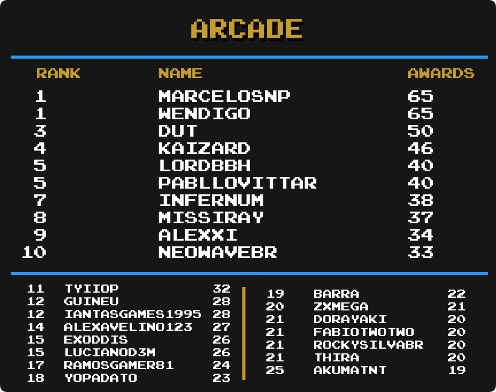

*  remains in 1st with 65 total mastery awards.
*  has moved up 2 spots and is in 4th place.
*  has moved up 5 spots and is tied for 5th place.
*  has moved up 2 spots and is tied for 12th place.
*  has moved up 1 spot and is tied for 15th place.
*  has moved up 4 spots and is in 20th place.
*  has made it into the top 25 and is in a 4-way tie for 21st place.
*  has made it into the top 25 and is in a 4-way tie for 25th place.

### Arduboy

  

*  remains in 1st with 43 total mastery awards.
*  has moved up 1 spot and is in 3rd place.
*  has moved up 2 spots and is tied for 7th place.
*  has moved up 4 spots and is in a 3-way tie for 10th place.
*  has made it into the top 25 and is tied for 17th place.
*  has moved up 1 spot and is in a 3-way tie for 19th place.

### Atari 2600

  

*  has taken 1st place with 119 total mastery awards.
*  has moved up 6 spots and is in 8th place.
*  has made it into the top 25 and is tied for 14th place.
*  has moved up 2 spots and is in a 3-way tie for 17th place.

### Dreamcast

  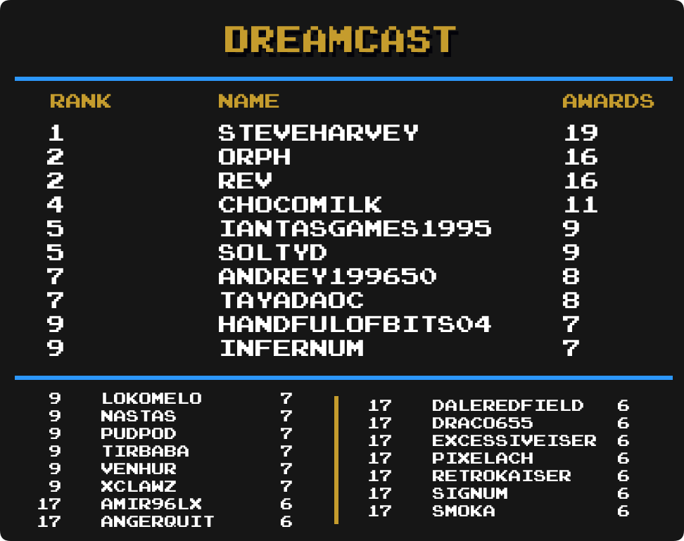

*  remains in 1st with 19 total mastery awards.
*  has moved up 1 spot and is tied for 7th place.
*  has made it into the top 25 and is in a 10-way tie for 17th place.

### Fairchild Channel F

  

*  has taken 1st place with 27 total mastery awards.
*  has made it into the top 25 and is in 8th place.
*  has made it into the top 25 and is in 10th place.
*  has made it into the top 25 and is tied for 18th place.

### Game Boy

  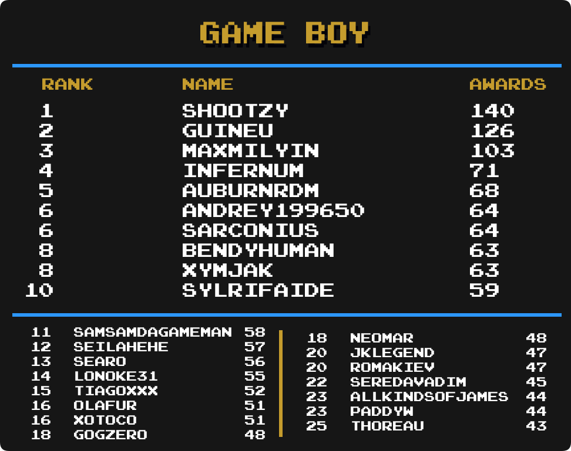

*  remains in 1st with 140 total mastery awards.
*  has moved up 2 spots and is tied for 6th place.
*  has moved up 1 spot and is in 14th place.
*  has moved up 3 spots and is tied for 18th place.
*  has made it into the top 25 and is tied for 23rd place.
*  has moved up 1 spot and is tied for 23rd place.

### Game Boy Advance

  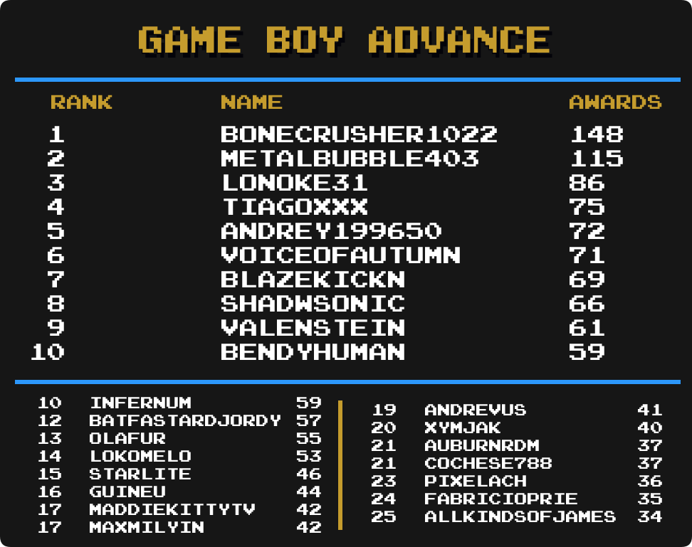

*  remains in 1st with 148 total mastery awards.
*  has moved up 1 spot and is in 4th place.
*  has moved up 1 spot and is tied for 10th place.
*  has moved up 1 spot and is tied for 17th place.
*  has moved up 1 spot and is in 23rd place.
*  has made it into the top 25 and is in a 3-way tie for 25th place.

### Game Boy Color

  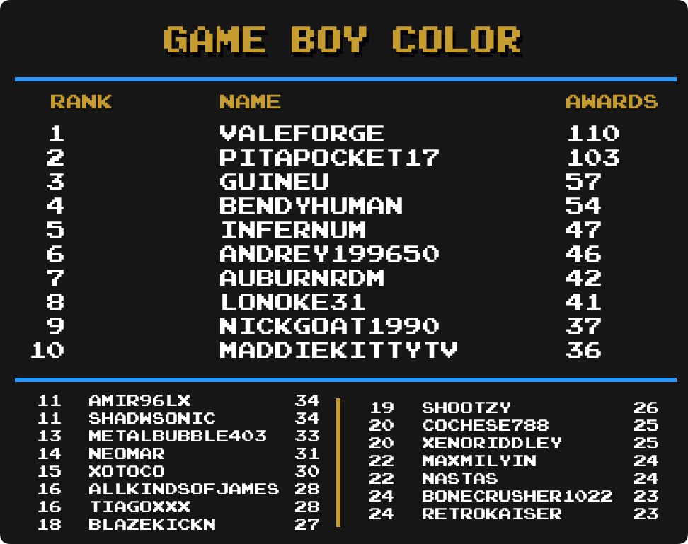

*  remains in 1st with 110 total mastery awards.
*  has moved up 3 spots and is in 8th place.
*  has moved up 2 spots and is tied for 11th place.
*  has moved up 3 spots and is in 14th place.
*  has moved up 4 spots and is in 19th place.
*  has made it into the top 25 and is tied for 24th place.

### Game Gear

  

*  remains in 1st with 75 total mastery awards.
*  has moved up 1 spot and is tied for 8th place.
*  has moved up 2 spots and is in a 3-way tie for 15th place.
*  has made it into the top 25 and is in a 3-way tie for 20th place.

### Hack Champ

  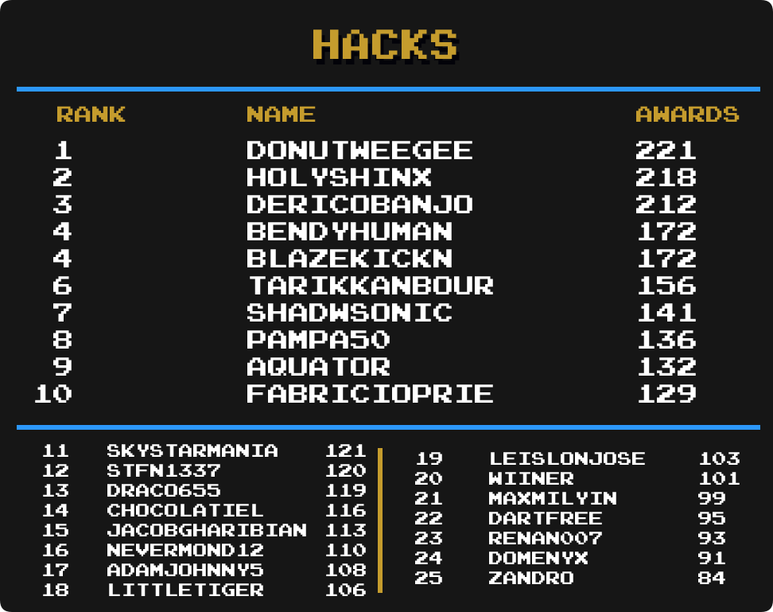

*  has taken 1st place with 221 total mastery awards.
*  has moved up 7 spots and is in 17th place.
*  has made it into the top 25 and is in 25th place.

### Homebrew Champ

  

*  remains in 1st with 224 total mastery awards.
*  has moved up 5 spots and is in 4th place.
*  has moved up 2 spots and is in 11th place.
*  has moved up 1 spot and is in 15th place.
*  has made it into the top 25 and is in 23rd place.
*  has made it into the top 25 and is tied for 24th place.

### Master System

  

*  remains in 1st with 90 total mastery awards.
*  has moved up 1 spot and is in 4th place.
*  has moved up 1 spot and is tied for 10th place.
*  has moved up 4 spots and is in a 5-way tie for 14th place.
*  has moved up 2 spots and is in a 4-way tie for 22nd place.
*  has moved up 1 spot and is in a 4-way tie for 22nd place.
*  has made it into the top 25 and is in a 4-way tie for 22nd place.

### Mega Drive

  

*  remains in 1st with 133 total mastery awards.
*  has moved up 1 spot and is in 9th place.
*  has made it into the top 25 and is in a 5-way tie for 21st place.

### Mega Duck

  

*  remains in 1st with 12 total mastery awards.
*  has moved up 9 spots and is tied for 5th place.
*  has moved up 1 spot and is in a 4-way tie for 7th place.
*  has moved up 4 spots and is in a 6-way tie for 11th place.
*  has moved up 5 spots and is in a 6-way tie for 11th place.
*  has made it into the top 25 and is in a 12-way tie for 17th place.
*  has made it into the top 25 and is in a 12-way tie for 17th place.
*  has made it into the top 25 and is in a 12-way tie for 17th place.

### Nintendo 64

  

*  remains in 1st with 60 total mastery awards.
*  has moved up 5 spots and is in a 5-way tie for 19th place.

### NES

  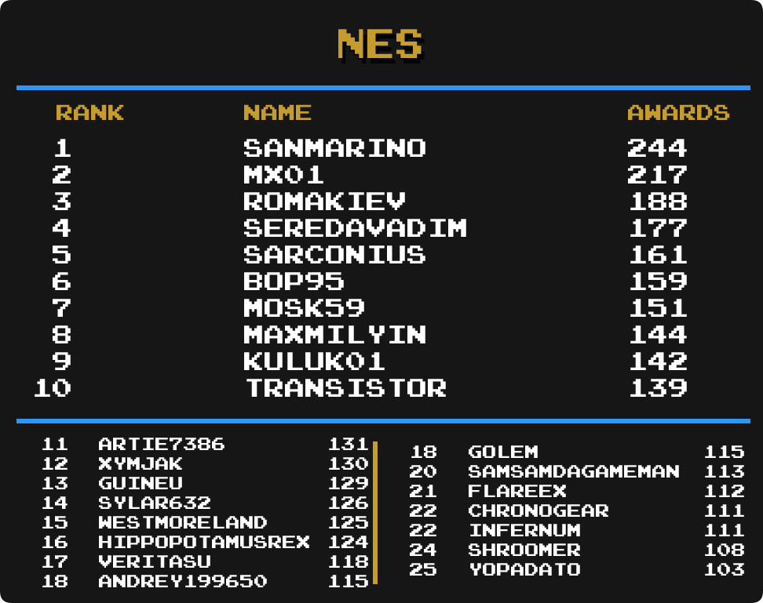

*  remains in 1st with 244 total mastery awards.
*  has moved up 1 spot and is in 15th place.
*  has moved up 2 spots and is tied for 22nd place.

### Nintendo DS

  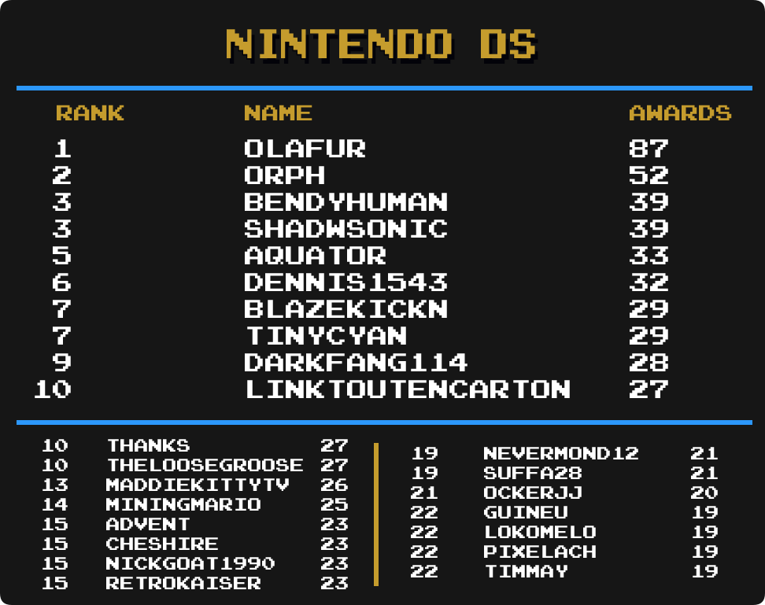

*  remains in 1st with 87 total mastery awards.
*  has moved up 1 spot and is tied for 7th place.
*  has moved up 4 spots and is in 9th place.
*  has moved up 2 spots and is in a 4-way tie for 15th place.
*  has moved up 1 spot and is in a 4-way tie for 15th place.
*  has made it into the top 25 and is in a 4-way tie for 22nd place.

### Nintendo DSi

  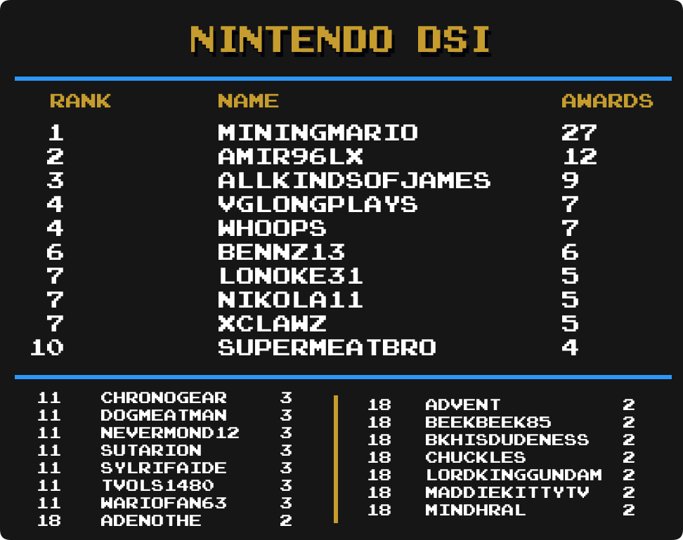

*  remains in 1st with 27 total mastery awards.
*  has moved up 1 spot and is tied for 4th place.
*  has moved up 1 spot and is tied for 4th place.
*  has made it into the top 25 and is in a 3-way tie for 7th place.
*  has moved up 11 spot and is in a 7-way tie for 11th place.
*  has made it into the top 25 and is in a 7-way tie for 11th place.
*  has made it into the top 25 and is in a 7-way tie for 11th place.

### PC Engine

  

*  remains in 1st with 36 total mastery awards.
*  has moved up 3 spots and is in a 3-way tie for 6th place.
*  has moved up 1 spot and is in a 3-way tie for 9th place.
*  has made it into the top 25 and is in a 8-way tie for 19th place.

### PC Engine CD

  

*  has moved into a tie for 1st place with .

### PC-8000/8800

  

*  remains in 1st with 14 total mastery awards.
*  has moved up 2 spots and is tied for 6th place.
*  has moved up 5 spots and is in a 6-way tie for 10th place.

### PlayStation

  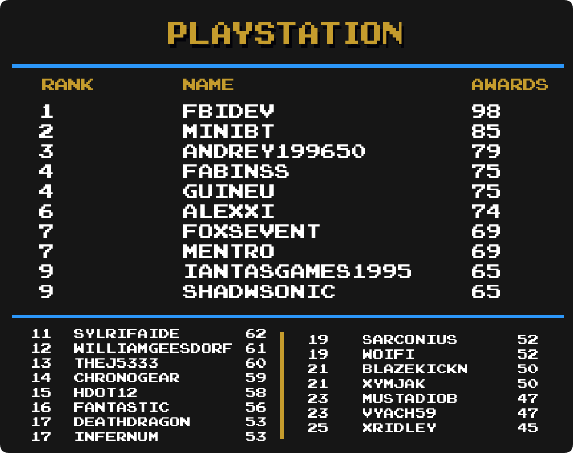

*  remains in 1st with 98 total mastery awards.
*  has moved up 1 spot and is tied for 7th place.
*  has moved up 1 spot and is tied for 9th place.
*  has moved up 2 spots and is tied for 17th place.
*  has moved up 1 spot and is tied for 19th place.

### PlayStation 2

  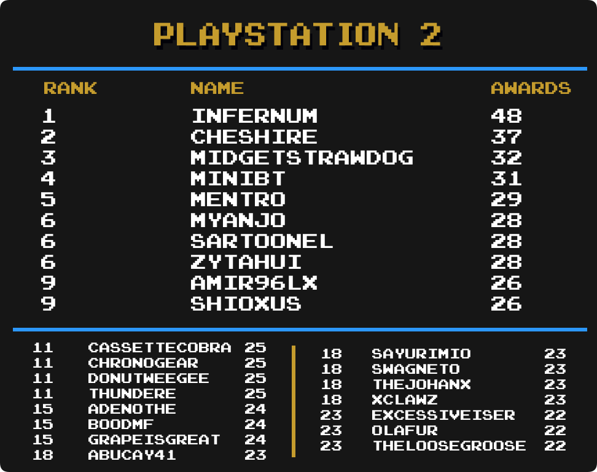

*  remains in 1st with 48 total mastery awards.
*  has moved up 1 spot and is in 3rd place.
*  has moved up 3 spots and is in 5th place.
*  has moved up 1 spot and is tied for 9th place.
*  has moved up 3 spots and is in a 4-way tie for 11th place.
*  has moved up 4 spots and is in a 4-way tie for 11th place.
*  has moved up 7 spots and is in a 3-way tie for 15th place.
*  has moved up 3 spots and is in a 5-way tie for 18th place.
*  has made it into the top 25 and is in a 3-way tie for 23rd place.

### PlayStation Portable

  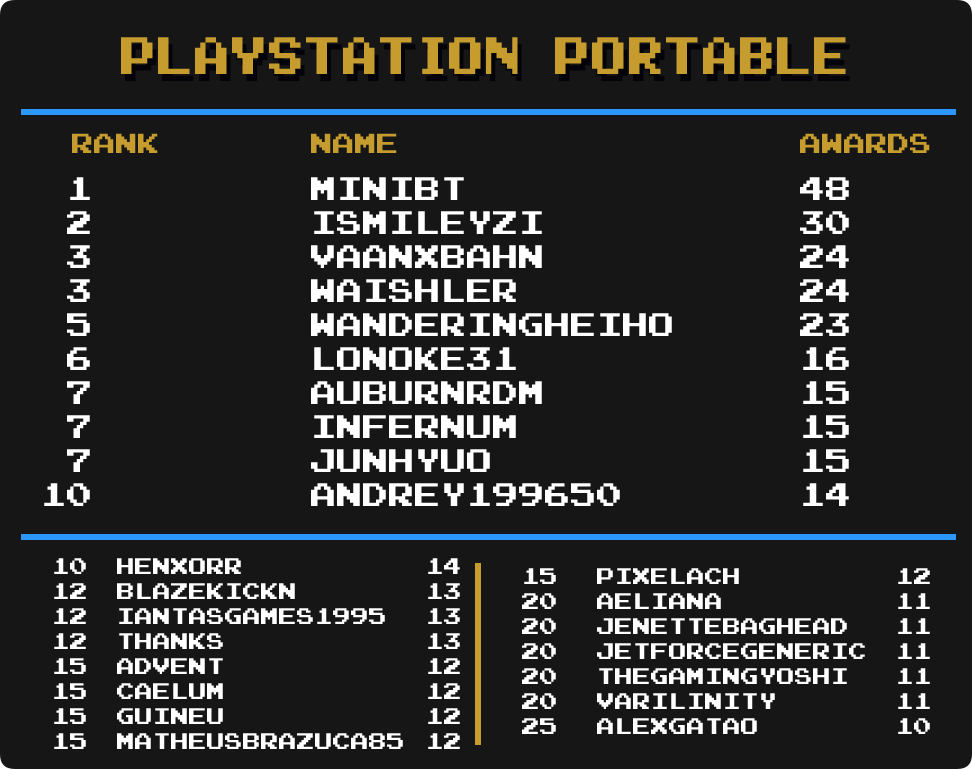

*  remains in 1st with 48 total mastery awards.
*  has moved up 2 spots and is in a 3-way tie for 7th place.
*  has moved up 1 spot and is tied for 10th place.
*  has moved up 2 spots and is in a 3-way tie for 12th place.
*  has moved up 7 spots and is in a 5-way tie for 15th place.
*  has moved up 3 spots and is in a 5-way tie for 15th place.
*  has made it into the top 25 and is in a 5-way tie for 20th place.
*  has made it into the top 25 and is in a 5-way tie for 20th place.

### Pokémon Mini

  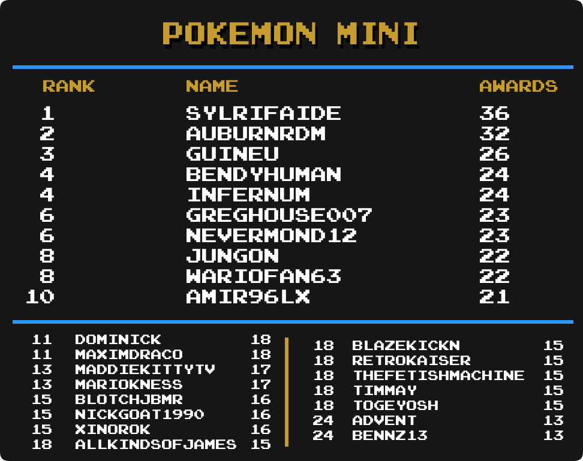

*  remains in 1st with 36 total mastery awards.
*  has moved up 1 spot and is in a 6-way tie for 18th place.

### Sega Saturn

  

*  remains in 1st with 16 total mastery awards.
*  has moved up 8 spots and is in a 9-way tie for 11th place.

### Sega CD

  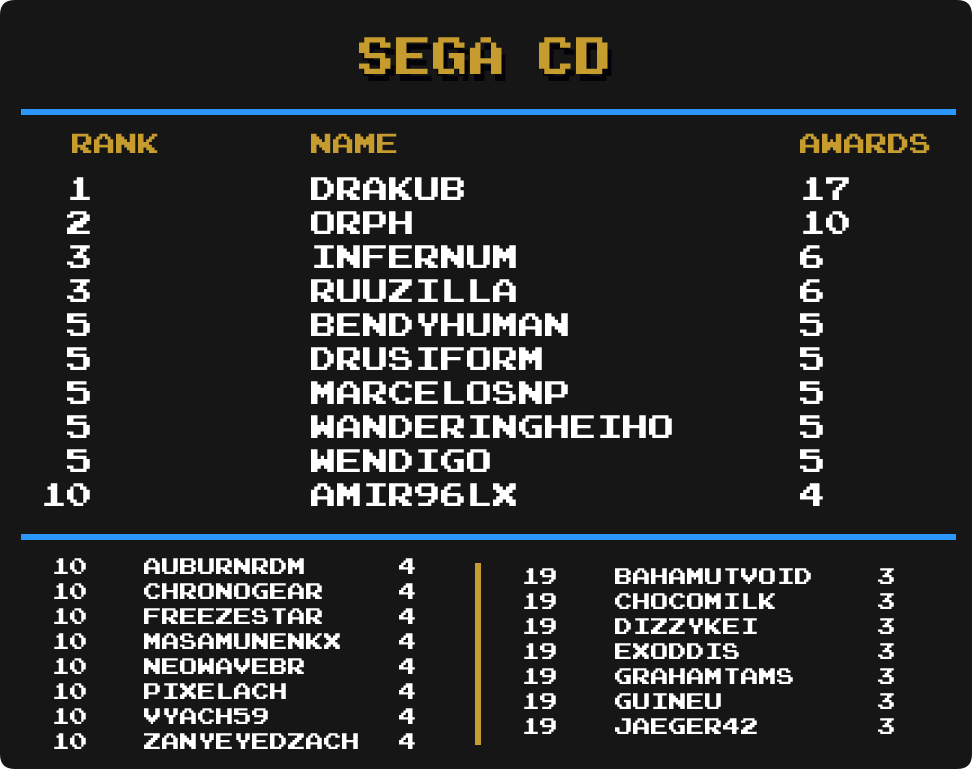

*  remains in 1st with 17 total mastery awards.
*  has moved up 7 spots and is in a 5-way tie for 5th place.
*  has made it into the top 25 and is in a 9-way tie for 10th place.
*  has made it into the top 25 and is in a 9-way tie for 10th place.

### SNES

  

*  remains in 1st with 222 total mastery awards.
*  has moved up 1 spot and is in 8th place.
*  has moved up 1 spot and is in 17th place.
*  has made it into the top 25 and is tied for 19th place.

### Virtual Boy

  

*  remains in 1st with 17 total mastery awards.
*  has moved up 2 spots and is in a 3-way tie for 6th place.
*  has moved up 4 spots and is in a 6-way tie for 14th place.
*  has made it into the top 25 and is in a 6-way tie for 14th place.
*  has made it into the top 25 and is in a 19-way tie for 20th place.
*  has made it into the top 25 and is in a 19-way tie for 20th place.

### WASM-4

  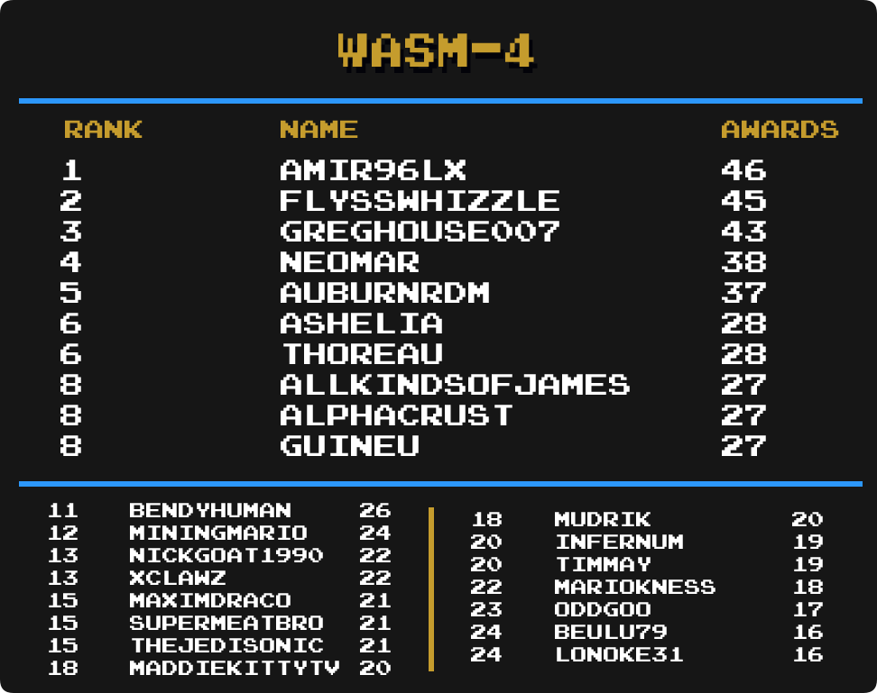

*  remains in 1st with 46 total mastery awards.
*  has made it into the top 25 and is tied for 6th place.
*  has moved up 2 spots and is in a 3-way tie for 8th place.
*  has moved up 3 spots and is in 12th place.
*  has moved up 9 spots and is tied for 13th place.
*  has made it into the top 25 and is tied for 13th place.

### Watara Supervision

  

*  remains in 1st with 47 total mastery awards.
*  has moved up 1 spot and is tied for 13th place.
*  has moved up 1 spot and is tied for 18th place.
