## Intro

We are going to take a look at another metric for greatness, Mastery Awards. Mastery awards are given to users when they complete every achievement for a given set in hardcore mode. Users wear mastery awards as a badge of honor on their profile page representing all the hard work they put into truly becoming a master of the game.

Below we will take a look at which users rank among the best with the most mastery awards in several categories well as notable updates from the previous month to each individual category. Check to see how you rank among the rest of the community members.

Special thanks to  for creating the ranking image templates.

\* Data as of August 1st 2023.

 

## Current Champions

<table>
    <tr style="text-align: left;"><th>:joystick: Category</th><th>:trophy: Champions</th><th>Mastery Awards</th></tr>
    <tr><td>
            
Total Awards

</td>               <td></td>                                 <td>1140</td><td><!--     --></td></tr>
    <tr><td>
            
Event Awards

</td>               <td></td>                             <td>22</td><td><!-- 101 --></td></tr>
    <tr><td>
            
Site Awards

</td>                <td> </td>  <td>25</td><td><!-- 101 --></td></tr>
    <tr><td>
            
Hacks

</td>                      <td></td>                            <td>233</td><td><!--     --></td></tr>
    <tr><td>
            
Homebrews

</td>                  <td></td>                              <td>225</td><td><!--     --></td></tr>
    <tr><td>
            
Subsets

</td>                    <td></td>                            <td>28</td><td><!--     --></td></tr>
    <tr><td>
            
3DO Interactive Multiplayer

</td><td> </td>      <td>12</td><td><!-- 43  --></td></tr>
    <tr><td>
            
Amstrad CPC

</td>                <td></td>                           <td>15</td><td><!-- 37  --></td></tr>
    <tr><td>
       
Apple II

</td>                   <td></td>                             <td>13</td><td><!-- 38  --></td></tr>
    <tr><td>
         
Arcade

</td>                     <td> </td>  <td>65</td><td><!-- 27  --></td></tr>
    <tr><td>
    
Arcadia 2001

</td>               <td></td>                           <td>17</td><td><!-- 73  --></td></tr>
    <tr><td>
        
Arduboy

</td>                    <td></td>                             <td>44</td><td><!-- 71  --></td></tr>
    <tr><td>
           
Atari 2600

</td>                 <td></td>                                 <td>119</td><td><!-- 25  --></td></tr>
    <tr><td>
           
Atari 7800

</td>                 <td></td>                                 <td>19</td><td><!-- 51  --></td></tr>
    <tr><td>
         
Atari Jaguar

</td>               <td></td>                                 <td>9</td><td><!-- 17  --></td></tr>
    <tr><td>
      
Atari Jaguar CD

</td>            <td></td>                           <td>8</td><td><!-- 71  --></td></tr>
    <tr><td>
           
Atari Lynx

</td>                 <td> </td>       <td>8</td><td><!-- 13  --></td></tr>
    <tr><td>
   
ColecoVision

</td>               <td></td>                                 <td>17</td><td><!-- 44  --></td></tr>
    <tr><td>
      
Dreamcast

</td>                  <td></td>                            <td>19</td><td><!-- 40  --></td></tr>
    <tr><td>
           
Elektor TV Games Computer

</td>  <td></td>                           <td>21</td><td><!-- 75  --></td></tr>
    <tr><td>
      
Fairchild Channel F

</td>        <td></td>                               <td>28</td><td><!-- 57  --></td></tr>
    <tr><td>
             
Game Boy

</td>                   <td></td>                                <td>141</td><td><!-- 4   --></td></tr>
    <tr><td>
            
Game Boy Advance

</td>           <td></td>                        <td>154</td><td><!-- 5   --></td></tr>
    <tr><td>
            
Game Boy Color

</td>             <td></td>                              <td>111</td><td><!-- 6   --></td></tr>
    <tr><td>
             
Game Gear

</td>                  <td></td>                                 <td>76</td><td><!-- 15  --></td></tr>
    <tr><td>
  
Intellivision

</td>              <td></td>                                 <td>20</td><td><!-- 45  --></td></tr>
    <tr><td>

Interton VC 4000

</td>           <td></td>                           <td>15</td><td><!-- 74  --></td></tr>
    <tr><td>
       
Magnavox Odyssey 2

</td>         <td></td>                                 <td>14</td><td><!-- 23  --></td></tr>
    <tr><td>
  
Master System

</td>              <td></td>                                 <td>92</td><td><!-- 11  --></td></tr>
    <tr><td>
             
Mega Drive

</td>                 <td></td>                                    <td>133</td><td><!-- 1   --></td></tr>
    <tr><td>
      
Mega Duck

</td>                  <td></td>                           <td>12</td><td><!-- 69  --></td></tr>
    <tr><td>
            
MSX

</td>                        <td></td>                                 <td>14</td><td><!-- 29  --></td></tr>
    <tr><td>
            
Nintendo 64

</td>                <td></td>                             <td>36</td><td><!-- 2   --></td></tr>
    <tr><td>
            
Neo Geo Pocket

</td>             <td></td>                              <td>13</td><td><!-- 14  --></td></tr>
    <tr><td>
            
NES

</td>                        <td></td>                              <td>244</td><td><!-- 7   --></td></tr>
    <tr><td>
             
Nintendo DS

</td>                <td></td>                                 <td>94</td><td><!-- 18  --></td></tr>
    <tr><td>
            
Nintendo DSi

</td>               <td></td>                            <td>27</td><td><!-- 78  --></td></tr>
    <tr><td>
            
PC Engine

</td>                  <td></td>                               <td>36</td><td><!-- 8   --></td></tr>
    <tr><td>
   
PC Engine CD

</td>               <td> </td>   <td>10</td><td><!-- 76  --></td></tr>
    <tr><td>
    
PC-8000/8800

</td>               <td></td>                                   <td>14</td><td><!-- 47  --></td></tr>
    <tr><td>
          
PC-FX

</td>                      <td></td>                                 <td>7</td><td><!-- 49  --></td></tr>
    <tr><td>
            
PlayStation

</td>                <td></td>                                 <td>103</td><td><!-- 12  --></td></tr>
    <tr><td>
            
PlayStation 2

</td>              <td></td>                               <td>54</td><td><!-- 21  --></td></tr>
    <tr><td>
            
PlayStation Portable

</td>       <td></td>                                 <td>52</td><td><!-- 41  --></td></tr>
    <tr><td>
   
Pokémon Mini

</td>               <td></td>                             <td>36</td><td><!-- 24  --></td></tr>
    <tr><td>
            
Sega 32X

</td>                   <td></td>                                <td>5</td><td><!-- 10  --></td></tr>
    <tr><td>
         
Sega Saturn

</td>                <td></td>                                   <td>16</td><td><!-- 39  --></td></tr>
    <tr><td>
            
Sega CD

</td>                    <td></td>                                 <td>17</td><td><!-- 9   --></td></tr>
    <tr><td>
        
SG-1000

</td>                    <td></td>                                 <td>15</td><td><!-- 33  --></td></tr>
    <tr><td>
           
SNES

</td>                       <td></td>                              <td>222</td><td><!-- 3   --></td></tr>
    <tr><td>
        
Vectrex

</td>                    <td></td>                                 <td>13</td><td><!-- 46  --></td></tr>
    <tr><td>
    
Virtual Boy

</td>                <td></td>                                 <td>17</td><td><!-- 28  --></td></tr>
    <tr><td>
         
WASM-4

</td>                     <td></td>                               <td>49</td><td><!-- 72  --></td></tr>
    <tr><td>
    
Watara Supervision

</td>         <td></td>                           <td>47</td><td><!-- 63  --></td></tr>
    <tr><td>
     
WonderSwan

</td>                 <td></td>                                <td>5</td><td><!-- 53  --></td></tr>
</table>

## Notable Milestones

### 900 Mastery Awards

||||

### 800 Mastery Awards

||||

### 600 Mastery Awards

||||

### 400 Mastery Awards

||||

### 300 Mastery Awards

||||
||||

### 200 Mastery Awards

||||
||||
||||

### 100 Mastery Awards

||||
||||
||||
||||
|||

## Category Rankings

### Total Awards

  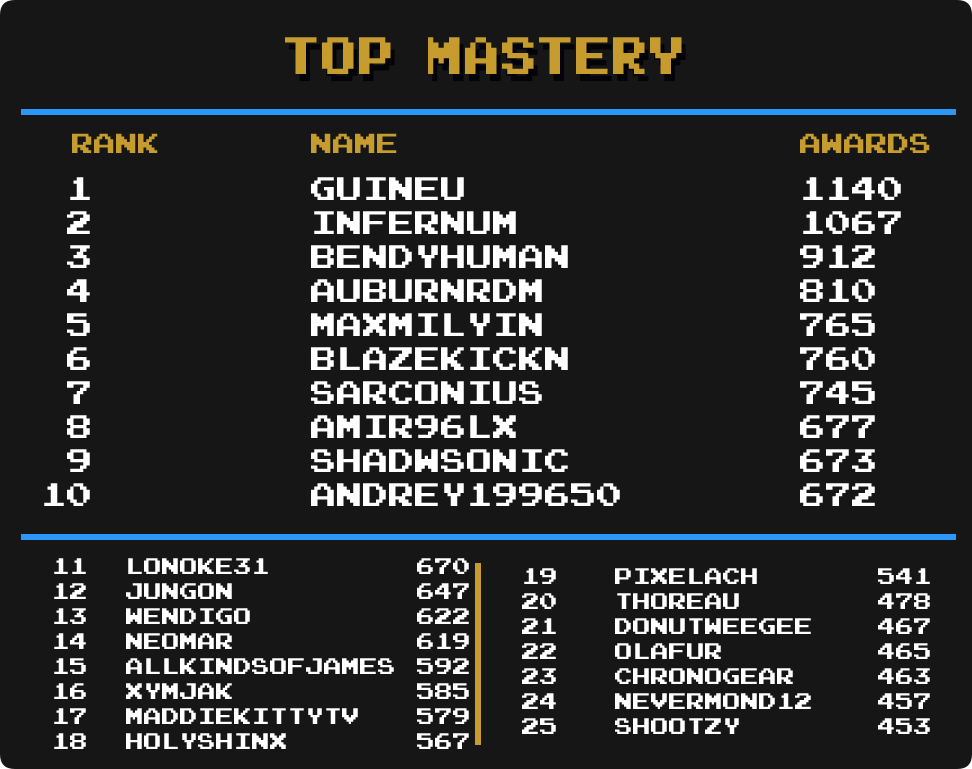

*  remains in 1st with 1140 total mastery awards.
*  has moved up 5 spots and is in 8th place.
*  has moved up 3 spots and is in 15th place.
*  has moved up 4 spots and is in 21st place.
*  has made it into the top 25 and is in 24th place.
*  has made it into the top 25 and is in 25th place.

### Total Awards (Excluding Hacks)

  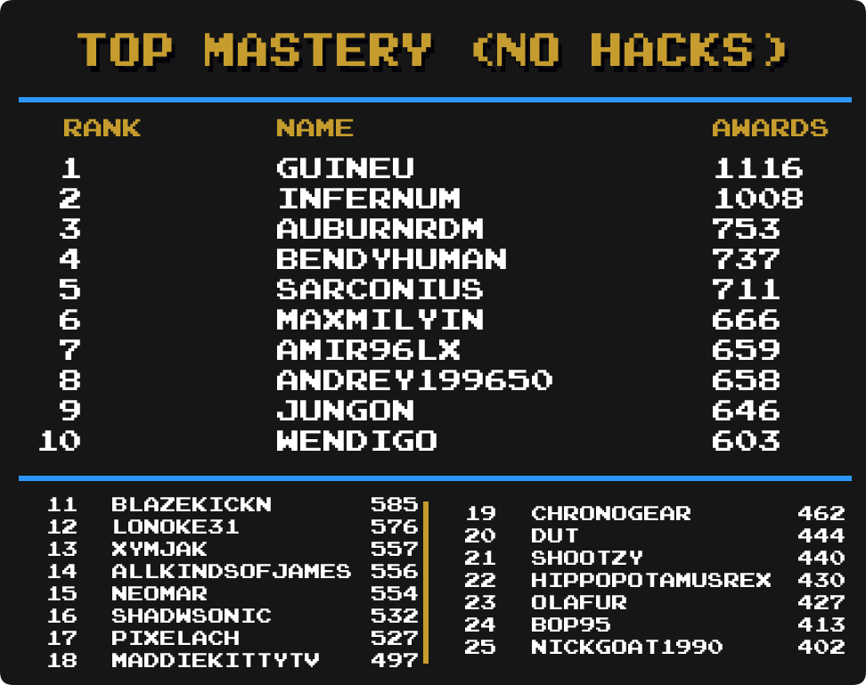

*  remains in 1st with 1116 total mastery awards.
*  has moved up 3 spots and is in 7th place.
*  has moved up 3 spots and is in 14th place.
*  has moved up 2 spots and is in 21st place.
*  has made it into the top 25 and is tied for 25th place.

### Event Awards

  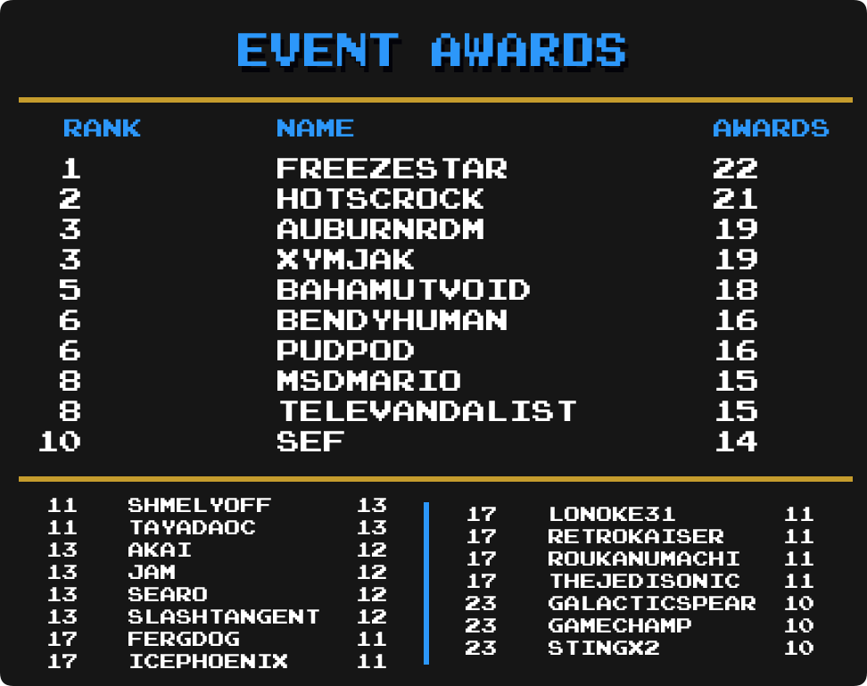

*  remains in 1st with 22 total mastery awards.

### Site Awards

  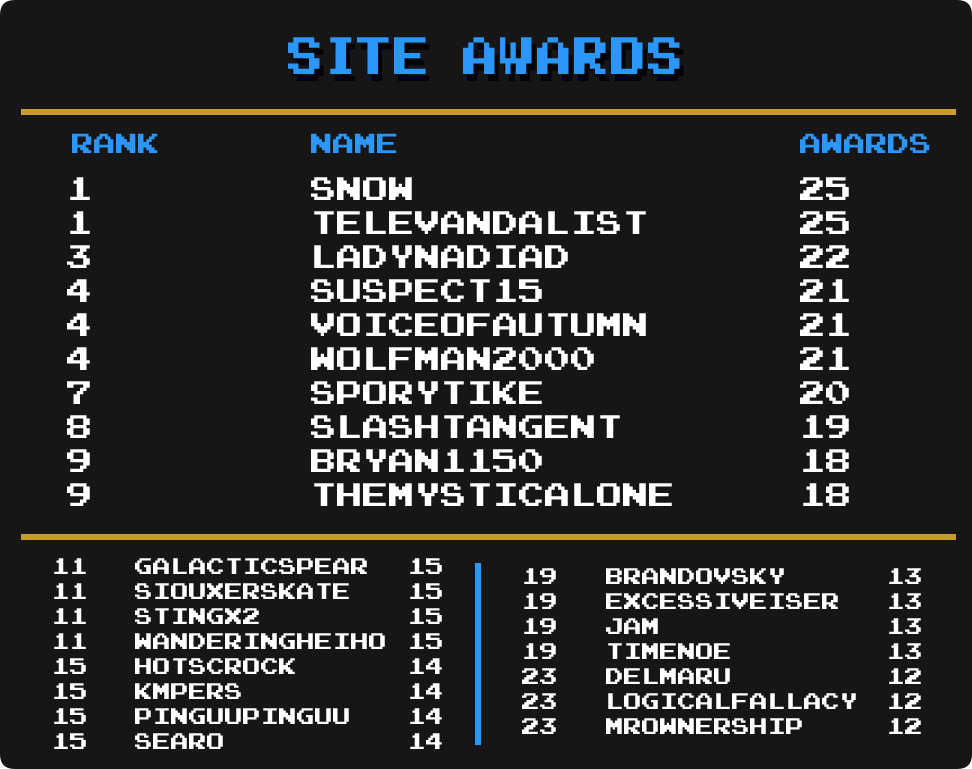

*  &  are tied in 1st with 25 total mastery awards.
*  has moved up 3 spots and is in a 3-way tie for 4th place.
*  has moved up 1 spot and is tied for 9th place.
*  has moved up 4 spots and is in a 4-way tie for 15th place.
*  has made it into the top 25 and is in a 4-way tie for 19th place.

### Hack Awards

  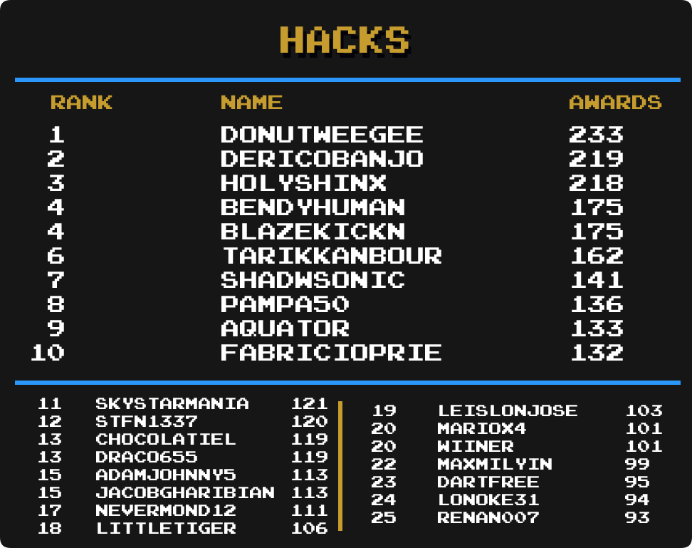

*  remains in 1st with 233 total mastery awards.
*  has moved up 1 spot and is in 2nd place.
*  has moved up 1 spot and is tied for 13rd place.
*  has moved up 2 spots and is tied for 15th place.
*  has made it into the top 25 and is tied for 20th place.
*  has made it into the top 25 and is in 24th place.

### Homebrew Awards

  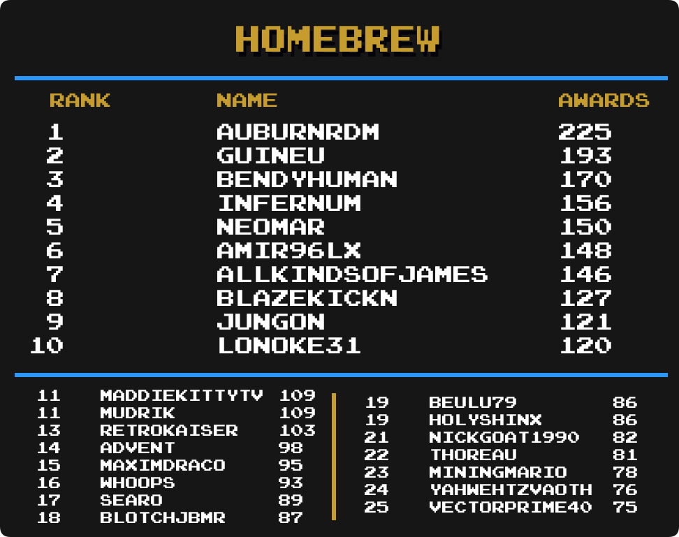

*  remains in 1st with 225 total mastery awards.
*  has moved up 2 spots and is in 4th place.
*  has moved up 1 spot and is tied for 11st place.
*  has moved up 1 spot and is in 14th place.
*  has moved up 7 spots and is in 16th place.
*  has moved up 1 spot and is in 18th place.
*  has moved up 1 spot and is in 23rd place.

### Subset Awards

  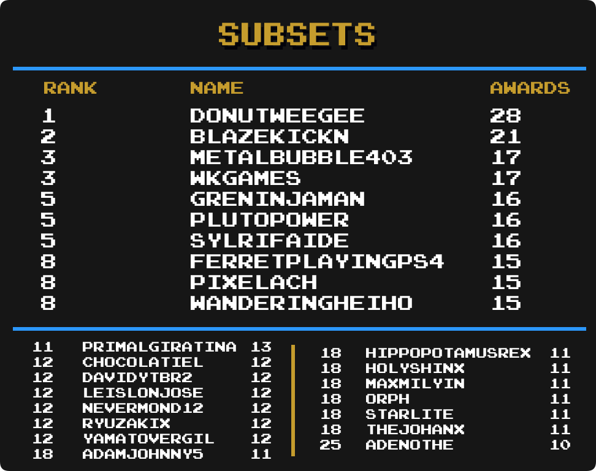

*  is in 1st place with 28 total mastery awards.
*  is in 2nd place with 21 total mastery awards.
*  &  are tied for 3rd place with 17 total mastery awards.

---

### Amstrad CPC

  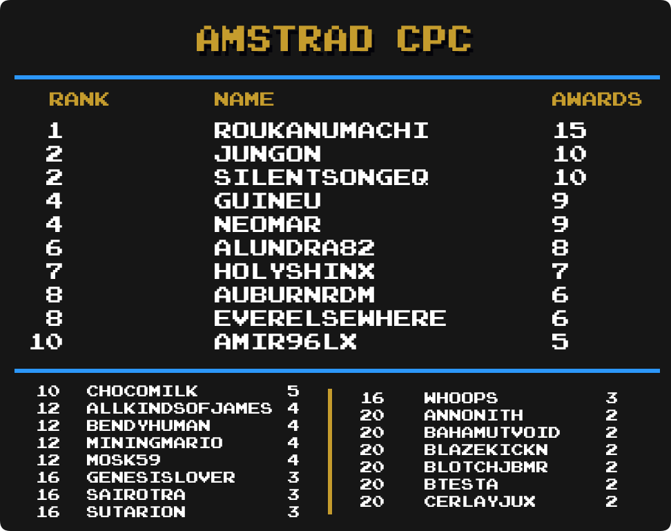

*  remains in 1st with 15 total mastery awards.
*  has moved up 11 spot and is tied for 10th place.
*  has moved up 3 spots and is in a 4-way tie for 12nd place.
*  has moved up 7 spots and is in a 4-way tie for 16th place.
*  has made it into the top 25 and is in a 4-way tie for 16th place.
*  has made it into the top 25 and is in a 4-way tie for 16th place.

### Apple II

  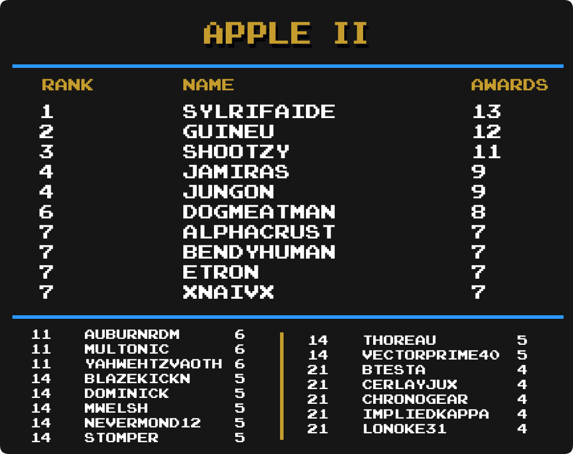

*  remains in 1st with 13 total mastery awards.
*  has moved up 7 spots and is in a 7-way tie for 14th place.
*  has made it into the top 25 and is in a 7-way tie for 14th place.

### Arcade

  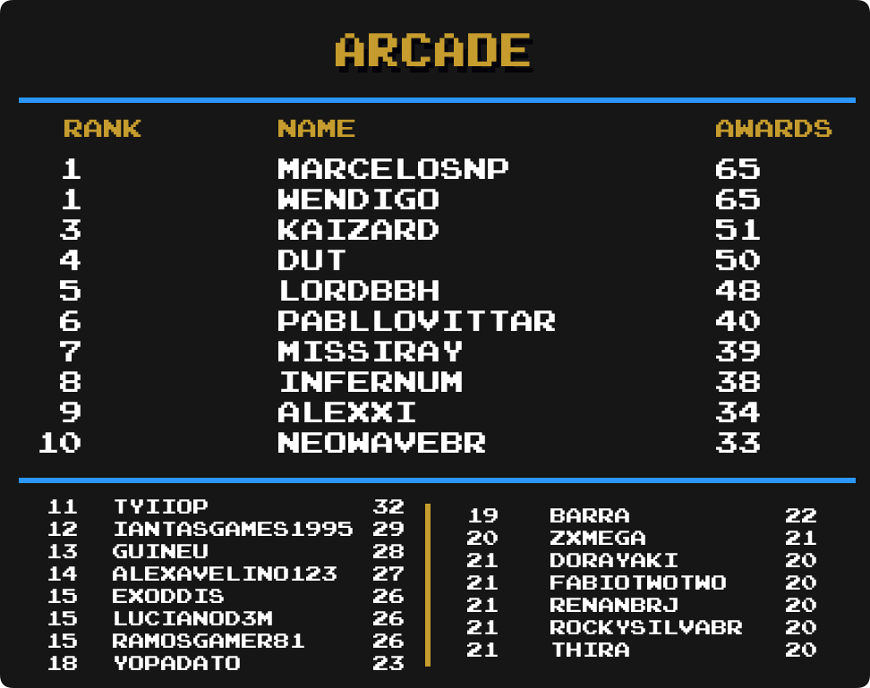

*  remains in 1st with 65 total mastery awards.
*  has moved up 1 spot and is in 3rd place.
*  has moved up 1 spot and is in 7th place.
*  has moved up 1 spot and is in 12nd place.
*  has made it into the top 25 and is in a 5-way tie for 21st place.

### Arcadia 2001

  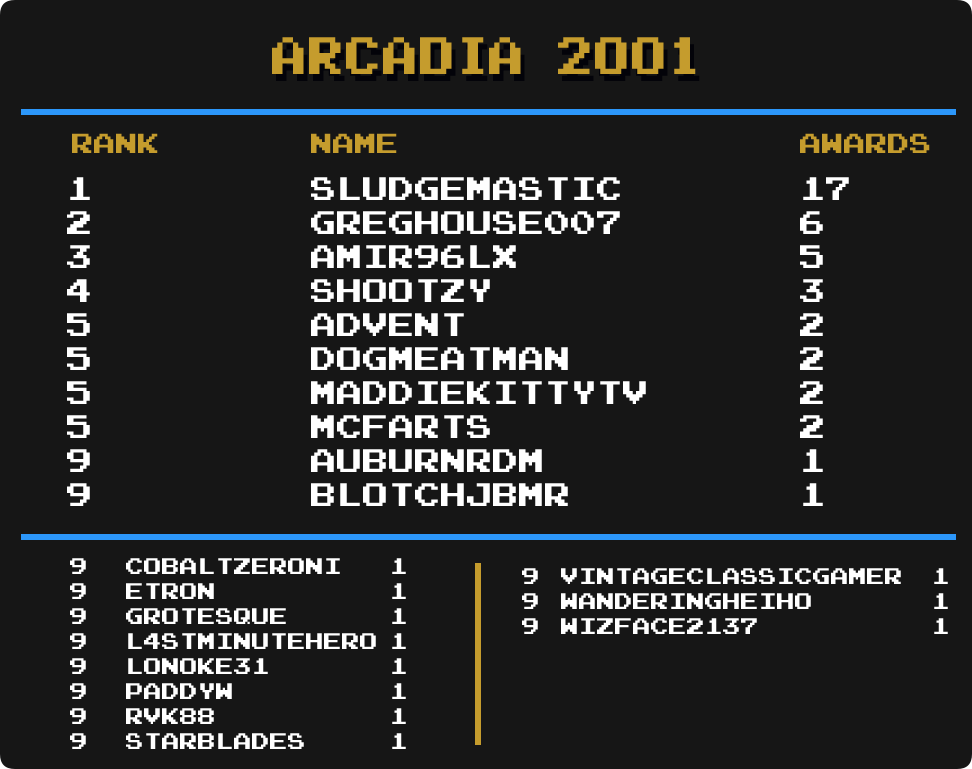

*  is in 1st place with 17 total mastery awards.
*  is in 2nd place with 6 total mastery awards.
*   is in 3rd place with 5 total mastery awards.

### Arduboy

  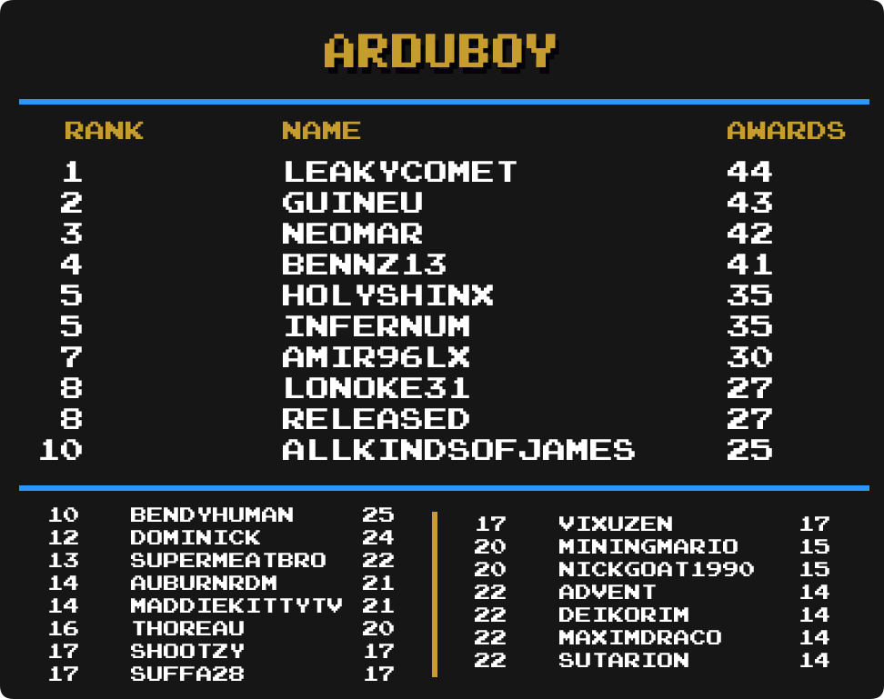

*  has taken 1st place with 44 total mastery awards.
*  has moved up 1 spot and is tied for 8th place.
*  has moved up 2 spots and is in 12nd place.
*  has moved up 4 spots and is in a 3-way tie for 17th place.
*  has made it into the top 25 and is tied for 20th place.
*  has made it into the top 25 and is tied for 20th place.
*  has made it into the top 25 and is in a 4-way tie for 22nd place.
*  has made it into the top 25 and is in a 4-way tie for 22nd place.

### Atari 2600

  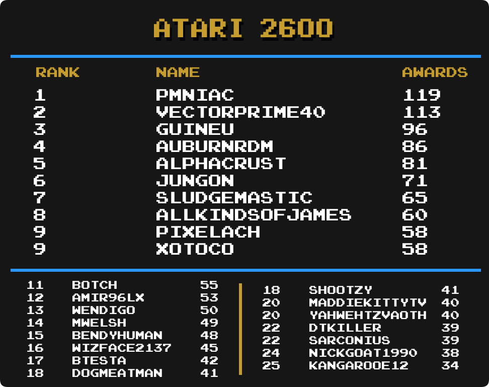

*  remains in 1st with 119 total mastery awards.
*  has moved up 2 spots and is in 12nd place.
*  has made it into the top 25 and is in 16th place.
*  has moved up 2 spots and is tied for 18th place.

### Dreamcast

  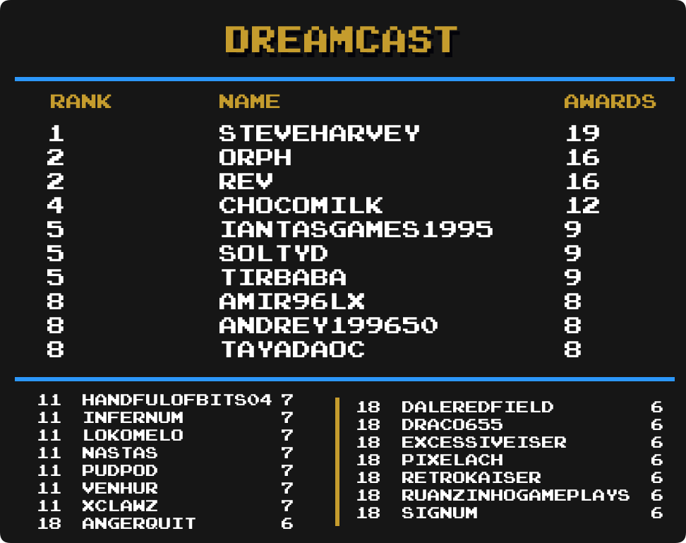

*  remains in 1st with 19 total mastery awards.
*  has moved up 7 spots and is in a 3-way tie for 5th place.
*  has moved up 9 spots and is in a 3-way tie for 8th place.
*  has made it into the top 25 and is in a 10-way tie for 18th place.

### Elektor TV Games Computer

  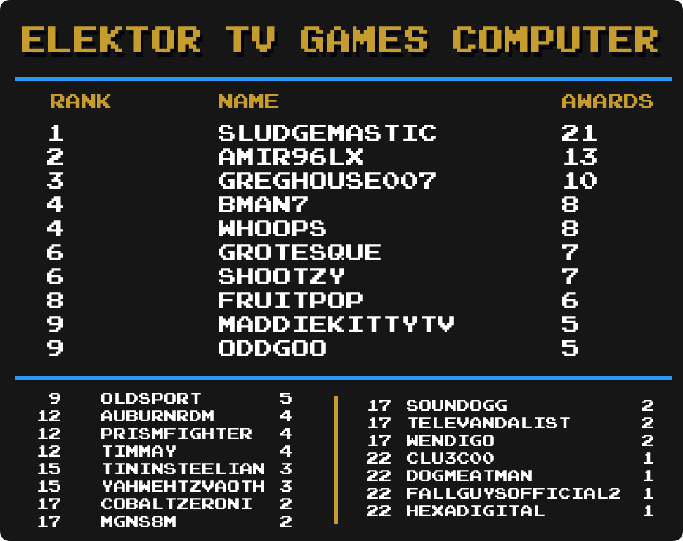

*  is in 1st place with 21 total mastery awards.
*  is in 2nd place with 13 total mastery awards.
*  is in 3rd place with 10 total mastery awards.

### Fairchild Channel F

  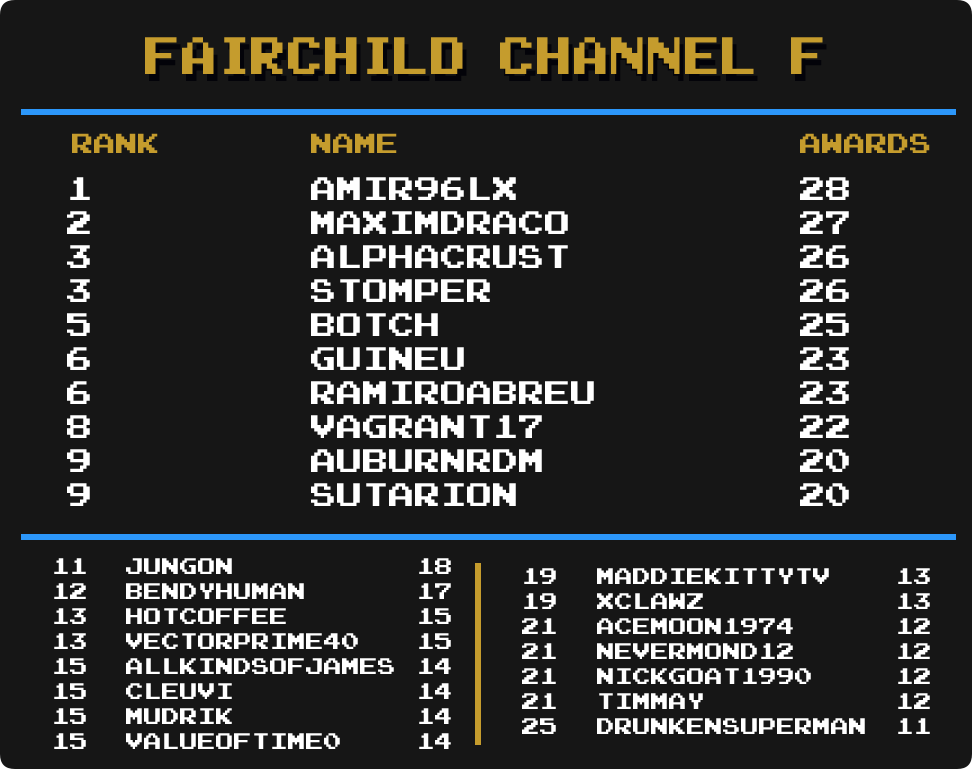

*  remains in 1st with 28 total mastery awards.
*  has moved up 1 spot and is tied for 3rd place.
*  has moved up 1 spot and is tied for 3rd place.
*  has moved up 1 spot and is in a 4-way tie for 15th place.
*  has moved up 2 spots and is tied for 19th place.
*  has made it into the top 25 and is in a 4-way tie for 21st place.
*  has made it into the top 25 and is in a 4-way tie for 25th place.

### Game Boy

  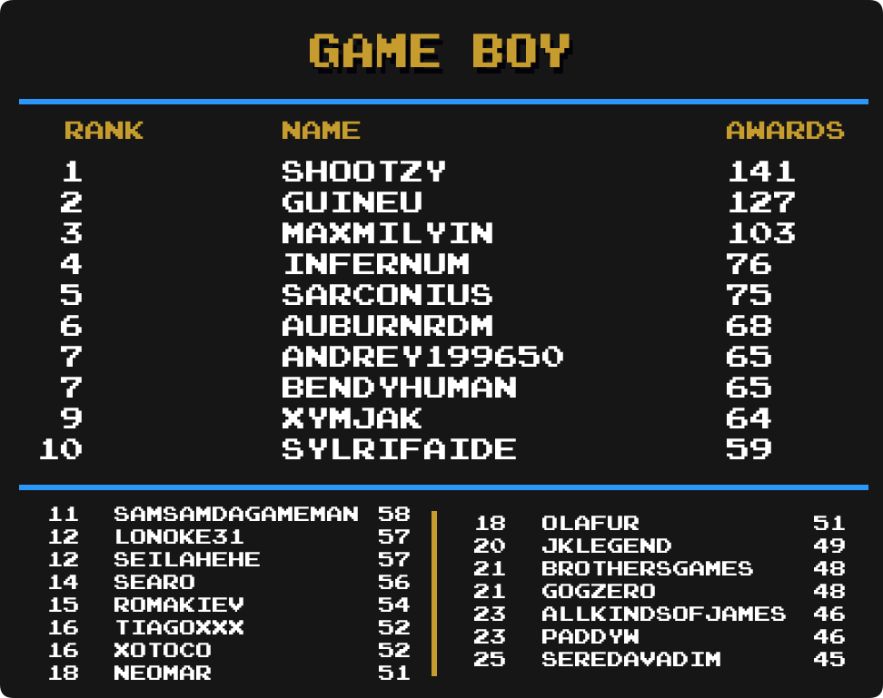

*  remains in 1st with 141 total mastery awards.
*  has moved up 2 spots and is in 5th place.
*  has moved up 2 spots and is tied for 12nd place.
*  has moved up 6 spots and is in 15th place.
*  has moved up 1 spot and is tied for 18th place.
*  has made it into the top 25 and is tied for 21st place.

### Game Boy Advance

  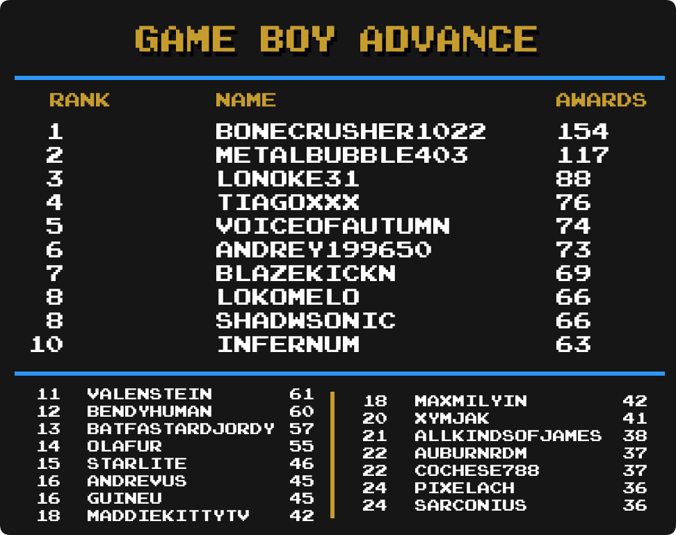

*  remains in 1st with 154 total mastery awards.
*  has moved up 1 spot and is in 5th place.
*  has moved up 6 spots and is tied for 8th place.
*  has moved up 1 spot and is in 10th place.
*  has moved up 3 spots and is tied for 16th place.
*  has moved up 4 spots and is in 21st place.
*  has made it into the top 25 and is tied for 24th place.

### Game Boy Color

  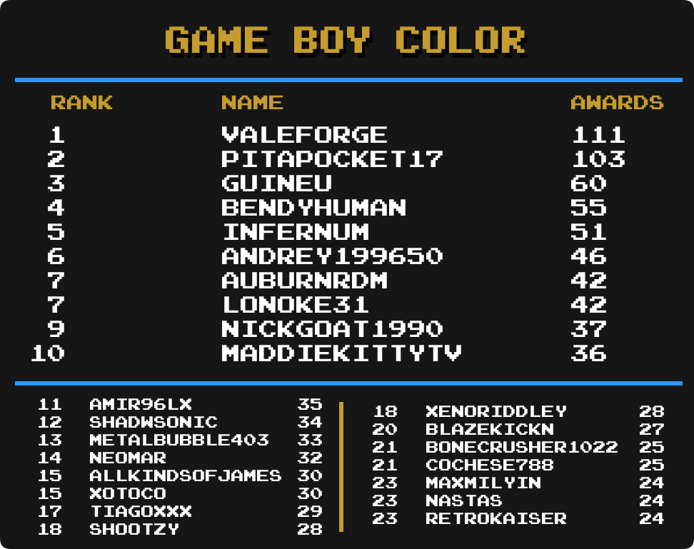

*  remains in 1st with 111 total mastery awards.
*  has moved up 1 spot and is tied for 15th place.
*  has moved up 1 spot and is tied for 18th place.
*  has moved up 2 spots and is tied for 18th place.
*  has moved up 3 spots and is tied for 21st place.

### Game Gear

  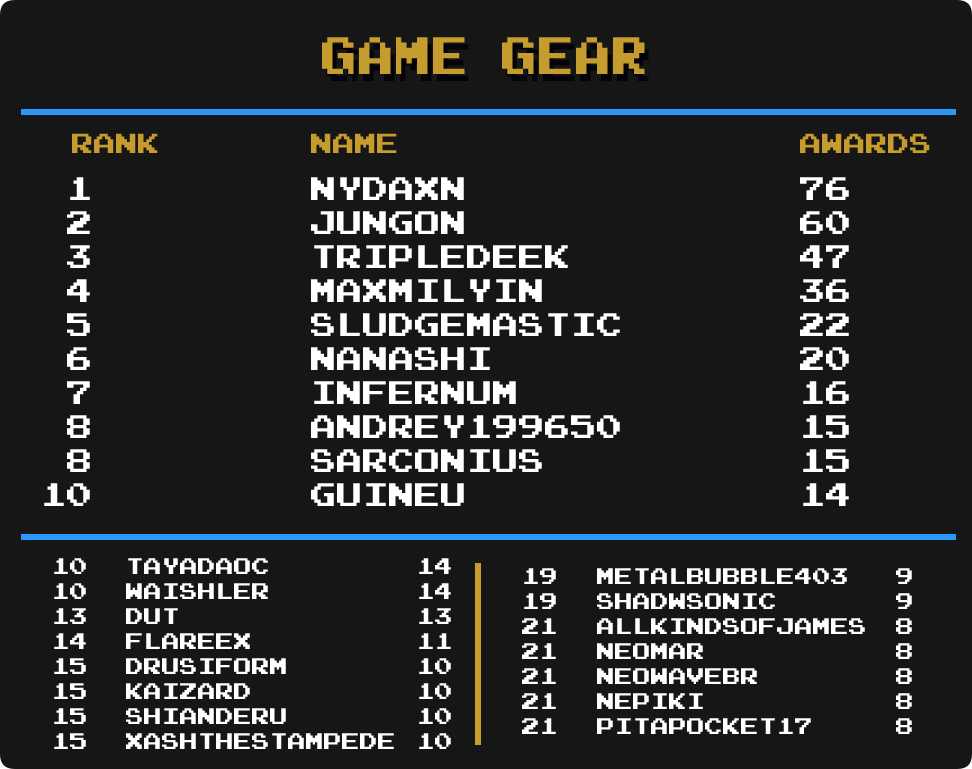

*  remains in 1st with 76 total mastery awards.
*  has moved up 2 spots and is in a 3-way tie for 10th place.
*  has moved up 10 spots and is in a 4-way tie for 15th place.
*  has moved up 2 spots and is in a 6-way tie for 21st place.
*  has made it into the top 25 and is in a 6-way tie for 21st place.

### Interton VC 4000

  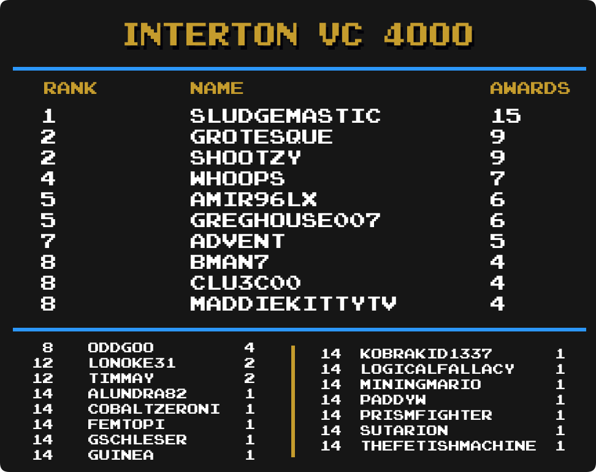

*  is in 1st place with 15 total mastery awards.
*  &  are tied for 2nd place with 9 total mastery awards.

### Master System

  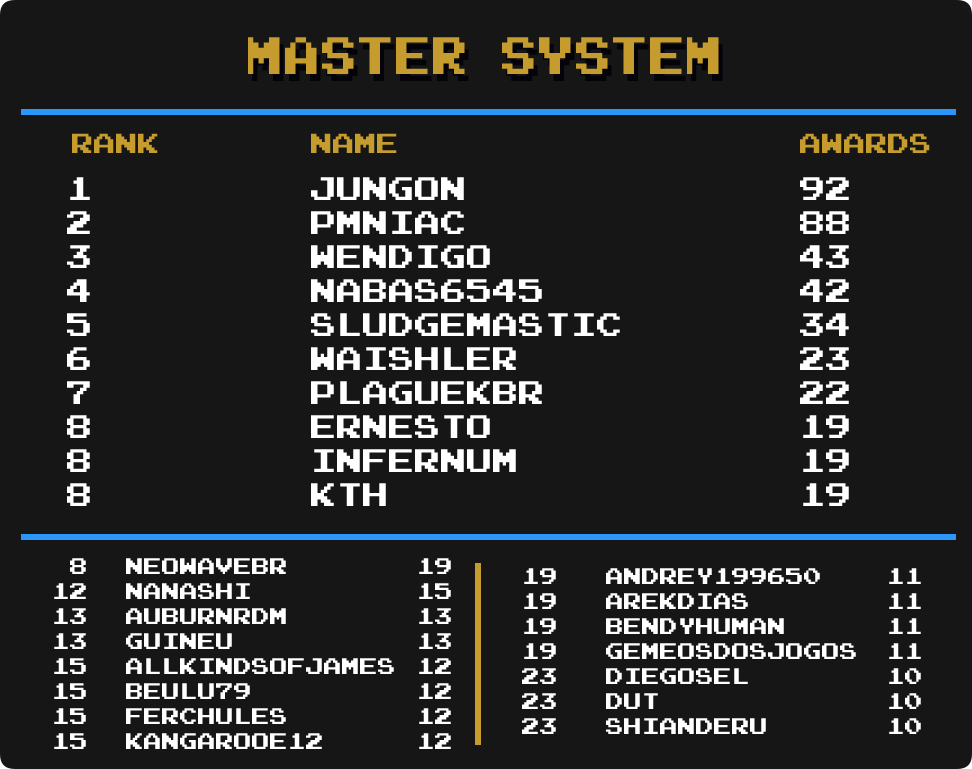

*  remains in 1st with 92 total mastery awards.
*  has moved up 2 spots and is in a 4-way tie for 8th place.
*  has moved up 2 spots and is in a 4-way tie for 8th place.
*  has moved up 2 spots and is tied for 13rd place.
*  has moved up 2 spots and is in a 4-way tie for 19th place.

### Mega Drive

  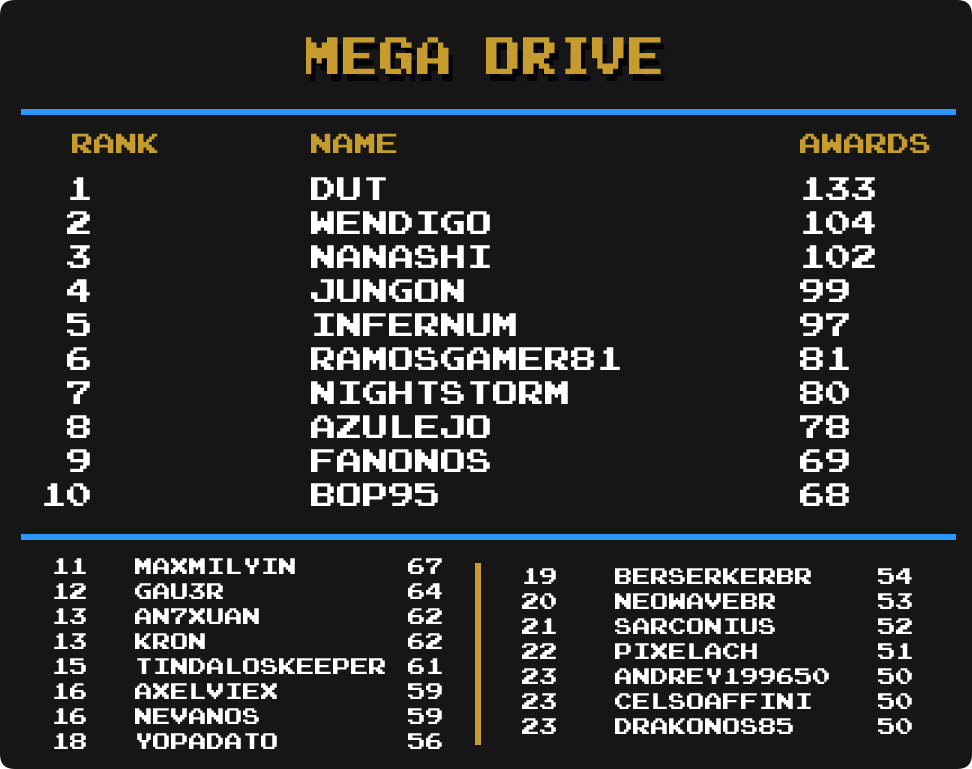

*  remains in 1st with 133 total mastery awards.
*  has moved up 1 spot and is in 6th place.
*  has moved up 4 spots and is in 21st place.
*  has moved up 2 spots and is in 22nd place.
*  has made it into the top 25 and is in a 5-way tie for 23rd place.

### Mega Duck

  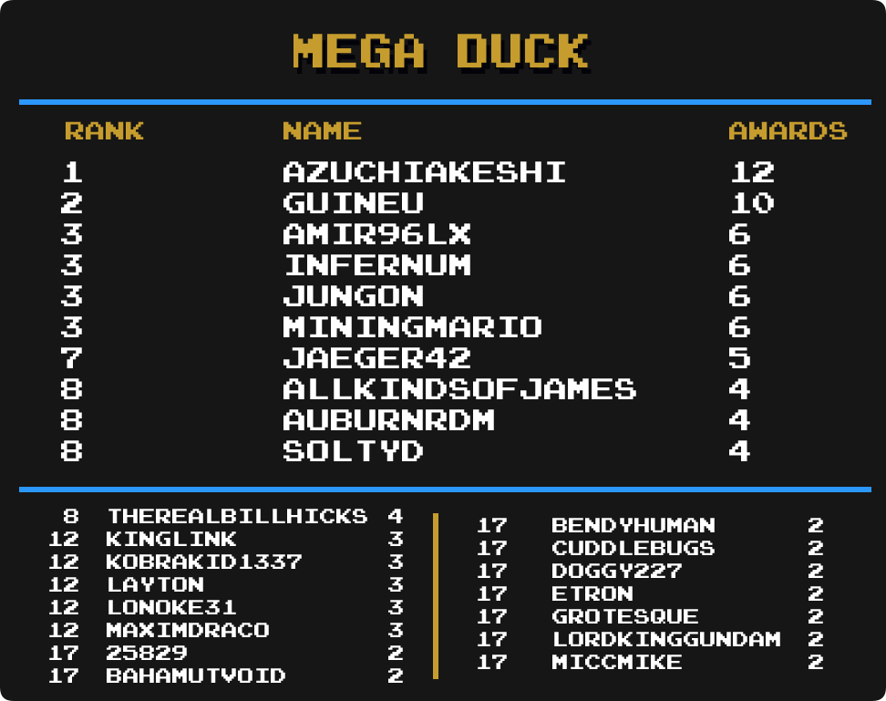

*  remains in 1st with 12 total mastery awards.
*  has moved up 2 spots and is in a 4-way tie for 3rd place.
*  has moved up 10 spots and is in a 4-way tie for 3rd place.
*  has made it into the top 25 and is in a 13-way tie for 17th place.

### Nintendo 64

  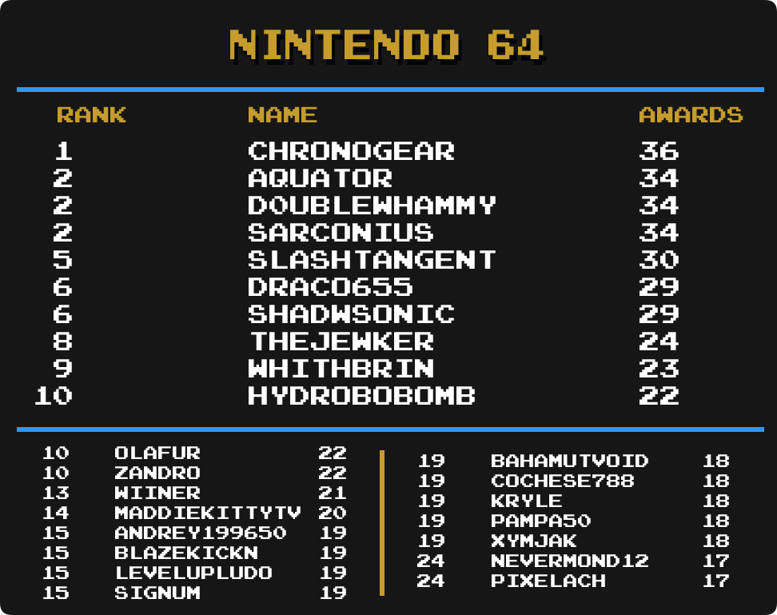

* Numerous players have moved up 1 spot doe to removal of a user from the leaderboard.
*  has taken 1st place with 36 total mastery awards.
*  has moved up 7 spots and is in 14th place.
*  has moved up 5 spots and is in a 5-way tie for 19th place.
*  has made it into the top 25 and is in a 3-way tie for 24th place.

### NES

  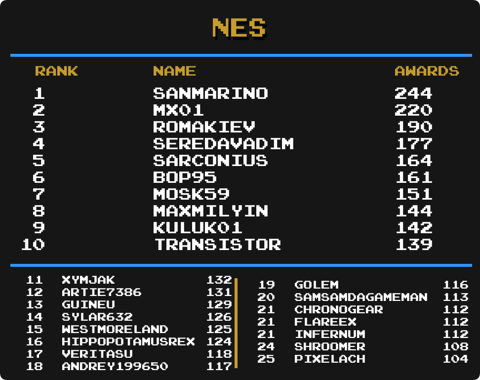

*  remains in 1st with 244 total mastery awards.
*  has moved up 1 spot and is in 11st place.
*  has moved up 1 spot and is in a 3-way tie for 21st place.
*  has made it into the top 25 and is in 25th place.

### Nintendo DS

  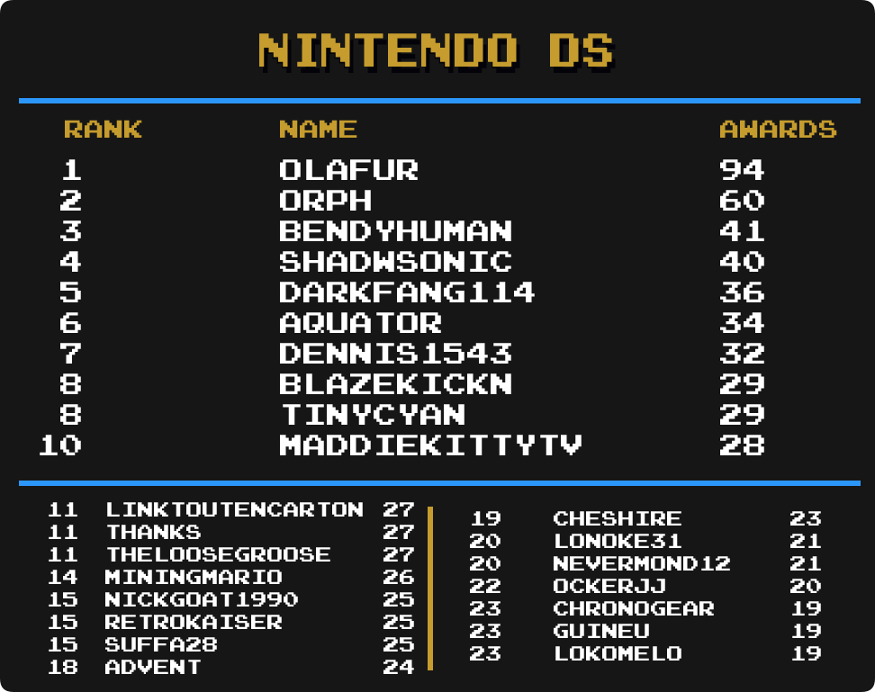

*  remains in 1st with 94 total mastery awards.
*  has moved up 4 spots and is in 5th place.
*  has moved up 3 spots and is in 10th place.
*  has moved up 2 spots and is in a 3-way tie for 15th place.
*  has moved up 2 spots and is in a 3-way tie for 15th place.
*  has moved up 3 spots and is in a 3-way tie for 15th place.
*  has made it into the top 25 and is tied for 20th place.
*  has made it into the top 25 and is in a 7-way tie for 23rd place.

### Nintendo DSi

  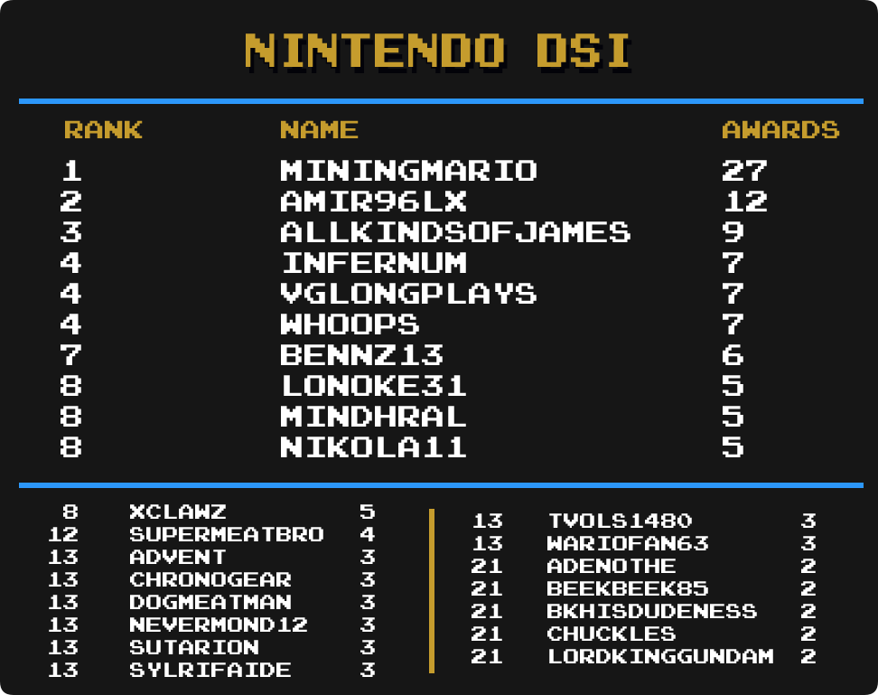

*  remains in 1st with 27 total mastery awards.
*  has made it into the top 25 and is in a 3-way tie for 4th place.
*  has moved up 16 spots and is in a 4-way tie for 8th place.
*  has moved up 6 spots and is in a 8-way tie for 13rd place.

### PC Engine

  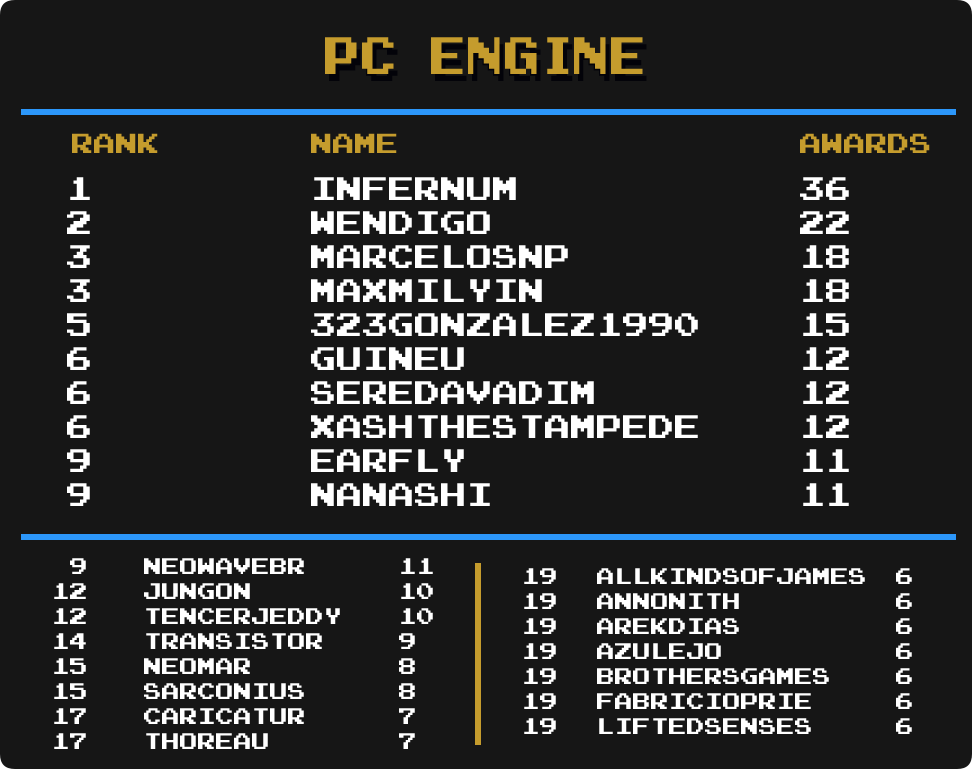

*  remains in 1st with 36 total mastery awards.
*  has made it into the top 25 and is in a 10-way tie for 19th place.
*  has made it into the top 25 and is in a 10-way tie for 19th place.

### PC Engine CD

  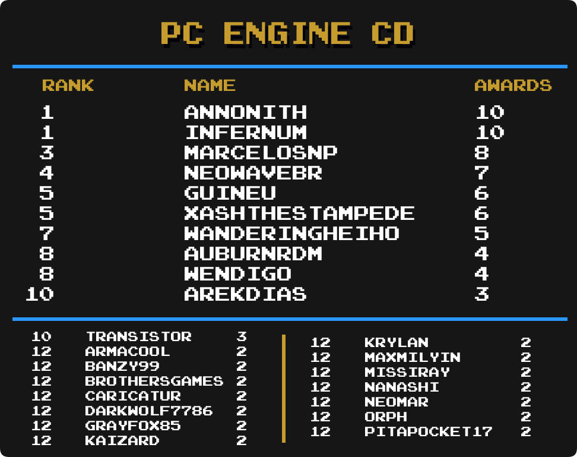

*  remains in 1st with 10 total mastery awards.
tied in first

### PC-8000/8800

  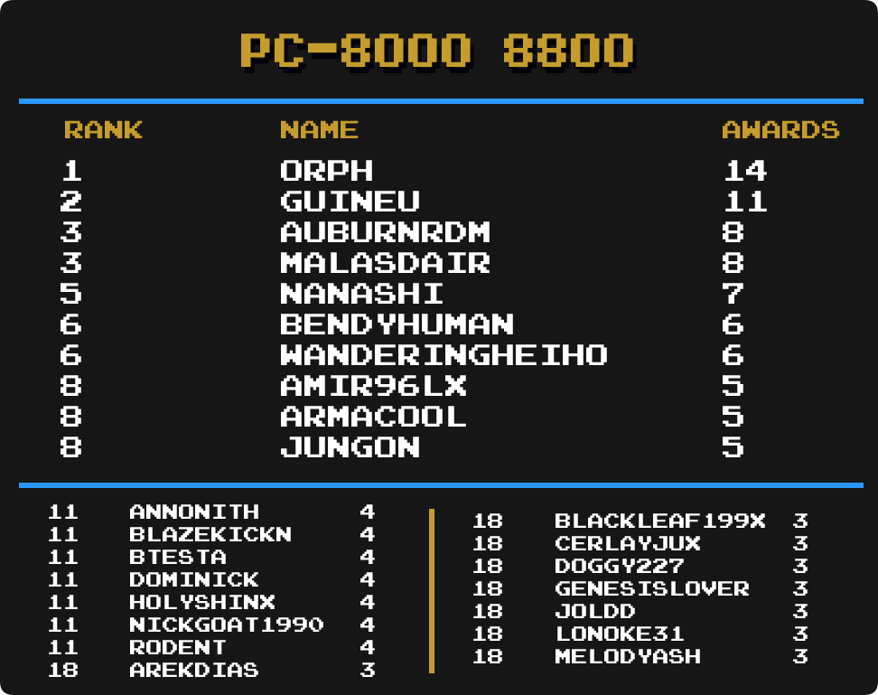

*  remains in 1st with 14 total mastery awards.
*  has moved up 2 spots and is in a 3-way tie for 8th place.
*  has moved up 6 spots and is in a 7-way tie for 11st place.
*  has moved up 8 spots and is in a 7-way tie for 11st place.
*  has made it into the top 25 and is in a 8-way tie for 18th place.

### PlayStation

  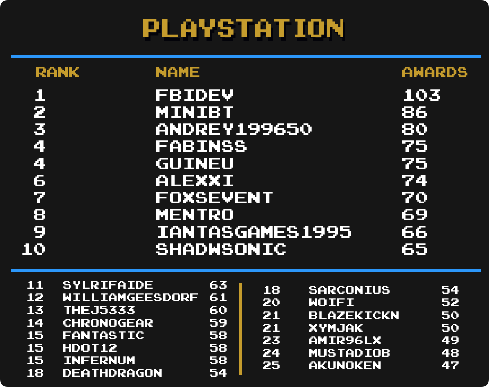

*  remains in 1st with 103 total mastery awards.
*  has moved up 1 spot and is in a 3-way tie for 15th place.
*  has moved up 1 spot and is in a 3-way tie for 15th place.
*  has made it into the top 25 and is in 23rd place.
*  has made it into the top 25 and is in a 3-way tie for 25th place.

### PlayStation 2

  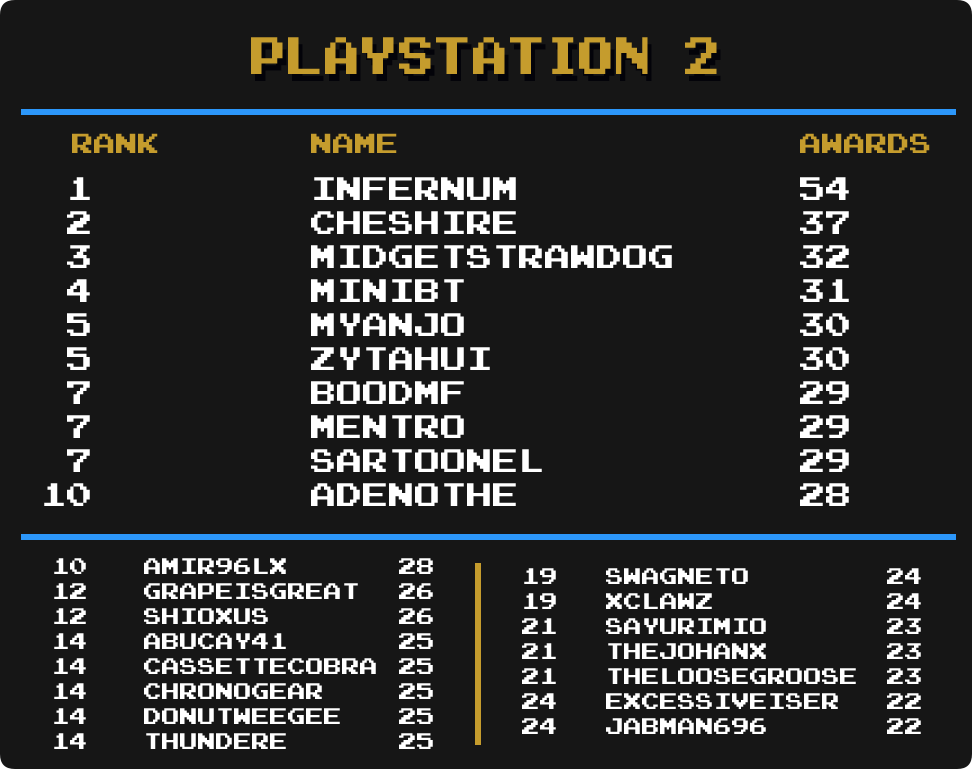

*  remains in 1st with 54 total mastery awards.
*  has moved up 1 spot and is tied for 5th place.
*  has moved up 2 spots and is tied for 5th place.
*  has moved up 9 spots and is in a 3-way tie for 7th place.
*  has moved up 5 spots and is tied for 10th place.
*  has moved up 5 spots and is tied for 12nd place.
*  has moved up 4 spots and is in a 5-way tie for 14th place.
*  has moved up 1 spot and is tied for 19th place.
*  has moved up 2 spots and is tied for 19th place.
*  has moved up 2 spots and is in a 3-way tie for 21st place.
*  has made it into the top 25 and is in a 4-way tie for 24th place.

### PlayStation Portable

  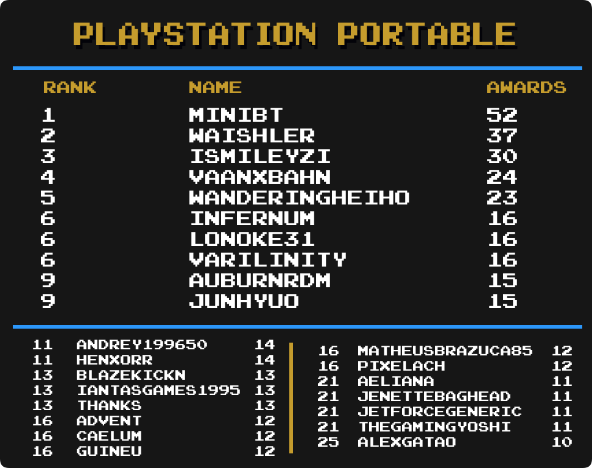

*  remains in 1st with 52 total mastery awards.
*  has moved up 2 spots and is in 2nd place.
*  has moved up 2 spots and is in a 3-way tie for 6th place.
*  has moved up 16 spots and is in a 3-way tie for 6th place.

### Pokémon Mini

  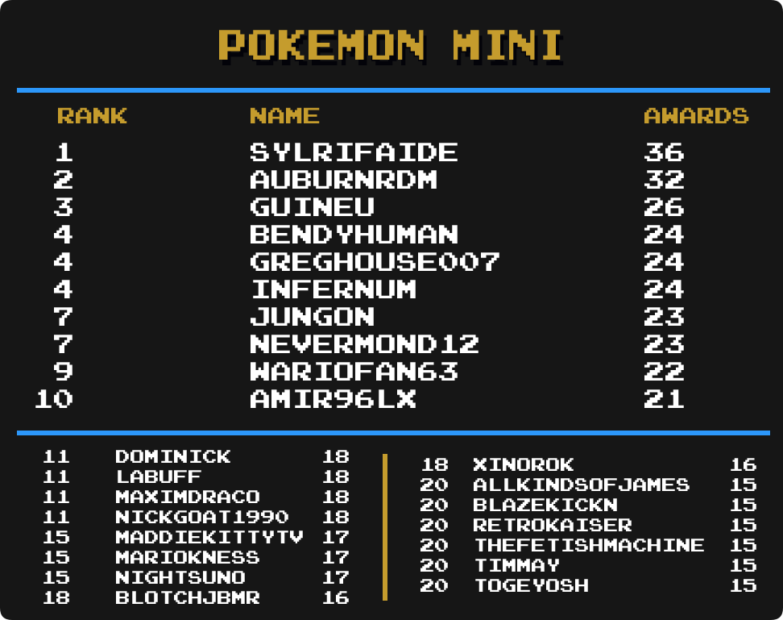

*  remains in 1st with 36 total mastery awards.
*  has moved up 1 spot and is in a 3-way tie for 4th place.
*  has moved up 1 spot and is tied for 7th place.
*  has made it into the top 25 and is in a 4-way tie for 11st place.
*  has moved up 2 spots and is in a 4-way tie for 11st place.
*  has made it into the top 25 and is in a 3-way tie for 15th place.

### Sega Saturn

  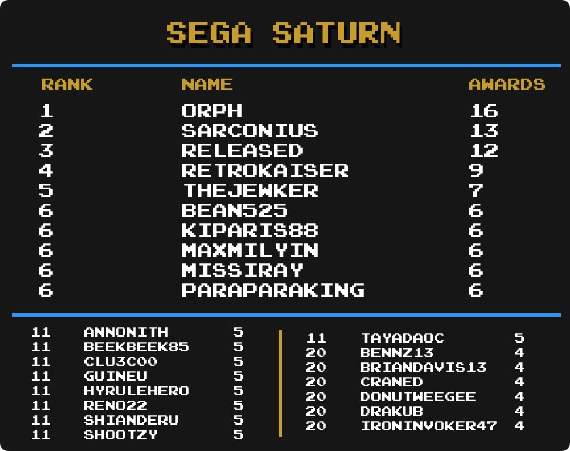

*  remains in 1st with 16 total mastery awards.
*  has moved up 1 spot and is in 2nd place.
*  has made it into the top 25 and is in a 17-way tie for 20th place.

### Sega CD

  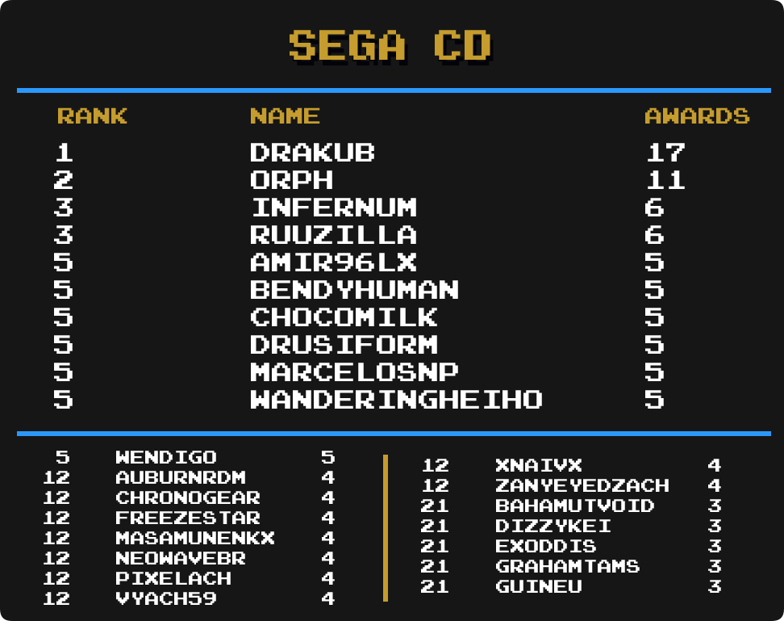

*  remains in 1st with 17 total mastery awards.
*  has moved up 5 spots and is in a 7-way tie for 5th place.
*  has moved up 13 spots and is in a 7-way tie for 5th place.
*  has made it into the top 25 and is in a 9-way tie for 12nd place.

### SNES

  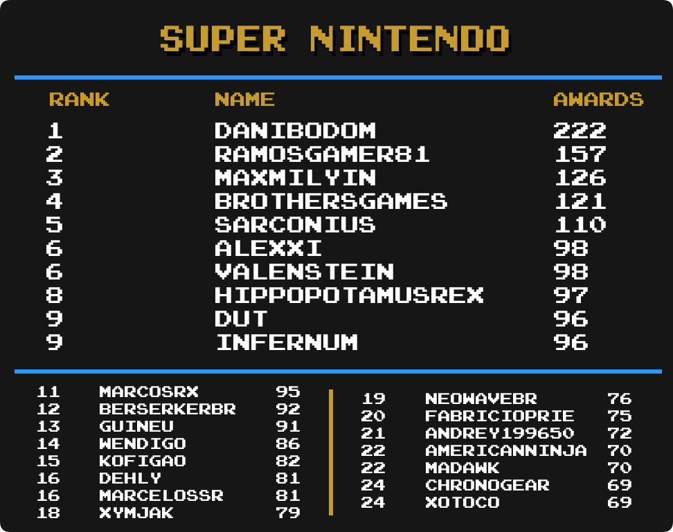

*  remains in 1st with 222 total mastery awards.
*  has moved up 1 spot and is in 15th place.
*  has made it into the top 25 and is tied for 16th place.
*  has moved up 1 spot and is in 19th place.
*  has made it into the top 25 and is tied for 24th place.

### Virtual Boy

  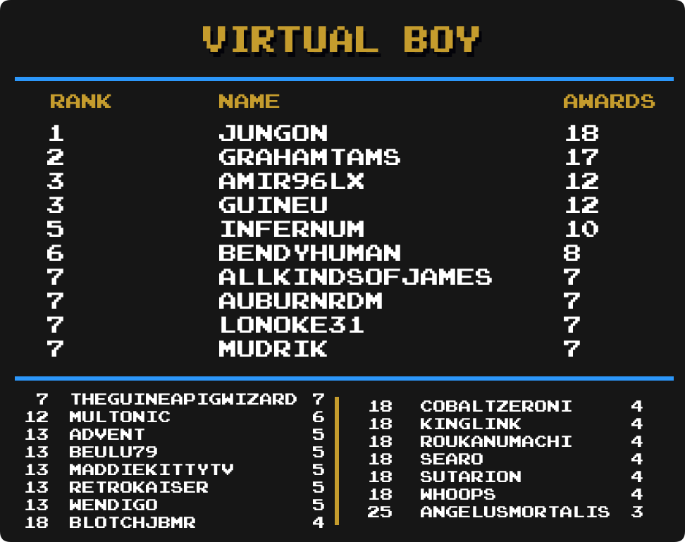

*  has taken 1st place with 18 total mastery awards.
*  has moved up 1 spot and is tied for 3rd place.
*  has moved up 1 spot and is in 6th place.
*  has moved up 2 spots and is in a 5-way tie for 7th place.
*  has moved up 1 spot and is in a 5-way tie for 7th place.
*  has made it into the top 25 and is in a 5-way tie for 7th place.
*  has moved up 1 spot and is in a 5-way tie for 13rd place.
*  has moved up 1 spot and is in a 5-way tie for 13rd place.
*  has moved up 2 spots and is in a 5-way tie for 13rd place.
*  has moved up 4 spots and is in a 7-way tie for 18th place.
*  has moved up 5 spots and is in a 7-way tie for 18th place.
*  has made it into the top 25 and is in a 7-way tie for 18th place.
*  has made it into the top 25 and is in a 7-way tie for 18th place.

### WASM-4

  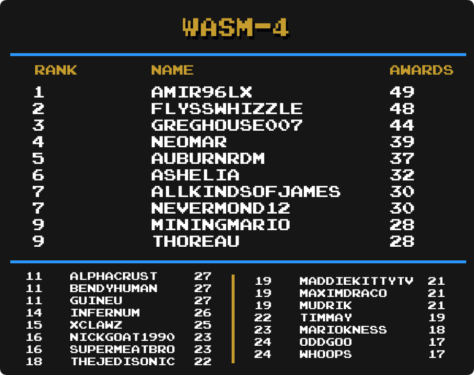

*  remains in 1st with 49 total mastery awards.
*  has moved up 1 spot and is tied for 7th place.
*  has made it into the top 25 and is tied for 7th place.
*  has moved up 3 spots and is tied for 9th place.
*  has moved up 6 spots and is in 14th place.
*  has made it into the top 25 and is tied for 24th place.

### Watara Supervision

  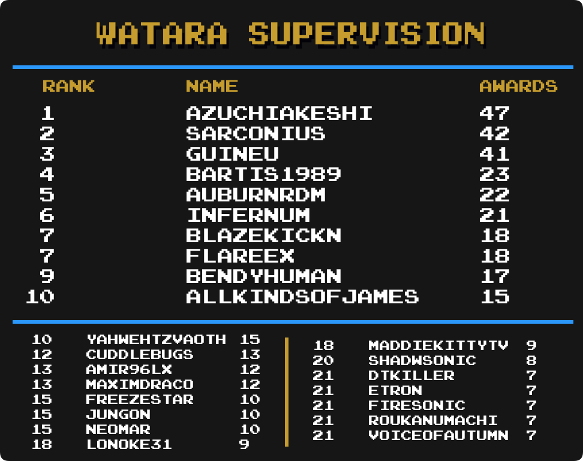

*  remains in 1st with 47 total mastery awards.
